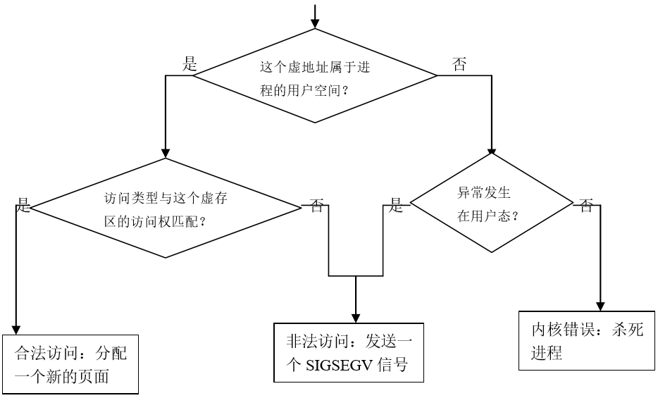
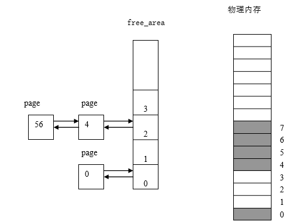
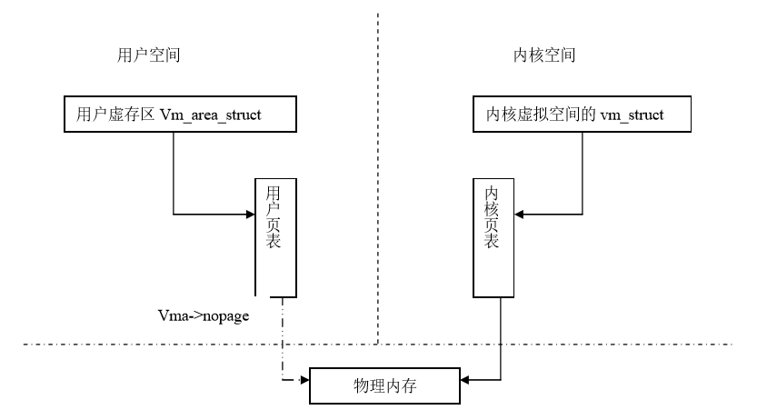

#第四章 内存管理

存储器是一种必须仔细管理的重要资源。在理想的情况下，每个程序员都喜欢无穷大、快速并且内容不易变(即掉电后内容不会丢失)的存储器，同时又希望它是廉价的。但不幸的是，当前技术没有能够提供这样的存储器，因此大部分的计算机都有一个存储器层次结构，即少量的非常快速、昂贵、易变的高速缓存(cache)；若干兆字节的中等速度、中等价格、易变的主存储器(RAM)；数百兆或数千兆的低速、廉价、不易变的磁盘。这些资源的合理使用与否直接关系着系统的效率。

##4.1 Linux的内存管理概述

Linux是为多用户多任务设计的操作系统, 所以存储资源要被多个进程有效共享；且由于程序规模的不断膨胀，要求的内存空间比从前大得多。Linux内存管理的设计充分利用了计算机系统所提供的虚拟存储技术，真正实现了虚拟存储器管理。

第二章介绍的80X86的段机制和页机制是操作系统实现虚拟存储管理的一种硬件平台。实际上，Linux不仅仅可以运行在Intel系列个人计算机上，还可以运行在Apple、DEC Alpha、MIPS和Motorola 68k等系列上，这些平台都支持虚拟存储器管理，而我们之所以选择80X86，是因为它更具代表性和普遍性。

关于内存管理，读者可能对一下问题比较困惑

1. 一个源程序编译链接后形成的地址空间是虚地址空间还是物理地址空间，如何管理？
2. 程序装入内存的过程中，虚地址如何被转换为物理地址？

本章将围绕这两大问题展开讨论，在讨论的过程中，会涉及到其他方面的技术问题。

### 4.1.1 虚拟内存、内核空间和用户空间

从第二章我们知道，Linux简化了分段机制，使得虚地址与线性地址总是一致的。线性空间在32位平台上为4GB的固定大小，也就是Linux的虚拟地址空间也这么大。Linux内核将这4G字节的空间分为两部分。最高的1G字节（从虚地址0xC0000000到0xFFFFFFFF）供内核使用，称为“**内核空间**”。而较低的3G字节（从虚地址0x00000000到0xBFFFFFFF），供各个进程使用，称为“**用户空间**”。因为每个进程可以通过系统调用进入内核，因此,Linux内核空间由系统内的所有进程共享。于是，从具体进程的角度来看，每个进程可以拥有4G字节的**虚拟地址空间**(也叫**虚拟内存**)。图4.1 给出了进程虚拟地址空间示意图。

<div style="text-align: center">

</div>

<center>图4.1 进程虚拟地址空间</center>

从图中可以看出，每个进程有各自的私有用户空间（0～3G），这个空间对系统中的其他进程是不可见的。最高的1GB内核空间则为所有进程以及内核所共享。另外，进程的“**用户空间**”也叫“**地址空间**”，在后面的叙述中，我们对这两个术语不再区分。

图4.1也说明，用户空间不是进程共享的，而是进程隔离的。每个进程最大都可以有3GB的用户空间。一个进程对其中一个地址的访问，与其它进程对于同一地址的访问绝不冲突。比如，一个进程从其用户空间的地址0x1234ABCD处可以读出整数8，而另外一个进程从其用户空间的地址0x1234ABCD处可以读出整数20，这取决于进程自身的逻辑。

任意一个时刻，在一个CPU上只有一个进程在运行。所以对于此CPU来讲，在这一时刻，整个系统只存在一个4GB的虚拟地址空间，这个虚拟地址空间是面向此进程的。当进程发生切换的时候，虚拟地址空间也随着切换。由此可以看出，每个进程都有自己的虚拟地址空间，只有此进程运行的时候，其虚拟地址空间才被运行它的CPU所知。在其它时刻，其虚拟地址空间对于CPU来说，是不可知的。所以尽管每个进程都可以有4GB的虚拟地址空间，但在CPU眼中，只有一个虚拟地址空间存在。虚拟地址空间的变化，随着进程切换而变化。

从第二章我们知道，一个程序编译连接后形成的地址空间是一个虚拟地址空间，但是程序最终还是要运行在物理内存中。因此，应用程序所给出的任何虚地址最终必须被转化为物理地址，所以，虚拟地址空间必须被映射到物理内存空间中，这个映射关系需要通过硬件体系结构所规定的数据结构来建立。这就是我们第二章所描述的段描述符表和页表，Linux主要通过页表来进行映射。

于是，我们得出一个结论，如果给出的页表不同，那么CPU将某一虚拟地址空间中的地址转化成的物理地址就会不同。所以我们为每一个进程都建立其页表，将每个进程的虚拟地址空间根据自己的需要映射到物理地址空间上。既然某一时刻在某一CPU上只能有一个进程在运行，那么当进程发生切换的时候，将页表也更换为相应进程的页表，这就可以实现每个进程都有自己的虚拟地址空间而互不影响。所以，在任意时刻，对于一个CPU来说，只需要有当前进程的页表，就可以实现其虚拟地址到物理地址的转化。

#### 1. 内核空间到物理内存的映射

内核空间对所有的进程都是共享的，其中存放的是内核代码和数据，而进程的用户空间中存放的是用户程序的代码和数据，不管是内核程序还是用户程序，它们被编译和连接以后，所形成的指令和符号地址都是**虚地址**（参见2.5节中的例子），而不是物理内存中的物理地址。

虽然内核空间占据了每个虚拟空间中的最高1GB字节，但映射到物理内存却总是从最低地址（0x00000000）开始的，如图4.2所示，之所以这么规定，是为了在内核空间与物理内存之间建立简单的线性映射关系。其中，3GB（0xC0000000）就是物理地址与虚拟地址之间的位移量，在Linux代码中就叫做PAGE_OFFSET。

<div style="text-align: center">

</div>

<center>图4.2内核的虚拟地址空间到物理地址空间的映射</center>

我们来看一下在page.h头文件中对内核空间中地址映射的说明及定义：

```c
#define __PAGE_OFFSET (0xC0000000)
……

#define PAGE_OFFSET ((unsigned long)__PAGE_OFFSET)

#define __pa(x) ((unsigned long)(x)-PAGE_OFFSET)

#define __va(x) ((void *)((unsigned long)(x)+PAGE_OFFSET))
```

对于内核空间而言，给定一个虚地址x，其物理地址为“x-PAGE_OFFSET”，给定一个物理地址x，其虚地址为“x+ PAGE_OFFSET”。

例如，进程的页目录PGD（Page Global Directory）就处于内核空间中。在进程切换时，要将寄存器CR3设置成指向新进程的页目录PGD，而该目录的起始地址在内核空间中是虚地址，但CR3所需要的是物理地址，这时候就要用__pa()进行地址转换：
asm volatile(“movl %0,%%cr3”: :”r” (__pa(next->pgd));

这是一行嵌入式汇编代码，其含义是将下一个进程的页目录起始地址next_pgd，通过__pa()转换成物理地址，存放在某个寄存器中，然后用movl指令将其写入CR3寄存器中。经过这行语句的处理，CR3就指向新进程next的页目录PGD

这里再次说明，宏__pa()仅仅把一个内核空间的虚地址映射到物理地址，而决不适用于用户空间，用户空间的地址映射要复杂得多，它通过分页机制完成。

#### 2．内核映像

在下面的描述中，我们把内核的代码和数据就叫内核映像（kernelimage）。当系统启动时，Linux内核映像被装入在物理地址0x00100000开始的地方，即1MB开始的区间，这第1M用来存放一些与系统硬件相关的代码和数据，如图4.3所示，内核只占用从0x100000开始到start_mem结束的一段区域。从start_mem到end_mem这段区域叫动态内存，是用户程序和数据使用的内存区。

    0          0x100000             start_mem                 end_mem

<center>图4.3 系统启动后的物理内存布局</center>

然而，在正常运行时，整个内核映像应该在虚拟内存的内核空间中，因为连接程序在连接内核映像时，在所有的符号地址上加一个偏移量PAGE_OFFSET，这样，内核映像在内核空间的起始地址就为0xC0100000。

### 4.1.2 虚拟内存实现机制间的关系

Linux虚拟内存的实现需要多种机制的支持，因此，本章我们将围绕以下几种核心机制进行介绍：

·地址映射机制

·请页机制

·内存分配和回收机制

·交换机制

·缓存和刷新机制

这几种机制的关系如图4.4所示。

<div style="text-align: center">

</div>

<center>图4.4 虚拟内存实现机制及之间的关系</center>

首先内核通过映射机制把进程的虚拟地址映射到物理地址，在进程运行时，如果内核发现进程要访问的页没有在物理内存时，就发出了请页要求①；如果有空闲的内存可供分配，就请求分配内存②（于是用到了内存的分配和回收），并把正在使用的物理页记录在页缓存中③（使用了缓存机制）。如果没有足够的内存可供分配，那么就调用交换机制，腾出一部分内存④⑤。另外在地址映射中要通过TLB（翻译后援存储器）来寻找物理页⑧；交换机制中也要用到交换缓存⑥，并且把物理页内容交换到交换文件中后也要修改页表来映射文件地址⑦。

##4.2 进程的用户空间管理 

如前所述,每个进程最大可以拥有3GB的私有虚存空间。那么，这3GB的空间是如何划分？概括地说，用户程序经过编译、链接后形成的二进制映像文件有一个代码段和数据段，其中代码段在下，数据段在上。数据段中包括了所有静态分配的数据空间，即全局变量和所有申明为static的局部变量，这些空间是进程所必需的基本要求，是在建立一个进程的运行映像时就分配好的。除此之外，堆栈使用的空间也属于基本要求，所以也是在建立进程时就分配好的，如图4.5所示：

<div style="text-align: center">

</div>

<center>图4.5 进程用户空间的划分</center>

由图可以看出，堆栈段安排在用户空间的顶部，运行时由顶向下延伸；代码段和数据段则在低部，运行时并不向上延伸。从数据段的顶部到堆栈段地址的下沿这个区间是一个巨大的空洞，这就是进程在运行时调用malloc()可以动态分配的空间，也叫动态内存或**堆**。BSS（Block Started by Symbol）是未初始化的数据段。

我们可以写一个用户态下的程序example.c来打印出各个区间的起始地址：

```c
#include<stdio.h>

#include<malloc.h>

#include<unistd.h>

int bss_var;

int data_var0=1;

int main(int argc,char **argv)

{

		printf("below are addresses of types of process's mem\n");

		printf("Text location:\n");

		printf("tAddress of main(Code Segment):%p\n",main);

		printf("____________________________\n");

		int stack_var0=2;

		printf("Stack Location:n");

		printf("tInitial end of stack:%p\n",&stack_var0);

		int stack_var1=3;

		printf("tnew end of stack:%pn",&stack_var1);

		printf("____________________________\n");

		printf("Data Location:\n");

		printf("tAddress of data_var(Data Segment):%p\n",&data_var0);

		static int data_var1=4;

		printf("tNew end of data_var(Data Segment):%p\n",&data_var1);

		printf("____________________________\n");

		printf("BSS Location:n"); /*未初始化代码段*/

		printf("tAddress of bss_var:%pn",&bss_var);

		printf("____________________________\n");

		char *b = sbrk((ptrdiff_t)0);

		printf("Heap Location:\n");

		printf("tInitial end of heap:%p\n",b);

		brk(b+4);

		b=sbrk((ptrdiff_t)0);

		printf("tNew end of heap:%p\n",b);

		return 0;

}
```

其中，sbrk() 函数用来增加分配给程序的数据段的空间。

该程序的结果如下：

   below are addresses of types of process's mem

   Text location:

   Address of main(Code Segment):0x8048388

   ____________________________

   Stack Location:

   Initial end of stack:0xbffffab4

   new end of stack:0xbffffab0

   ____________________________

   Data Location:

   Address of data_var(Data Segment):0x8049758

   New end of data_var(Data Segment):0x804975c

   ____________________________

   BSS Location:

   Address of bss_var:0x8049864

   ____________________________

   Heap Location:

   Initial end of heap:0x8049868

   New end of heap:0x804986c

利用size命令也可以看到程序的各段大小，比如执行size example会得到：

text data bss dec hex filename

1654 280 8 1942 796 example

但这些数据是程序编译的静态统计，而上面显示的是进程运行时的动态值，但两者是对应的。

前面的例子中我们看到的地址0x804xxxx都是虚地址。尽管每个进程拥有3GB的用户空间，但是其中的地址都是虚地址，因此，用户进程在这个虚拟内存中并不能真正地运行起来，必须把用户空间中的虚地址最终映射到物理存储空间才行，而这种映射的建立和管理是由内核完成的。所谓向内核申请一块空间，实际上是指请求内核分配一块虚存区间（如，数据段区间从0x8049758到0x804975c）和相应的若干物理页面，并建立起映射关系。

内核在创建进程时并不是为整个用户空间都分配好相应的物理空间,而是根据需要才真正分配一些物理页面并建立映射。在后面我们会看到，系统利用了请页机制来避免对物理内存的过分使用。因为进程访问的用户空间中的页可能当前不在物理内存中，这时，操作系统通过请页机制把数据从磁盘装入到物理内存。为此，系统需要修改进程的页表，以便标志用户空间中的页已经装入到物理页面中。由于上面这些原因，Linux采用了比较复杂的数据结构跟踪进程的用户地址空间。

### 4.2.1 进程用户空间的描述

一个进程的用户地址空间主要由两个数据结来描述。一个是mm_struct结构,它对进程整个用户空间进行描述，简称**内存描述符**；另一个是vm_area_structs结构,它对用户空间中各个区间(简称**虚存区**进行描述，这里的虚存区就是上例中的**代码区，未初始化数据区，数据区以及堆栈区等）**。Linux内核版本不同,对这些结构的定义可能稍有不同,为了简单起见，给出这些结构主要域的定义。

#### 1. mm_struct结构 

mm_strcut 用来描述一个进程的虚拟地址空间，在/include/linux/mm_types.h中主要域描述如下：

该结构用来描述进程的整个用户空间，具体定义如下：

```c
struct mm_struct {

		struct vm_area_struct * mmap;

		rb_root_t mm_rb;

		struct vm_area_struct * mmap_cache;

		pgd_t * pgd;

		atomic_t mm_users;                                    

   	 	atomic_t mm_count;                                    

   		int map_count;

   		struct rw_semaphore mmap_sem;

   		spinlock_t page_table_lock;                                              

   		struct list_head mmlist;

   		unsigned long start_code, end_code, start_data, end_data;

   		unsigned long start_brk, brk, start_stack;

   		unsigned long arg_start, arg_end, env_start, env_end;

   		unsigned long rss, total_vm, locked_vm;

   		unsigned long def_flags;

   		……
};
```

对主要域的解释如表4.1

表4.1 对mm_struct结构中主要域的说明

<table>
   <tr>
      <td>域名</td>
      <td>说明</td>
   </tr>
   <tr>
      <td>mmap</td>
      <td>指向线性区对象的链表头</td>
   </tr>
   <tr>
      <td>mm_rb</td>
      <td>指向线性区对象的红-黑树的根</td>
   </tr>
   <tr>
      <td>mmap_cahce</td>
      <td>最近一次用到的虚存区很可能下一次还要用到，因此，把最近用到的虚存区结构放入高速缓存，这个虚存区就由mmap_cache指向</td>
   </tr>
   <tr>
      <td>pgd</td>
      <td>进程的页目录基地址，当调度程序调度一个进程运行时，就将这个地址转成物理地址，并写入控制寄存器（CR3）</td>
   </tr>
   <tr>
      <td>mm_user</td>
      <td>表示共享地址空间的进程数目</td>
   </tr>
   <tr>
      <td>mm_count</td>
      <td>对mm_struct结构的引用进行计数。为了在Linux中实现线程，内核调用clone派生一个线程，线程和调用进程共享用户空间，即mm_struct结构，派生后系统会累加mm_struct中的引用计数</td>
   </tr>
   <tr>
      <td>map_count</td>
      <td>在进程的整个用户空间中虚存区的个数</td>
   </tr>
   <tr>
      <td>mmap_sem</td>
      <td>线性区的读写信号量</td>
   </tr>
   <tr>
      <td>page_table_lock</td>
      <td>线性区的自旋锁和页表的自旋锁</td>
   </tr>
   <tr>
      <td>mmlist</td>
      <td>所有mm_struct通过mmlist域链接成双向链表，链表的第一个元素是idle进程的mm_struct结构</td>
   </tr>
   <tr>
      <td>start_code，end_code, start_data，end_data</td>
      <td>进程的代码段和数据段的起始地址和终止地址</td>
   </tr>
   <tr>
      <td>start_brk，brk, start_stack</td>
      <td>每个进程都有一个特殊的地址区间，这个区间就是所谓的堆，也就是图4.5中的空洞。前两个域分别描述堆的起始地址和终止的地址，最后一个域描述堆栈段的起始地址</td>
   </tr>
   <tr>
      <td>arg_start，arg_end, env_start，env_end</td>
      <td>命令行参数所在的堆栈部分的起始地址和终止地址；环境串所在的堆栈部分的起始地址和终止地址</td>
   </tr>
   <tr>
      <td>Rss，total_vm, locked_vm</td>
      <td>进程贮留在物理内存中的页面数，进程所需的总页数，被锁定在物理内存中的页数</td>
   </tr>
   <tr>
      <td>def_flags</td>
      <td>线性区默认的访问标志</td>
   </tr>
   <tr>
</table>

对该结构进一步说明如下：

1.  在内核代码中，指向这个数据结构的变量常常是mm。

2.  每个进程只有一个mm_struct结构，在每个进程的task_struct结构中，有一个指向该结构的指针。可以说，mm_struct结构是对整个用户空间的描述。

3.  一个进程的虚拟空间中可能有多个虚拟区间（参见下面对vm_area_struct描述），对这些虚拟区间的组织方式有两种，当虚拟区较少时采用单链表，由mmap指针指向这个链表，当虚拟区间多时采用树结构。在2.4.10以前的版本中，采用的是AVL树结构，之后，采用的是红黑树结构，因为与AVL树相比，对红黑树进行操作的效率更高。

4.  因为程序中用到的地址常常具有局部性，因此，最近一次用到的虚拟区间很可能下一次还要用到，因此，把最近用到的虚拟区间结构应当放入高速缓存，这个虚拟区间就由mmap_cache指向。

5.  指针pgt指向该进程的页目录（每个进程都有自己的页目录，注意同内核页目录的区别）,当调度程序调度一个程序运行时，就将这个地址转成物理地址，并写入控制寄存器（CR3）。

6.  由于进程的虚拟空间及其下属的虚拟区间有可能在不同的上下文中受到访问，而这些访问又必须互斥，所以在该结构中设置了用于P、V操作的信号量mmap_sem。此外，page_table_lock也是为类似的目的而设置。

7.  虽然每个进程只有一个虚拟地址空间，但这个地址空间可以被别的进程来共享，如，子进程共享父进程的地址空间（也即共享mm_struct结构）。所以，用mm_user和mm_count进行计数。类型atomic_t实际上就是整数，但对这种整数的操作必须是“原子”的。

8.  另外，还描述了代码段、数据段、堆栈段、参数段以及环境段的起始地址和结束地址。这里的段是对程序的逻辑划分，与我们前面所描述的段机制是不同的。

#### 2. VM_AREA_STRUCT 结构

vm_area_struct描述进程用户空间的一个虚拟内存区间(Virtual Memory
Area,简称VMA)，其定义如下：

```c
struct vm_area_struct {

   		struct mm_struct * vm_mm;

  	 	unsigned long vm_start;

   		unsigned long vm_end;

   		struct vm_area_struct * vm_next;

   		pgprot_t vm_page_prot;

   		unsigned long vm_flags;

   		struct rb_node_t vm_rb;

   		struct vm_operations_struct * vm_ops;

   		unsigned long vm_pgoff;

  		struct file * vm_file;

   		void * vm_private_data;

   		……

};
```

对其主要域的解释如表4.2

表4.2 对vm_area_struct结构主要域的说明
  
<table>
   <tr>
      <td>域名</td>
      <td>说明</td>
   </tr>
   <tr>
      <td>vm_mm</td>
      <td>指向虚存区所在的mm_struct结构的指针。</td>
   </tr>
   <tr>
      <td>vm_start，vm_end</td>
      <td>虚存区的起始地址和终止地址。</td>
   </tr>
   <tr>
      <td>vm_page_prot</td>
      <td>虚存区的保护权限。</td>
   </tr>
   <tr>
      <td>vm_flags</td>
      <td>虚存区的标志。</td>
   </tr>
   <tr>
      <td>vm_next</td>
      <td>构成线性链表的指针，按虚存区基址从小到大排列。</td>
   </tr>
   <tr>
      <td>vm_rb</td>
      <td>用于红-黑树结构</td>
   </tr>
   <tr>
      <td>vm_ops</td>
      <td>对虚存区进行操作的函数。这些给出了可以对虚存区中的页所进行的操作。</td>
   </tr>
   <tr>
      <td>vm_pgoff</td>
      <td>映射文件中的偏移量。对匿名页，它等于0、vm_start或PAGE_SIZE</td>
   </tr>
   <tr>
      <td>vm_file</td>
      <td>指向映射文件的文件对象</td>
   </tr>
   <tr>
      <td>vm_private_data</td>
      <td>指向内存区的私有数据</td>
   </tr>
   <tr>
</table>                                         

另外，与磁盘文件相关的域有vm_pgoff及vm_file等，为什么要设置这些域？这是因为在两种情况下虚存中的页（或区间）会与磁盘发生关系。一种是磁盘交换区（Swap），当内存不够分配时，一些久未使用的页面可以被交换到磁盘的交换区，腾出物理页面以供急需的进程使用，这就是分页管理的“交换机制”。另一种情况是，将一个磁盘文件映射到进程的用户空间中，Linux提供的mmap()系统调用可以将一个打开的文件映射到进程的用户空间，此后就可以像访问内存中的字符数组那样来访问这个文件，而不必通过lseek()、read()或write()等进行文件操作。

为什么把进程的用户空间要划分为一个个区间？这是因为每个虚存区可能来源不同，有的可能来自可执行映像，有的可能来自共享库，而有的则可能是动态分配的内存区，对不同的区间可能具有不同的访问权限，也可能有不同的操作。因此Linux
把进程的用户空间分割管理，并利用了虚存区处理函数（vm_ops）来抽象对不同来源虚存区的处理方法。Linux在这里利用了面向对象的思想，即把一个虚存区看成一个对象，用vm_area_structs描述了这个对象的属性，其中的vm_operation结构描述了在这个对象上的操作，其定义如下：

```c
struct vm_operations_struct {

		void (*open)(struct vm_area_struct * area);

		void (*close)(struct vm_area_struct * area);

		struct page * (*nopage)(struct vm_area_struct * area, unsigned long address, int unused);

		…;

};
```

vm_operations结构中包含的是函数指针；其中，open、close分别用于虚存区的打开、关闭，而nopage是当虚存页面不在物理内存而引起的“缺页异常”时所应该调用的函数。如图4.6
给出虚存区的操作函数。

<div style="text-align: center">

</div>

<center>图4.6 虚存区的操作函数</center>

#### 3. 相关数据结构之间的关系

进程控制块是内核中的核心数据结构。在进程的 task_struct
结构中包含一个mm域，它是指向 mm_struct 结构的指针。而进程的
mm_struct结构则包含进程的可执行映像信息以及进程的页目录指针pgd等。该结构还包含有指向
vm_area_struct 结构的几个指针，每个 vm_area_struct
代表进程的一个虚拟地址区间。这几个结构之间的关系如图4.7所示：

<div style="text-align: center">

</div>

<center>图4.7相关数据结构之间的关系示意图</center>

从图中可以看出，系统以用户虚拟内存地址的降序排列
vm_area_struct。在进程的运行过程中，Linux要经常为进程分配虚存区，因此，vm_area_struct结构的访问时间就成了性能的关键因素。为此，除链表结构外，Linux还利用红黑树来组织 vm_area_struct。通过这种树结构，Linux可以快速定位某个虚存区。

### 4.2.2 进程用户空间的创建

了解了以上数据结构后，读者会问进程的用户空间到底是什么时候创建的？实际上，在调用fork()系统调用创建一个新的进程时就为这个进程创建了一个完整的用户空间。

我们在第三章“进程创建”一节中提到，当创建一个新的进程时，拷贝或共享父进程的用户空间，具体地说，就是内核调用copy_mm()函数。该函数通过建立新进程的所有页表和mm_struct结构来创建进程的用户空间。

通常，每个进程都有自己的用户空间，但是调用clone()函数创建的内核线程时共享父进程的用户空间。

按照第三章讲述的写时复制方法，子进程继承父进程的用户空间：只要页是只读的，就依然共享它们。当其中的一个进程试图写入某一个页时，这个页就被复制一份；一段时间之后，所创建的进程通常获得与父进程不一样的完全属于自己的用户空间。而对于内核线程来说，它使用父进程的用户空间。因此创建内核线程比创建普通进程相应要快得多，而且只要父进程和子进程谨慎地调整它们的访问顺序，就可以认为页的共享是有益的。

由此可以看出，进程用户空间的创建主要依赖于父进程，而且，在创建的过程中所做的工作仅仅是mm_struc结构的建立、vm_area_struct结构的建立以及页目录和页表的建立，并没有真正地复制一个物理页面，这也是为什么Linux内核能迅速地创建进程的原因之一。

### 4.2.3 虚存映射

当调用exec()系统调用开始执行一个进程时，进程的可执行映像（包括代码段、数据段等）必须装入到进程的用户地址空间。如果该进程用到了任何一个共享库，则共享库也必须装入到进程的用户空间。

由此可看出，Linux并不将映像装入到物理内存，相反，可执行文件只是被连接到进程的用户空间中。随着进程的运行，被引用的程序部分会由操作系统装入到物理内存，这种将映像链接到进程用户空间的方法被称为“**虚存映射**”，也就是把文件从磁盘映射到进程的用户空间，这样把对文件的访问转化为对虚存区的访问。有两种类型的虚存映射：

1.  **共享的**：有几个进程共享这一映射，也就是说，如果一个进程对共享的虚存区进行写，其它进程都能感觉到，而且会修改磁盘上对应的文件。

2.  **私有的**：进程创建的这种映射只是为了读文件，而不是写文件，因此，对虚存区的写操作不会修改磁盘上的文件，由此可以看出，私有映射的效率要比共享映射的高。

除了这两种映射外，如果映射与文件无关，就叫**匿名映射**。

当可执行映像映射到进程的用户空间时，将产生一组 vm_area_struct结构来描述各个虚拟区间的起始点和终止点，每个 vm_area_struct结构代表可执行映像的一部分，可能是可执行代码，可能是初始化的变量或未初始化的数据，也可能是刚打开的一个文件，这些映射都是在mmap（）系统调用对应的do_mmap()内核函数来实现的。随着vm_area_struct 结构的生成，这些结构所描述的虚拟内存区间上的标准操作函数也由Linux初始化。但要明确，在这一步还没有建立从虚拟内存到物理内存的映射。

这里要说明的是，do_mmap()主要建立了文件到虚存的映射。那么，什么时候才建立虚存页面到物理页面的映射？其实，具体的映射是较复杂的，是一个动态变化的过程。因此，不管是从文件到虚存区的映射，还是虚存页面到物理页面映射，重要的并不是建立一个特定的映射，而是建立一套机制，使得一旦需要，可以根据当时的具体情况建立实际的映射。

当某个可执行映像映射到进程用户空间中并开始执行时，因为只有很少一部分虚存页面装入到了物理内存，可能会遇到所访问的数据不在物理内存。这时，处理器将向
Linux 报告一个页故障及其对应的故障原因，于是就用到了后面讲述的请页机制。

### 4.2.4 进程的虚存区举例

如前所述，进程的用户空间中包含代码段、数据段、堆栈段等程序段。mm_struct结构中相应域描述了各个段的起始地址和终止地址。现在，我们通过一个简单的例子来描述Linux内核是如何把共享库及各个程序段映射到进程的用户空间的。我们照样假设用户进程的地址空间范围从0x00000000
到0xbfffffff。我们考虑一个最简单的C程序exam.c：

例4-1 查看进行的虚拟区

```c
#include<stdio.h>

#include<stdlib.h>

#include<unistd.h>
 
int main(int argc, char **argv)

{

        int i;

        unsigned char *buff;

 

        buff = (char *)malloc(sizeof(char)*1024);

        printf("My pid is :%dn", getpid());

        for (i = 0; i < 60; i++) {

                sleep(60);

        }  

 		return 0;
}
```

编译：

$ gcc exam.c –o exam

$ ./exam&（在后台运行）

My pid is 9840 (在你的机器上可能是另一个pid值)

假定这个程序编译连接后的可执行代码位于/home/test/目录下，则这个进程对应的虚存区如表4.3所示（可以从/proc/9840/maps得到这些信息）。注意，这里列出的所有区都是私有虚存映射（在许可权列出现的字母p）。这是因为，这些虚存区的存在仅仅是为了给进程提供数据；当进程执行指令时，可以修改这些虚存区的内容，但与它们相关的磁盘上的文件保持不变,这就是私有虚存映射所起的保护作用。

表4.3 exam进程的虚存区

<table>
   <tr>
      <td>地址范围</td>
      <td>许可权</td>     
	  <td> 偏移量 </td>
      <td>     所映射的文件</td>
   </tr>
   <tr>
      <td>08048000-08049000 </td>
      <td>r-xp</td>
      <td>    00000000</td>
      <td>/home/test/exam</td>
   </tr>
   <tr>
      <td>08049000-0804a000</td>
      <td>rw-p </td>
      <td>    00001000</td>
      <td>/home/test/exam </td>
   </tr>
   <tr>
      <td>40000000-40015000</td>
      <td>r-xp</td>   
   	  <td>   00000000</td>
      <td>/lib/ld-2.3.2.so</td>
   </tr>
   <tr>
      <td>40015000-40016000</td>
      <td>rw-p</td>
      <td>    00015000</td>
      <td>/lib/ld-2.3.2.so</td>
   </tr>
   <tr>
      <td>40016000-40017000</td>
      <td>rw-p</td>
      <td>    00000000</td>
      <td>匿名</td>
   </tr>
   <tr>
      <td>4002a000-40159000</td>
      <td>r-xp </td>
      <td>    00000000</td>
      <td>/lib/libc-2.3.2.so</td>
   </tr>
   <tr>
      <td>40159000-4015e000</td>
      <td>rw-p</td>
      <td>    0012f000</td>
      <td>/lib/libc-2.3.2.so</td>
   </tr>
   <tr>
      <td>4015e000-40160000</td>
      <td>rw-p</td>
      <td>    00000000</td>
      <td>匿名</td>
   </tr>
   <tr>
      <td>bfffe000-c0000000 </td>
      <td>        rwxp   
	  <td>  fffff000</td>
      <td>        匿名</td>
   </tr>
   <tr>
</table>

从0x8048000开始的虚存区是/home/test/exam文件的某一部分的虚存映射，范围从0到0x1000字节。许可权指定这个区域是可执行的（包含目标代码）、只读的（不可写，因为指令执行期间不能改变），并且是私有的，因此我们可以猜出这个区域映射了程序的代码段。

从0x8049000开始的虚存区是/home/test/exam文件的另一部分虚存映射，因为许可权指定这个私有区域可以被写，我们可以推断出它映射了程序的数据段。

类似地，从0x40000000、0x40015000开始的虚存区分别对应动态链接库/lib/ld-2.3.2.so的代码段和数据段。从40016000开始的虚存区是匿名的，也就是说，它与任何文件都无关，可以推断出它映射了连接程序的bbs段（未初始化的数据段）。紧接着的三个区映射了C库程序/lib/libc-2.3.2.so的代码段、数据段和bss段。最后一个虚拟区是进程的堆栈。

另外，我们可以编写内核模块，查看某一进程的虚拟区。

在进程的task_struct（PCB）结构中，有如下定义：
```c
struct task_struct {

		……

		struct mm_struct *mm; /*描述进程的整个用户空间*/

		……

}

在stuct mm_struct 结构中，又有如下定义：

struct mm_struct{

		……

		struct vm_area_struct * mmap; /*描述进程的虚存区*/

		……

}
```
例4-2 编写一个内核模块，打印进程的虚存区，其中通过模块参数把进程的pid传递给模块

```c

#include<linux/module.h>                     

#include<linux/init.h>

#include<linux/interrupt.h>

#include<linux/sched.h>

static int pid;

module_param(pid,int,0644);

static int __init memtest_init(void)

{

        struct task_struct *p;

        struct vm_area_struct *temp;

 

        printk("The virtual memory areas(VMA) are:\n");

        p = find_task_by_vpid(pid); /*该函数因内核版本而稍有不同*/

        temp = p->mm->mmap;

         while(temp) {

                printk("start:%ptend:%pn", (unsigned long*)temp->vm_start,

(unsigned long *)temp->vm_end);

                temp = temp->vm_next;

        }  

 		return 0;

}

static void __exit memtest_exit(void)

{

        printk("Unloading my module.\n");

        return;

}

module_init(memtest_init);

module_exit(memtest_exit);

MODULE_LICENSE("GPL");

```        

编译模块，运行例4-1中的程序,然后带参数插入模块，如下：

$ ./exam &

pid is :9413

$ sudo insmod mem.ko pid=9413

$dmesg

可以看出，输出的信息与前面从proc文件系统中所读取的信息是一致的。

通过这个简单的例子可以看出，一个进程的虚拟地址空间是由一个个的虚存区组成。对进程用户空间的管理在很大程度上依赖于对虚存区的管理。

### 4.2.5 与用户空间相关的系统调用

对虚存区了解以后，我们来看一下哪些系统调用会对进程的用户空间及其中虚存区产生影响，表4.4是几个主要的系统调用。

表4.4 与用户空间相关的主要系统调用

<table>
   <tr>
      <td>系统调用</td>
      <td>描述</td>
   </tr>
   <tr>
      <td>fork()</td>
      <td>创建具有新的用户空间的进程,用户空间中的所有页被标记为“写时复制”，且由父子进程共享，当其中的一个进程所访问的页不在内存时，这个页就被复制一份。</td>
   </tr>
   <tr>
      <td>mmap()</td>
      <td>在进程的用户空间内创建一个新的虚存区。</td>
   </tr>
   <tr>
      <td>munmap()</td>
      <td>销毁一个完整的虚存区或其中的一部分，如果要取消的虚存区位于某个虚存区的中间，则这个虚存区被划分为两个虚存区。</td>
   </tr>
   <tr>
      <td>exec()</td>
      <td>装入新的可执行文件以代替当前用户空间。</td>
   </tr>
   <tr>
      <td>Exit()</td>
      <td>销毁进程的用户空间及其所有的虚存区。</td>
   </tr>
   <tr>
</table>

对fork()、exec()、exit（）这几个系统调用我们在第三章已经有所了解，下面说明在用户程序中如何调用mmap()，其原型为：

```c
void *mmap (void *start , int length, int prot, int flags, int fd, int offset)
```

其中参数fd代表一个已打开的文件，offset为文件的起点，而start为映射到用户空间的起始地址，length则为长度（以字节为单位）。参数prot表示对所映射区间的访问模式，如可写、可读、可执行等，而flags用于其他控制目的：

MAP_SHARED：与子进程共享虚存区

MAP_PRIVATE: 子进程对这个虚存区是“写时考贝”

MAP_LOCKED：锁定这个虚存区，不能交换。

MAP_ANONYMOUS：匿名区，与文件无关

例4-3 映射一个4字节大小的匿名区，父进程和子进程**共享**这个匿名区：

```c
#define N 10

int i,sum,fd;

int *result_ptr = **mmap** (0, 4, PROT_READ | PROT_WRITE,MAP_SHARED |
MAP_ANONYMOUS, 0, 0);

int pid = fork();

if (pid==0) { /*子进程，进行计算*/

		for (sum=0,i=1; i<=N i++)

				sum+=i;

		*result_ptr = sum;

} else { /*父进程，等待计算结果*/

        wait(0);

		printf(“result=%d\n”, *result_ptr);

}
```

请给出打印结果。

例4-4 映射一个名为“test_data”的文件，文件包含的内容为“Hello，World！”：

```c
int i,fd;

char* buf;

fd = open(“test-data”,O_RDONLY);

buf = mmap (0, 12, PROT_READ,

MAP_PRIVATE, fd, 0);

for (i=0; i<12; i++)

printf (“%c\n”,buf[i]);
```

把文件映射到进程的用户空间后，就可以像访问内存一样访问文件，如上例中把对文件的操作变为对数组的操作，而不必通过lseek(),read()或write()等进行文件操作。

##4.3 请页机制

当一个进程运行时，CPU访问的地址是用户空间的虚地址。Linux采用请页机制来节约物理内存，也就是说，它仅仅把当前要使用的用户空间中的少量页装入物理内存。当访问的虚存页面尚未装入物理内存时，处理器将向Linux 报告一个页故障及其对应的故障原因。 页故障的产生有三种原因：

1.  程序出现错误，例如，要访问的虚地址在PAGE_OFFSET（3GB）之外，则该地址无效，Linux 将向进程发送一个信号并终止进程的运行；

2.  虚地址有效，但其所对应的页当前不在物理内存中，即缺页异常[^1]，这时，操作系统必须从磁盘或交换文件（此页被换出）中将其装入物理内存。这是本节要讨论的主要内容。

3.  要访问的虚地址被写保护，即保护错误，这时，操作系统必须判断：如果是某个用户进程正在写当前进程的地址空间，则发送一个信号并终止进程的运行。但是，如果错误发生在一旧的共享页上时，则处理方法有所不同，也就是要对这一共享页进行复制，这就是曾经描述过的“写时复制”技术。

### 4.3.1 缺页异常处理程序

当一个进程执行时，如果CPU访问到一个有效的虚地址，但是这个地址对应的页没有在内存，则CPU产生一个缺页异常，同时将这个虚地址存入CR2寄存器（参见第二章），然后调用缺页异常处理程序do_page_fault()。Linux的缺页异常处理程序必须对产生缺页的原因进行区分：是由编程错误所引起的异常，还是由访问进程用户空间的页但还尚未分配物理页面所引起的异常。

下面我们首先给出缺页异常处理程序的总体方案如图4.8所示，随后给出其详细流程图，其中的“地址”指当前进程执行时引起缺页的虚地址，“虚存区”指该地址所处的虚存区。SIGSEGV是当一个进程执行了一个无效的内存引用，或发生段错误时发送给它的信号。

<div style="text-align: center">

</div>

<center>图4.8  缺页异常处理程序的总体方案</center>

实际上，缺页异常处理程序必须处理多种更细的特殊情况，它们不宜在总体方案中列出，详细流程图如图4.9。
<div style="text-align: center">

</div>

<center>图4.9 缺页异常处理程序流程图</center>

do_page_fault()函数的首先是读取引起缺页的虚地址。如果没找到，则说明访问了非法虚地址，Linux会发信号终止进程。否则，检查缺页类型，如果是非法类型(越界错误，段权限错误等)同样会发信号终止进程。

缺页异常肯定要发生在内核态，如果发生在用户态，则必定是错误的，于是把相关信息保存在进程的PCB中。

对有效的虚地址，如果是缺页异常，Linux必须区分页所在的位置，即判断页是在交换文件中，还是在可执行映像中。为此，Linux通过页表项中的信息区分页所在的位置。如果该页的页表项非空，但对应的页不在内存,则说明该页处于交换文件中，操作系统要从交换文件装入页。

如果错误由写访问引起，该函数检查这个虚存区是否可写。如果不可写，则对这种错误进行相应的处理；如果可写，则采用“写时复制”技术。

如果错误由读或执行访问引起，该函数检查这一页是否已经存在于物理内存中。如果在，错误的发生就是由于进程试图访问用户态下的一个有特权的页面（页面的User/Supervisor标志被清除），因此函数跳到相应的错误处理代码处（实际上这种情况从不发生，因为内核根本不会给用户进程分配有特权的页面）。如果不在物理内存，函数还将检查这个虚存区是否可读或可执行。

如果这个虚存区的访问权限与引起缺页异常的访问类型相匹配，则调用handle_mm_fault()函数，该函数确定如何给进程分配一个新的物理页面：

1.  如果被访问的页不在内存，也就是说，这个页还没有被存放在任何一个物理页面中，那么，内核分配一个新的页面并适当地初始化；这种技术称为“**请求调页”**。

2.  如果被访问的页在内存但是被标为只读，也就是说，它已经被存放在一个页面中，那么，内核分配一个新的页面，并把旧页面的数据拷贝到新页面来初始化它；这种技术称为“**写时复制”**。

### 4.3.2 请求调页

术语“请求调页”指的是一种动态内存分配技术，它把页面的分配推迟到不能再推迟为止，也就是说，一直推迟到进程要访问的页不在物理内存时为止，由此引起一个缺页异常。

请求调页技术的引入主要是因为进程开始运行时并不访问其地址空间中的全部地址；事实上，有一部分地址也许进程永远不使用。此外，程序的局部性原理保证了在程序执行的每个阶段，真正使用的进程页只有一小部分，因此临时用不着的页根本没必要调入内存。相对于全局分配（一开始就给进程分配所需要的全部页面，直到程序结束才释放这些页面）来说，请求调页是首选的，因为它增加了系统中的空闲页面的平均数，从而更好地利用空闲内存。从另一个观点来看，在内存总数保持不变的情况下，请求调页从总体上能使系统有更大的吞吐量。

但是，系统为此也要付出额外的开销，这是因为由请求调页所引发的每个“缺页”异常必须由内核处理，这将浪费CPU的周期。幸运的是，局部性原理保证了一旦进程开始在一组页上运行，在接下来相当长的一段时间内它会一直停留在这些页上而不去访问其它的页：这样我们就可以认为“缺页”异常是一种稀有事件。

基于以下两种原因，被寻址的页可以不在主存中：

1.  进程永远也没有访问到这个页。内核能够识别这种情况，这是因为页表相应的表项被填充为0。宏pte_none(pte是PageTable Entry的缩写)用来判断这种情况，如果页表项为空，则返回1，否则返回0。

2.  进程已经访问过这个页，但是这个页的内容被临时保存在磁盘上。内核也能够识别这种情况，这是因为页表相应表项没有被填充为0（然而，由于页面不存在物理内存中，存在位P为0）。

在其它情况下，当页从未被访问时则调用do_no_page()函数。有两种方法装入所缺的页，这取决于这个页是否与磁盘文件建立了映射关系。该函数通过检查虚存区描述符的nopage域来确定这一点，如果页与文件建立起了映射关系，则nopage域就指向一个函数，该函数把所缺的页从磁盘装入到内存。因此，可能有两种情况：

1.  nopage域不为NULL。在这种情况下，说明某个虚存区映射了一个磁盘文件，nopage域指向从磁盘进行读入的函数。这种情况涉及到磁盘文件的低层操作，暂不讨论。

2.  nopage域为NULL。在这种情况下，虚存区没有映射磁盘文件，也就是说，它是一个匿名映射。因此，do_no_page()调用do_anonymous_page()函数获得一个新的页面。

do_anonymous_page()函数分别处理写请求和读请求：

当处理写访问时，该函数调用__get_free_page()分配一个新的页面，并把新页面填为0。最后，把页表相应的表项置为新页面的物理地址，并把这个页面标记为可写和脏两个标志。

相反，当处理读访问时(所访问的虚存区可能是未初始化的数据段bss)，因为进程正在对它进行第一次访问,因此页的内容是无关紧要的。给进程一个填充为0的页面要比给它一个由其它进程填充了信息的旧页面更为安全。Linux在请求调页方面做得更深入一些。没有必要立即给进程分配一个填充为零的新页面，我们可以给它一个现有的称为“零页”的页，这样可以进一步推迟页面的分配。“零页”在内核初始化期间被静态分配，并存放在empty_zero_page变量中（一个有1024个长整数的数组，并用0填充）；因此页表项被设为零页的物理地址：

由于“零页”被标记为不可写，如果进程试图写这个页，则写时复制机制被激活。当且仅当在这个时候，进程才获得一个属于自己的页面并对它进行写。

### 4.3.3 写时复制

第一代Unix系统实现了一种傻瓜式的进程创建：当发出fork()系统调用时，内核原样复制父进程的整个用户地址空间并把复制的那一份分配给子进程。这种行为是非常耗时的，因为它需要：

1.  为子进程的页表分配页面

2.  为子进程的页分配页面

3.  初始化子进程的页表

4.  把父进程的页复制到子进程相应的页中

这种创建地址空间的方法涉及许多内存访问，消耗许多CPU周期，并且完全破坏了高速缓存中的内容。在大多数情况下，这样做常常是毫无意义的，因为许多子进程通过装入一个新的程序开始它们的运行，这样就完全丢弃了所继承的地址空间。

写时复制(Copy-on-write)是一种可以推迟甚至免除拷贝数据的技术。内核此时并不复制整个进程空间，而是让父进程和子进程共享同一个拷贝。只有在需要写入的时候，数据才会被复制，从而使各个进程拥有各自的拷贝。也就是说，资源的复制只有在需要写入的时候才进行，在此之前，以只读方式共享。这种技术使地址空间上的页的拷贝被推迟到实际发生写入的时候。有时共享页根本不会被写入，例如，fork()后立即调用exec()，就无需复制父进程的页了。fork()的实际开销就是复制父进程的页表以及给子进程创建唯一的PCB。这种优化可以避免拷贝大量根本就不会使用的数据（地址空间里常常包含数十兆的数据）。

##4.4 物理内存分配与回收

在操作系统启动过程中要对内存进行初始化，初始化完成后，物理内存的分布如图4.3所示：

从图可以看出，0x100000(1MB)地址以前的内存留作BIOS和其它特定情况所用，而从1MB开始的一段内存，永久地分配给内核来存放内核映象（内核代码及内核静态数据结构）。

如前所述，在Linux中，CPU所访问的地址不是物理内存中的实地址，而是虚拟地址空间的虚地址；因此，对于内存页面的管理，通常是先在虚存空间中分配一个虚存区间，然后才根据需要为此区间分配相应的物理页面并建立起映射，也就是说，虚存区间的分配在前，而物理页面的分配在后。

###4.4.1 页描述符

从虚拟内存的角度来看，页就是最小单位。体系结构不同，支持的页大小也不尽相同。有些体系结构甚至支持几种不同的页大小。大多数32位体系结构支持4KB的页，而64位体系结构一般会支持8KB的页。这就意味着，在支持4KB页大小并有1GB物理内存的机器上，物理内存会被划分为262144个页。

内核用struct page结构表示系统中的每个物理页，也叫**页描述符**，该结构位于<linux/mm.h>中：

```c
struct page {

		page_flags_t flags;

		atomic_t _count;

		atomic_t _mapcount;

		unsigned long private;

		struct address_space *mapping;

		pgoff_t index;

		struct list_head lru;

		void *virtual;

}
```

让我们看一下其中比较重要的域。flag域用来存放页的状态。这些状态包括页是不是脏的，是不是被锁定在内存中等等。flag的每一位单独表示一种状态，所以它至少可以同时表示出32种不同的状态。这些标志定义在<linux/page-flags.h>中。

_count域存放页的引用计数—也就是这一页被引用了多少次。当计数值变为0时，就说明当前内核并没有引用这一页，于是，在新的分配中就可以使用它。内核代码不应当直接检查该域，而是调用page_count（）函数进行检查，该函数唯一的参数就是
page结构。对page_count（）函数而言，返回0表示页空闲，返回一个正整数表示页在使用。一个页可以由页缓存使用,这就是mapping域所指向的addresss_space对象；一个页也可以装有私有数据，这就由private域说明。virtual域是页的虚拟地址。通常情况下，它就是页在虚拟内存中的地址。lru域存放的next和prev指针，指向最近最久未使用（LRU）链表中的相应结点。这个链表用于页面的回收。

必须要理解的一点是page结构与物理页相关，而并非与虚拟页相关。因此，该结构对页的描述只是短暂的。即使页中所包含的数据继续存在，但是由于交换等原因，它们可能并不再和同一个page结构相关联。内核仅仅用这个数据结构来描述当前时刻在相关的物理页中存放的东西。这种数据结构的目的在于描述物理内存本身，而不是描述包含在其中的数据。

内核用这一结构来管理系统中所有的页，因为内核需要知道一个页是否空闲（也就是页有没有被分配）。如果页已经被分配，内核还需要知道谁拥有这个页。拥有者可能是用户空间进程、动态分配的内核数据、静态内核代码，
或页缓存等等。

系统中的每个物理页都要分配一个这样的结构体。假定struct
page占40字节的内存，系统的物理页为4KB大小，系统有128MB物理内存。那么，系统中所有page结构消耗的内存是1MB多。要管理系统中这么多物理页面，可以采用最简单的数组结构：

```c
struct page *mem_map;
```

系统初始化时就建立起page结构的数组mem_map，在内核代码中, mem_map是一个全局变量，它描述了系统中的全部物理页面。

随着用户程序的执行和结束，就需要不断地为其分配和释放物理页面。内核应该为分配一组连续的页面而建立一种稳定、高效的分配策略。但是，频繁地请求和释放不同大小的一组连续页面，必然导致在已分配的内存块中分散许多小块的空闲页面，即**外碎片**，由此带来的问题是，即使这些小块的空闲页面加起来足以满足所请求的页面，但是要分配一个大块的连续页面可能就根本无法满足。为此，Linux采用著名的伙伴（Buddy）算法来解决外碎片问题。

### 4.4.2伙伴算法

Linux的伙伴算法把所有的空闲页面分为10个块链表，每个链表中的一个块含有2的幂次个页面，我们把这种块叫做“**页块**”或简称“块”。例如，第0个链表中块的大小都为20（1个页面），第1个链表中块的大小为都为21（2个页面），第9个链表中块的大小都为29（512个页面）。

伙伴系统所采用的数据结构是一个叫做 free_area 的数组，其示意图如图4.11所示。

```c
struct free_area_struct {

		struct page *next;

		struct page *prev;

		unsigned int * map;

} free_area[10]
```
<div style="text-align: center">

</div>

<center>图4.11 伙伴系统使用的数据结构</center>

数组free_area的每项包含三个域：next、prev和map。指针next、prev
用于将物理页面结构struct page
连结成一个双向链表，其中的数字表示内存块的起始页面号，例如，图4.11中大小为4的页块有两块，一块从第4页开始，一块从56页开始。nr_free表示2k个空闲页块的个数，例如上图中大小为1（20）的页块有1个，为4的页块有两个。其中的map域指向一个位图。

我们通过一个简单的例子来说明该算法的工作原理。

假设要求分配的块其大小为128个页面。该算法先在块大小为128个页面的链表中查找，看是否有这样一个空闲块。如果有，就直接分配；如果没有，该算法会查找下一个更大的块，具体地说，就是在块大小为256个页面的链表中查找一个空闲块。如果存在这样的空闲块，内核就把这256个页面分为两等份，一份分配出去，另一份插入到块大小为128个页面的链表中。如果在块大小为256个页面的链表中也没有找到空闲页块，就继续找更大的块，即512个页面的块。如果存在这样的块，内核就从512个页面的块中分出128个页面满足请求，然后从384个页面中取出256个页面插入到块大小为256个页面的链表中。然后把剩余的128个页面插入到块大小为128个页面的链表中。如果512个页面的链表中还没有空闲块，该算法就放弃分配，并发出出错信号。

以上过程的逆过程就是块的释放过程，这也是该算法名字的来由。满足以下条件的两个块称为伙伴：

- 两个块的大小相同

- 两个块的物理地址连续

伙伴算法把满足以上条件的两个块合并为一个块，该算法是迭代算法，如果合并后的块还可以跟相邻的块进行合并，那么该算法就继续合并。

### 4.4.3物理页面的分配

Linux使用伙伴算法有效地分配和回收物理页块。该算法试图分配由一个或多个连续物理页面组成的内存块，其大小为1页，2页，或4页等。只要系统有满足需要的足够的空闲页面，就会在free_area数组中查找满足需要大小的一个页块。

函数__get_free_pages 用于物理页块的分配，其定义如下：

unsigned long __get_free_pages(int gfp_mask, unsigned long order)

其中gfp_mask是分配标志，表示对所分配内存的特殊要求。常用的标志为GFP_KERNEL和GFP_ATOMIC，前者表示在分配内存期间可以睡眠，在进程中使用；后者表示不可以睡眠。在中断处理程序中使用。

Order是指数，所请求的页块大小为2的order次幂个物理页面，即页块在free_area数组中的索引。

该函数所做的工作如下：

####1.  检查所请求的页块大小是否能够被满足：

```c
if (order >= 10)

		goto nopage; /* 说明free_area数组中没有这么大的块*/
```

####2.  检查系统中空闲物理页的总数是否已低于允许的下界：

```c
if (nr_free_pages > freepages.min) {

		if (!low_on_memory)

				goto ok_to_allocate;

		if (nr_free_pages >= freepages.high) {

				low_on_memory = 0;

				goto ok_to_allocate;

		}

}
```

因为物理内存是十分紧俏的系统资源，很容易被用完。而一旦内存被用完，当出现特殊情况时系统将无法处理，因此必须留下足够的内存以备急需。另外，当系统中空闲内存的数量太少时，要唤醒内核交换守护进程（kswapd），让其将内核中的某些页交换到外存，从而保证系统中有足够的空闲页块。为此，Linux系统定义了一个结构变量freepages。其定义如下：

```c
struct freepages_v1
{

		unsigned int min;

		unsigned int low;

		unsigned int high;

} freepages_t;

freepages_t freepages ；
```

   这里划定了三条线：min、low和high。系统中空闲物理页数绝对不要少于freepages.min；当系统中空闲物理页数少于freepages.low时，开始强化交换；当空闲物理页数少于freepages.high时，启动后台交换；而当空闲物理页数大于freepages.high时，内核交换守护进程什么也不做。在系统初始化时，变量freepages被赋予了初值，其各个界限值的大小是根据实际的物理内存大小计算出来的。

   全局变量nr_free_pages中记录的是系统中当前空闲的物理页数。

   上面一段程序即使判断系统中空闲物理页数是否低于freepages.min界限，如果空闲物理页数大于freepages.min界限，则正常分配；否则，换页。

####3.  正常分配。从free_area数组的第order项开始。

#####1.  如果该链表中有满足要求的页块，则：

* 将其从链表中摘下；

* 将free_area数组的位图中该页块所对应的位取反，表示页块已用；

* 修改全局变量nr_free_pages（减去分配出去的页数）；

* 根据该页块在mem_map数组中的位置，算出其起始物理地址，返回。

#####2.  如果该链表中没有满足要求的页块，则在free_area数组中顺序向上查找。其结果有二：

a).  整个free_area数组中都没有满足要求的页块，此次无法分配，返回。

b).  找到一个满足要求的页块，则：

*   将其从链表中摘下；

*   将free_area数组的位图中该页块所对应的位取反，表示页块已用；

*   修改全局变量nr_free_pages（减去分配出去的页数）；

*   因为页块比申请的页块要大，所以要将它分成适当大小的块。因为所有的页块都由2的幂次的页数组成，所以这个分割的过程比较简单，只需要将它平分就可以：

a).  将其平分为两个伙伴，将小伙伴加入free_area数组中相应的链表，修改位图中相应的位；

b).  如果大伙伴仍比申请的页块大，则转I，继续划分；

c).  大伙伴的大小正是所要的大小，修改位图中相应的位,根据其在mem_map数组中的位置，算出它的起始物理地址，返回。

#####4.  换页。通过下列语句调用函数try_to_free_pages（），启动换页进程。

   try_to_free_pages(gfp_mask);

   该函数所做的工作非常简单：唤醒内核交换守护进程kswapd。

   wake_up_process(kswapd_process);

   其中kswapd_process是指向内核交换守护进程kswapd的指针。

例如在图4.10中，如果请求2页的内存块，第一个4页块（起始于页编号4）将会被分为两个2页块。起始于页号6的第二个2页块将会被返回给调用者，而第一个2页块（起始于页号4）将会排在free_area数组下表1中大小为2页的空闲块链表中。

### 4.4.4物理页面的回收 

分配页块的过程中将大的页块分为小的页块，将会使内存更为零散。页回收的过程与页分配的过程相反，只要可能，它就把小页块合并成大的页块。

函数free_pages用于页块的回收，其定义如下：

void free_pages(unsigned long addr, unsigned long order)

其中addr是要回收的页块的首地址；

order指出要回收的页块的大小为2的order次幂个物理页。

该函数所做的工作如下：

1.  根据页块的首地址addr算出该页块的第一页在mem_map数组的索引；

2.  如果该页是保留的（内核在使用），则不允许回收；

3.  将页块第一页对应的page结构中的count域减1，表示引用该页的进程数减了1个。如果count域的值不是0，说明还有别的进程在使用该页块，因此不能回收它，简单地返回；

4.  清除页块第一页对应的page结构中flags域的PG_referenced位，表示该页块不在被引用；

5.  调整全局变量nr_free_pages，将其值加上回收的物理页数；

6.  将页块加入到数组free_area的相应链表中。

   要加入的链表由order参数指定，即将页块加入到free_area[order]链表中。加入的过程如下：

1.  检查free_area[order]的位图map，看该页块的伙伴是否已在链表中（在位图map中，两伙伴使用同一位）。对大小为2的order幂次的页块，假定其开始页在mem_map数组中的索引为map_nr，则其伙伴在mem_map数组中的索引是：

   map_nr^（-（（~0）<< order））。

   检查的结果有二：

1.  其伙伴不在链表中，说明该页块的伙伴还在使用，不需要合并。此时只需将位图中该页块相应的位取反，表示页块已经自由；将其加入到free_area[order]链表的头部。

2.  其伙伴在链表中，说明页块及其伙伴均获得自由，可以将它们合并成更大的页块。将页块的伙伴从链表中摘下，将它们在位图中对应的位取反，表示页块已不可用；计算新的大页块在mem_map数组中的索引（页块索引和伙伴索引的小者）；order++，转1），将大页块加入到数组free_area的相应链表中。

例如，在图4.10，如果第1页释放，因为此时它的伙伴（第0页）已经空闲，因此可以将他们合并成一个大小为2页的块（0、1），并将其加入到free_area[1]的链表中；因为新块（0、1）的伙伴（2、3）不在free_area[1]链表中，所以不需要进行进一步的合并。其结果是，第0块被从free_area[0]链表中取下，合并成大小为2页的新块（0、1），新块被加到了free_area[1]链表中。当然，相应的位图也做了修改以反映这种变化。

### 4.4.5 Slab分配机制

采用伙伴算法分配内存时，每次至少分配一个页面。但当请求分配的内存大小为几十个字节或几百个字节时应该如何处理？如何在一个页面中分配小的内存区，小内存区的分配所产生的内碎片又如何解决？

Linux2.0采用的解决办法是建立了13个空闲区链表，它们的大小从32字节到132056字节。从Linux2.2开始，内存管理的开发者采用了一种叫做slab的分配模式，该模式早在1994年就被开发出来，用于Sun Microsystem Solaris 2.4操作系统中。Slab的提出主要是基于以下考虑：

1.  内核对内存区的分配取决于所存放数据的类型。例如，当给用户态进程分配页面时，内核调用__get_free_pages()函数，并用0填充所分配的页面。而给内核的数据结构分配页面时，事情没有这么简单，例如，要对数据结构所在的内存进行初始化、在不用时要收回它们所占用的内存。因此，Slab中引入了对象这个概念，所谓对象就是存放一组数据结构的内存区，其方法就是构造或析构函数，构造函数用于初始化数据结构所在的内存区，而析构函数收回相应的内存区。但为了便于理解，也可以把对象直接看作内核的数据结构。为了避免重复初始化对象，Slab分配模式并不丢弃已分配的对象，而是释放但把它们依然保留在内存中。当以后又要请求分配同一对象时，就可以从内存获取而不用进行初始化，这是在Solaris中引入Slab的基本思想。

Linux中对Slab分配模式有所改进，它对内存区的处理并不需要进行初始化或回收。出于效率的考虑，Linux并不调用对象的构造或析构函数，而是把指向这两个函数的指针都置为空。Linux中引入Slab的主要目的是为了减少对伙伴算法的调用次数。

2.  实际上，内核经常反复使用某一内存区。例如，只要内核创建一个新的进程，就要为该进程相关的数据结构（PCB、打开文件对象等）分配内存区。当进程结束时，收回这些内存区。因为进程的创建和撤销非常频繁，因此，Linux的早期版本把大量的时间花费在反复分配或回收这些内存区上。从Linux2.2开始，把那些频繁使用的页面保存在高速缓存中并重新使用。

3.  可以根据对内存区的使用频率来对它分类。对于预期频繁使用的内存区，可以创建一组特定大小的专用缓冲区进行处理，以避免内碎片的产生。对于较少使用的内存区，可以创建一组通用缓冲区来处理，即使这种处理模式产生碎片，也对整个系统的性能影响不大。

4.  硬件高速缓存的使用，又为尽量减少对伙伴算法的调用提供了另一个理由，因为对伙伴算法的每次调用都会“弄脏”硬件高速缓存，因此，这就增加了对内存的平均访问次数。

Slab分配模式把对象分组放进缓冲区（尽管英文中使用了Cache这个词，但实际上指的是内存中的区域，而不是指硬件高速缓存）。因为缓冲区的组织和管理与硬件高速缓存的命中率密切相关，因此，Slab缓冲区并非由各个对象直接构成，而是由一连串的“大块（Slab）”构成，而每个大块中则包含了若干个同种类型的对象，这些对象或已被分配，或空闲，如图4.12所示。一般而言，对象分两种，一种是大对象，一种是小对象。所谓小对象，是指在一个页面中可以容纳下好几个对象的那种。例如，一个inode结构大约占300多个字节，因此，一个页面中可以容纳8个以上的inode结构，因此，inode结构就为小对象。Linux内核中把小于512字节的对象叫做小对象，大于512字节的对象叫做大对象。

<div style="text-align: center">

</div>

<center>图4.12 Slab的组成</center>

实际上，缓冲区就是主存中的一片区域，把这片区域划分为多个块，每块就是一个Slab，每个Slab由一个或多个页面组成，每个Slab中存放的就是对象。

Linux把缓冲区分为专用和通用，它们分别用于不同的目的，下面给予说明。

#### 1 Slab专用缓冲区的建立和释放

专用缓冲区主要用于频繁使用的数据结构，如task_struct、mm_struct、vm_area_struct、 file、 dentry、
inode等。缓冲区是用kmem_cache_t类型描述的，通过kmem_cache_create（）来建立，函数原型为：

```c
kmem_cache_t *kmem_cache_create(const char *name, size_t size, size_t
offset, unsigned long c_flags,

void (*ctor) (void *objp, kmem_cache_t *cachep, unsigned long flags),

void (*dtor) (void *objp, kmem_cache_t *cachep, unsigned long flags))
```

   对其参数说明如下：

   name： 缓冲区名 ( 19 个字符)

   size： 对象大小

   offset： 在缓冲区内第一个对象的偏移，用来确定在页内进行对齐的位置，缺省为0，表示标准对齐。

   c_flags： 对缓冲区的设置标志：

   SLAB_HWCACHE_ALIGN： 表示与第一个缓冲区中的缓冲行边界（16或32字节）对齐。
   SLAB_NO_REAP： 不允许系统回收内存

   SLAB_CACHE_DMA： 表示Slab使用的是DMA内存

   ctor： 构造函数（一般都为NULL)

   dtor： 析构函数（一般都为NULL)

   objp： 指向对象的指针
 
   cachep： 指向缓冲区

但是，函数kmem_cache_create（）所创建的缓冲区中还没有包含任何Slab，因此，也没有空闲的对象。只有以下两个条件都为真时，才给缓冲区分配Slab：

1.  已发出一个分配新对象的请求；

2.  缓冲区不包含任何空闲对象；

当从内核卸载一个模块时，同时应当撤销为这个模块中的数据结构所建立的缓冲区，这是通过调用kmem_cache_destroy()函数来完成的。

   创建缓冲区之后，就可以通过下列函数从中获取对象：

```c
   void *kmem_cache_alloc(kmem_cache_t *cachep, int flags)
```

该函数从给定的缓冲区cachep中返回一个指向对象的指针。如果缓冲区中所有的slab中都没有空闲的对象，那么
slab必须调用__get_free_pages()获取新的页面，flags是传递给该函数的值，一般应该是GFP_KERNEL或GFP_ATOMIC。

   最后释放一个对象，并把它返回给原先的slab，这使用下面这个函数：

```c
   void kmem_cache_free(kmem_cache_t *cachep, void *objp)
```

   这样就能把cachep中的对象objp标记为空闲了。

#### 2 Slab分配举例

让我们考察一个实际的例子，这个例子用的是task_struct结构（进程控制块），代码取自kernel/fork.c。

   首先，内核用一个全局变量存放指向task_struct缓冲区的指针：

```c
   kmem_cache_t *task_struct_cachep;
```

   内核初始化期间，在fork_init()中会创建缓冲区：

```c
task_struct_cachep = kmem_cache_create(“task_struct”, sizeof(struct
task_struct), 0, SLAB _HWCACHE_ALIGN,NULL,NULL)

		if (!task_struct_cachep)

  		printk(“fork_init(): cannot create task_sturct SLAB cache”);
```

这样就创建了一个名为task_struct_cachep的缓冲区，其中存放的就是类型为struct
task_struct的对象。对象被创建在slab中缺省的偏移量处，并完全按缓冲区对齐。没有构造函数或析构函数。注意要检查返回值是否为NULL，
NULL表示失败。在这种情况下，如果内核不能创建task_struct_cachep缓冲区，它就会陷入混乱，因为这时系统操作一定要用到该缓冲区（没有进程控制块，操作系统自然不能正常运行）。

每当进程调用fork()时，一定会创建一个新的进程控制块。这是在dup_task_sturct()中完成的，而该函数会被do_fork()调用：

```c
struct task_struct *tsk;

tsk = kmem_cache_alloc(task_struct_cachep, GFP_KERNEL);

if (!tsk) {

/* 不能分配进程控制块，清除，并返回错误码 */
			
		…

		return NULL;
}
```

进程执行完后，如果没有子进程在等待的话，它的进程控制块就会被释放，并返回给task_struct_cachep
slab缓冲区。这是在free_task_struct()中执行的（这里，tsk是现有的进程）：

```c
kmem_cache_free(task_struct_cachep, tsk);
```

由于进程控制块是内核的核心组成部分，时刻都要用到，因此task_struct_cachep缓冲区绝不会销毁。即使真能销毁，我们也要通过下列函数：

```c
int err;

err = kmem_cache_destroy(task_struct_cachep);

if (err)

/*出错，撤销缓冲区*/
```

如果要频繁创建很多相同类型的对象，那么，就应该考虑使用slab缓冲区。确切地说，不要自己去实现空闲链表！

#### 3. 通用缓冲区

在内核中初始化开销不大的数据结构可以合用一个通用的缓冲区。通用缓冲区最小的为32字节，然后依次为64、128、…直至128K（即32个页面），但是，对通用缓冲区的管理又采用的是Slab方式。从通用缓冲区中分配和释放缓冲区的函数为：

```c
void *kmalloc(size_t size, int flags);

Void kfree(const void *ptr);
```

因此，当一个数据结构的使用根本不频繁时，或其大小不足一个页面时，就没有必要给其分配专用缓冲区，而应该调用kmallo()进行分配。如果数据结构的大小接近一个页面，则干脆通过__get_free_pages()为之分配一个页面。

事实上，在内核中，尤其是驱动程序中，有大量的数据结构仅仅是一次性使用，而且所占内存只有几十个字节，因此，一般情况下调用kmallo()给内核数据结构分配内存就足够了。另外，因为在Linux2.0以前的版本一般都调用kmallo()给内核数据结构分配内存，因此，调用该函数的一个优点是让你开发的驱动程序能保持向后兼容。

kfree()函数释放由kmalloc()分配出来的内存块。如果想要释放的内存不是由kmalloc()分配的，或者想要释放的内存早就被释放过了，比如说释放属于内核其它部分的内存，调用这个函数会导致严重的后果。与用户空间类似，分配和回收要注意配对使用，以避免内存泄漏和其它bug。注意，调用kfree(NULL
)是安全的。

让我们看一个在中断处理程序中分配内存的例子。在这个例子中，中断处理程序想分配一个缓冲区来保存输入数据。BUF_SIZE预定义为缓冲区长度，它应该是大于两个字节。

```c
char *buf;

buf = kmalloc(BUF_SIZE, GFP_ATOMIC);

if (!buf)
```

/*内存分配出错*/

之后，当我们不再需要这个内存时，别忘了释放它：

kfree(buf)

### 4.4.6 内核空间非连续内存区的分配

我们说，任何时候，CPU访问的都是虚拟内存，那么，在你编写驱动程序，或者编写模块时，Linux给你分配什么样的内存？它处于4G空间的什么位置？这就是我们要讨论的非连续内存。

首先，非连续内存处于3G到4G之间，也就是处于内核空间，如图4.13所示：

<div style="text-align: center">

</div>

<center>图4.13 从PAGE_OFFSET开始的内核地址区间</center>

图中，PAGE_OFFSET为3GB，high_memory为保存物理地址最高值的变量，VMALLOC_START为非连续区的的起始地址。

在物理地址的末尾与第一个内存区之间插入了一个8MB的区间，这是一个安全区，目的是为了“捕获”对非连续区的非法访问。出于同样的理由，在其他非连续的内存区之间也插入了4K大小的安全区。每个非连续内存区的大小都是4096的倍数。

描述非连续区的数据结构为struct vm_struct：

```c
struct vm_struct {

		unsigned long flags;

		void * addr;

		unsigned long size;

		struct vm_struct * next;

};
```

Addr域是每个内存区的起始地址；size是内存区的大小加4096(安全区的大小)
，非连续区组成一个单链表。

函数get_vm_area()创建一个新的非连续区结构，其中调用了kmalloc()和kfree()函数分别为vm_struct结构分配和释放所需的内存。

vmalloc()函数给内核分配一个非连续的内存区，其原型为：

void * vmalloc (unsigned long size)

函数首先把size参数取整为页面大小（4096）的一个倍数，也就是按页的大小进行对齐，然后进行有效性检查，如果有大小合适的可用内存，就调用get_vm_area（）获得一个内存区的结构。最后调用函数vmalloc_area_pages()真正进行非连续内存区的分配，该函数实际上建立起了非连续内存区到物理页面的映射。

vmalloc()与 kmalloc()都是在内核代码中用来分配内存的函数，但二者有何区别？

从前面的介绍已经看出，这两个函数所分配的内存都处于内核空间，即从3GB～4GB；但位置不同，kmalloc()分配的内存处于3GB～high_memory之间，这
一段内核空间与物理内存的映射一一对应，而vmalloc()分配的内存在VMALLOC_START～4GB之间，这一段非连续内存区映射到物理内存也可能是非连续的。

vmalloc()工作方式与kmalloc()类似，
其主要差别在于前者分配的物理地址无需连续，而后者确保页在物理上是连续的（虚地址自然也是连续的）。

尽管仅仅在某些情况下才需要物理上连续的内存块，但是，很多内核代码都调用kmalloc()，而不是用vmalloc()获得内存。这主要是出于性能的考虑。vmalloc()函数为了把物理上不连续的页面转换为虚拟地址空间上连续的页，必须专门建立页表项。还有，通过vmalloc()获得的页必须一个一个的进行映射（因为它们物理上不是连续的），这就会导致比直接内存映射大得多的缓冲区刷新。因为这些原因，vmalloc()仅在绝对必要时才会使用——典型的就是为了获得大块内存时，例如，当模块被动态插入到内核中时，就把模块装载到由vmalloc()分配的内存上。

vmalloc()函数用起来比较简单：

```c
char *buf;

buf = vmalloc（16*PAGE_SIZE）; /*获得16页*/

if （!buf）
```

/* 错误！不能分配内存*/

在使用完分配的内存之后，一定要释放它：

vfree（buf）；

### 4.4.7 物理内存分配举例

通过以上介绍我们了解到，调用伙伴算法的_get_free_pages()函数能分配一个或多个连续的物理页面，调用kmalloc()为不足一个页面的需求分配内存，而调用vmalloc()获得大块的内存区，以下代码说明了如何调用这几个函数，它们所返回的地址位于何处。

例 4-5 内存分配函数的调用

```c
#include<linux/module.h>

#include<linux/init.h>

#include<linux/slab.h>

#include<linux/mm.h>

#include<linux/vmalloc.h>

unsigned long pagemem;

unsigned char *kmallocmem;

unsigned char *vmallocmem;

MODULE_LICENSE("GPL");

static int __init init_mmshow(void)

{

		pagemem = __get_free_page(GFP_KERNEL);

		if(!pagemem)

				goto fail3;

		printk(KERN_INFO "pagemem=0x%lx\n", pagemem);

		kmallocmem = kmalloc(100, GFP_KERNEL);

		if(!kmallocmem)

				goto fail2;

		printk(KERN_INFO "kmallocmem=0x%p\n", kmallocmem);

		vmallocmem = vmalloc(1000000);

		if(!vmallocmem)

			goto fail1;

		printk(KERN_INFO "vmallocmem=0x%p\n", vmallocmem);

		return 0;

fail1:

		kfree(kmallocmem);

fail2:

		free_page(pagemem);

fail3:

		return -1;

}

static void __exit cleanup_mmshow(void)

{

		vfree(vmallocmem);

		kfree(kmallocmem);

		free_page(pagemem);

}

module_init(init_mmshow);

module_exit(cleanup_mmshow);
```

#### 1. 把一个虚地址转换为物理地址

我们知道，CPU访问应用程序的中的地址都是虚拟地址，然后通过MMU将虚拟地址转化成物理地址。虚拟内存和物理内存的映射关系是通过页表来实现的。由于内核要在各种不同的CPU上运行，甚至包括目前64位机器。因此，内核提供了四级页表的管理机制，它可以兼容各种架构的CPU。

因此，一个虚地址会被分为五个部分：页全局目录PGD（Page Global Directory），页上级目录PUD（Page Upper Directory），页中间目录PMD（Page Middle
Directory），PT（Page Table）以及偏移量offset，其中的表项叫页表项PTE（Page Tabe
Entry）。也就是说，一个线性地址中除去偏移量，分别存放了四级目录表项的索引值。具体的线性地址翻译成物理地址的过程是：首先从进程地址描述符中（mm_struct）中读取pgd字段的内容，它就是页全局目录的起始地址；然后页全局目录起始地址加上页全局目录索引获得页上级目录的起始地址；页上级目录的起始地址加上页上级目录的索引获得页中间目录的起始地址；页中间目录的起始地址加上页中间目录的索引获得页表起始地址；页表起始地址加上索引，可以得到完整的页表项内容；从页表项中取出物理页的基址，加上偏移量可以得到最终的物理地址。

接下来的程序是通过给定一个有效的虚地址，首先找到该虚地址所属的内存区，然后通过my_follow_page()函数得到该虚地址对应的物理页描述符page。最后通过page_address()函数找到该物理页描述符所代表的物理页起始地址，接着提取出物理页的偏移量，最终合成完整的物理地址。

```c
static struct page *my_follow_page(struct vm_area_struct *vma, unsigned
long addr)

{

		pud_t *pud;

		pmd_t *pmd;

		pte_t *pte;

		spinlock_t *ptl;

		unsigned long full_addr;

		struct page *page = NULL;

		struct mm_struct *mm = vma->vm_mm;

		pgd = pgd_offset(mm, addr); /*获得addr对应的pgd项的地址*/

		if (pgd_none(*pgd) || unlikely(pgd_bad(*pgd))) { /*pgd为空或无效*/

				goto out;

		}

		pud = pud_offset(pgd, addr);

		if (pud_none(*pud) || unlikely(pud_bad(*pud)))

				goto out;

		pmd = pmd_offset(pud, addr);

		if (pmd_none(*pmd) || unlikely(pmd_bad(*pmd))) {

				goto out;

		}

		pte = pte_offset_map_lock(mm, pmd, addr, &ptl);

		if (!pte)

				goto out;

		if (!pte_present(*pte))

		goto unlock;

		page = pfn_to_page(pte_pfn(*pte)); /*从pte_pfn(*pte)取得物理页号，从而获得页的起始地址*/

		if (!page)

				goto unlock;

		full_addr=(*pte).pte_low & PAGE_MASK; /*获取低12位偏移量*/

		full_addr+=addr & (~PAGE_MASK);

		printk("full_addr=%lx..n",full_addr); /*打印物理地址*/

		printk("pte=%lx.....n",pte_pfn(*pte)); /*打印物理页面号*/

		printk("page=%p..\n",page); /*打印页的起始地址*/

		get_page(page); /* page->_count原子的加1*/

unlock:

		pte_unmap_unlock(pte, ptl);

out:

		return page;

}
```

## 4.5 交换机制

当物理内存出现不足时，Linux
内存管理子系统需要释放部分物理内存页面。这一任务由内核的交换守护进程 kswapd
完成，该内核守护进程实际是一个内核线程，它在内核初始化时启动，并周期地运行。它的任务就是保证系统中具有足够的空闲页面，从而使内存管理子系统能够有效运行。

### 4.5.1 交换的基本原理

如前所述，每个进程的可以使用的虚存空间很大（3GB），但实际使用的空间并不大，一般不会超过几MB，大多数情况下只有几十K或几百K。可是，当系统的进程数达到几百甚至上千个时，对存储空间的总需求就很大，在这种情况下，一般的物理内存量就很难满足要求。因此，在计算机技术的发展史上很早就有了把内存的内容与一个专用的磁盘空间交换的技术，在Linux中，我们把用作交换的磁盘空间叫做**交换文件或交换区**。

交换技术已经使用了很多年。第一个Unix系统内核就监控空闲内存的数量。当空闲内存数量小于一个固定的极限值时，就执行换出操作。换出操作包括把进程的整个地址空间拷贝到磁盘上。反之，当调度算法选择出一个进程运行时，整个进程又被从磁盘中交换进来。

现代的Unix（包括Linux）内核已经摒弃了这种方法，主要是因为当进行换入换出时，上下文切换的代价相当高。在Linux中，交换的单位是页面而不是进程。尽管交换的单位是页面，但交换还是要付出一定的代价，尤其是时间的代价。实际上，在操作系统中，时间和空间是一对矛盾，常常需要在二者之间作出平衡，有时需要以空间换时间，有时需要以时间换空间，页面交换就是典型的以时间换空间。这里要说明的是，页面交换是不得已而为之，例如在时间要求比较紧急的实时系统中，是不宜采用页面交换机制的，因为它使程序的执行在时间上有了较大的不确定性。因此，Linux给用户提供了一种选择，可以通过命令或系统调用开启或关闭交换机制。

在页面交换中，页面置换算法是影响交换性能的关键性指标，其复杂性主要与换出有关。具体说来，必须考虑三个主要问题：

1.  哪种页面要换出

2.  如何在交换区中存放页面

3.  如何选择被交换出的页面

请注意，我们在这里所提到的页或页面指的是其中存放的数据，因此，所谓页面的换入换出实际上是指页面中数据的换入换出。

#### 1.哪种页面被换出

实际上，交换的最终目的是页面的回收。并非内存中的所有页面都是可以交换出去的。事实上，只有与用户空间建立了映射关系的物理页面才会被换出去，而内核空间中内核所占的页面则常驻内存。我们下面对用户空间中的页面和内核空间中的页面给出进一步的分类讨论。

   可以把用户空间中的页面按其内容和性质分为以下几种：

(1).  进程映像所占的页面，包括进程的代码段、数据段、堆栈段以及动态分配的“存储堆”（参见图4.5）。

(2).  通过系统调用mmap()把文件的内容映射到用户空间

(3).  进程间共享内存区

   对于第1种情况，进程的代码段数据段所占的内存页面可以被换入换出，但堆栈所占的页面一般不被换出，因为这样可以简化内核的设计。

   对于第2种情况，这些页面所使用的交换区就是被映射的文件本身。

   对于第3种情况，其页面的换入换出比较复杂。

   与此相对照，映射到内核空间中的页面都不会被换出。具体来说，内核代码和内核中的全局量所占的内存页面既不需要分配（启动时被装入），也不会被释放，这部分空间是静态的。相比之下，进程的代码段和全局量都在用户空间，所占的内存页面都是动态的，使用前要经过分配，最后都会被释放，中途可能被换出而回收后另行分配。

   除此之外，内核在执行过程中使用的页面要经过动态分配，但永驻内存，此类页面根据其内容和性质可以分为两类：

(1).  内核调用kmalloc()或vmalloc()为内核中临时使用的数据结构而分配的页用完立即释放。但是，由于一个页面中存放有多个同种类型的数据结构，所以要到整个页面都空闲时才把该页面释放。

(2).  内核中通过调用__get_free_pages为某些临时使用和管理目的而分配的页面，例如，每个进程的内核栈所占的两个页面、从内核空间复制参数时所使用的页面等等，这些页面也是一旦使用完毕便无保存价值，所以立即释放。

在内核中还有一种页面，虽然使用完毕，但其内容仍有保存价值，因此，并不立即释放。这类页面“释放”之后进入一个LRU（最近最少使用）队列，经过一段时间的缓冲让其“老化”。如果在此期间又要用到其内容了，就又将其投入使用，否则便继续让其老化，直到条件不再允许时才加以回收。这种用途的内核页面大致有以下这些：

(4).  件系统中用来缓冲存储一些文件目录结构dentry的空间

(5).  文件系统中用来缓冲存储一些索引节点inode的空间

(6).  用于文件系统读／写操作的缓冲区

#### 2.如何在交换区中存放页面

我们知道物理内存被划分为若干页面，每个页面的大小为4KB。实际上，交换区也被划分为块，每个块的大小正好等于一页，我们把交换区中的一块叫做一个**页插槽**（page slot），意思是说，把一个物理页面插入到一个插槽中。当进行换出时，内核尽可能把换出的页放在相邻的插槽中，从而减少在访问交换区时磁盘的寻道时间。这是高效的页面置换算法的物质基础。

如果系统使用了多个交换区，事情就变得更加复杂了。快速交换区（也就是存放在快速磁盘中的交换区）可以获得比较高的优先级。当查找一个空闲插槽时，要从优先级最高的交换区中开始搜索。如果优先级最高的交换区不止一个，为了避免超负荷地使用其中一个，应该循环选择相同优先级的交换区。如果在优先级最高的交换区中没有找到空闲插槽，就在优先级次高的交换区中继续进行搜索，依此类推。

#### 3.如何选择被交换出的页面

页面交换是非常复杂的，其主要内容之一就是如何选择要换出的页面，我们以循序渐进的方式来讨论页面交换策略的选择。

策略一，需要时才交换。每当缺页异常发生时，就给它分配一个物理页面。如果发现没有空闲的页面可供分配，就设法将一个或多个内存页面换出到磁盘上，从而腾出一些内存页面来。这种交换策略确实简单，但有一个明显的缺点，这是一种被动的交换策略，需要时才交换，系统势必要付出相当多的时间进行换入换出。

策略二，系统空闲时交换。与策略一相比较，这是一种积极的交换策略，也就是，在系统空闲时，预先换出一些页面而腾出一些内存页面，从而在内存中维持一定的空闲页面供应量，使得在缺页中断发生时总有空闲页面可供使用。至于换出页面的选择，一般都采用LRU算法。但是这种策略实施起来也有困难，因为并没有哪种方法能准确地预测对页面的访问，所以，完全可能发生这样的情况，即一个好久没有受到访问的页面刚刚被换出去，却又要访问它了，于是又把它换进来。在最坏的情况下，有可能整个系统的处理能力都被这样的换入／换出所影响，而根本不能进行有效的计算和操作。这种现象被称为页面的“抖动”。

策略三，换出但并不立即释放。当系统挑选出若干页面进行换出时，将相应的页面写入磁盘交换区中，并修改相应页表中页表项的内容（把present标志位置为0），但是并不立即释放，而是将其page结构留在一个缓冲（cache）队列中，使其从活跃（active）状态转为不活跃（Inactive）状态。至于这些页面的最后释放，要推迟到必要时才进行。这样，如果一个页面在释放后又立即受到访问，就可以从物理页面的缓冲队列中找到相应的页面，再次为之建立映射。由于此页面尚未释放，还保留着原来的内容，就不需要磁盘读入了。经过一段时间以后，一个不活跃的内存页面一直没有受到访问，那这个页面就需要真正被释放了。

策略四，把页面换出推迟到不能再推迟为止。实际上，策略三还有值得改进的地方。首先在换出页面时不一定要把它的内容写入磁盘。如果一个页面自从最近一次换入后并没有被写过（如代码），那么这个页面是“干净的”，就没有必要把它写入磁盘。其次，即使“脏”页面，也没有必要立即写出去，可以采用策略三。至于“干净”页面，可以一直缓冲到必要时才加以回收，因为回收一个“干净”页面花费的代价很小。

下面对物理页面的换入换出给出一个概要描述，这里涉及到前面介绍的page结构和free_area结构：

-   释放页面。如果一个页面变为空闲可用，就把该页面的page结构链入某个空闲队列free_area，同时页面的使用计数count减1。

-   分配页面。调用___get_free_page()从某个空闲队列分配内存页面，并将其页面的使用计数count置为1。

-   活跃状态。已分配的页面处于活跃状态，该页面的数据结构page通过其队列头结构lru链入活跃页面队列active_list，并且在进程地址空间中至少有一个页与该页面之间建立了映射关系。

-   不活跃“脏”状态。处于该状态的页面其page结构通过其队列头结构lru链入不活跃“脏”页面队列inactive_dirty_list，并且原则是任何进程的页面表项不再指向该页面，也就是说，断开页面的映射，同时把页面的使用计数count减1。

-   将不活跃“脏”页面的内容写入交换区，并将该页面的page结构从不活跃“脏”页面队列inactive_dirty_list转移到不活跃“干净”页面队列，准备被回收。

-   不活跃“干净”状态。页面page结构通过其队列头结构lru链入某个不活跃“干净”页面队列。

-   如果在转入不活跃状态以后的一段时间内，页面又受到访问，则又转入活跃状态并恢复映射。

-   当需要时，就从“干净”页面队列中回收页面，也就是说或者把页面链入到空闲队列，或者直接进行分配。

   以上是页面换入／换出及回收的基本思想，实际的实现代码还要更复杂一些。

### 4.5.2页面交换守护进程kswapd

为了避免在CPU忙碌的时候，也就是在缺页异常发生时，临时搜索可供换出的内存页面并加以换出，Linux内核定期地检查系统内的空闲页面数是否小于预定义的极限，一旦发现空闲页面数太少，就预先将若干页面换出，以减轻缺页异常发生时系统所承受的负担。当然，由于无法确切地预测页面的使用，即使这样做了也还可能出现缺页异常发生时内存依然没有足够的空闲页面。但是，预换出毕竟能减少空闲页面不够用的概率。并且通过选择适当的参数（如每隔多久换出一次，每次换出多少页），可以使临时寻找要换出页面的情况很少发生。为此，Linux内核设置了一个定期将页面换出的守护进程kswapd。

从原理上说，kswapd相当于一个进程，它有自己的进程控制块task_struct结构。与其它进程一样受内核的调度。而正因为内核将它按进程来调度，就可以让它在系统相对空闲的时候来运行。不过，与普通进程相比，kswapd有其特殊性。首先，它没有自己独立的地址空间，所以在近代操作系统理论中把它称为“线程”或“守护进程”以与进程相区别。

那么，kswapd到底隔多长时间运行一次，这由内核设计时所确定的一个常量HZ决定。HZ决定了内核中每秒时钟中断的次数，用户可以在编译内核前的系统配置阶段改变其值，但是一经编译就确定下来了。在Linux2.4的内核中，每一秒钟kswapd被调用一次。

Kswapd的执行路线分为两部分，第一部分是发现物理页面已经短缺的情况下才进行的，目的在于预先找出若干页面，且将这些页面的映射断开，使这些物理页面从活跃状态转入不活跃状态，为页面的换出做好准备。第二部分是每次都要执行的，目的在于把已经处于不活跃状态的“脏”
页面写入交换区，使他们成为不活跃的“干净”页面继续缓冲，或进一步回收这样的页面成为空闲页面。

在本章的学习中，有一点需特别向读者强调。在Linux系统中，CPU不能按物理地址访问存储空间，而必须使用虚拟地址。因此，对于Linux内核映像，即使系统启动时将其全部装入物理内存，也要将其映射到虚拟地址空间中的内核空间，而对于用户程序，其经过编译、链接后形成的映像文件最初存于磁盘，当该程序被运行时，先要建立该映像与虚拟地址空间的映射关系，当真正需要物理内存时，才建立地址空间与物理空间的映射关系。

##4.6内存管理实例

我们希望能通过访问用户空间的内存达到读取内核数据的目的，这样便可进行内核空间到用户空间的大规模信息传送，从而应用于高速数据采集等性能要求高的场合。

因为通过外设采集的数据首先会由驱动程序放入内核，然后才传送到用户空间由应用程序做进一步的处理。而我们知道由于内核内存是受保护的，因此，要想将其数据拷贝到用户空间，通常的方法是利用系统调用，但是系统调用的缺点是速度慢，这会成为数据高速处理的瓶颈。因此我们希望可以从用户空间直接读取内核数据，从而省去了数据在两个空间拷贝的过程。

具体地讲，我们要利用内存映射功能，将内核中的一部分虚拟内存映射到用户空间，使得访问用户空间地址等同于访问被映射的内核空间地址，从而不再需要数据拷贝操作了。

#### 4.6.1相关背景知识

我们知道，在内核空间中调用kmalloc()分配连续物理空间，而调用vmalloc()分配非物理连续空间。在这里，我们把kmalloc()所分配内核空间中称为**内核逻辑空间（Kernel Logic Space）**。它所分配的内核空间虚地址是连续的，所以很容易获得其对应的实际物理地址，即“内核虚地址－PAGE_OFFSET＝实际的物理地址”。另外，由于系统在初始化时就建立了内核页表“swapper_pg_dir”，而kmalloc()分配过程所使用的就是该页表，因此也省去了建立和更新页表的工作。

我们把vmalloc()分配的内核空间中称为**内核虚拟空间（Kernel Virtual Space,简称KVS）**，它的映射相来说较复杂，这是因为其分配的内核空间位于非连续区，如图4.13所示，所采用的数据结构是vm_struct。vamlloc()分配的内核空间地址所对应的物理地址并非可通过简单线性运算获得，从这个意义上说，它的物理地址在分配前是不确定的，虽然vmalloc()分配空间与kmalloc()一样都是由内核页表来映射的，但vmalloc()在分配过程中须更新内核页表[^2]。

[^2]: 内核页表把内核空间映射到物理内存，其中vmalloc和kmalloc分配的物理内存都由内核页表描述；同理用户页表把用户空间映射到物理内存。

### 4.6.2代码体系结构介绍

我们将试图写一个虚拟字符设备驱动程序（参见第九章），通过它将系统**内核空间映射到用户空间。**跨空间的地址映射主要包括：

**1) 找到内核地址对应的物理地址，这是为了将用户页表项直接指向这些物理地址；**

**2) 建立新的用户页表项**。

因为用户空间和内核空间映射到了同一物理地址，这样以物理地址为中介，用户进程寻址时，通过自己的用户页表就能找到对应的物理内存，因此访问用户空间就等于访问了内核空间。

##### 1. 实例蓝图

如前所述，我们把内核场景，实际的武力如上所述
内核空间分为**内核逻辑空间**和**内核虚拟空间，**我们的目标是把vmalloc()分配的**内核虚拟空间**映射到用户空间。（这里没有选择kmalloc()，是因为它的映射关系过于简单，而作为教学，我们主要目的就是找到内核地址对应的物理地址，因此我们选择更为复杂的内核虚拟空间
，它更能体现映射场景）。

我们知道，用户进程操作的是虚存区vm_area_struct，我们此刻需要利用用户页表将用户虚存区映射到物理内存，如图4.14所示。这里主要工作便是建立用户页表项，从而完成映射工作。这个操作由用户虚拟区操作表中的vma->nopage[^3]方法完成，当发生“缺页”时，该方法会帮助我们动态构造被映射物理内存的用户页表项。（注意这里并非一次就全部映射我们所需要的空间，而是在缺页时动态地一次一次地在现场完成映射）。

>1. 内核页表把内核空间映射到物理内存，其中vmalloc和kmalloc分配的物理内存都由内核页表描述；同理用户页表把用户空间映射到物理内存。

>2. 除了使用nopage动态地一次一页构造用户页表项外，还可以调用remap_page_range()方法一次构造一段内存范围的页表项，但显然这个方法是针对物理内存连续被分配时使用的，而这里内核虚拟空间对应的物理内存并非连续，所以这里使用nopage。

<div style="text-align: center">

</div>

<center>(虚线箭头表示需要建立的新映射关系。 实线箭头表示已有的映射关系)</center>
<center>图4.14 用户虚存区映射到内核虚拟空间对应的物理内存</center>

为了把用户空间的虚存区映射到内核虚拟空间对应的物理内存，我们首先寻找内核虚拟空间中的地址对应的内核逻辑地址。读者会问，为什么不直接映射到物理地址？
这主要是想利用内核提供的一些现有的例程，例如，把内核虚地址转换成物理地址的宏virt_to_page，这些例程都是针对内核逻辑地址而言的，所以，只要求出内核逻辑地址，只需减去一个偏移量PAGE_OFFSET就得到相应的物理地址。

我们需要实现nopage方法，动态建立对应页表，而在该方法中核心任务是找到内核逻辑地址。这就需要我们做以下工作：

1.  找到vmalloc虚拟内存对应的内核页表，并寻找到对应的内核页表项。

2.  获取内核页表项对应的物理页面指针。

3.  通过页面得到对应的内核逻辑地址**。**

获得内核逻辑地址后，很容易获得对应的物理页面，这主要用于建立用户页表映射。到此，以物理页面为中介，我们完成了内核虚拟空间到用户空间的映射。

#### 2. 基本函数

我们实例利用一个虚拟字符驱动程序，将vmallo()分配的一定长的内核虚拟地址映射到设备文件[^3]，以便可以通过访问文件内容来达到访问内存的目的。这样除了提高内存访问速度外，还可以让用户利用文件系统的编程接口访问内存，降低了开发难度。
 

Map_driver.c就是我们的虚拟字符驱动程序。为了要完成内存映射，除了常规的open()/release()操作外，必须自己实现mmap()操作，该函数将给定的文件映射到指定的地址空间上，也就是说它将负责把vmalloc()分配的内核地址映射到我们的设备文件上。

文件操作表中的mmap()是在用户进程调用mmap()系统调用时被执行的，而且在调用前内核已经给用户进程找到并分配了合适的虚存区vm_area_struct，这个区将代表文件内容，所以接着要做的是如何把虚存区和物理内存挂接到一起了，即构造页表。由于我门前面所说的原因，系统中页表需要动态分配，因此不可使用remap_page_range函数一次分配完成，而必须使用虚存区操作中的nopage方法，在现场一页一页地构造页表。

mmap()方法的主要操作是“为它得到的虚存区绑定对应的操作表vm_operations”。于是构造页表的主要操作就由虚存区操作表的nopage方法来完成。

nopage方法主要操作是“寻找到内核虚拟空间中的地址对应的内核逻辑地址”。这个解析内核页表的工作是由我们编写的辅助函数vaddr_to_kaddr来完成的，它所做的工作概括来就是完成上文提到的abc三条。

整个任务执行路径如图4.15所示。

<div style="text-align: center">

</div>

<center>图4.15 从mmap()到获得内核逻辑地址的执行路径</center>

> 3. Linux中的设备是一个 广义的概念，不仅仅指物理设备。这里的设备实际上是指vmalloc()所分配的一块区域。之所以以设备驱动程序的方式实现，是为了把所实现的内容以模块的方式插入内核，有关模块的内容参见附录A。

### 4.6.3 一步一步 

编译map_driver.c为map_driver.o模块，具体参数见Makefile

加载模块 ：insmod map_driver.o

生成对应的设备文件

1) 在/proc/devices下找到map_driver对应的设备命和设备号：grep mapdrv
/proc/devices

2) 建立设备文件mknod mapfile c 254 0 （在我这里的设备号为254）

利用用户测试程序maptest读取mapfile文件，将存放在内核的信息打印到用户屏幕。

### 4.6.4 程序代码

首先，编写用户空间测试程序如下：

```c
#include<stdio.h>

#include<unistd.h>

#include<sys/mman.h>

#include<sys/types.h>

#include<fcntl.h>

#include<stdlib.h>

#define LEN (10*4096)

int main(void)

{

		int fd;

		char *vadr;

		if ((fd = open("/dev/mapdrv0", O_RDWR)) < 0) {

				perror("open");

				exit(-1);

		}

		vadr = mmap(0, LEN, PROT_READ, MAP_PRIVATE | MAP_NORESERVE, fd, 0);

		if (vadr == MAP_FAILED) {

				perror("mmap");

				exit(-1);

		}

		printf("%s\n", vadr);

		close(fd);

		exit(0);

}
```

从上面我们可以清楚地看出，要映射的设备文件为/dev/mapdrv0，所以我们在插入内核模块时应该进行如下操作：

# insmod map_driver.ko

然后再/proc/devices文件中查找该设备对应的主设备号

#grep map_driver /proc/devices

251 mapdrv

（假设你得到的数是251）

#mknod /dev/mapdrv0 c 251 0

#gcc -Wall -o maptest maptest.c

# ./maptest

hello world from kernel space !

把所有251替换成你通过grep搜索到的那个主设备号即可。

内核模块代码如下：

```c
--------------map_driver.h--------------------

#include<asm/atomic.h>

#include<asm/semaphore.h>

#include<linux/cdev.h>

struct mapdrv{

		struct cdev mapdev;

		atomic_t usage;

};

---------------map_driver.c-------------------

#include<linux/kernel.h>

#include<linux/module.h>

#include<linux/fs.h>

#include<linux/string.h>

#include<linux/errno.h>

#include<linux/mm.h>

#include<linux/vmalloc.h>

#include<linux/slab.h>

#include<asm/io.h>

#include<linux/mman.h>

#include "map_driver.h"

#define MAPLEN (PAGE_SIZE*10)

int mapdrv_open(struct inode *inode, struct file *file); /* 打开设备 */

int mapdrv_release(struct inode *inode, struct file *file); /*关闭设备 */

int mapdrv_mmap(struct file *file, struct vm_area_struct *vma);
/*设备的mmap函数 */

void map_vopen(struct vm_area_struct *vma); /* 打开虚存区 */

void map_vclose(struct vm_area_struct *vma); /* 关闭虚存区 */

struct page *map_nopage(struct vm_area_struct *vma, unsigned long address,

int *type); /* 虚存区的缺页处理函数 */

static struct file_operations mapdrv_fops = {

		.owner = THIS_MODULE,

		.mmap = mapdrv_mmap,

		.open = mapdrv_open,

		.release = mapdrv_release,

};

static struct vm_operations_struct map_vm_ops = {

		.open = map_vopen,

		.close = map_vclose,

		.nopage = map_nopage,

};

static int *vmalloc_area = NULL;

static int major; /*设备的主设备号*/

volatile void *vaddr_to_kaddr(volatile void *address)

{

		pgd_t *pgd; /*全局页目录*/

		pmd_t *pmd; /*中间页目录*/

		pte_t *ptep, pte; /*页表项*/

		unsigned long va, ret = 0UL;

		va = (unsigned long)address; /*把address转换成无符号长整型的虚地址*/

		pgd = pgd_offset_k(va); /* 获取页目录*/

		if (!pgd_none(*pgd)) { /

				pmd = pmd_offset(pgd, va); /*获取中间页目录 */

				if (!pmd_none(*pmd)) {

						ptep = pte_offset_kernel(pmd, va); /*获取指向页表项的指针 */

						pte = *ptep;

						if (pte_present(pte)) {

								ret =(unsigned long)page_address(pte_page(pte)); /*获取页起始地址 */

								ret |= (va & (PAGE_SIZE - 1)); /*把页偏移量加到页地址上 */

						}

				}

		}

		return ((volatile void *)ret);

}

struct mapdrv* md;

MODULE_LICENSE("GPL");

static int __init mapdrv_init(void) /*驱动程序初始化 */

{

		unsigned long virt_addr;

		int result, err;

		dev_t dev = 0;

		dev = MKDEV(0, 0);

		major = MAJOR(dev); /*获取主设备号 */

		md = kmalloc(sizeof(struct mapdrv), GFP_KERNEL);

		if (!md)

				goto fail1;

		result = alloc_chrdev_region(&dev, 0, 1, "mapdrv");

		if (result < 0) {

				printk(KERN_WARNING "mapdrv: can't get major %dn", major);

				goto fail2;

		}

		cdev_init(&md->mapdev, &mapdrv_fops);

		md->mapdev.owner = THIS_MODULE;

		md->mapdev.ops = &mapdrv_fops;

		err = cdev_add (&md->mapdev, dev, 1);

		if (err) {

				printk(KERN_NOTICE "Error %d adding mapdrv", err);

				goto fail3;

		}

		atomic_set(&md->usage, 0);

		vmalloc_area = vmalloc(MAPLEN); /* 在非连续区获得一块内存区*/

		if (!vmalloc_area)

		goto fail4;

		for (virt_addr = (unsigned long)vmalloc_area;

virt_addr < (unsigned long)(&(vmalloc_area[MAPLEN / sizeof(int)]));

virt_addr += PAGE_SIZE) {

				SetPageReserved(virt_to_page

(vaddr_to_kaddr((void *)virt_addr))); /*使缓存的页面常驻内存 */

}

				strcpy((char *)vmalloc_area, "hello world from kernel space !");
/*把信息放在内核空间，供用户读取*/

				printk("vmalloc_area at 0x%p (phys 0x%lx)n", vmalloc_area,

virt_to_phys((void *)vaddr_to_kaddr(vmalloc_area)));

				return 0;

fail4:

		cdev_del(&md->mapdev);

fail3:

		unregister_chrdev_region(dev, 1);

fail2:

		kfree(md);

fail1:

		return -1;

}

static void __exit mapdrv_exit(void)

{

		unsigned long virt_addr;

		dev_t devno = MKDEV(major, 0);

		for (virt_addr = (unsigned long)vmalloc_area;

virt_addr < (unsigned long)(&(vmalloc_area[MAPLEN / sizeof(int)]));

virt_addr += PAGE_SIZE) {

				ClearPageReserved(virt_to_page

(vaddr_to_kaddr((void *)virt_addr))); /*收回在内存保留的所有页面 */

		}

		if (vmalloc_area)

				vfree(vmalloc_area); /* 释放所分配的区间*/

		cdev_del(&md->mapdev);

		unregister_chrdev_region(devno, 1); /*注销设备*/

		kfree(md);

}

int mapdrv_open(struct inode *inode, struct file *file) /* 打开设备的函数
*/

{

		struct mapdrv *md;

		md = container_of(inode->i_cdev, struct mapdrv, mapdev); /*
获得md的起始地址*/

		atomic_inc(&md->usage); /*引用数加1 */

		return (0);

}

int mapdrv_release(struct inode *inode, struct file *file) /*关闭设备的方法
*/

{

		struct mapdrv* md;

		md = container_of(inode->i_cdev, struct mapdrv, mapdev);

		atomic_dec(&md->usage); /*引用数减1 */

		return (0);

}

int mapdrv_mmap(struct file *file, struct vm_area_struct *vma)

{

		unsigned long offset = vma->vm_pgoff << PAGE_SHIFT; /* 求出偏移量*/

		unsigned long size = vma->vm_end - vma->vm_start;

		if (offset & ~PAGE_MASK) { /* 如果偏移量没有在页边界，说明没有对齐*/

				printk("offset not aligned: %ldn", offset);

				return -ENXIO;

		}

		if (size > MAPLEN) {

				printk("size too bign");

				return (-ENXIO);

		}

/* 仅支持共享映射 */

		if ((vma->vm_flags & VM_WRITE) && !(vma->vm_flags & VM_SHARED)) {

				printk("writeable mappings must be shared, rejectingn");

				return (-EINVAL);

		}

		vma->vm_flags |= VM_LOCKED; /*不要让这个区换出，锁住它*/

		if (offset == 0) {

				vma->vm_ops = &map_vm_ops;

				map_vopen(vma); /* 增加引用计数*/

		} else {

				printk("offset out of rangen");

				return -ENXIO;

		}

		return (0);

}

/* 打开虚存区的函数 */

void map_vopen(struct vm_area_struct *vma)

{

/*当有人还在使用内存映射时，需要保护该模块以免被卸载 */

}

/* 关闭虚存区的函数 */

void map_vclose(struct vm_area_struct *vma)

{

}

/* 缺页处理函数 */

struct page *map_nopage(struct vm_area_struct *vma, unsigned long address,

int *type)

{

		unsigned long offset;

		unsigned long virt_addr;

/*确定vmalloc()所分配区中的偏移量 */

		offset = address - vma->vm_start + (vma->vm_pgoff << PAGE_SHIFT);

/* 把 vmalloc地址转换成 kmalloc地址*/

		virt_addr =

(unsigned long)vaddr_to_kaddr(&vmalloc_area[offset / sizeof(int)]);

		if (virt_addr == 0UL) {

				return ((struct page *)0UL);

		}

		get_page(virt_to_page(virt_addr)); /* 增加页的引用计数*/

		printk("map_drv: page fault for offset 0x%lx (kseg x%lx)n", offset,virt_addr);

		return (virt_to_page(virt_addr));

}

module_init(mapdrv_init);

module_exit(mapdrv_exit);
```

## 4.7 本章小结

一个程序编译链接后形成的地址空间本身就是一个虚拟地址空间，对于内核代码而言，它存放在4G虚拟空间的3G以上，对于用户程序而言，存放在3G一下的虚拟地址空间。但是不管是内核还是用户程序，最终运行时还是要被搬到物理内存中。本章的核心就是围绕虚地址到物理地址的转换，由此引发出了各种问题，比如地址映射问题，一方面把可执行映像映射到虚拟地址空间，另一方面把虚地址空间映射到物理地址空间。而在程序执行时，涉及到请页问题，把虚空间中的页真正搬到物理空间，由此要对物理空间进行分配和回收，而在物理内存不够时，又必须进行内外交换，交换的效率直接影响系统的性能，于是缓冲和刷新技术粉墨登场。

本章最后一节给出了一个比较完整的例子，说明内存管理在实际中的应用。

### 习题

1.  为什么把进程的地址空间划分为“内核空间”和“用户空间”？

2.  为什么说每个进程都拥有3G私有的用户空间？

3.  内核空间存放什么内容？如何把其中的一个虚地址转换成物理地址？

4.  什么是内核映象？它存放在物理空间和内核空间的什么地方？

5.  用户空间划分为哪几部分？用户程序调用malloc()分配的内存属于哪一部分？

6.  mm_struct结构描述了用户空间的哪些方面？内核对该结构如何组织？查看源代码

7.  vm_area_struct结构描述了虚存区的哪些方面？内核对该结构如何组织？查看源代码

8.  为什么把进程的用户地址空间划分为一个个区间？

9.  结合图4.6，叙述task_struct、mm_struct、vm_area_struct及页目录等数据结构之间的关系，并说明哪些数据结构与物理内存和进程的地址空间相关，是如何相关的？

10. 进程用户空间何时创建？如何创建？

11. 什么是虚存映射？有哪几种类型？

12. 一个进程一般包含哪些虚存区？举例说明。

13. 说明mmap()系统调用的功能？利用mmap()写一个拷贝文件的程序。

14. 对图4.8进程详细描述

15. Linux是如何实现“请求调页”的？

16. 系统启动后，物理内存的布局如何？动态内存存放什么？

17. 试叙述伙伴算法的工作原理，并说明为什么伙伴算法可以消除外碎片？

18. 画出物理页面分配和回收的流程图，其中所采用的算法为伙伴算法。

19. Linux为什么要采用slab分配机制？

20. 举例说明slab专用缓冲区和通用缓冲区的使用。

21. 内核的非连续空间位于何处？给出创建非连续区的实现算法。

22. vmalloc()和kmalloc()有何区别？编写内核模块程序，调用这两个函数以观察二者所分配空间位于不同的区域。

23. 在面交换中，必须考虑哪几个方面的问题？哪些页不应当被换出？

24. 对系统空闲时换出页面的策略进行分析，说明“抖动”发生的概率有多大？这种策略在什么情况下实施起来有较好的效果？

25. 分析守护进程kswapd的运行时机，你认为怎样换出页面比较合理？

26. 分析并调试实例程序。
