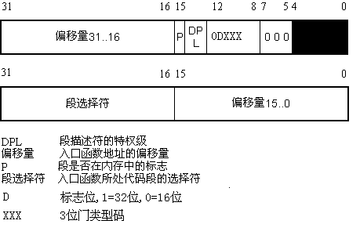
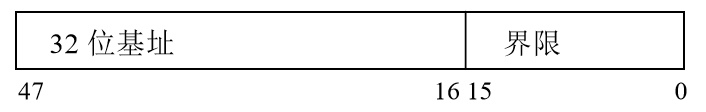
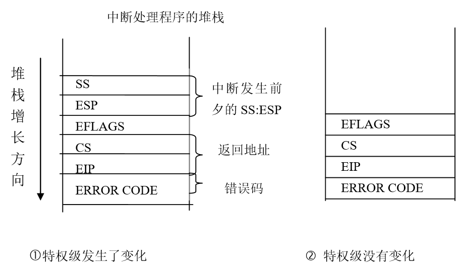
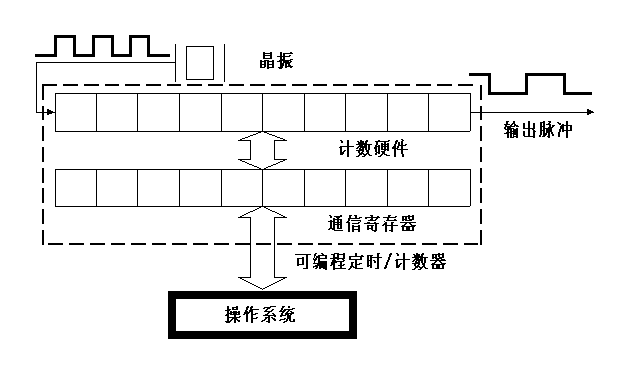

#第五章 中断和异常

中断控制是计算机发展中一种重要的技术。最初它是为克服对I/O接口控制采用程序查询所带来的处理器低效率而产生的。中断控制的主要优点是只有在I/O需要服务时才能得到处理器的响应，而不需要处理器不断地进行查询。由此，最初的中断全部是对外部设备而言的，即称为外部中断（或硬件中断）。

但随着计算机系统结构的不断改进以及应用技术的日益提高，中断的适用范围也随之扩大，出现了所谓的内部中断（或叫异常），它是为解决机器运行时所出现的某些随机事件及编程方便而出现的。因而形成了一个完整的中断系统。本章主要讨论在80x86保护模式下中断机制在Linux中的实现

##5.1中断是什么

大多数读者可能对16位实地址模式下的中断机制有所了解，例如中断向量、外部I/O中断以及异常，这些内容在32位的保护模式下依然有效。两种模式之间最本质的差别就是在保护模式引入了中断描述符表。

### 5.1.1中断向量

Intel
x86系列微机共支持256种向量中断，为使处理器较容易地识别每种中断源，将它们从0到256编号，即赋以一个中断类型码n，Intel把这个8位的无符号整数叫做一个向量，因此，也叫**中断向量**。所有256种中断可分为两大类：异常和中断。异常又分为**故障（Fault）和陷阱(Trap)**，它们的共同特点是既不使用中断控制器，又不能被屏蔽（异常其实是CPU发出的中断信号）。中断又分为外部**可屏蔽中断**（INTR）和外部**非屏蔽中断**（NMI），所有I/O设备产生的中断请求（IRQ）均引起屏蔽中断，而紧急的事件（如硬件故障）引起的故障产生非屏蔽中断。

非屏蔽中断的向量和异常的向量是固定的，而屏蔽中断的向量可以通过对中断控制器的编程来改变。Linux对256个向量的分配如下：

1.  从0~31的向量对应于异常和非屏蔽中断。

2.  从32~47的向量（即由I/O设备引起的中断）分配给屏蔽中断。

3.  剩余的从48~255的向量用来标识软中断。Linux只用了其中的一个（即128或0x80向量）用来实现系统调用。

说明，你可以在proc文件系统下的interrupts文件中，查看当前系统中各种外设的IRQ：

$cat /proc/interrupts

### 5.1.2 外设可屏蔽中断

Intel
x86通过两片中断控制器8259A来响应15个外中断源，每个8259A可管理8个中断源。第一级（称主片）的第二个中断请求输入端，与第二级8259A（称从片）的中断输出端INT相连，如图5.1所示。我们把与中断控制器相连的每条线叫做**中断线**，要使用中断线，就要进行中断线的申请，也就是IRQ(Interrupt
ReQuirement
)，因此我们也常把申请一条中断线称为申请一个IRQ或者是申请一个中断号。IRQ线是从0开始顺序编号的；因此，第一条IRQ线通常表示成IRQ0。IRQn的缺省向量是n+32；如前所述，IRQ和向量之间的映射可以通过中断控制器端口来修改。
<div style="text-align: center">

</div>

<center>图5.1 级连的 8259A的中断机构</center>

并不是每个设备都可以向中断线上发中断信号的，只有对某一条确定的中断线拥有了控制权，才可以向这条中断线上发送信号。由于计算机的外部设备越来越多，所以15条中断线已经不够用了，中断线是非常宝贵的资源，所以只有当设备需要中断的时候才申请占用一个IRQ，或者是在申请IRQ时采用共享中断的方式，这样可以让更多的设备使用中断。

对于外部I/O请求的屏蔽可分为两种情况，一种是从CPU的角度，也就是清除eflag的中断标志位（IF），当IF=0时，禁止任何外部I／O的中断请求，即关中断；一种是从中断控制器的角度，因为中断控制器中有一个8位的中断屏蔽寄存器，每位对应8259A中的一条中断线，如果要禁用某条中断线，则把中断屏蔽寄存器相应的位置1，要启用，则置0。

### 5.1.3异常及非屏蔽中断

异常就是CPU内部出现的中断,也就是说，在CPU执行特定指令时出现的非法情况。非屏蔽中断就是计算机内部硬件出错时引起的异常情况。从上图可以看出，二者与外部I/O接口没有任何关系。Intel把非屏蔽中断作为异常的一种来处理，因此，后面所提到的异常也包括了非屏蔽中断。在CPU执行一个异常处理程序时，就不再为其他异常或可屏蔽中断请求服务，也就是说，当某个异常被响应后，CPU清除eflag的中IF位，禁止任何可屏蔽中断。但如果又有异常产生，则由CPU锁存（CPU具有缓冲异常的能力），待这个异常处理完后，才响应被锁存的异常。我们这里讨论的异常中断向量在0～31之间，不包括系统调用（中断向量为0x80）。

Intel
x86处理器发布了大约20种异常（具体数字与处理器模式有关）。Linux内核必须为每种异常提供一个专门的异常处理程序。

### 5.1.4中断描述符表

在实地址模式中，CPU把内存中从0开始的1K字节作为一个中断向量表。表中的每个表项占四个字节，由两个字节的段地址和两个字节的偏移量组成，这样构成的地址便是相应中断处理程序的入口地址。但是，在保护模式下，由四字节的表项构成的中断向量表显然满足不了要求。这是因为，除了两个字节的段描述符，偏移量必用四字节来表示；要有反映模式切换的信息。因此，在保护模式下，中断向量表中的表项由8个字节组成，如图5.2所示，中断向量表也改叫做中断描述符表IDT（Interrupt
Descriptor Table）。其中的每个表项叫做一个**门描述符**（gate
descriptor），“门”的含义是当中断发生时必须先通过这些门，然后才能进入相应的处理程序。

<div style="text-align: center">

</div>

<center>图5.2门描述符的一般格式</center>

其中类型占3位，表示门描述符的类型，主要门描述符为：

(1)中断门（Interrupt gate）

   其类型码为110,中断门包含了一个中断或异常处理程序所在段的选择符和段内偏移量。当控制权通过中断门进入中断处理程序时，处理器清IF标志，即关中断，以避免嵌套中断的发生。中断门中的**请求特权级**（DPL）为0，因此，用户态的进程不能访问Intel的中断门。所有的中断处理程序都由中断门激活，并全部限制在内核态。

(2)陷阱门（Trap gate）

   其类型码为111,与中断门类似，其唯一的区别是，控制权通过陷阱门进入处理程序时维持IF标志位不变，也就是说，不关中断。

(3)系统门（System gate）

   这是Linux内核特别设置的，用来让用户态的进程访问Intel的陷阱门，因此，门描述符的DPL为3。系统调用就是通过系统门进入内核的。

最后，在保护模式下，中断描述符表在内存的位置不再限于从地址0开始的地方，而是可以放在内存的任何地方。为此，CPU中增设了一个中断描述符表寄存器IDTR，用来存放中断描述符表在内存的起始地址。中断描述符表寄存器IDTR是一个48位的寄存器，其低16位保存中断描述符表的大小，高32位保存中断描述符表的基址，如图5.3所示。

<div style="text-align: center">

</div>

<center>图5.3 中断描述符表寄存器IDTR</center>

### 5.1.5 相关汇编指令

为了有助于读者对中断实现过程的理解，下面介绍几条相关的汇编指令：

####1.  调用过程指令CALL

   指令格式： CALL 过程名

   说明：在取出CALL指令之后及执行CALL指令之前，使指令指针寄存器EIP指向紧接CALL指令的下一条指令。CALL指令先将EIP值压入栈内，再进行控制转移。当遇到RET指令时，栈内信息可使控制权直接回到CALL的下一条指令

####2.  调用中断过程的指令INT

   指令格式：INT 中断向量

   说明：EFLAG、CS及EIP寄存器被压入栈内。控制权被转移到由中断向量指定的中断处理程序。在中断处理程序结束时，IRET指令又把控制权送回到刚才执行被中断的地方。

####3.  中断返回指令IRET

   指令格式：IRET

   说明：IRET与中断调用过程相反：它将EIP、CS及EFLAGS寄存器内容从栈中弹出，并将控制权返回到发生中断的地方。IRET用在中断处理程序的结束处。

####4.  加载中断描述符表的指令LIDT

   格式：LIDT 48位的伪描述符

   说明：LIDT将指令中给定的48位伪描述符装入中断描述符寄存器IDTR。

##5.2中断描述符表的初始化

通过上面的介绍，我们知道了Intel微处理器对中断和异常所做的工作。下面，我们从操作系统的角度来对中断描述符表的初始化给予描述。

Linux内核在系统的初始化阶段要进行大量的初始化工作，其与中断相关的工作有：初始化可编程控制器8259A；将中断描述符表的起始地址装入IDTR寄存器，并初始化表中的每一项。这些操作的完成将在本节进行具体描述。

用户进程可以通过INT指令发出一个中断请求，其中断请求向量在0～255之间。为了防止用户使用INT指令模拟非法的中断和异常，必须对中断描述符表进行谨慎的初始化。其措施之一就是将中断门或陷阱门中的请求特权级DPL域置为0。如果用户进程确实发出了这样一个中断请求，CPU会检查出其**当前特权级**CPL（3）与所请求的特权级DPL（0）有冲突，因此产生一个“通用保护”异常。

但是，有时候必须让用户进程能够使用内核所提供的功能（比如系统调用），也就是说从用户态进入内核态，这可以通过把中断门或陷阱门的DPL域置为3
来达到。

当计算机运行在实模式时，中断描述符表被初始化，并由BIOS使用。然而，一旦真正进入了Linux内核，中断描述符表就被移到内存的另一个区域，并为进入保护模式进行预初始化：用汇编指令LIDT对中断向量表寄存器IDTR进行初始化，即把IDTR置为0。把中断描述符表IDT的起始地址装入IDTR

用setup_idt()函数填充中断描述表中的256个表项。在对这个表进行填充时，使用了一个空的中断处理程序。因为现在处于初始化阶段，还没有任何中断处理程序，因此，用这个空的中断处理程序填充每个表项。

在对中断描述符表进行预初始化后,
内核将在启用分页功能后对IDT进行第二遍初始化,也就是说，用实际的陷阱和中断处理程序替换这个空的处理程序。一旦这个过程完成，对于每个异常，IDT都由一个专门的陷阱门或系统门，而对每个外部中断，IDT都包含专门的中断门。

### 5.2.1 IDT表项的设置

IDT表项的设置是通过_set_gaet()函数实现的，在此，我们给出如何调用该函数在IDT表中插入一个门：

####1. 插入一个中断门

```c
void set_intr_gate(unsigned int n, void *addr)

{

		_set_gate(idt_table+n,14,0,addr);

}
```

其中，idt_table是中断描述符表IDT在程序中的符号表示，n表示在第n个表项中插入一个中断门。这个门的段选择符设置成代码段的选择符，DPL域设置成0，14表示D标志位为1（表示32位）而类型码为110，所以set_intr_gate（）设置的是中断门，偏移域设置成中断处理程序的地址addr。

####2. 插入一个陷阱门

```c
static void __init set_trap_gate(unsigned int n, void *addr)

{

		_set_gate(idt_table+n,15,0,addr);

}
```
在第n个表项中插入一个陷阱门。这个门的段选择符设置成代码段的选择符，DPL域设置成0，15表示D标志位为1而类型码为111，所以set_trap_gate（）设置的是陷阱门，偏移域设置成异常处理程序的地址addr。

#### 插入一个系统门

```c
static void __init set_system_gate(unsigned int n, void *addr)

{

		_set_gate(idt_table+n,15,3,addr);

}
```
在第n个表项中插入一个系统门。这个门的段选择符设置成代码段的选择符，DPL域设置成3，15表示D标志位为1而类型码为111，所以set_system_gate（）设置的也是陷阱门，但因为DPL为3，因此，系统调用在用户态可以通过“INT0x80”顺利穿过系统门，从而进入内核态。

### 5.2.2对陷阱门和系统门的初始化

trap_init()函数就是设置中断描述符表开头的19个陷阱门和系统门，这些中断向量都是CPU保留用于异常处理的：

```c
set_trap_gate(0,&divide_error);

set_trap_gate(1,&debug);

……

set_trap_gate(19,&simd_coprocessor_error);

set_system_gate(SYSCALL_VECTOR,&system_call);
```

其中，“&”之后的名字就是每个异常处理程序的名字。最后一个是对系统调用的设置。

### 5.2.3 中断门的设置

中断门的设置是由init_IRQ()函数中的一段代码完成的：

```c
for (i = 0; i < (NR_VECTORS - FIRST_EXTERNAL_VECTOR); i++) {  
		int vector = FIRST_EXTERNAL_VECTOR + i;  
		if (i >= NR_IRQS)  
				break;  
		if (vector != SYSCALL_VECTOR)  
		set_intr_gate(vector, interrupt[i]);  
   }
```

从FIRST_EXTERNAL_VECTOR开始，设置NR_IRQS（NR_VECTORS - FIRST_EXTERNAL_VECTOR）个IDT表项。常数FIRST_EXTERNAL_VECTOR定义为0x20，而NR_IRQS则为224[^1]，即中断门的个数。注意，必须跳过用于系统调用的向量0x80，因为这在前面已经设置好了。
这里，中断处理程序的入口地址是一个数组interrupt[]，数组中的每个元素是指向中断处理函数的指针。

### 5.2.4 中断处理程序的形成

由前一节知道，interrupt[]为中断处理程序的入口地址，这只是一个笼统的说法。实际上不同的中断处理程序，不仅名字不同，其内容也不同，但是，这些函数又有很多相同之处，因此应当以统一的方式形成其函数名和函数体，于是，内核对该数组的定义如下：

```c
static void (*interrupt[NR_VECTORS - FIRST_EXTERNAL_VECTOR])(void) = {

IRQLIST_16(0x2), IRQLIST_16(0x3),

IRQLIST_16(0x4), IRQLIST_16(0x5), IRQLIST_16(0x6), IRQLIST_16(0x7),

IRQLIST_16(0x8), IRQLIST_16(0x9), IRQLIST_16(0xa), IRQLIST_16(0xb),

IRQLIST_16(0xc), IRQLIST_16(0xd), IRQLIST_16(0xe), IRQLIST_16(0xf)

 };
```

这里定义的数组interrupt[]，从IRQLIST_16(0x2)到IRQLIST_16(0xf)一共有14个数组元素，其中IRQLIST_16()宏的定义如下：

  #define IRQLIST_16(x) 

  IRQ(x,0), IRQ(x,1), IRQ(x,2), IRQ(x,3), 

  IRQ(x,4), IRQ(x,5), IRQ(x,6), IRQ(x,7), 

  IRQ(x,8), IRQ(x,9), IRQ(x,a), IRQ(x,b), 

  IRQ(x,c), IRQ(x,d), IRQ(x,e), IRQ(x,f)

该宏中定义了16个IRQ(x,y)，这样就有224（14*16）个函数指针。不妨再接着展开IRQ(x,y)宏：

#define IRQ(x,y) 

IRQ##x##y##_interrupt

## 表示将字符串连接起来，比如IRQ(0x2,0)就是IRQ0x20_interrupt。

综上可知，以这样的方式就定义出224个函数，从
IRQ0x20_interrupt一直到IRQ0xff_interupt。那么这些函数名又是如何形成的？我们看如下宏定义：

#define IRQ_NAME2(nr) nr##_interrupt(void)

#define IRQ_NAME(nr) IRQ_NAME2(IRQ##nr)

从这两个宏的定义可以推知，IRQ_NAME(n)就是IRQn_interrupt(void)函数形式，其中随n具体数字不同，则形成不同的IRQn_interrupt()函数名。接下来，又如何以统一的方式让这些函数拥有内容，也就是说，这些函数的代码是如何形成的？内核定义了BUILD_IRQ宏。

BUILD_IRQ宏是一段嵌入式汇编代码，为了有助于理解，我们把它展开成下面的汇编语言片段：

IRQn_interrupt:

            pushl $n-256

jmp common_interrupt

    把中断号减256的结果保存在栈中，这是进入中断处理程序后第一个压入堆栈的值，是一个负数，正数留给系统调用使用。对于每个中断处理程序，唯一不同的就是压入栈中的这个数。然后，所有的中断处理程序都跳到一段相同的代码common_interrupt。关于这段代码，请参看5.3.3一节中断处理程序IRQn_interrupt。

##5.3 中断处理

通过上面的介绍，我们知道了中断描述符表已被初始化，并具有了相应的内容；对于外部中断，还要建立中断请求队列，以及执行中断处理程序，这正是我们本节要关心的主要内容。

### 5.3.1中断和异常的硬件处理。

首先，我们从硬件的角度来看CPU如何处理中断和异常。这里假定内核已被初始化，CPU已从实模式转到保护模式。

当CPU执行了当前指令之后，CS和EIP这对寄存器中所包含的内容就是下一条将要执行指令的虚地址。在对下一条指令执行前，CPU先要判断在执行当前指令的过程中是否发生了中断或异常。如果发生了一个中断或异常，那么CPU将做以下事情：

1.  确定所发生中断或异常的向量i（在0～255之间）。

2.  通过IDTR寄存器找到IDT表，读取IDT表第i项（或叫第i个门）。

3.  分两步进行有效性检查：首先是“段”级检查，将CPU的当前特权级CPL（存放在CS寄存器的最低两位）与IDT中第i项段选择符中的DPL相比较，如果DPL（3）大于CPL（0），就产生一个“通用保护”异常，因为中断处理程序的特权级不能低于引起中断的进程的特权级。这种情况发生的可能性不大，因为中断处理程序一般运行在内核态，其特权级为0。然后是“门”级检查，把CPL与IDT中第i个门的DPL相比较，如果CPL大于DPL，也就是当前特权级（3）小于这个门的特权级（0），CPU就不能“穿过”这个门，于是产生一个“通用保护”异常，这是为了避免用户应用程序访问特殊的陷阱门或中断门。但是请注意，这种“门”级检查是针对一般的用户程序，而不包括外部I/O产生的中断或因CPU内部异常而产生的异常，也就是说，如果产生了中断或异常，就免去了“门”级检查。

4.  检查是否发生了特权级的变化。当中断发生在用户态（特权级为3），而中断处理程序运行在内核态（特权级为0），特权级发生了变化，所以会引起堆栈的更换。也就是说，从用户堆栈切换到内核堆栈。而当中断发生在内核态时，即CPU在内核中运行时，则不会更换堆栈，如图5.4所示。

<div style="text-align: center">

</div>

<center>图5.4中断处理程序堆栈示意图</center>

 从图可以看出，当从用户态堆栈切换到内核态堆栈时，先把用户态堆栈的值压入中断程序的内核态堆栈中，同时把EFLAGS寄存器自动压栈，然后把被中断进程的返回地址压入堆栈。如果异常产生了一个硬错误码，则将它也保存在堆栈中。如果特权级没有发生变化，则压入栈中的内容如图5.4中。此时，CS:EIP的值就是IDT表中第i项门描述符的段选择符和偏移量的值，于是，CPU就跳转到了中断或异常处理程序。

### 5.3.2 中断请求队列的建立

由于硬件的限制，很多外部设备不得不共享中断线，例如，一些PC配置可以把同一条中断线分配给网卡和图形卡。由此看来，让每个中断源都必须占用一条中断线是不现实的。所以，仅仅中断描述符表并不能提供中断产生的所有信息，内核必须对中断线给出进一步的描述。在Linux设计中，专门为每个中断请求IRQ设置了一个队列，这就是所谓的中断请求队列。

#### 1中断服务程序与中断处理程序

我们这里提到的**中断服务程序ISR**（Interrupt Service Routine）与以前所提到的**中断处理程序**(Interrupt handler)是两个不同的概念。在Linux中，15条中断线对应15个中断处理程序，其名依次为IRQ0x00_interrupt()，IRQ0x01_interrupt()……IRQ0x0f_interrupt()。具体来说，中断处理程序相当于某个中断向量的总处理程序，例如IRQ0x05_interrupt()是中断号5（向量为37）的总处理程序，如果这个5号中断由网卡和图形卡共享，则网卡和图形卡分别有其相应的中断服务程序。

#### 2中断线共享的数据结构

为了让多个设备能共享一条中断线而内核设置了一个叫irqaction的数据结构：

```c
typedef irqreturn_t (*irq_handler_t)(int, void *);

		struct irqaction {

		irq_handler_t handler;

		unsigned long flags;

		cpumask_t mask;

		const char *name;

		void *dev_id;

		struct irqaction *next;

		int irq;

		…

};
```

对每个域描述如下：

handler

指向一个具体I/O设备的中断服务程序，该函数有两个参数，第一个参数为中断号IRQ，第二个参数为void指针，该指针一般传入dev_id（唯一地标示某个设备的设备号）的值。

flags

用一组标志描述中断线与I/O设备之间的关系。

IRQF_DISABLED

中断处理程序执行时必须禁止中断

IRQF_SHARED

允许其它设备共享这条中断线。

IRQF_SAMPLE_RANDOM

可以把这个设备看作是随机事件发生源；因此，内核可以用它做随机数产生器。

name

I/O设备名

dev_id

指定I/O设备的主设备号和次设备号(参见第9章)。

next

指向irqaction描述符链表的下一个元素，前提是flags为IRQF_SHARED标志。共享同一中断线的每个硬件设备都有其对应的中断服务程序，链表中的每个元素就是对相应设备及中断服务程序的描述。

#### 3 注册中断服务程序

在IDT表初始化完成之初，每个中断服务队列还为空。此时，即使打开中断且某个外设中断真的发生了，也得不到实际的服务。因为CPU虽然通过中断门进入了某个中断向量的总处理程序，例如IRQ0x05_interrupt()，但是，具体的中断服务程序（如图形卡的）还没有挂入中断请求队列。因此，在设备驱动程序的初始化阶段，必须通过request_irq()函数将相应的中断服务程序挂入中断请求队列，也就是对其进行注册。

request_irq()函数原型为：

```c
int request_irq(unsigned int irq,

   irq_handler_t handler,

   unsigned long irqflags,

   const char *devname,

void *(dev_id)
```

第一个参数irq表示要分配的中断号。对某些设备，如传统PC设备上的系统时钟或键盘，这个值通常是预先设定的。而对于大多数其他设备来说，这个值要么是可以通过探测获取，要么可以通过编程动态确定。

第二个参数handler是一个指针，指向处理这个中断的实际中断服务程序。只要操作系统一接收到中断，该函数就被调用。要注意，handler函数的原型是特定的，它接受两个参数，并有一个类型为irqreturn_t的返回值。

第三个参数irqflags可以为0，也可能是IRQF_SAMPLE_RANDOM ，IRQF_SHARED，

或IRQF_DISABLED 这几个标志的位掩码。

第四个参数devname是与中断相关的设备的名字。例如，
PC机上键盘中断对应的这个值为“keyboard”。这些名字会被/proc/irq和/proc/interrupt文件使用，以便与用户通信，稍后我们将对此进行简短讨论。

第五个参数dev_id主要用于共享中断线。当一个中断服务程序需要释放时，dev_id将提供唯一的标志信息，以便从共享中断线的诸多中断服务程序中删除指定的那一个。如果没有这个参数，那么内核不可能知道在给定的中断线上到底要删除哪一个处理程序。如果无需共享中断线，那么将该参数赋为空值（NULL），但是，如果中断线是被共享的，那么就必须传递唯一的信息。

这里要说明的是，在驱动程序初始化或者在设备第一次打开时，首先要调用request_irq()函数，以申请使用参数中指明的中断请求号irq，另一参数handler指的是要挂入到中断请求队列中的中断服务程序。假定一个程序要对/dev/fd0/（第一个软盘对应的设备）设备进行访问，通常将IRQ6分配给软盘控制器，给定这个中断号6，软盘驱动程序就可以发出下列请求，以将其中断服务程序挂入中断请求队列：

request_irq(6, floppy_interrupt,

IRQF_DISABLED|IRQF_SAMPLE_RANDOM, "floppy", NULL);

我们可以看到，floppy_interrupt（）中断服务程序运行时必须禁止中断（设置了IRQF_DISABLED标志），并且不允许共享这个IRQ（清IRQF_SHARED标志），但允许根据这个中断发生的时间产生随机数（设置了IRQF_SAMPLE_RANDOM标志，用于建立熵池，以供系统产生随机数使用）。

注意，request_irq()函数可能会睡眠，因此，不能在中断上下文或其他不允许阻塞的代码中这调用该函数。在睡眠不安全的上下文中调用request_irq()函数是一种常见错误。

#### 4 注销中断服务程序

卸载驱动程序时，需要注销相应的中断处理服务程序，并释放中断线。可以调用

void free_irq(unsigned int irq,void *dev_id)来释放中断线。

如果指定的中断线不是共享的，那么，该函数删除处理程序的同时将禁用这条中断线。如果中断线是共享的，则仅删除dev_id所对应的服务程序，而这条中断线本身只有在删除了最后一个服务程序时才会被禁用。由此可以看出为什么唯一的dev_id如此重要。对于共享的中断线，需要一个唯一的信息来区分其上面的多个服务程序，并让free_irq()仅仅删除指定的服务程序。不管在哪种情况下（共享或不共享），如果dev_id非空，它都必须与需要删除的服务程序相匹配。

注意，必须从进程上下文中调用free_irq() 。

### 5.3.3中断处理程序的执行

从前面的介绍，我们已经了解了中断机制及有关的初始化工作。现在，我们可以从中断请求的发生到CPU的响应，再到中断处理程序的调用和返回，沿着这一思路走一遍，以体会Linux内核对中断的响应及处理。

假定外设的驱动程序都已完成了初始化工作，并且已把相应的中断服务程序挂入到特定的中断请求队列。
又假定当前进程正在用户空间运行（随时可以接受中断），且外设已产生了一次中断请求。当这个中断请求通过中断控制器8259A到达CPU的中断请求引线INTR时（参看图5.1）,CPU就在执行完当前指令后来响应该中断。

CPU从中断控制器的一个端口取得中断向量I，然后根据I从中断描述符表IDT中找到相应的表项，也就是找到相应的中断门。因为这是外部中断，不需要进行“门级”检查，CPU就可以从这个中断门获得中断处理程序的入口地址，假定为IRQ0x05_interrupt。因为这里假定中断发生时CPU运行在用户空间（CPL＝3），而中断处理程序属于内核（DPL＝0），因此，要进行堆栈的切换。当CPU进入IRQ0x05_interrupt时，内核栈如图5.4的，栈中除用户栈指针、EFLAGS的内容以及返回地址外再无其他内容。另外，由于CPU进入的是中断门（而不是陷阱门），因此，这条中断线已被禁用，直到重新启用。

我们用IRQn_interrupt表示从IRQ0x00_interrupt
到IRQ0x0f_interrupt任意一个中断处理程序。这个中断处理程序要调用do_IRQ()函数。do_IRQ()对所接收的中断进行应答，并禁止这条中断线，然后要确保这条中断线上有一个有效的中断服务程序，而且这个例程已经启动但是目前还没有执行。这时，do_IRQ()调用handle_IRQ_event（）来运行挂在这条中断线上的所有中断服务程序；图5.5给出它们的调用关系：

<div style="text-align: center">

</div>

<center>图5.5中断处理函数的调用关系</center>

#### 1.中断处理程序IRQn_interrupt

如5.2.4节所述，一个中断处理程序主要包含两条语句：

IRQn_interrupt:

pushl $n-256

jmp common_interrupt

其中第一条语句把中断号减256的结果保存在栈中，这是每个中断处理程序唯一的不同之处。然后，所有的中断处理程序都跳到一段相同的代码common_interrupt。这段代码的汇编语言片段为：

common_interrupt:

SAVE_ALL

call do_IRQ

jmp ret_from_intr

SAVE_ALL宏把中断处理程序会使用的所有CPU寄存器都保存在栈中。然后，调用do_IRQ()函数，因为通过CALL调用这个函数，因此，该函数的返回地址被压入栈。当执行完do_IRQ()，就跳转到ret_from_intr()地址（参见后面的“从中断和异常返回”）。

#### 2. do_IRQ( )函数

do_IRQ()这个函数处理所有外设的中断请求。do_IRQ()对中断请求队列的处理主要是调用
handle_IRQ_event （）函数完成的，handle_IRQ_event （）函数的主要代码片段为：

```c
retval=0;

do {

	   	retval | = action->handler(irq, action->dev_id);

	   	action = action->next;

} while (action);
```

这个循环依次调用请求队列中的每个中断服务程序。这里要说明的是，中断服务程序都在关中断的条件下进行（不包括非屏蔽中断），这也是为什么CPU在穿过中断门时自动关闭中断的原因。但是，关中断时间绝不能太长，否则就可能丢失其它重要的中断。也就是说，中断服务程序应该处理最紧急的事情，而把剩下的事情交给另外一部分来处理，即下半部（bottom half）来处理，这一部分内容将在下一节进行讨论。

### 5.3.4 从中断返回

从前面的讨论我们知道，do_IRQ()这个函数处理所有外设的中断请求。当这个函数执行时，内核栈从栈顶到栈底包括：

1.  do_IRQ( )的返回地址

2.  由SAVE_ALL 推进栈中的一组寄存器的值

3.  (n-256）

4.  CPU自动保存的寄存器

可以看出,内核栈顶包含的就是do_IRQ()的返回地址，这个地址指向ret_from_intr。实际上，ret_from_intr是一段汇编语言的入口点，为了描述简单起见，我们以函数的形式提及它。虽然我们这里讨论的是中断的返回，但实际上中断、异常及系统调用的返回是放在一起实现的，因此，我们常常以函数的形式提到下面这三个入口点：

ret_from_intr（）

终止中断处理程序

ret_from_sys_call( )

终止系统调用，即由0x80引起的异常。

ret_from_exception( )

终止除了0x80的所有异常

在相关的计算机课程中，我们已经知道从中断返回时CPU要做的事情。简而言之，调用恢复中断现场的宏RESTORE_ALL(与SAVEL_ALL相对应)，彻底从中断返回。

### 5.3.5 中断的简单应用

在了解中断相关的知识之后，我们用一个简单例子说明如何编写中断服务程序。

例5-1 编写内核模块，计算两次中断的时间间隔。

说明：在内核中，时间用用无符号长整型jiffies表示，这是一个全局变量，表示自系统启动以来的时钟节拍数（参见5.5.3一节）。另外，通过给内核模块传递参数的形式，把设备名和对应的中断号irq传给模块。

```c
#include<linux/module.h>

#include<linux/init.h>

#include<linux/interrupt.h>

#include<linux/kernel.h>

static int irq; /*模块参数-中断号*/

static char *interface; /*模块参数-设备名*/

static int count = 0; /*统计插入模块期间发生的中断次数*/

module_param(interface,charp,0644);

module_param(irq,int,0644);

static irqreturn_t intr_handler(int irq, void *dev_id)

{

		static long interval = 0;

		if(count==0){

		interval=jiffies;

}

interval=jiffies-interval; /*计算两次中断之间的间隔,时间单位为节拍 */

printk(" The interval between two interrupts is %ld\n" interval);

		interval=jiffies;

		count++;

		return IRQ_NONE;

}

static int __init intr_init(void)

{

		if (request_irq(irq,&intr_handler,IRQF_SHARED,interface,&irq)) {
/*注册中断服务程序，注意内核版本不同，共享标志可能有所不同*/

				printk(KERN_ERR " Fails to register IRQ %dn", irq);

				return -EIO;

		}

		printk("%s Request on IRQ %d succeededn",interface,irq);

		return 0;

}

static void __exit intr_exit(void)

{

		printk(“The %d interrupts happened on irq %d”,conut,irq);

		free_irq(irq, &irq); /* 释放中断线*/

		printk("Freeing IRQ %d\n", irq);

		return;

}

module_init(intr_init);

module_exit(intr_exit);

MODULE_LICENSE("GPL");
```

假定编译后的模块名为 intr.ko,则插入方法如下

$ sodu insmod intr.ko interface=eth0 irq=9

编译以后在插入模块时需要带参数interface和irq，interface是设备名，irq是所要申请的中断号，可以从/proc/interrupts文件中查找得到，注意这里要申请的中断号必须是可共享的。读者可以观察网卡中断，当网络连接断开时是出现什么现象，当有网络请求时，又出现什么现象。

##5.4 中断的下半部处理机制

从上面的讨论我们知道，Linux并不是一口气把中断所要求的事情全部做完，而是分两部分来做，本节我们来具体描述内核怎样处理中断的下半部。

### 5.4.1 为什么把中断分为两部分来处理

中断服务程序一般都是在中断请求关闭的条件下执行的,以避免嵌套而使中断控制复杂化。但是，中断是一个随机事件，它随时会到来，如果关中断的时间太长，CPU就不能及时响应其他的中断请求，从而造成中断的丢失。因此，内核的目标就是尽可能快的处理完中断请求，尽其所能把更多的处理向后推迟。例如，假设一个数据块已经达到了网线，当中断控制器接受到这个中断请求信号时，Linux内核只是简单地标志数据到来了，然后让处理器恢复到它以前运行的状态，其余的处理稍后再进行（如把数据移入一个缓冲区，接受数据的进程就可以在缓冲区找到数据）。因此，内核把中断处理分为两部分：上半部（top
half）和下半部（bottom
half），上半部（就是中断服务程序）内核立即执行，而下半部（就是一些内核函数）留着稍后处理，如图5.6所示：

<div style="text-align: center">

</div>

<center>图5.6 中断的分割</center>

首先，一个快速的“上半部”来处理硬件发出的请求，它必须在一个新的中断产生之前终止。通常，除了在设备和一些内存缓冲区（如果你的设备用到了DMA，就不止这些）之间移动或传送数据，确定硬件是否处于健全的状态之外，这一部分做的工作很少。

下半部运行时是允许中断请求的，而上半部运行时是关中断的，这是二者之间的主要区别。

但是，内核到底什时候执行下半部，以何种方式组织下半部？这就是我们要讨论的下半部实现机制，这种机制在内核的演变过程中不断得到改进，在以前的内核中，这个机制叫做bottom
half(简称bh)，在2.4以后的版本中有了新的发展和改进，改进的目标使下半部可以在多处理机上并行执行，并有助于驱动程序的开发者进行驱动程序的开发，这种执行机制叫软中断（SOFTIRQ）机制。下面主要介绍软中断中常用的**小任务(Tasklet)**机制及2.6内核中的工作队列机制。

### 5.4.2 小任务机制 

这里的小任务是指**对要推迟执行的函数进行组织的一种机制**。其数据结构为tasklet_struct，每个结构代表一个独立的小任务，其定义如下：

```c
struct tasklet_struct {

		struct tasklet_struct *next; /*指向链表中的下一个结构*/

		unsigned long state; /* 小任务的状态 */

		atomic_t count; /* 引用计数器 */

		void (*func) (unsigned long); /* 要调用的函数 */

		unsigned long data; /* 传递给函数的参数 */

}；
```

结构中的func域就是下半部中要推迟执行的函数 ，data是它唯一的参数。

State域的取值为TASKLET_STATE_SCHED或TASKLET_STATE_RUN。TASKLET_STATE_SCHED表示小任务已被调度，正准备投入运行，TASKLET_STATE_RUN表示小任务正在运行。TASKLET_STATE_RUN只有在多处理器系统上才使用，任何时候单处理器系统都清楚一个小任务是不是正在运行（它要么就是当前正在执行的代码，要么不是）。

Count域是小任务的引用计数器。如果它不为0，则小任务被禁止，不允许执行；只有当它为零，小任务才被激活，并且在被设置为挂起时，小任务才能够执行。

#### 1声明和使用小任务

大多数情况下，为了控制一个寻常的硬件设备，小任务机制是实现下半部的最佳选择。小任务可以动态创建，使用方便，执行起来也比较快。

我们既可以静态地创建小任务，也可以动态地创建它。选择那种方式取决于到底是想要对小任务进行直接引用还是一个间接引用。如果准备静态地创建一个小任务（也就是对它直接引用），使用下面两个宏中的一个：
```c
DECLARE_TASKLET(name, func, data)

DECLARE_TASKLET_DISABLED(name, func, data)
```
这两个宏都能根据给定的名字静态地创建一个tasklet_struct结构。当该小任务被调度以后，给定的函数func会被执行，它的参数由data给出。这两个宏之间的区别在于引用计数器的初始值设置不同。第一个宏把创建的小任务的引用计数器设置为0，因此，该小任务处于激活状态。另一个把引用计数器设置为1，所以该小任务处于禁止状态。例如：
```c
DECLARE_TASKLET(my_tasklet, my_tasklet_handler, dev);
```
这行代码其实等价于
```c
struct tasklet_struct my_tasklet = { NULL, 0, ATOMIC_INIT(0),

tasklet_handler, dev};
```
这样就创建了一个名为my_tasklet的小任务，其处理程序为tasklet_handler，并且已被激活。当处理程序被调用的时候，dev就会被传递给它。

#### 2 编写自己的小任务处理程序

小任务处理程序必须符合如下的函数类型：
```c
void tasklet_handler(unsigned long data)
```
由于小任务不能睡眠，因此不能在小任务中使用信号量或者其它产生阻塞的函数。但是小任务运行时可以响应中断。

#### 3调度自己的小任务

通过调用tasklet_schedule()函数并传递给它相应的tasklt_struct指针，该小任务就会被调度以便适当的时候执行：
```c
tasklet_schedule(&my_tasklet); /*把 my_tasklet 标记为挂起 */
```
在小任务被调度以后，只要有机会它就会尽可能早的运行。在它还没有得到运行机会之前，如果一个相同的小任务又被调度了，那么它仍然只会运行一次。

可以调用tasklet_disable()函数来禁止某个指定的小任务。如果该小任务当前正在执行，这个函数会等到它执行完毕再返回。调用tasklet_enable()函数可以激活一个小任务，如果希望把以DECLARE_TASKLET_DISABLED（）创建的小任务激活，也得调用这个函数，如：
```c
tasklet_disable(&my_tasklet); /* 小任务现在被禁止,这个小任务不能运行 */

tasklet_enable(&my_tasklet); /* 小任务现在被激活 */
```
也可以调用tasklet_kill()函数从挂起的队列中去掉一个小任务。该函数的参数是一个指向某个小任务的tasklet_struct的长指针。在小任务重新调度它自身的时候，从挂起的队列中移去已调度的小任务会很有用。这个函数首先等待该小任务执行完毕，然后再将它移去。

#### 4. 小任务的简单应用

例5-2 调用tasklet的相关函数编写一个模块。

```c
#include<linux/module.h>  
#include<linux/init.h>  
#include<linux/fs.h>  
#include<linux/kdev_t.h>  
#include<linux/cdev.h>  
#include<linux/kernel.h>  
#include<linux/interrupt.h>  
     
static struct tasklet_struct my_tasklet;  
     
static void tasklet_handler (unsigned long data)  
{  
       printf(KERN_ALERT "tasklet_handler is running.\n");  
}  
     
static int __init test_init(void)  
{  
       tasklet_init(&my_tasklet, tasklet_handler, 0);  
       tasklet_schedule(&my_tasklet);  

       return 0;  
}  
     
static void __exit test_exit(void)  
{  
       tasklet_kill(&tasklet);  
       printk(KERN_ALERT "test_exit running.\n");  
}  
MODULE_LICENSE("GPL");  
     
module_init(test_init);  
module_exit(test_exit);
```

从这个例子可以看出，所谓的小任务机制是为下半部函数的执行提供了一种执行机制，也就是说，推迟处理的事情是由tasklet_handler实现，何时执行，经由小任务机制封装后交给内核去处理。

### 5.4.3工作队列

工作队列（work queue）是另外一种将工作推后执行的形式，它和我们前面讨论的所有其他形式都有不同。工作队列可以把工作推后，交由一个内核线程去执行，也就是说，这个下半部分可以在进程上下文中执行。这样，通过工作队列执行的代码能占尽进程上下文的所有优势。最重要的就是工作队列允许被重新调度甚至是睡眠。

那么，什么情况下使用工作队列，什么情况下使用tasklet。如果推后执行的任务需要睡眠，那么就选择工作队列。如果推后执行的任务不需要睡眠，那么就选择tasklet。另外，如果需要用一个可以重新调度的实体来执行你的下半部处理，也应该使用工作队列。它是唯一能在进程上下文运行的下半部实现的机制，也只有它才可以睡眠。这意味着在需要获得大量的内存时、在需要获取信号量时，在需要执行阻塞式的I/O操作时，它都非常有用。如果不需要用一个内核线程来推后执行工作，那么就考虑使用tasklet。

#####1.  工作、工作队列和工作者线程

   如前所述，我们把推后执行的任务叫做工作（work），描述它的数据结构为work_struct，这些工作以队列结构组织成工作队列（workqueue），其数据结构为workqueue_struct，而工作线程就是负责执行工作队列中的工作。系统默认的工作者线程为events,自己也可以创建自己的工作者线程。

#####2.  表示工作的数据结构

   在linux/workqueue.h中定义了work_struct结构：

```c
struct work_struct{

		unsigned long pending; /* 这个工作正在等待处理吗？*/

		struct list_head entry; /* 工作的链表 */

		void (*func) (void *); /* 要执行的函数 */

		void *data; /* 传递给函数的参数 */

		void *wq_data; /* 内部使用 */

		struct timer_list timer; /* 延迟的工作队列所用到的定时器 */

};
```

这些结构被连接成链表。当一个工作者线程被唤醒时，它会执行它的链表上的所有工作。工作被执行完毕，它就将相应的work_struct对象从链表上移去。当链表上不再有对象的时候，它就会继续休眠。

####3. 创建推后的工作

要使用工作队列，首先要做的是创建一些需要推后完成的工作。可以通过DECLARE_WORK在编译时静态地建该结构：

   DECLARE_WORK(name, void (*func) (void *), void *data);

这样就静态地创建一个名为name，待执行函数为func，参数为data的work_struct结构。

同样，也可以在运行时通过指针创建一个工作：

   INIT_WORK(struct work_struct *work, woid(*func) (void *), void *data);

这将动态地初始化一个由work指向的工作。

####4. 工作队列中待执行的函数

工作队列待执行的函数原型是：

   void work_handler(void *data)

这个函数由一个工作者线程执行，因此，函数运行在进程上下文中。默认情况下，允许响应中断，并且不持有任何锁。如果需要，函数可以睡眠。需要注意的是，尽管该函数运行在进程上下文中，但它不能访问用户空间，因为内核线程在用户空间没有相关的内存映射。通常在系统调用发生时，内核代表用户空间的进程运行，此时它才能访问用户空间，也只有在此时它才映射用户空间的内存。

####5. 对工作进行调度

现在工作已经被创建，我们可以调度它。想要把给定工作的待处理函数提交给缺省的events工作线程，只需调用
```c
   schedule_work(&work)；
```
work马上就被调度，一旦其所在的处理器上的工作者线程被唤醒，它就被执行。

有时候并不希望工作马上就被执行，而是希望它经过一段延迟以后再执行。在这种情况下，可以调度它在指定的时间执行：
```c
   schedule_delayed_work(&work, delay);
```
这时，&work指向的work_struct直到delay指定的时钟节拍用完以才会执行。

####6. 工作队列的简单应用

例5-3 调用工作队列的相关函数编写一个模块

```c
#include<linux/module.h>  
#include<linux/init.h>  
#include<linux/workqueue.h>  
  
static struct workqueue_struct *queue = NULL;  
static struct work_struct work;  
  
static void work_handler(struct work_struct *data)  
{  
        printk(KERN_ALERT "work handler function.n");  
}  
  
static int __init test_init(void)  
{  
        queue = create_singlethread_workqueue("helloworld");
/*创建一个单线程的工作队列*/  
        if (!queue)  
                goto err;  
  
        INIT_WORK(&work, work_handler);  
        schedule_work(&work);  
  
        return 0;  
err:  
        return -1;  
}  
  
static void __exit test_exit(void)  
{  
        destroy_workqueue(queue);  
}  
MODULE_LICENSE("GPL");  
module_init(test_init);  
module_exit(test_exit);
```

##5.5 中断应用－时钟中断

在所有的外部中断中，时钟中断起着特殊的作用。因为计算机是以严格精确的时间进行数值运算和和数据处理的，最基本的时间单元是时钟周期，例如取指令、执行指令、存取内存等，但是我们不讨论这些纯硬件的东西，这里要讨论的是操作系统建立的时间系统，这个时间系统是整个操作系统活动的动力。

###5.5.1时钟硬件

大部分PC机中有两个时钟源，他们分别叫做RTC和OS（操作系统）时钟。RTC（Real Time
Clock，实时时钟）也叫做CMOS时钟，它是PC主机板上的一块芯片（或者叫做时钟电路），它靠电池供电，即使系统断电，也可以维持日期和时间。由于它独立于操作系统，所以也被称为硬件时钟，它为整个计算机提供一个计时标准，是最原始最底层的时钟数据。

OS时钟产生于PC主板上的定时/计数芯片，由操作系统控制这个芯片的工作，OS时钟的基本单位就是该芯片的计数周期。在开机时操作系统取得RTC中的时间数据来初始化OS时钟，然后通过计数芯片的向下计数形成了OS时钟，所以OS时钟并不是本质意义上的时钟，它更应该被称为一个计数器。OS时钟只在开机时才有效，而且完全由操作系统控制，所以也被称为软时钟或系统时钟。下面我们重点描述OS时钟的产生。

OS时钟所用的定时/计数芯片最典型的是8253/8254可编程定时/计数芯片，其硬件结构及工作原理在这里不详细讲述，只简单地描述它是怎样维持OS时钟的。OS时钟的物理产生示意图如图5.7
所示：

<div style="text-align: center">

</div>

<center>图 5.7 8253/8254工作示意图</center>

可编程定时/计数器总体上由两部分组成：计数硬件和通信寄存器。通信寄存器包含有控制寄存器、状态寄存器、计数初始值寄存器（16位）、计数输出寄存器等。通信寄存器在计数硬件和操作系统之间建立联系，用于二者之间的通信，操作系统通过这些寄存器控制计数硬件的工作方式、读取计数硬件的当前状态和计数值等信息。在Linux内核初始化时，内核写入控制字和计数初值，这样计数硬件就会按照一定的计数方式对晶振产生的输入脉冲信号（5~100MHz的频率）进行计数操作：计数器从计数初值开始，每收到一次脉冲信号，计数器减1，当计数器减至0时，就会输出高点平或低电平，然后，如果计数为循环方式（通常为循环计数方式），则重新从计数初值进行计数，从而产生如图所示的输出脉冲信号（当然不一定是很规整的方波）。这个输出脉冲是OS时钟的硬件基础，之所以这么说，是因为这个输出脉冲将接到中断控制器上
，产生中断信号，触发后面要讲的时钟中断，由时钟中断服务程序维持OS时钟的正常工作，所谓维持，其实就是简单的加1及细微的修正操作。这就是OS时钟产生的来源。

### 5.5.2 时钟运作机制

不同的操作系统，RTC和OS时钟的关系是不同的。RTC和OS时钟之间的关系通常也被称作操作系统的时钟运作机制。

一般来说，RTC是OS时钟的时间基准，操作系统通过读取RTC来初始化OS时钟，此后二者保持同步运行，共同维持着系统时间。所谓同步，是指操作系统在运行过程中，每隔一个固定时间会刷新或校正RTC中的信息。

Linux中的时钟运作机制如图5.8所示。OS时钟和RTC之间要通过BIOS的连接，是因为传统PC机的BIOS中固化有对RTC进行有关操作的函数，例如INT
1AH等中断服务程序，通常操作系统也直接利用这些函数对RTC进行操作，例如从RTC中读出有关数据对OS时钟初始化、对RTC进行更新等等。Linux在内核初始化完成后就完全抛弃了BIOS中的程序。

<div style="text-align: center">

</div>

<center>图5.8 时钟运作机制</center>

我们可以看到，RTC处于最底层，提供最原始的时钟数据。OS时钟建立在RTC之上，初始化完成后将完全由操作系统控制，和RTC脱离关系。操作系统通过OS时钟提供给应用程序所有和时间有关的服务。因为OS时钟完全是一个软件问题，其所能表达的时间由操作系统的设计者决定，将OS时钟定义为整型还是长整型或者大的超乎想象都是由设计者决定。

### 5.5.3 Linux时间系统

以上我们了解了RTC和OS时钟。下面我们具体描述OS时钟。

OS时钟是由可编程定时/计数器产生的输出脉冲触发中断而产生的。输出脉冲的周期叫做一个“**时钟节拍**”。计算机中的时间是以时钟节拍为单位的，每一次时钟节拍，系统时间就会加1。操作系统根据当前时钟节拍的数目就可以得到以秒或毫秒等为单位的其他时间格式。

不同的操作系统采用不同的“时间基准”。定义“时间基准”的目的是为了简化计算，这样，计算机中的时间只要表示为从这个时间基准开始的时钟节拍数就可以了。时间基准是由操作系统的设计者规定的。例如DOS的时间基准是1980年1月1日，Unix和Minux的时间基准是1970年1月1日上午12点，Linux的时间基准是1970年1月1日凌晨0点。

通过上面的时钟运作机制，我们知道了OS时钟在Linux中的重要地位。OS时钟记录的时间也就是通常所说的系统时间。系统时间是以“时钟节拍”为单位的，而时钟中断的频率（简称节拍率）决定了一个时钟节拍的长短。节拍率是通过静态预处理定义的，也就是Hz（赫兹），在系统启动时按照Hz值对硬件进行设置。体系结构不同，Hz的值也不同。实际上，对于某些体系结构来说，甚至是机器不同，它的值都会不一样。

内核在文件<asm/param>中定义了Hz的实际值，节拍率就等于Hz，周期为1/Hz秒。比如，对Hz值定义如下：

#define Hz 100 /*内核时间频率*/

可以看到系统定时器频率为100Hz（2.6以后的内核为1000Hz），也就是说每秒钟时钟中断100次（每10毫秒产生一次）。

####1.节拍数jiffies

**j**iffies是Linux内核中的一个全局变量,用它来表示系统自启动以来的时钟节拍总数。启动时，内核将该变量初始化为0，此后，每次时钟中断处理程序都会增加该变量的值。因为一秒内时钟中断的次数等于Hz，所以jiffes一秒内增加的值也就为Hz。系统运行时间以秒为单位计算，就等于jiffes/Hz。

jiffy是“瞬间、一会儿”的意思，和“时钟节拍”表达的是同一个意思。每次时钟中断jiffies都增1。

iffies变量总是无符号长整数（unsigned long），因此，在32位体系结构上是32位，在64位体系结构上是64位。32位的jiffies变量，在时钟频率为100Hz的情况下，497天后会溢出。如果频率为1000Hz，49.7天后就会溢出。而使用64位的jiffies变量，溢出就会遥遥无期了。

由于性能与历史的原因，主要还考虑到与现有内核代码的兼容性，内核开发者希望jiffie依然为unsigned long
extern unsigned long volatile jiffies;

现在我们来看一些用到jiffes的内核代码。将以秒为单位的时间转化为jiffes：(seconds * HZ)
相反，将jiffies转换为以秒为单位的时间：(jiffies/HZ)
比较而言，内核中将秒转换为jiffies用得多一些，比如经常需要设置一些将来的时间：
```c
unsigned long time_stamp = jiffes; /*现在*/

unsigned long next_tick = jiffies+1; /* 从现在开始1个节拍*/

unsigned long later = jiffies+5*HZ; /*从现在开始5秒*/
```
上面这种操作经常会用在内核和用户空间进行交互的时候，而内核本身很少用到绝对时间。

注意jiffies类型为无符号长整型（unsigned long），用其他任何类型存放它都不正确。

####2.实际时间xtime

所谓实际时间就是实际生活中以秒为单位的时间。当系统启动时，内核通过读取RTC来初始化实际时间，该时间存放在内核的**xtim**e变量中。

当前实际时间（墙上时间）定义在文件kernel/timekeeping.c中：

```c
struct timespec xtime;

timespec 数据结构定义在文件linux/time.h中，形式如下：

struct timespec { /* 高精度*/

		long tv_sec; /* 秒 */

		long tv_nsec; /* 纳秒：十亿分之一秒（ nanosecond）*/

   };
```

xtime.tv_sec以秒为单位，存放着自1970年7月1日（UTC）以来经过的时间，1970年1月1日被称为纪元，多数Unix系统的墙上时间都是基于该纪元而言的。xtime.tv_nsec记录自上一秒开始经过的纳秒数。除此之外，还有一种普通精度的时间表示方式：

```c
struct timeval { /* 普通精度 */

		int tv_sec; /* 秒 */

		int tv_usec; /* 微秒：百万分之一秒（microsecond）*/

};
```

另外，Linux还定义了更加符合大众习惯的时间表示：年、月、日。但是万变不离其宗，所有的时间应用都是建立在jiffies基础之上的。

### 5.5.5 时钟中断

####1. 时钟中断的产生

前面我们看到，Linux的OS时钟的物理产生原因是可编程定时/计数器产生的输出脉冲，这个脉冲送入CPU，就可以引发一个中断请求信号，我们就把它叫做时钟中断。

“时钟中断”是特别重要的一个中断，因为整个操作系统的活动都受到它的激励。系统利用时钟中断维持系统时间、促使环境的切换，以保证所有进程共享CPU；利用时钟中断进行记帐、监督系统工作以及确定未来的调度优先级等工作。可以说，“时钟中断”是整个操作系统的脉搏。

时钟中断的物理产生如图5.9所示：

<div style="text-align: center">

</div>

<center>图5.9 8253和8259A的物理连接方式</center>

操作系统对可编程定时/计数器进行有关初始化，然后定时/计数器就对输入脉冲进行计数（分频），产生的三个输出脉冲Out0、Out1、Out2各有用途，很多计算机接口书都介绍了相关主题，我们只看Out0上的输出脉冲，这个脉冲信号接到中断控制器8259A_1的0号管脚，触发一个周期性的中断，我们就把这个中断叫做时钟中断，时钟中断的周期，也就是脉冲信号的周期，我们叫做“滴答”或“节拍”（tick）。从本质上说，时钟中断只是一个周期性的信号，完全是硬件行为，该信号触发CPU去执行一个中断服务程序。

####2.时钟中断处理程序

每一次时钟中断的产生都会进行一些列的操作，其中调用的主要函数为do_timer()：

1） 给jiffies变量增加1。

2）更新资源消耗的统计值，比如当前进程所消耗的系统时间和用户时间。

3）执行已经到期的定时器（下一节将讨论）。

4）执行sheduler_tick()函数。

5）更新墙上时间，该时间存放在xtime变量中。

6） 计算平均负载值。

因为上述工作分别都由单独的函数负责完成，所以实际上do_timer()执行代码看起来非常简单。

```c
void do_timer(struct pt_regs *regs)

{

		jiffies++;

		update_process_times(user_mode(regs));

		update_times();

}
```

其中参数structpt_reg是CPU中一组寄存器的定义，在本函数中user_mode()宏在查询处理器寄存器状态时，根据cs寄存器最低两位RPL判断时钟中断发生在用户态还是内核态，如果发生在用户态它返回1；如果发生在内核态则返回0。update_process_times()函数根据时钟中断产生的位置，对相关时间进行更新。

```c
void update_process_times(int user_tick)

{

		struct task_struct *p = current ;

		int cpu = smp_processor_id();

		int system = user_tick;

		update_one_process(p,user_tick,system,cpu);

		run_local_timers();

		scheduler_tick(user_tick,system);
}
```

update_one_process()函数的作用是更新进程时间。它的实现是相当细致的，但是要注意，因为使用了XOR操作，所以user_tick和system两个变量只要其中有一个为1，则另外一个就必为0。updates_one_process()函数可以通过判断分支，将user_tick和system加到进程相应的计数上：
```c
/*

* 更新恰当的时间计数器，给其加一个jiffy。

*/

p->utime += user;

p->stime += system;
```
上述操作将适当的计数值增加1，而另一个值保持不变。这样做意味着内核对进程进行时间计数时，是根据中断发生时处理器所处的状态进行分类统计的，它把上一个tick全部算给进程。但是事实上进程在上一个节拍期间可能多次进入和退出内核态，而且在上一个节拍期间，该进程也不一定是唯一一个运行进程。很不幸，这种粒度的进程统计方式是传统的Unix/Linux所具有的，现在还没有更加精密的统计算法的支持，内核现在只能做到这个程度。

接下来的run_lock_times()函数去处理所有到期的定时器，定时器作为在下半部分中执行。在下一节中将对定时器进行简单讨论。

最后
scheduler_tick()函数负责减少当前运行进程的时间片计数值并且在需要时设置need_resched标志。

当update_process_timer（）函数返回后，do_timer()函数接着会调用update_times()函数更新墙上时钟。

```c
void update_times(void)

{

		unsigned long ticks;

		ticks = jiffies - wall_jiffies;
	
		if(ticks){

				wall_jiffies + = ticks;

				update_wall_time(ticks);

		}

		last_time_offset = 0;

		calc_load(ticks);

}
```

ticks记录最近一次更新后新产生的节拍数。通常情况下ticks显然应该等于1。但是时钟中断也有可能丢失，因而节拍也会丢失。在中断长时间被禁止的情况下，就会出现这种现象—但这种现象并不正常，往往是个bug。wall_jiffies值随后被加上ticks—所以此刻wall_jiffies值就等于最新的墙上时间的更新值jiffies—接着调用update_wall_time()函数更新xtime，最后由calc_load()计算平均负载，到此，update_times()执行完毕。

do_timer()函数执行完毕后返回具体的时钟中断处理程序，继续执行后面的工作，释放xtime_lock锁，然后退出。

以上全部工作每1/Hz秒都要发生一次，也就是说在你的PC机上时钟中断处理程序每秒执行100或者1000次。

### 5.5.5 定时器及应用

定时器是管理内核所花时间的基础，有时也被称为动态定时器或内核定时器。内核经常需要推后执行某些代码，比如前面提到的下半部机制就是为了将工作放到以后执行。但不幸的是，“之后”这个概念很含糊，下半部的本意并非是放到以后的某个时间去执行任务，而仅仅是不在此时此刻执行就可以了。我们所需要的是能够使工作在指定时间点上执行，也就是不长不短，就在希望的时间点上执行。内核定时器正是解决这个问题的理想工具。

定时器使用很简单。只需要执行一些初始化工作，设置一个到期时间，指定到时后执行的函数，然后激活定时器就可以了。指定的函数将在定时器到期时自动执行。注意定时器并不周期运行，它在到期后就自行销毁，这也正是这种定时器被称为动态定时器的一个原因；动态定时器不断的创建和销毁，而且它的运行次数也不受限制。定时器在内核中用得非常普遍。

#### 1 使用定时器

定时器由timer_list结构表示，定义如下：

```c
struct timer_list {

		struct list_head entry; /*包含定时器的链表*/

		unsigned long expires; /*以jifffies为单位的定时值*/

		spinlock_t lock; /*保护定时器的锁*/

		void (*function)(unsigned long); /*定时器到时要执行的函数*/

		unsigned long data; /*传递给处理函数的长整型参数*/

};
```

内核提供了一组与定时器相关的接口简化了对定时器的操作。

创建定时器首先需要先定义它：

struct timer_list my_timer;

接下来需要通过一个辅助函数初始化定时器数据结构的内部值，初始化必须在对定时器操作前完成。

init_timer(&my_timer);

现在就可以填充结构中需要的值：

my_timer.expires = jiffies + delay; /* 定时器到期节拍数*/

my_timer.data = 0;/* 给定时器处理函数传入0值*/

my_timer.function = my_function;/*定时器到期调用的函数*/

my_timer.expires表示到期时间，它是以节拍为单位的绝对计数值。如果当前jiffies计数等于或大于my_timer.expires，由my_timer.function指向的处理函数就会开始执行，另外该函数还要使用长整型参数my_timer.data。我们从timer_list结构可以看到，处理函数必须符合下面的函数原形：

void my_timer_function(unsigned long data)

data参数不同，则可以对应不同的定时器。如果不需要这个参数，可以简单传递０（或任何其它值）。

最后，必须激活定时器：

add_timer(&my_timer);

到此为止，定时器可以工作了。但请注意定时值的重要性。当前节拍计数*等于或大于*指定的到期时间，内核就开始执行定时器处理函数。虽然内核可以保证不会在定时时间到期前运行定时器处理函数，但是有可能延误定时器的执行。一般来说，定时器都在到期后马上就会执行，但是也有可能被推迟到下一次时钟节拍才能运行，所以不能用定时器实现任何硬实时任务。

如果需要在定时器到期前停止定时器，可以使用del_timer()函数：

del_timer(&my_timer);

被激活或未被激活的定时器都可以使用该函数，如果定时器还未被激活，该函数返回０；否则返回１。注意，不需要为已经到期的定时器调用该函数，因为它们会自动被删除。

#### 2 执行定时器

内核在时钟中断发生后执行定时器，定时器作为软中断在下半部中执行。具体来说，时钟中断处理程序会执行update_process_timers()函数，该函数随即调用run_local_timers()函数：
```c
void run_local_timers(void)

{

		raise_softirq(TIMER_SOFTIRQ);

}
```

run_timer_softirq()函数处理软中断TIMER_SOFTIRQ，其处理函数为
run_timer_softirq
，该函数用来处理所有的软件时钟，从而在当前处理器上运行所有的超时定时器。定时器是一种比较复杂的机制，其具体实现在此不做讨论。

#### 3 定时器应用

为了说明定时器如何在内核中实际使用，我们给出创建和使用进程延时的例子。假定内核决定把当前进程挂起两秒，可以通过执行下列代码来做到这一点：
```c
timeout = 2 * HZ; /*1HZ等于1000，因此为2000ms*/

set_current_state(TASK_INTERRUPTIBLE); /* 或者 TASK_UNINTERRUPTIBLE */

remaining = schedule_timeout(timeout);
```
schedule_timeout()函数会让需要延迟执行的进程睡眠到指定的延迟时间耗尽后再重新运行。但该方法也不能保证睡眠时间正好等于指定的延迟时间，而只能尽量使睡眠时间接近指定的延迟时间。当指定的时间到期后，内核唤醒被延迟的进程并将其重新放回运行队列。

上面的代码将相应的进程推入可中断睡眠队列，睡眠timeout秒。因为进程处于可中断状态，所以如果进程收到信号将被唤醒。如果睡眠进程不想接收信号，可以将进程状态设置为TASK_UNINTERRUPTBLE，然后睡眠。注意在调用sechedule_timeout()函数前必须首先将进程设置成上面两种状态之一，否则进程不会睡眠。

注意，由于shedule_timeout()函数需要调用调度程序，所以调用它的代码必须保证能够睡眠。简而言之，调用代码必须处于进程上下文中，并且不能持有锁。

schedule_timeout( )函数的主要代码如下：

```c
unsigned schedule_timeout(unsigned long timeout)

{

		struct timer_list timer;

		unsigned long expire;

		expire = timeout + jiffies;

		init_timer(&timer);

		timer.expires = expire;

		timer.data = (unsigned long) current;

		timer.function = process_timeout;

		add_timer(&timer);

		schedule( ); /* 进程被挂起直到定时器到期 */

		del_timer(&timer);

		timeout = expire - jiffies;

		return (timeout < 0 ? 0 : timeout);

};
```

该函数创建一个定时器timer；然后设置它的到期时间expires；设置超时时要执行的函数process_timeout()；然后激活定时器而且调用schedule()。因为进程被标识为TASK_
INTERRUPTIBLE或TASK_UNINTERRUPTIBLE，所以调度程序不会再选择该进程投入运行，而会选择其他新进程运行。

当延时到期时，内核执行下列函数：

```c
void process_timeout(unsigned long data)

{

		struct task_struct * p = (struct task_struct *) data;

		wake_up_process(p);
}
```

当调用process_timeout(
)，把存在定时器对象data域的task_struct指针作为参数传递过去。结果，挂起的进程被唤醒，状态被置为TASK_RUNNING，然后将其放入运行队列。

当该进程重新被调度时，将返回进入睡眠前的位置继续执行（正好在调用schedule()后）。如果进程提前被唤醒（比如收到信号），那么定时器被销毁，process_timeout()函数返回剩余的时间。

### 5.4本章小结

本章涵盖了较多的概念：中断和异常，中断向量，IRQ，中断描述符表，中断请求队列，中断的上半部和下半部，时钟中断，时钟节拍，节拍率，定时器等，尽量区分这些概念。

中断使得硬件与处理器进行通信，不同的设备对应的中断不同，每个都有一个惟一的数字标识，这就是IRQ；同时，不同的中断具有不同的中断服务程序，其中断处理程序的入口地址存放在中断向量表中。当某个中断发生时，对应的中断服务程序得到执行，在执行期间不接受外界的干扰。为了缓解中断服务程序的压力，内核中引入了中断下半部机制，不管是tasklet机制，工作队列机制，其本质都是推后下半部函数的执行。

时钟中断是内核跳动的脉搏，本章引入了时钟节拍，jiffies，节拍率等概念，简要介绍了时钟中断的运行机制，同时给出了定时器的简单应用。

习题

1.  什么是中断？什么是异常？二者有何不同？

2.  什么是中断向量？Linux是如何分配中断向量的？

3.  什么是中断描述符表？什么是门描述符？请描述其格式。

4.  门描述符有哪些类型？它们有什么不同？

5.  Call指令和INT指令有何区别？

6.  如何对中断描述符表进行初始化？

7.  在中断描述符表中如何插入一个中断门、陷阱门和系统门？

8.  内核如何处理异常？

9.  画出对中断和异常进行硬件处理的流程图，并说明CPU为什么要进行有效性检查？如何检查？CPU是如何跳到中断或异常处理程序的？

10. 中断处理程序和中断服务程序有何区别？Linux如何描述一条共享的中断线？

11. 为什么要把中断所执行的操作进行分类？分为哪几类？

12. 叙述中断处理程序的执行过程，并给出几个主要函数的调用关系和功能。

13. 为什么把中断分为两部分来处理？

14. 如何申明和使用一个小任务？

15. 实时时钟和操作系统时钟有何不同？

16. jiffies表示什么？什么时候对其增加？

17. 时钟中断服务程序的主要操作是什么？其主要函数的功能是什么？

18. 时钟中断的下半部分主要做什么？

19. 阅读时钟中断的源代码。

20. 举例说明如何使用定时器。
