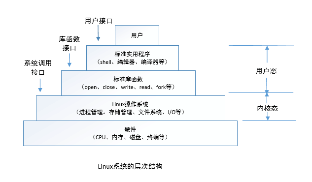

## 第一章 概述
&emsp;&emsp;不管是计算机的心脏—CPU，还是记忆的载体—内存，甚至于种类繁多的外围设备—磁盘、打印机、键盘、网卡等输入输出设备，
它们之所以能有条不紊地协同工作，是因为有一层软件不遗余力地管理着它们。这层软件就是操作系统。

&emsp;&emsp;操作系统作是一种庞大而复杂的系统软件，为了对这样一个庞然大物有全方位的认识，让我们站在这座大厦的不同侧面给予初步观察。

  

