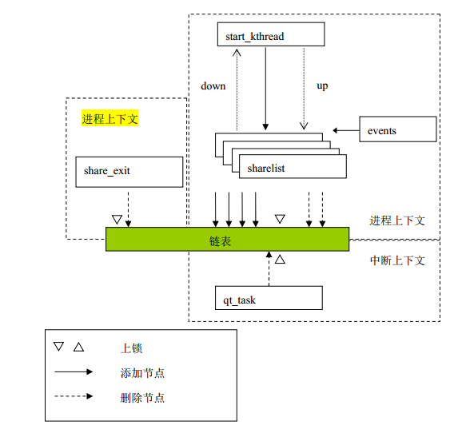

## 7.4 内核多任务并发实例

&emsp;&emsp;内核任务是指在内核态执行的任务，具体包括内核线程、系统调用、中断处理程序、下半部任务等几类。

### 7.4.1 内核任务及其并发关系

&emsp;&emsp;在我们的实例中，涉及三种内核任务，分别是系统调用、内核线程和定时器任务队列

&emsp;&emsp;（1）系统调用：系统调用是用户程序通过门机制来进入内核执行的内核例程，它运行在内核态，处于进程上下文中，可以认为是代表用户进程的内核任务，因此具有用户态任务的特性。

&emsp;&emsp;（2） 内核线程：内核线程可以理解成在内核中运行的特殊进程，它有自己的“进程上下文”（也就是借用了调用它的用户进程的上下文），所以同样被进程调度程序调度，也可以睡眠。不同之处就在于内核线程运行于内核空间，可访问内核数据，运行期间不能被抢占。

&emsp;&emsp;（3） 定时器任务队列：定时器任务队列属于下半部，在每次产生时钟节拍时得到处理。

&emsp;&emsp;上述三种内核任务存在如下竞争关系：系统调用和内核线程可能和各种内核任务并发执行，除了中断（定时器任务队列属于软中断范畴）可以抢占它、产生并发外，它们还有可能自发地主动睡眠（比如在一些阻塞性的操作中），放弃处理器，从而其他任务被重新调度，所以系统调用和内核线程除与定时器任务队列发生竞争，也会与其他（包括自己）系统调用和内核线程发生竞争。

### 7.4.2 问题描述

&emsp;&emsp;假设存在这样一个内核共享资源－链表(mine),有多个内核任务并发访问链表：200个内核线程(sharelist)向链表加入新节点；内核定时器（qt\_task）定时删除节点；系统调用（share\_exit销）毁链表。这三种内核任务并发执行时，有可能会破坏链表数据的完整性，所以我们必须对链表进行同步访问保护，以保证数据的一致性。

### 7.4.3 实现机制

1.变量声明

```c
#define NTHREADS 200 /* 线程数 */
struct my_struct {
        struct list_head list;
        int id;
        int pid;
};
static struct work_struct queue; /* 定义工作队列 */
static struct timer_list mytimer; /* 定时器队列 */
static LIST_HEAD(mine); /* sharelist头 */
static unsigned int list_len = 0;
static DECLARE_MUTEX(sem); /* 内核线程进行同步的信号量 */
static spinlock_t my_lock = SPIN_LOCK_UNLOCKED; /* 保护对链表的操作*/
static atomic_t my_count = ATOMIC_INIT(0); /* 以原子方式进行追加*/
static long count = 0; /* 行计数器，每行打印4个信息*/
static int timer_over = 0; /* 定时器结束标志 */
static int sharelist(void *data); /*从共享链表增删节点的线程*/
static void kthread_launcher(struct work_struct *q); /*创建内核线程*/
static void start_kthread(void); /*调度内核线程 */
```
2.模块注册函数share\_init
```c
static int share_init(void)
{
        int i;
        printk(KERN_INFO"share list enter\n");
        INIT_WORK(&queue, kthread_launcher);//初始化工作队列
        setup_timer(&mytimer, qt_task, 0); //设置定时器
        add_timer(&mytimer); //添加定时器
        for (i = 0; i < NTHREADS; i++) //再启动200个内核线程来添加节点
        start_kthread();
        return 0;
}
```
该函数是模块注册函数，也是通过它启动定时器任务和内核线程。它首先初始化定时器任务队列，注册定时器任务qt\_task；然后依次启动200个内核线程start\_kthread()。至此开始对链表进行操作。

3.对共享链表操作的内核线程sharelist
```c
static int sharelist(void *data)
{
        struct my_struct *p;
        if (count++ % 4 == 0)
                printk("\n");
        spin_lock(&my_lock); /* 添加锁，保护共享资源 */
        if (list_len < 100) {
                if ((p = kmalloc(sizeof(struct my_struct), GFP_KERNEL)) == NULL)
                        return -ENOMEM;
                p->id = atomic_read(&my_count); /* 原子变量操作 */
                atomic_inc(&my_count);
                p->pid = current->pid;
                list_add(&p->list, &mine); /* 向队列中添加新节点*/
                list_len++;
                printk("THREAD ADD:%-5d\t", p->id);
        } 
        else { /* 队列超过定长则删除节点 */
                struct my_struct *my = NULL;
                my = list_entry(mine.prev, struct my_struct, list);
                list_del(mine.prev); /* 从队列尾部删除节点 */
                list_len--;
                printk("THREAD DEL:%-5d\t", my->id);
                kfree(my);
        }
        spin_unlock(&my_lock);
        return 0;
}
```
为了防止定时器任务队列抢占执行时造成链表数据不一致，需要在操作链表期间进行同步保护。

4.创建内核线程的kthread\_launcher
```c
void kthread_launcher(struct work_struct *q)
{
        kernel_thread(sharelist, NULL, CLONE_KERNEL | SIGCHLD); /*创建内核线程*/
        up(&sem);
}
```
该函数作用仅仅是通过kernel\_thread方法启动内核线程sharelist。

5.调度内核线程的start\_kthread
```c
static void start_kthread(void)
{
        down(&sem);
        schedule_work(&queue);/*调度工作队列*/
}
```
在模块初始化函数share\_init中，创建内核线程的kthread\_launcher任务挂在工作队列上，也就是说该任务受内核中默认的工作者线程events调度（参见5.4.3一节）。

>注意：为了能依次建立且启动内核线程，start\_kthread函数会在任务加入调度队列前利用信号量进行自我阻塞即down（&sem），直到内核线程执行后才解除阻塞即up（&sem），这种信号量同步机制保证了串行地创建内核线程，虽然串行并非必需。

6.删除节点的定时器任务qt\_task
```c
void qt_task(unsigned long data)
{
        if (!list_empty(&mine)) {
                struct my_struct *i;
                if (count++ % 4 == 0)
                        printk("\n");
                i = list_entry(mine.next, struct my_struct, list); /* 取下一个节点 */
                list_del(mine.next); /* 删除节点 */
                list_len--;
                printk("TIMER DEL:%-5d\t", i->id);
                kfree(i);
        }
        mod_timer(&mytimer, jiffies + 1); /*修改定时器时间*/
}
```
7.share\_exit
```c
static void_exit share_exit(void)
{
        struct list_head *n, *p = NULL;
        struct my_struct *my = NULL;
        printk("\nshare list exit\n");
        del_timer(&mytimer);
        spin_lock(&my_lock); /* 上锁，以保护临界区 */
        list_for_each_safe(p, n, &mine) { /* 删除所有节点，销毁链表 */
        if (count++ % 4 == 0)
                printk("\n");
        my = list_entry(p, struct my_struct, list); /* 取下一个节点 */
        list_del(p);
        printk("SYSCALL DEL: %d\t", my->id);
        kfree(my);
}
	spin_unlock(&my_lock); /* 开锁*/
	printk(KERN_INFO"Over \n");
}
```
&emsp;&emsp;该函数是模块注销函数，负责销毁链表。由于销毁时内核线程与定时器任务都在运行，所以应该进行同步保护，即锁住链表，这是通过spin\_lock自旋锁达到的，因为自旋锁保证了任务执行的串行化，此刻其他任务就没有机会执行了。当重新打开自旋锁时，其他任务就可以运行。

&emsp;&emsp;图7.1 给出了这个并发控制实例中各种对象的关系示意图。
<div align=center>

</div>
<div align=center>
图 7.1 并发控制实例示意图	
</div>
