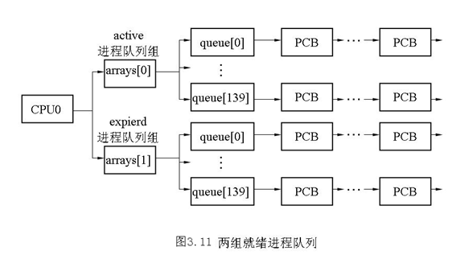

## **3.4 进程调度**

&emsp;&emsp;在多进程的操作系统中，进程调度是一个全局性、关键性的问题，它对系统的总体设计、系统的的实现、功能设置以及各个方面的性能都有着决定性的影响。进程调度算法的设计，还对系统的复杂性有着极大的影响，常常会由于实现的复杂程度而在功能与性能方面作出必要的权衡和让步。在Linux 2.6中为了提高性能，对调度算法进行了大幅度改进，其实现复杂度也随之增加。为了简单起见，这里以Linux 2.4中的调度算法来说明进程调度原理。后面附加说明Linux 2.6中进程调度的改进方法。

### **3.4.1基本原理**

&emsp;&emsp;从前面我们可以看到，进程运行时需要各种各样的系统资源，如内存、文件、打印机和最宝贵的CPU等等，所以说，调度的实质就是资源的分配。系统通过不同的调度算法来实现这种资源的分配。通常来说，选择什么样的调度算法取决于的资源分配的策略， 一个好的调度算法应当考虑以下几个方面：

（1）公平：保证每个进程得到合理的CPU时间。

（2）高效：使CPU保持忙碌状态，即总是有进程在CPU上运行。

（3）响应时间：使交互用户的响应时间尽可能短。

（4）周转时间：使批处理用户等待输出的时间尽可能短。

（5）吞吐量：使单位时间内处理的进程数量尽可能多。

&emsp;&emsp;很显然，这5个目标不可能同时达到，所以，不同的操作系统会在这几个方面中作出相应的取舍，从而确定自己的调度算法，例如Unix采用动态优先数调度、BSD采用多级反馈队列调度、Windows采用抢先多任务调度等等。

下面来了解一下主要的调度算法及其基本原理：

**1．时间片轮转调度算法**

&emsp;&emsp;时间片（Time Slice）就是分配给进程运行的一段时间。

&emsp;&emsp;在分时系统中，为了保证人机交互的及时性，系统使每个进程依次地按时间片轮流地执行，此时应采用时间片轮转法进行调度。在通常的轮转法中，系统将所有的可运行（即就绪）进程按先来先服务的原则，排成一个队列，每次调度时把CPU分配给队首进程，并令其执行一个时间片。时间片的大小从几ms到几百ms不等。当执行的时间片用完时，系统发出信号，通知调度程序，调度程序便据此信号来停止该进程的执行，并将它送到运行队列的末尾，等待下一次执行；然后，把处理机分配给就绪队列中新的队首进程，同时也让它执行一个时间片。这样就可以保证就绪队列中的所有进程，在一个给定的时间（人所能接受的等待时间）内，均能获得一时间片的处理机执行时间。

**2．优先权调度算法**

&emsp;&emsp;为了照顾到紧迫型进程在进入系统后便能获得优先处理，引入了最高优先权调度算法。当将该算法用于进程调度时，系统将把处理机分配给运行队列中优先权最高的进程，这时，又可进一步把该算法分成两种方式：

(1) 非抢占式优先权算法（又称不可剥夺调度：Nonpreemptive Scheduling）

在这种方式下，系统一旦将处理机（CPU）分配给运行队列中优先权最高的进程后，该进程便一直执行下去，直至完成；或因发生某事件使该进程放弃处理机时，系统方可将处理机分配给另一个优先权高的进程。这种调度算法主要用于批处理系统中，也可用于某些对实时性要求不严的实时系统中。

(2) 抢占式优先权调度算法（又称可剥夺调度：Preemptive Scheduling）

&emsp;&emsp;该算法的本质就是系统中当前运行的进程永远是可运行进程中优先权最高的那个。

&emsp;&emsp;在这种方式下，系统同样是把处理机分配给优先权最高的进程，使之执行。但是只要一出现了另一个优先权更高的进程时，调度程序就暂停原最高优先权进程的执行，而将处理机分配给新出现的优先权最高的进程，即剥夺当前进程的运行。因此，在采用这种调度算法时，每当出现一新的可运行进程，就将它和当前运行进程进行优先权比较，如果高于当前进程，将触发进程调度。

&emsp;&emsp;这种方式的优先权调度算法，能更好的满足紧迫进程的要求，故而常用于实时性要求比较严格的系统中，以及对性能要求较高的批处理和分时系统中。Linux目前也采用这种调度算法。

**3．多级反馈队列调度**

&emsp;&emsp;这是一种折衷调度算法。其本质是综合了时间片轮转调度和抢占式优先权调度的优点，即优先权高的进程先运行给定的时间片，相同优先权的进程轮流运行给定的时间片。

**4．实时调度**

&emsp;&emsp;最后我们来看一下实时系统中的调度。什么叫实时系统，就是系统对外部事件有求必应、尽快响应。在实时系统中存在有若干个实时进程或任务，它们用来反应或控制某个（些）外部事件，往往带有某种程度的紧迫性，因而一般采用抢占式调度方式。

### **3.4.2时间片**

&emsp;&emsp;时间片表明进程在被抢占前所能持续运行的时间。调度策略必须规定一个默认的时间片，但这并不是件简单的事。时间片过长会导致系统对交互的响应表现欠佳；让人觉得系统无法并发执行应用程序。时间片太短会明显增大进程切换带来的处理器时间，因为肯定会有相当的一部分系统时间用在进程切换上，而用来运行的时间片却很短。从上面的争论中可以看出，任何长时间片都将导致系统交互表现欠佳。很多操作系统中都特别重视这点，所以默认的时间片很短——如20毫秒。

&emsp;&emsp;Linux调度程序提高交互式程序的优先级，让它们运行得更频繁。于是，调度程序提供较长的默认时间片给交互式程序。此外，Linux调度程序还根据进程的优先级动态调整分配给它的时间片。从而保证了优先级高的进程，也应该是重要性高的进程，执行的频率高，执行时间长。通过实现这样一种动态调整优先级和时间片长度的机制，Linux调度性能不但非常稳定而且也很强健。

### **3.4.3 Linux进程调度时机**

&emsp;&emsp;Linux的调度程序是一个叫Schedule（）的函数，这个函数被调用的频率很高，由它来决定是否要进行进程的切换，如果要切换的话，切换到哪个进程等等。我们先来看在什么情况下要执行调度程序，Linux调度时机主要有：

(1)	进程状态转换的时刻：进程终止、进程睡眠；

(2)	当前进程的时间片用完时；

(3)	设备驱动程序运行时；

(4)	从内核态返回到用户态时；

&emsp;&emsp;时机(1)，进程要调用sleep_on（）或exit（）等函数时，这些函数会主动调用调度程序。

&emsp;&emsp;时机(2)，由于进程的时间片用完时要放弃CPU，因此也是主动调用调度程序。

&emsp;&emsp;时机(3)，当设备驱动程序执行长而重复的任务时，直接调用调度程序。在每次反复循环中，驱动程序都检查调度标志，如果必要，则调用调度程序schedule()主动放弃CPU。

&emsp;&emsp;时机(4)，不管是从中断、异常还是系统调用返回，都要对调度标志进行检测，如果必要，则调用调用调度程序。那么，为什么从系统调用返回时要调用调度程序呢？这当然是从效率考虑。从系统调用返回意味着要离开内核态而返回到用户态，而状态的转换要花费一定的时间，因此，在返回到用户态前，系统把在内核态该处理的事全部做完。

### **3.4.4 进程调度的依据**

&emsp;&emsp;调度程序运行时，要在所有处于可运行状态的进程之中选择最值得运行的进程投入运行。选择进程的依据是什么呢？在进程的task_struct结构中有以下几个与调度相关的域：

&emsp;&emsp;（1）	need_resched：调度标志，以决定是否调用schedule( )函数。

&emsp;&emsp;（2）  counter: 进程处于可运行状态时所剩余的时钟节拍数，每次时钟中断到来时，这个值就减1。这个值将作为进程调度的依据，因此，也把这个域叫做进程的“动态优先级”，这就巧妙地把时间片和优先级结合起来。

&emsp;&emsp;(3）  nice: 进程的基本优先级，或叫做“静态优先级”。它的值决定counter的初值。这个域包含的值在－20～19之间；负值对应“高优先级”进程，正数对应“低优先级”进程。缺省值0对应普通进程。这个值也可以由用户通过nice系统调用进行改变。

&emsp;&emsp;（4）	policy: 调度的类型，允许的取值是：

> SCHED_FIFO

&emsp;&emsp;先入先出的实时进程。

> SCHED_RR

&emsp;&emsp;时间片轮转的实时进程。当调度程序把CPU分配给一个进程时，把这个进程的PCB就放在运行队列的末尾。这种策略确保了把CPU时间公平地分配给具有相同优先级的所有SCHED_RR实时进程。


> SCHED_OTHER

&emsp;&emsp;普通的分时进程。
​		
（5）	rt_priority: 实时进程的优先级
​     
&emsp;&emsp;这里要说明的是，与其他分时操作系统一样，Linux的时间单位是“时钟节拍”，Linux设计者将一个时钟节拍定义为10ms（在内核2.6版以后最小可可以定义为1ms）。在这里，我们把counter叫做进程的时间片，系统用时钟节拍数来表示，例如，若counter为2，则分配给该进程的时间片就为2个时钟节拍，也就是2*10ms=20ms。

&emsp;&emsp;以下代码片段取自Linux 2.4。

&emsp;&emsp;Linux中有一个goodness（）函数用来衡量一个处于可运行状态的进程值得运行的程度。该函数综合使用了上面提到的几域，给每个处于可运行状态的进程赋予一个权值（weight），调度程序以这个权值作为选择进程的唯一依据。函数主体如下（为了便于理解，笔者对函数做了一些改写和简化，只考虑单处理机的情况）：

    static inline int goodness(struct task_struct * p, struct mm_struct *this_mm)
    {	int weight;     ／* 权值，作为衡量进程是否运行的唯一依据 *
    
       weight=-1;   
       if (p->policy&SCHED_YIELD)  
        goto out;  /*如果该进程愿意“礼让（yield）”，则让其权值为－1 *／
     switch(p->policy)  
    {
    	/* 实时进程*/
    	case SCHED_FIFO:
    	case SCHED_RR:
    		weight = 1000 + p->rt_priority;
    
    	/* 普通进程 */
    	case SCHED_OTHER:
    	    {	weight = p->counter;
    	      if(!weight)
    		   goto out
    		/* 做细微的调整*/
    		if (p->mm=this_mm||!p->mm)
    				weight = weight+1;
    	       weight+=20-p->nice;				
    		}	
       }
    out:
    return weight;   /*返回权值*/
    }

&emsp;&emsp;其中，在sched.h中对调度策略定义如下：

    #define SCHED_OTHER             0
    #define SCHED_FIFO              1
    #define SCHED_RR                2
    #define SCHED_YIELD             0x10

&emsp;&emsp;这个函数比较很简单。首先，根据policy区分实时进程和普通进程。实时进程的权值取决于其实时优先级，其至少是1000，与conter和nice无关。普通进程的权值需特别说明两点：

&emsp;&emsp;（1）	为什么进行细微的调整？如果p->mm为空，则意味着该进程无用户空间（例如内核线程），则无需切换到用户空间。如果p->mm=this_mm，则说明该进程的用户空间就是当前进程的用户空间，该进程完全有可能再次得到运行。对于以上两种情况，都给其权值加1，算是对它们小小的奖励。

&emsp;&emsp;（2）	进程的优先级nice是从早期Unix沿用下来的负向优先级，其数值标志“谦让”的程度，其值越大，就表示其越“谦让”，也就是优先级越低，其取值范围为－20～＋19，因此，（20-p->nice）的取值范围就是0～40。可以看出，普通进程的权值不仅考虑了其剩余的时间片，还考虑了其优先级，优先级越高，其权值越大。

&emsp;&emsp;有了衡量进程是否应该运行的标准，选择进程就是轻而易举的事情了，弱肉强食，谁的权值大谁就先运行。

&emsp;&emsp;根据进程调度的依据，调度程序就可以控制系统中的所有处于可运行状态的进程并在它们之间进行选择。

### **3.4.5 调度函数schedule( )的实现**

&emsp;&emsp;调度程序在内核中就是一个函数，为了讨论方便，我们同样对其进行了简化，略其对SMP的实现部分。
​    
    asmlinkage void schedule(void)
    {
      struct task_struct *prev, *next, *p; ／* prev表示调度之前的进程, 
     next表示调度之后的进程 *／  
    struct list_head *tmp;    /* 定义一个临时指针，指向双向链表*/
    int this_cpu, c;           
    
      if (!current->active_mm) BUG();/*如果当前进程的的active_mm为空，出错*／
    need_resched_back:             
           prev = current;         ／*让prev成为当前进程 *／
           this_cpu = prev->processor;
    
    if (in_interrupt()) {／*如果schedule是在中断服务程序内部执行，
    就说明发生了错误*／
           printk("Scheduling in interrupt\n");
              BUG();
        }
       release_kernel_lock(prev, this_cpu); /*释放全局内核锁，
    并开this_cpu的中断*／
       spin_lock_irq(&runqueue_lock); ／*锁住运行队列，并且同时关中断*/
        if (prev->policy == SCHED_RR) ／*将一个时间片用完的SCHED_RR实时
               goto move_rr_last;      进程放到队列的末尾 *／
     move_rr_back:
        switch (prev->state) {     ／*根据prev的状态做相应的处理*／
               case TASK_INTERRUPTIBLE:  /*此状态表明该进程可以被信号中断*/
                        if (signal_pending(prev)) { /*如果该进程有未处理的
    信号，则让其变为可运行状态*/
                               prev->state = TASK_RUNNING;
                                break;
                        }
                 default:     ／*如果为可中断的等待状态或僵死状态*／
                        del_from_runqueue(prev); ／*从运行队列中删除*／
                case TASK_RUNNING:;／*如果为可运行状态，继续处理*／
         }
         prev->need_resched = 0;
     
     ／*下面是调度程序的正文 *／
    repeat_schedule:    ／*真正开始选择值得运行的进程*／
        next = idle_task(this_cpu); /*缺省选择空闲进程*/
       c = -1000;
     if (prev->state == TASK_RUNNING)
          goto still_running;
    still_running_back:
    list_for_each(tmp, &runqueue_head) { ／*遍历运行队列*／
       p = list_entry(tmp, struct task_struct, run_list);
     if (can_schedule(p, this_cpu)) { ／*单CPU中，该函数总返回1*／       
             int weight = goodness(p, this_cpu, prev->active_mm);
               if (weight > c)
                   c = weight, next = p;
           }
     }          
               
    ／* 如果c为0，说明运行队列中所有进程的权值都为0，也就是分配给各个进程的时间片都已用完，需重新计算各个进程的时间片 *／ 
     
    if  (!c) {
             struct task_struct *p;
             spin_unlock_irq(&runqueue_lock);／*锁住运行队列*／
              read_lock(&tasklist_lock);  ／* 锁住进程的双向链表*／
             for_each_task(p)            ／* 对系统中的每个进程*／
             p->counter = (p->counter >> 1) + NICE_TO_TICKS(p->nice);
             read_unlock(&tasklist_lock);
                 spin_lock_irq(&runqueue_lock);
               goto repeat_schedule;
        }
    
     spin_unlock_irq(&runqueue_lock);／*对运行队列解锁，并开中断*／
    
       if (prev == next) {     /*如果选中的进程就是原来的进程*/
            prev->policy &= ~SCHED_YIELD;
               goto same_process;
      }
    
          ／* 下面开始进行进程切换*／
       kstat.context_swtch++; ／*统计上下文切换的次数*／
       
        {
               struct mm_struct *mm = next->mm;
               struct mm_struct *oldmm = prev->active_mm;
              if (!mm) {  ／*如果是内核线程，则借用prev的地址空间*／
                      if (next->active_mm) BUG();
                      next->active_mm = oldmm;
                 
              } else { ／*如果是一般进程，则切换到next的用户空间*／
                       if (next->active_mm != mm) BUG();
                       switch_mm(oldmm, mm, next, this_cpu);
              }
    
            if (!prev->mm) { ／*如果切换出去的是内核线程*／
                  prev->active_mm = NULL;／*归还它所借用的地址空间*／
                    mmdrop(oldmm);     ／*mm_struct中的共享计数减1*／
               }
        }
    
        switch_to(prev, next, prev); ／*进程的真正切换，即堆栈的切换*／
        __schedule_tail(prev);  ／*置prev->policy的SCHED_YIELD为0 *／
    
    same_process:
       reacquire_kernel_lock(current);／*针对SMP*／
        if (current->need_resched)    ／*如果调度标志被置位*／
               goto need_resched_back; ／*重新开始调度*／
        return;
    }


&emsp;&emsp;以上就是调度程序的主要内容，为了对该程序形成一个清晰的思路，我们对其再给出进一步的解释：

(1)	如果当前进程既没有自己的地址空间，也没有向别的进程借用地址空间，那肯定出错。另外， 如果schedule()在中断服务程序内部执行,那也出错.

(2)	对当前进程做相关处理，为选择下一个进程做好准备。当前进程就是正在运行着的进程,可是，当进入schedule()时,其状态却不一定是TASK_RUNNIG，例如，在exit()系统调用中，当前进程的状态可能已被改为TASK_ZOMBE；又例如，在wait4()系统调用中，当前进程的状态可能被置为TASK_INTERRUPTIBLE。因此，如果当前进程处于这些状态中的一种，就要把它从运行队列中删除。

(3)	从运行队列中选择最值得运行的进程，也就是权值最大的进程。

(4)	如果已经选择的进程其权值为0，说明运行队列中所有进程的时间片都用完了（队列中肯定没有实时进程，因为其最小权值为1000），因此，重新计算所有进程的时间片，其中宏操作NICE_TO_TICKS就是把优先级nice转换为时钟节拍。

(5)	进程地址空间的切换。如果新进程有自己的用户空间，也就是说，如果next->mm与next->active_mm相同，那么，switch_mm( )函数就把该进程从内核空间切换到用户空间，也就是加载next的页目录。如果新进程无用户空间（next->mm为空），也就是说，如果它是一个内核线程，那它就要在内核空间运行，因此，需要借用前一个进程（prev）的地址空间，因为所有进程的内核空间都是共享的，因此，这种借用是有效的。

(6)	宏switch_to()进行真正的进程切换。

&emsp;&emsp;注意，从schedule(  )退出的return语句并不是由next进程立即执行，而是稍后一点在调度程序又选择prev执行时由prev进程执行。

&emsp;&emsp;switch_to（）的实现比较复杂，与具体的硬件体系结构有关，感兴趣的读者可以阅读相关的参考书。

### **3.4.6 Linux2.6调度程序的改进**

&emsp;&emsp;Linux2.4之前的版本，用较为简单的调度算法实现了进程调度。但是，随着Linux服务器上多处理器（SMP）的采用以及进程数量的增加，以前的调度算法存在以下问题：

（1）	单就绪队列问题。不管进程的时间片是否耗完，都放在一个就绪队列中，这就使得时间片耗完的进程在不可能被调度的情况下，还毫无必要的参与调度，这是其一。其二，调度算法与系统进程数量密切相关，队列越长，选中一个进程的时间亦愈长，不适合用在硬实时系统。

（2）	多处理器问题。多个处理器上的进程放在一个就绪队列中，使得这个就绪队列成为临界资源，各个处理器因为等待进入就绪队列而降低了系统效率。

（3）	内核态不可抢占问题。只要一个进程进入了内核态，即使有另一个非常紧迫的任务到来，它也只能干等着，只有那个进程从内核态返回到用户态时，紧迫的任务才能占有处理机，这使得紧迫任务无法及时完成。
从以上分析可以看出，单就绪队列是影响调度性能的主要问题之一，因此改进就绪队列就成为改进调度算法的入口点。

**1.	就绪队列**

&emsp;&emsp;针对多处理器问题，每个CPU设置一个就绪队列。针对单就绪队列问题，设置两个队列组：活跃（active）队列组和时间片到期（expired）队列组。每个队列组中的元素以优先级再进行分类，相同优先级的进程为一个队列，最多可以有140个优先级，也就是对应140个队列，如图3.11

<div align=center>
  
</div>


&emsp;&emsp;如图3.11，没有耗完时间片的进程位于active队列组，耗完的进程存放在expired队列组，该组进程不再参与本轮调度，从而节省处理器时间。当一轮调度结束，则active队列组变为空，所有进程时间片耗完从而进入expired队列组。这时，active和expired两个指针互换，从而进入下一轮调度。

&emsp;&emsp;为了描述上述队列结构，同时考虑到SMP，Linux2.6为每个CPU定义一个struct runqueue数据结构：

    struct runqueue {
    …
        prio_array  *active, *expired, array[2];
     …
    }

其中，prio_array 定义为：

    struct prio_array {
        unsigned int nr_active;     /*进程总数*/
        struct list_head queue[MAX_PRIO]; /*进程链表头指针数组*/
        unsigned long bitmap[BITMAP_SIZE]; /*进程就绪队列位图*/
    };

&emsp;&emsp;runqueue中的两个指针active, expired分别指向array数组的array[0]和ayyay[1]，而这两个元素又分别指向队列数组queue[]，进一步，queue数组中的每个元素存放的是就绪进程的链表头，其中每个链表中的就绪进程具有相同的优先级。

**2.	就绪队列位图**

​	从图3.11可以看出，一个CPU上就绪队列最多可达280个。如何从中快速选中要运行的进程成为关系系统性能的一个关键因素。为此，Linux2.6为这两个进程组设置了以优先级为序的就绪队列位图，该位图的每一位对应一个就绪队列，只要队列中有一个就绪进程，则对应的位被置为1，否则置为0。这样，调度程序无需遍历所有的就绪队列，而只需遍历位图就可选中要运行的进程。例如，当前所有进程中最高优先级为50(换句话说，系统中没有任何进程的优先级小于50)。则调度程序先查找位图，如果找到优先级为38的队列有就绪进程，则直接读取active[37]，得到优先级为38的进程队列指针。该队列头上的第一个进程就是被选中的进程。这种算法的复杂度为O(1)，从而使得调度程序的开销与系统当前的负载（进程数）无关

**3.	优先级的动态调整**

&emsp;&emsp;为了提高交互式进程的响应时间，O(1)调度程序不仅动态地提高该类进程的优先级，还采用以下方法：

&emsp;&emsp;每次时钟节拍中断中，进程的时间片减1。当时间片为0时，调度程序判断当前进程的类型，如果是交互式进程或者实时进程，则重置其时间片并重新插入active数组。如果不是交互式进程则从active数组中移到expired数组。这样实时进程和交互式进程就总能优先获得CPU。然而这些进程不能始终留在active数组中，否则进入expire数组的进程就会产生饥饿现象。当进程已经占用CPU时间超过一个固定值后，即使它是实时进程或者交互式进程也会被移到expire数组中。

&emsp;&emsp;当active数组中的所有进程都被移到expire数组中后，调度程序交换active数组和expire数组。当进程被移入expire数组时，调度程序会重置其时间片，因此新的active数组又恢复了初始情况，而expire数组为空，从而开始新的一轮调度。

**4.	调度程序的再改进**

&emsp;&emsp;为了解决优先级动态调整等问题，大量难以维护和阅读的复杂代码被加入Linux2.6.0的调度模块，虽然很多性能问题因此得到了解决，可是另外一个严重问题始终困扰着许多内核开发者，那就是代码的复杂度问题。

&emsp;&emsp;在2004年，Con Kolivas提出了一个改进调度程序设计的补丁-楼梯调度程序（staircase scheduler，简称SD）。为调度程序设计提供了一种新的思路。	

&emsp;&emsp;楼梯算法(SD)在思路上和O(1)算法的不同在于，它抛弃了动态优先级的概念，而采用了一种完全公平的思路。前任算法的主要复杂性来自动态优先级的计算，调度程序根据平均睡眠时间和一些很难理解的经验公式来修正进程的优先级以及区分交互式进程。这样的代码很难阅读和维护。

&emsp;&emsp;楼梯算法思路简单，但是实验证明它对应交互式进程的响应比其前任更好，而且极大地简化了代码。

&emsp;&emsp;楼梯算法和O(1)算法一样，也同样为每一个优先级维护一个进程队列，并将这些队列组织在active数组中。当选取下一个被调度进程时，SD算法也同样从active数组中直接读取进程。

&emsp;&emsp;与O(1)算法不同在于，当进程用完了自己的时间片后，并不是被移到expire数组中，而是被加入active数组的低一优先级队列中，即将其降低一个级别。不过请注意这里只是将该任务插入低一级优先级任务队列中，任务本身的优先级并没有改变。当时间片再次用完，任务被再次放入更低一级优先级任务队列中。就象一部楼梯，任务每次用完了自己的时间片之后就下一级楼梯。

&emsp;&emsp;任务下到最低一级楼梯时，如果时间片再次用完，它会回到初始优先级的下一级任务队列中。比如某进程的优先级为1，当它到达最后一级台阶140后，再次用完时间片时将回到优先级为2的任务队列中，即第二级台阶。不过此时分配给该任务的时间片将变成原来的2倍。比如原来该任务的时间片为10ms，则现在变成了20ms。基本的原则是，当任务下到楼梯底部时，再次用完时间片就回到上次下楼梯的起点的下一级台阶。并给予该任务相同于其最初分配的时间片。

&emsp;&emsp;以上描述的是普通进程的调度算法，实时进程还是采用原来的调度策略，即FIFO或者Round Robin。

&emsp;&emsp;楼梯算法能避免进程饥饿现象，高优先级的进程会最终和低优先级的进程竞争，使得低优先级进程最终获得执行机会。

&emsp;&emsp;对于交互式应用，当进入睡眠状态时，与它同等优先级的其他进程将一步一步地走下楼梯，进入低优先级进程队列。当该交互式进程再次唤醒后，它还留在高处的楼梯台阶上，从而能更快地被调度程序选中，加速了响应时间。

&emsp;&emsp;楼梯算法的优点在于，从实现角度看，SD基本上还是沿用了O(1)的整体框架，只是删除了O(1)调度程序中动态修改优先级的复杂代码；还淘汰了expire数组，从而简化了代码。

(2) RSDL算法

Con Kolivas在完成了楼梯算法后对其继续进行改进，形成了新的调度算法RSDL(The Rotating Staircase Deadline Schedule)，其核心思想仍然是“完全公平”。

RSDL重新引入了楼梯算法中淘汰的expire数组，

### **3.4.7 CFS调度算法**

上一节中最后介绍的楼梯算法，其作者Con Kolivas在其后继续对楼梯算法进行改进，形成了RSDL算法(The Rotating Staircase Deadline Schedule)，其核心思想仍然是“完全公平”。楼梯算法以及RSDL算法都是对O(1)调度算法的改造优化，虽然取得了一定的效果，但是仍然采取根据nice值为进程分配绝对时间片，以此决定进程执行时间。这种分配绝对时间片的方式会引发固定的进程切换频率，为调度程序的公平性造成了很大的变数。为了解决这个问题，名为“完全公平调度”（CFS）的调度器被提出，并且最终被内核采纳，从Linux内核2.6.23版本开始，O(1)调度被CFS调度取代。

CFS是由Red Hat公司的Ingo Molnar提出，其从楼梯算法以及RSDL算法中吸取“完全公平“的思想，同时解决以往调度中存在的绝对时间片问题。CFS不再采用分配给每个进程绝对时间片的方法，而是允许每个进程运转一段时间，每次调度选择运行最少的进程作为下一个运行进程，进程执行的时间也由调度器在所有可运行进程总数的基础上计算得出。完全公平调度不再区分交互式进程，取而代之的是将所有的非实时进程都统一对待，真正实现完全公平的含义。

作者Ingo Molnar对CFS的描述为：“CFS百分之八十的工作可以用一句话概括：CFS在真实的硬件上模拟了完全理想的多任务处理器”。其中“理想的多任务处理器”是指理想中的CPU能够让所有的进程在同一时刻都能够执行，即每个进程能够同时获得CPU执行时间，例如当系统中存在5个进程时，CPU的计算时间就被分为了5份，每个进程获得1/5。但是现实的情况是目前的CPU在同一时刻只能够运行单个进程，即当一个进程占用CPU的时候，其他进程就必须等待。举例来说，假设就绪队列中有5个进程，当前进程运行了5ms，在“理想的多任务处理器”中，5ms应该平分给5个进程即当前进程应该得到的执行时间为1ms，但是它却运行了5ms，因此产生了不公平的情况，CFS为了实现完全公平，选择对当前进程进行惩罚，在下次调度时会尽可能让其他进程取代当前进程执行，最终实现所有进程的公平调度。

那么CFS如何实现以上所说的方案呢？具体来说其引入了权重、vruntime等概念，同时通过红黑树这种数据结构对就绪队列中所有的进程进行排列组织，从而实现完全公平的调度方法，下面介绍权重、vruntime以及红黑树的基础概念。

**（1）权重**

**进程调度周期？**

CFS引入了进程权重（weight）的概念，并采取“轻优先级、重权重”的思想，通过权重来作为公平的评判标准。权重的大小仍然由优先级来决定，之前介绍过每个进程都有着nice值来表示其静态优先级，而进程的权重就根据nice值通过一个转换表得到，表内容如下：

```
static const int prio_to_weight[40] = {
 /* -20 */     88761,     71755,     56483,     46273,     36291,
 /* -15 */     29154,     23254,     18705,     14949,     11916,
 /* -10 */      9548,      7620,      6100,      4904,      3906,
 /*  -5 */      3121,      2501,      1991,      1586,      1277,
 /*   0 */      1024,       820,       655,       526,       423,
 /*   5 */       335,       272,       215,       172,       137,
 /*  10 */       110,        87,        70,        56,        45,
 /*  15 */        36,        29,        23,        18,        15,
};
```

以上通过一个数组实现了优先级与权重值的对应，从索引为0开始的40个权重值分别对应了nice值从-20~19的40个优先级，此表的设计实现了进程根据其nice值的增高或降低改变其权重值，权重值在调度时直接参与vruntime的计算，通过vruntime影响不同进程的调度执行时间以及调度执行的顺序，这部分在vruntime部分介绍。

一般情况下当nice值从0变为1时，代表其优先级降低，那么nice值为1的进程所获得的CPU时间相比于nice值为0的进程就会减少10%，可以看出，这个10%的效果是相对的，即从某个级别来看，如果nice值增长1那么CPU使用时间下降10%，而如果nice值减少1那么CPU使用时间上升10%。

权重值的大小直接影响了一个进程获得的CPU时间，因此通过对进程nice值的设置能够影响其权重值进而改变进程执行时间。

**（2）vruntime**

权重的概念说明了完全公平调度如何计算进程的运行时间，那么其如何体现出公平性呢？这主要依靠了完全公平调度中虚拟时钟(vruntime)的概念。

在完全公平调度中每个进程都有着自己的虚拟时钟，用于记录自己的运行时间，其结构如下：

```c
struct sched_entity {
  ...
  u64			vruntime;
  ...
}
```

下面我们先关注一个进程的vruntime值在调度时如何计算，从中总结完全公平调度如何通过vruntime实现调度的公平性。在完全公平调度中主要通过update_curr函数对当前运行进程的vruntime值进行计算，此函数的主要代码如下：

```c
static void update_curr(struct cfs_rq *cfs_rq)
{
  ...
  unsigned long delta_exec;
  delta_exec = (unsigned long)(now - curr->exec_start);
  if (!delta_exec)
    return;
  
  __update_curr(cfs_rq, curr, delta_exec);
  ...
}
```

其首先计算当前执行进程的执行时间，之后调用\_\_update\_curr函数计算此进程虚拟时间。在\_\_update\_curr函数中主要包含是对当前进行的执行时间的计算，我们这里主要关注虚拟时间的计算，这也是其功能最重要的部分，主要代码如下：

```c
__update_curr(struct cfs_rq *cfs_rq, struct sched_entity *curr,
	      unsigned long delta_exec)
{
  unsigned long delta_exec_weighted;
  
  ...
  delta_exec_weighted = calc_delta_fair(delta_exec, curr);/*delta_exec是在上层函数中计算出的当前进程本次调度执行的时间，这里计算出虚拟时间vruntime。*/
  
  curr->vruntime += delta_exec_weighted;
  update_min_vruntime(cfs_rq);
}
```

从以上代码中可以看出在\_\_update\_curr函数通过calc_delte_fair函数计算当前进程本次调度执行的虚拟时间，并累加到之前提到的vruntime值中，即计算进程的虚拟时钟。calc_delta_fair函数主要包含了对虚拟时间计算中的各种判断、乘法以及移位操作，为了简单起见，我们对其内容进行总结，实际得出vruntime值的计算公式如下所示：

$vruntime = delta\_exec\ *\ \frac{1024} {weight}$

其中delta_exec为当前进程本次调度实际执行的时间，而weight代表本进程的权重值，1024的值代表了进程nice值为0时的权重值。可以看出vruntime是根据当前进程的实际执行时间乘以当前进程的权重比例得到，当前进程的nice值为0时，那么vruntime与实际执行时间相同；当进程的nice值大于0时，进程的权重值小于1024，因此相当于vruntime值相比实际执行时间要大，即优先级较低的进程的vruntime要比真实时间跑的更快；当进程的nice值小于0时，进程的权重值则大于1024，即进高优先级进程的vruntime的比真实时间跑的更慢。

以上介绍了进程vruntime的概念以及其计算方式，完全公平调度会对就绪队列中所有进程根据其vruntime值的大小进行排序，公平的概念就体现在让各进程的vruntime值都相同，vruntime值较小的进程代表其受到了“不公平”的调度，因此每次选择vruntime值最小的进程执行，这就是完全公平调度的核心功能。

这里我们描述一个一般情况来简单说明完全公平调度的核心功能所达到的调度效果。假设将当前就绪队列中所有的进程按照vruntime值从小到大进行排序，选择起始的第一个进程执行，此进程的vruntime值随着其的执行而不断增加，其所处的排序位置在不断靠后，对优先级越高的进程而言这个靠后的过程也就越慢，而优先级越低的进程这个靠后的过程就越快，相比之下，优先级高的进程获得调度的机会必然大于优先级低的进程。若进程处于睡眠状态，其vruntime值不会变化，而处于就绪队列中的进程的vruntime都在不断增长，因此进程当其醒来进入就绪队列后，由于其vruntime相比于整体的vruntime值较小，因此会处在整个序列中较左的位置上，那么其被调度的可能性会相比起睡眠前更高。

**（3）红黑树**

在上一个部分中介绍了完全公平调度中是在选择当前就绪队列中vruntime值最小的那个进程，那么每次调度时难道都对所有就绪态进程进行排序吗？答案当然是否定的，完全公平调度对其就绪队列采用了一种独特的方式，即采用红黑树数据结构，以各进程的vruntime为key，将所有的就绪进程组织起来。

考虑到红黑树对于不少学生都比较陌生，这里对其进行简单介绍。红黑树(Red Black Tree)是一种自平衡二叉查找树，能够实现不同值的从小到大排列，其在进行插入、删除操作时通过特定的旋转操作来保持二叉查找树的平衡，从而获得较高的查找性能。红黑树对插入时间、删除时间以及查找时间的时间复杂度都为$O(log_2(n))$，虽然相比于O(1)调度的时间复杂度较高，但是在任务数较多的情况下则显得无关紧要。结合调度器的功能、性能以及数据结构所使用的空间开销等各个方面，作者Ingo Molnar最终选择了红黑树作为完全公平调度中就绪进程的组织方式。

完全公平调度中就绪队列的数据结构为cfs_rq，其中与红黑树的组织有关的部分如下所示：

```c
struct cfs_rq {
  ...
  struct rb_root tasks_timeline;
  struct rb_node *rb_leftmost;
  ...
}
```

以上两个字段中，rb_root是红黑树根节点结构体，而rb_node则是一个红黑树节点结构体，在cfs_rq的红黑树结构中每个节点都代表了一个进程。rb_leftmost这个字段用于红黑树中处于最左右的节点，而在整个红黑树中位于最左侧的就是vruntime值最小的节点，即这个字段实际上存储了本次调度中需要调度执行的进程。可能有的人会疑问，缓存的进程是如何得到的，这些是在进行红黑树的插入、删除等操作时完成的，简单来说，我们将一个进程唤醒，插入到就绪队列的红黑树中时，内核就将红黑树中最左侧的节点找出并缓存了下来。

通过实际代码说明完全公平调度如何使用rb_leftmost这个字段。在调度过程中完全公平调度器通过pick\_next\_entity函数找出下一个要调度执行的进程，其主要内容如下：

```c
static struct sched_entity *pick_next_entity(struct cfs_rq *cfs_rq)
{
  struct sched_entity *se = __pick_first_entity(cfs_rq);
  ...;
  return se;
}

struct sched_entity *__pick_first_entity(struct cfs_rq *cfs_rq)
{
	struct rb_node *left = cfs_rq->rb_leftmost;

	if (!left)
		return NULL;

	return rb_entry(left, struct sched_entity, run_node);
}
```

为了简单起见，以上代码中删除了pick_next_entity函数中的一些分支的判断语句，只展示一般情况。可以看出pick_next_entity中主要调用\_\_pick\_first\_entity函数找出调度执行的进程，此函数直接返回了就绪队列中的rb\_leftmost字段指向的进程。将红黑树中最左节点进行缓存的举措，实际简化了调度的流程并且省去了调度过程中的查找措施，节省调度操作所需的时间。


