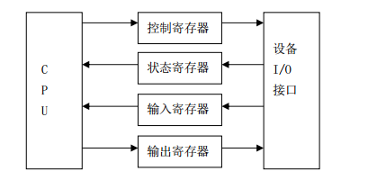

## 9.3 I/O空间的管理

&emsp;&emsp;设备通常会提供一组寄存器来控制设备、读写设备以及获取设备的状态。这些寄存器就是控制寄存器、数据寄存器和状态寄存器，它们可能位于I/O空间，也可能位于内存空间。当位于I/O空间时，通常被称为I/O端口，当位于内存空间时，对应的内存空间被称为I/O内存。

### 9.3.1 I/O端口和I/O内存

&emsp;&emsp;系统设计者为了对I/O编程提供统一的方法，每个设备的I/O端口都被组织成如图9.3所示的一组专用寄存器。CPU把要发给设备的命令写入控制寄存器，并从状态寄存器中读出表示设备内部状态的值。CPU还可以通过读取输入寄存器的内容从设备取得数据，也可以通过向输出寄存器中写入字节而把数据输出到设备。

<div align=center>
  
</div>

<div align=center>
图9.3 专用I/O端口
</div>

&emsp;&emsp;一般来说，一个外设的寄存器通常被连续地编址。CPU对外设I/O端口物理地址的编址方式有两种：一种是 **I/O端口**，另一种是 **I/O内存**。而具体采用哪一种则取决于CPU的体系结构。  

&emsp;&emsp;有些体系结构的CPU(如PowerPC、m68k等)通常只实现一个物理地址空间(RAM)。在这种情况下，外设I/O端口的物理地址就被映射到CPU的单一物理地址空间中，而成为内存的一部分。此时，CPU可以象访问一个内存单元那样访问外设I/O端口，而不需要设立专门的外设I/O指令。这就是所谓的“**I/O内存**”。  


&emsp;&emsp;而另外一些体系结构的CPU(典型地如X86)则为外设专门实现了一个单独地地址空间，称为“I/O端口空间”。这是一个与CPU的内存物理地址空间不同的地址空间，所有外设的I/O端口均在这一空间中进行编址。CPU通过设立专门的I/O指令(如X86的IN和OUT指令)来访问这一空间中的地址单元(也即I/O端口)。这就是所谓的“ **I/O端口**”。与内存物理地址空间相比，I/O地址空间通常都比较小，如x86CPU的I/O空间就只有64KB(0-0xffff)。这是“I/O端口”的一个主要缺点。

### 9.3.2 I/O资源管理  
&emsp;&emsp;Linux将基于I/O端口和I/O内存的映射方式通称为“I/O区域”(I/O Region)。在对I/O区域的管理讨论之前，我们首先来分析一下Linux是如何实现“I/O资源”这一抽象概念的。  
  
&emsp;&emsp;1.Linux对I/O资源的描述  

&emsp;&emsp;Linux设计了一个通用的数据结构resource来描述各种I/O资源(如I/O端口、I/O内存、DMA和IRQ等)。该结构定义在include/linux/ioport.h头文件中：  

``` c
    struct resource {
            resource_size_t start; /*资源拥有者的名字*/
            resource_size_t end; /*资源范围的开始*/
            const char *name; /*资源范围的结束*/
            unsigned long flags; /*各种标志*/
            struct resource *parent, *sibling, *child; /*指向资源树中父、兄以及孩子的指针*/
    };
```

&emsp;&emsp;资源表示某个实体的一部分，这部分被互斥地分配给设备驱动程序。所有的同种资源都插入到一个树型数据结构（父亲、兄弟和孩子）中；
节点的孩子被收集在一个链表中，其第一个元素由child指向，sibling字段指向链表中的下一个节点。  
  
&emsp;&emsp;为什么使用树？例如，考虑一下IDE硬盘接口所使用的I/O端口地址－比如说从0xf000到0xf00f。那么，start字段为0xf000，end字段为0xf00f的，控制器的名字存放在name字段中，这就是一颗资源树。但是，IDE设备驱动程序需要记住另外的信息，比如IDE主盘使用0xf000到 0xf007的子范围，从盘使用0xf008到0xf00f的子范围。为了做到这点，设备驱动程序把两个子范围对应的孩子插入到从0xf000到0xf00f的整个范围对应的资源下。

&emsp;&emsp;Linux在kernel/resource.c文件中定义了全局变量ioport\_resource和iomem\_resource，它们来分别描述基于I/O端口的整个I/O端口空间和基于I/O内存的整个I/O内存资源空间，其定义如下：  
```c
struct resource ioport_resource = {  
        .name   = "PCI IO",  
        .start = 0,  
        .end    = IO_SPACE_LIMIT,  
        .flags  = IORESOURCE_IO,  
};  
  
struct resource iomem_resource = {  
        .name   = "PCI mem",  
        .start = 0,  
        .end    = -1,  
        .flags  = IORESOURCE_MEM,  
};  
```
   
   
&emsp;&emsp;其中，宏IO\_SPACE\_LIMIT表示整个I/O空间的大小，对于X86平台而言，它是0xffff(定义在arch/x86/include/asm/io.h头文件中)。

&emsp;&emsp;任何设备驱动程序都可以使用下面三个函数申请、分配和释放资源，传递给它们的参数为资源树的根节点和要插入的新资源数据结构的地址：

&emsp;&emsp;request\_resource( )：把一个给定范围分配给一个I/O设备。  

&emsp;&emsp;allocate\_resource( )：在资源树中寻找一个给定大小和排列方式的可用范围；若存在，将这个范围分配给一个I/O设备（主要由PCI设备驱动程序使用，可以使用任意的端口号和主板上的内存地址对其进行配置）。 

&emsp;&emsp;release\_resource( )：释放以前分配给I/O设备的给定范围。

&emsp;&emsp;当前分配给I/O设备的所有I/O地址的树都可以从/proc/ioports文件中查看，例如

```
    $ cat /proc/ioports  
```

&emsp;&emsp;2.管理I/O 区域资源　　　　

&emsp;&emsp;Linux将基于I/O端口和基于I/O内存的资源统称为“I/O区域”。I/O
区域仍然是一种I/O资源，因此它仍然可以用resource结构类型来描述。Linux在头文件include/linux/ioport.h中定义了三个对I/O区域进行操作的接口函数：  

&emsp;&emsp;\_\_request\_region()：I/O 区域的分配  

&emsp;&emsp;\_\_release\_region()：I/O 区域的释放  

&emsp;&emsp;\_\_check\_region()：检查指定的I/O 区域是否已被占用  
  
&emsp;&emsp;3.管理I/O端口资源　　　
　  
&emsp;&emsp;采用I/O端口的X86处理器为外设实现了一个单独的地址空间，也即“I/O空间”或称为“I/O端口空间”，其大小是64KB(0x0000-0xffff)。Linux在其所支持的所有平台上都实现了“I/O端口空间”这一概念。  
   
&emsp;&emsp;由于I/O空间非常小，因此即使外设总线有一个单独的I/O端口空间，却也不是所有的外设都将其I/O端口(指寄存器)映射到“I/O端口空间”中。比如，大多数PCI卡都通过内存映射方式来将其I/O端口或外设内存映射到CPU的内存物理地址空间中。而老式的ISA卡通常将其I/O端口映射到I/O端口空间中。 

&emsp;&emsp;Linux是基于“I/O区域”这一概念来实现对I/O端口资源的管理的。对I/O端口空间的操作基于I/O区域的操作函数\_\_xxx\_region()，Linux在头文件include/linux/ioport.h中定义了三个对I/O端口空间进行操作的接口函数：

&emsp;&emsp;request\_region()：请求在I/O端口空间中分配指定范围的I/O端口资源。  

&emsp;&emsp;check\_region()：检查I/O端口空间中的指定I/O端口资源是否已被占用。

&emsp;&emsp;release\_region()：释放I/O端口空间中的指定I/O端口资源。  
  
&emsp;&emsp;4.管理I/O内存资源　　  
   
&emsp;&emsp;基于I/O区域的操作函数\_\_xxx\_region()，Linux在头文件include/linux/ioport.h中定义了三个对I/O内存资源进行操作的接口：

&emsp;&emsp;request_mem_region()：请求分配指定的 I/O 内存资源。

&emsp;&emsp;check_mem_region()：检查指定的 I/O 内存资源是否已被占用。

&emsp;&emsp;release_mem_region()：释放指定的 I/O 内存资源。  
  
### 9.3.3 访问I/O端口空间

&emsp;&emsp;在驱动程序请求了I/O端口空间中的端口资源后，它就可以通过CPU的IO指令来读写这些I/O端口。在读写I/O端口时要注意的一点就是，大多数平台都区分8位、16位和32位的端口。  

&emsp;&emsp;inb() outb() inw() outw() inl() outl()  

&emsp;&emsp;inb()的原型为:
```c
    unsigned char inb(unsigned port);  
```

&emsp;&emsp;port参数指定I/O端口空间中的端口地址。在大多数平台上(如x86)它都是unsigned short类型的，其它的一些平台上则是unsigned int类型的。显然，端口地址的类型是由I/O端口空间的大小来决定的。  
   
&emsp;&emsp;除了上述这些I/O操作外，某些CPU也支持对某个I/O端口进行连续的读写操作，也即对单个I/O端口读或写一系列字节、字或32位整数，这就是所谓的“串I/O指令”。这种指令在速度上显然要比用循环来实现同样的功能快得多。 
```
insb() outsb() insw() outw() insl() outsl()  
```
&emsp;&emsp;另外，在一些平台上(典型地如X86)，对于老式总线(如ISA)上的慢速外设来说，如果CPU读写其I/O端口的速度太快，那就可能会发生丢失数据的现象。对于这个问题的解决方法就是在两次连续的I/O操作之间插入一段微小的时延，以便等待慢速外设。这就是所谓的“暂停I/O”。 

&emsp;&emsp;对于暂停I/O，Linux也在io.h头文件中定义了它的I/O读写函数，而且都以XXX\_p命名，比如：inb\_p()、outb\_p()等等。  

### 9.3.4访问I/O内存资源

&emsp;&emsp;用于I/O指令的“地址空间”相对来说是很小的。事实上，现在x86的I/O地址空间已经非常拥挤。但是，随着计算机技术的发展，这种只能对外设中的几个寄存器进行操作的方式，已经无法满足实际需要了。而实际上，需求在不断发生变化，例如，在PC上可以插上一块图形卡，有2MB的存储空间，甚至可能还带有ROM,其中装有可执行代码。自从PCI总线出现后，无论CPU的设计采用I/O端口方式，还是I/O内存方式，都必须将外设卡上的存储器映射到内存空间，实际上是采用了虚存空间的手段，这样的映射是通过ioremap（）来建立的，该函数的原型为：
```c
void * ioremap(resource_size_t offset, unsigned long size);  
```
&emsp;&emsp;其中参数的含义为：  
&emsp;&emsp;offset：I/O设备上的一块物理内存的起始地址；  

&emsp;&emsp;size：要映射的空间的大小；  

&emsp;&emsp;ioremap()与第四章讲的vmalloc()类似，也需要建立新的页表，但并不进行vmalloc()所执行的内存分配（因为I/O物理内存已存在）。ioremap()返回一个特殊的虚拟地址，该地址可用来存取特定的物理地址范围。通过ioremap()获得的虚拟地址应该被iounmap()函数释放，其原型如下：

```c
void iounmap(void *addr);
```

&emsp;&emsp;在调用ioremap()之前，首先要调用requset\_mem\_region()函数申请资源，该函数的原型为：

```c
struct resource *requset_mem_region(unsigned long start, unsigned long len,char *name);  
```

&emsp;&emsp;这个函数从内核申请len个内存地址（在3G\~4G之间的虚地址），而这里的start为I/O物理地址，name为设备的名称。(注意，如果分配成功，则返回非NULL，否则，返回NULL。)另外，可以通过/proc/iomem查看系统给各种设备的内存范围。

&emsp;&emsp;在将I/O内存的物理地址映射成内核虚地址后，理论上讲我们就可以象读写内存那样直接读写I/O内存。但是，由于在某些平台上，对
I/O内存和系统内存有不同的访问处理，因此为了确保跨平台的兼容性，Linux实现了一系列读写I/O内存的函数，这些函数在不同的平台上有不同的实现。但在x86平台上，读写I/O内存与读写内存无任何差别，相关函数如下：

&emsp;&emsp;readb() readw() readl()：读I/O内存  

&emsp;&emsp;writeb() writew() writel()：写I/O内存  

&emsp;&emsp;memset\_io() memcpy\_fromio() memcpytoio()：拷贝I/O内存   

&emsp;&emsp;为了保证驱动程序的跨平台的可移植性，建议开发者应该使用上面的函数来访问I/O内存。
