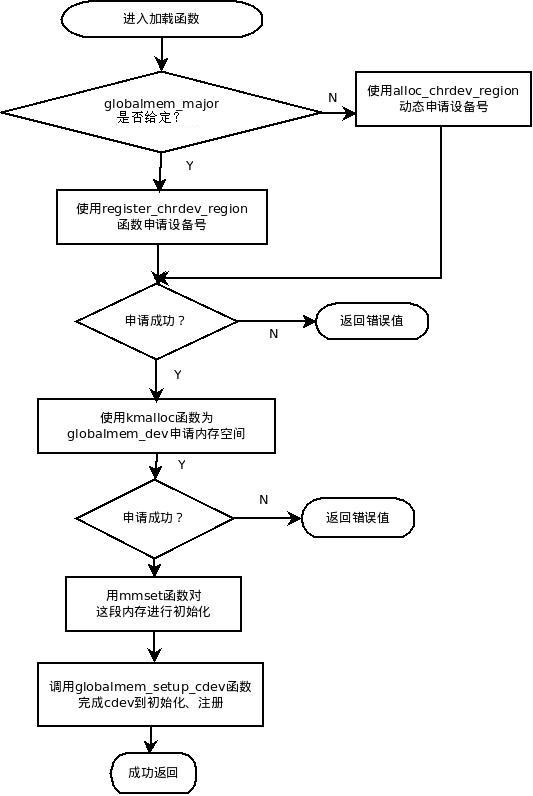
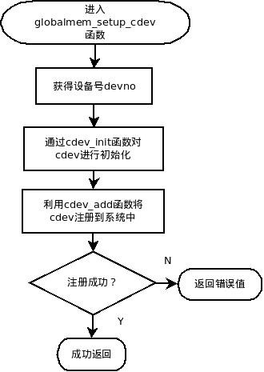
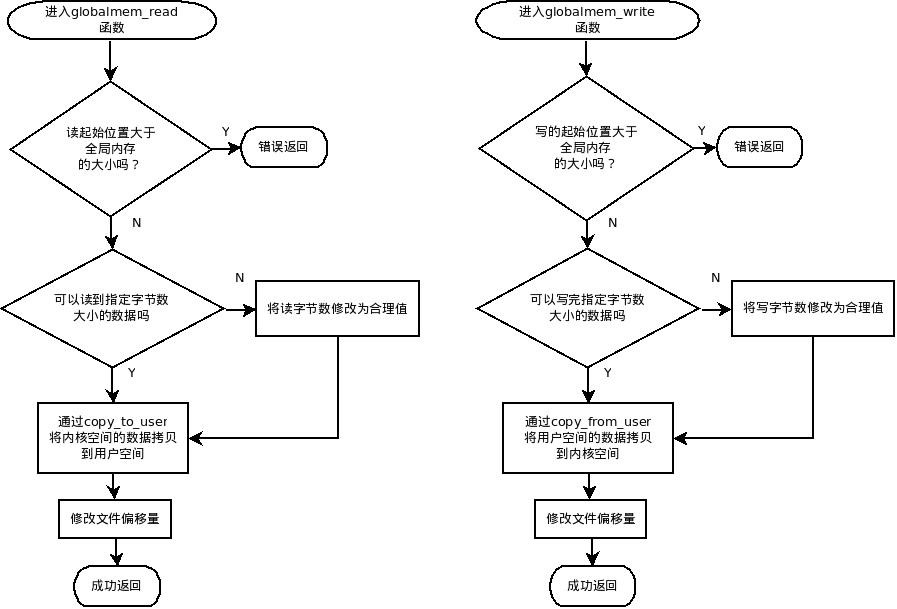

## 9.4 字符设备驱动程序

&emsp;&emsp;Linux下的应用程序在访问字符设备时，一般都是通过设备文件访问的。设备文件一般都存放在/dev目录下。字符设备文件的第一个标志是c，如下所示：

```
    $ ls| grep tty //列目录并搜出所有的终端设备tty
```

……

crw--w----. 1 root root      4,   0 Sep 26 18:05 tty0

crw--w----. 1 root root      4,   1 Sep 25 19:04 tty1

crw--w----. 1 root tty       4,  10 Sep 26 18:05 tty10

crw--w----. 1 root tty       4,  11 Sep 26 18:05 tty11

crw--w----. 1 root tty       4,  12 Sep 26 18:05 tty12

……

&emsp;&emsp;在上面的输出中，每一个文件代表一个设备，在时间前面有两个用逗号隔开的数字，第一个数字是主设备号，第二个数字是次设备号。一般认为一个主设备号对应一个驱动程序，可以看到，这里列出的TTY设备都由主设备号为4的驱动程序管理。不过，也可以一个主设备号对应多个驱动程序。一个次设备号对应一个设备， 所以上面输出中表示的0，1，10等数字代表不同的设备。一个驱动程序，可以管理多个此类型的设备，设备数可以有2^20个，原因是次设备号有20位，不过实际不可能有这么多设备。

### 9.4.1.字符设备的数据结构

&emsp;&emsp;Linux内核中使用struct
cdev来表示一个字符设备，该结构位于include/linux/cdev.h：
```c
    struct cdev {
            struct kobject kobj;
            struct module *owner;
            const struct file_operations *ops;
            struct list_head list;
            dev_t dev;
            unsigned int count;
    };
```
&emsp;&emsp;其中主要字段的含义如下：

&emsp;&emsp;kobj:
kobject类似于面向对象语言中的对象（object）类,其中包含了引用计数、名称以及父指针等字段，可以创建对象的层次结构，属于驱动模型的基础对象。

&emsp;&emsp;owner:该设备的驱动程序所属的内核模块，一般设置为THIS\_MODULE; 

&emsp;&emsp;ops:文件操作结构体指针，file\_operations结构体中包含一系列对设备进行操作的函数接口;  

&emsp;&emsp;dev:设备号。dev\_t封装了unsigned;

&emsp;&emsp;int:该类型前12位为主设备号，后20位为次设备号;

&emsp;&emsp;cdev结构是内核对字符设备驱动的标准描述。在实际的设备驱动开发中，通常使用自定义的结构体来描述一个特定的字符设备。这个自定义的结构体中必然会包含cdev结构，另外还要包含一些描述这个具体设备某些特性的字段。比如,用一段全局内存（命名为globalmem）来模拟字符设备：

```c
    struct globalmem_dev
    {
            struct cdev cdev; /*cdev 结构体*/
            unsigned char mem[255]; /*全局内存*/
    };
```
&emsp;&emsp;该结构体用来描述一个具有全局内存的字符设备，将在后面的例子中使用。

### 9.4.2 分配和释放设备号

&emsp;&emsp;对于每一个设备，必须有一个惟一的设备号与之相对应。通常会有多个设备共用一个主设备号，而每个设备都唯一拥有一个次设备号。对于设备号有以下几个常用的宏（定义于include/linux/kdev\_t.h中）：

```c
    #define MINORBITS     20 //次设备号的位数
    #define MINORMASK   ((1U << MINORBITS) - 1) //此设备号掩码
    #define MAJOR(dev) ((unsigned int) ((dev) >> MINORBITS))//从设备号提取主设备号
    #define MINOR(dev) ((unsigned int) ((dev) & MINORMASK)) // 从设备号提取次设备号
    #define MKDEV(ma,mi) (((ma) << MINORBITS) | (mi))
    //通过主次设备号组合出设备号
```
&emsp;&emsp;在设备驱动程序中，首先向系统申请设备号。申请的设备号一般都是一段连续的号，这些号有共同的主设备号。申请的方法有两种：若提前设定主设备号，则再接着申请若干个连续的次设备；若未指定主设备号，则直接向系统动态申请未被占用的设备号。由此可以看出，如果使用第一种方法，则可能会出现设备号已被系统中的其他设备占用的情况。

&emsp;&emsp;上出两种申请设备号的方法分别对应以下两个申请函数(定义于fs/Char_dev.c)：
```c
int register_chrdev_region(dev_t from, unsigned count, const char *name)
int alloc_chrdev_region(dev_t *dev, unsigned baseminor, unsigned count,
const char *name)
```
&emsp;&emsp;这两个函数都可以申请一段连续的设备号。前者适用已知起始设备号的情况（通过MADEV(major,0)可以获得主设备号为major的起始设备号）；后者使用于动态申请设备号的情况。如果只想申请一个设备号，则将函数中的参数count设为1即可。

### 9.4.3字符设备驱动的组成

&emsp;&emsp;实现一个基本的字符设备驱动需要完成以下几部分：字符设备驱动模块的加载、卸载函数和file\_operations结构中的成员函数。

1. file\_operations结构体

&emsp;&emsp;file\_operations结构体中包含许多函数指针，这些函数指针是字符设备驱动和内核的接口。实现该结构中的这些函数也是整个字符设备驱动程序的核心工作。file\_operations结构中的每个函数都对应一个具体的功能，也就是对设备的不同操作。不过，这些函数是在内核模块中实现的，最终会被加载到内核中和内核一起运行。因此，用户态下的程序是不能直接使用这些函数对相应设备进行操作的。比如当应用程序通过系统调用read对设备文件进行读操作时，最终调用字符设备globalmem驱动中的globalmem
\_read函数。而将系统调用read和globalmem\_read函数连在一起的则是struct
file\_operations。具体赋值为：
```c
    static const struct file_operations globalmem_fops =
    {
            .owner = THIS_MODULE,
            .read = globalmem_read,
            .write = globalmem_write,
            .open = globalmem_open,
            .release = globalmem_release,
    };
```
### 9.4.4 加载和卸载函数

&emsp;&emsp;由于字符设备驱动程序是以内核模块的形式加载到内核的，因此程序中必须有内核模块的加载和卸载函数。在我们的实例中为：
```c
    module_init(globalmem_init);

    module_exit(globalmem_exit);
```
&emsp;&emsp;通常，字符设备驱动程序的加载函数完成的工作有设备号的申请、cdev的注册。具体的过程可如图9.4

<div align=center>
  
</div>

<div align=center>
图9.4 globalmem_init流程图
</div>

&emsp;&emsp;从上图中可以看到，在内核模块加载函数中主要完成了字符设备号的申请。具体代码如下:
```c
    int globalmem_init(void)
    {
            int result;
            dev_t devno=MKDEV(globalmem_major,0);
            if (globalmem_major){     /*globalmem_major为给定的全局变量，见后面的程序清单*/
            result=register_chrdev_region(devno,1,"globalmem");
            }
            else{
                    result=alloc_chrdev_region(&devno,0,1,"globalmem");
                    globalmem_major=MAJOR(devno);
            }
            if (result<0)
                    return result;
            globalmem_devp=kmalloc(sizeof(struct globalmem_dev),GFP_KERNEL);
            if (!globalmem_devp){
                    result=-ENOMEM;
            goto fail_malloc;
    }

    memset(globalmem_devp,0,sizeof(struct globalmem_dev));
    globalmem_setup_cdev(globalmem_devp,0);
    return 0;
    fail_malloc:unregister_chrdev_region(devno,1);
    return result;
    }
```
&emsp;&emsp;将字符设备注册到系统中是通过 globalmem\_setup\_cdev()函数来完成的。该函数具体完成的工作如图9.5：

<div align=center>
  
</div>

<div align=center>
图 9.5 globalmem_setup_cdev流程图
</div>

&emsp;&emsp;结合上图,globalmem\_setup\_cdev()函数的具体代码如下：
```c
    static void globalmem_setup_cdev(struct globalmem_dev *dev, int index)
    {
            int ret;
            int devno = MKDEV(globalmem_major, index);
            cdev_init(&dev->cdev, &globalmem_fops);
            dev->cdev.owner = THIS_MODULE;
            dev->cdev.ops = &globalmem\_fops;
            ret = cdev_add(&dev->cdev, devno, 1);
            if (ret){
                    printk("adding globalmem error");
            }
    }
```
&emsp;&emsp;在cdev\_init中，除了初始化cdev结构中的字段，最重要的是将globalmem\_fops传递给cdev中的ops字段。

&emsp;&emsp;通过上述的几步，就可以完成字符设备驱动加载。对于字符设备卸载而言，所作的工作就是加载功能的逆向：将cdev从系统中注销；释放设备结构体所占用的内存空间；释放设备号。具体代码如下：

```c
    static void _exit globalmem_exit(void)
    {
            cdev_del(&dev->cdev); /*释放struct cdev*/
            kfree(dev); /*释放分配为给 struct globalmem_dev的内存*/
            unregister_chrdev_region(MKDEV(globalmem_major,0), 1); /*释放devno*/
    }
```

### 9.4.5 实现file\_operaions中定义的函数

&emsp;&emsp;file\_operaions中定义的函数很多，最基本的函数包括open、release、read和write等函数。对这些函数的具体实现还要根据具体的设备要求来完成。在本文所述的全局内存字符设备驱动中，我们要实现的是功能是在用户程序中对该字符设备中的这块全局内存进行读写操作。读写函数的具体功能可参考下图：

<div align=center>
  
</div>

<div align=center>
图9.6 字符驱动读写函数的实现流程
</div>

&emsp;&emsp;对于open和release可以不做具体实现，当用户态程序打开或释放设备文件时，会自动调用内核中通用的打开和释放函数。

&emsp;&emsp;例9-3 字符设备驱动程序完整代码
```c
    #include <linux/moudule.h>
    #include <linux/types.h>
    #include <linux/fs.h>
    #include <linux/errno.h>
    #include <linux/mm.h>
    #include <linux/sched.h>
    #include <linux/init.h>
    #include <linux/cdev.h>
    #include <linux/io.h>
    #include <linux/system.h>
    #include <linux/uaccess.h>

    #define GLOBALMEM_SIZE 0x1000

    #define GLOBALMEM_MAJOR 254

    static globalmem_major = GLOBALMEM_MAJOR;

    struct globalmem_dev
    {
    .../*具体字段如9.4.1节*/
    }

    struct globalmem_dev dev /*定义设备变量*/

    static const struct file_operations globalmem_fops =
    {
    /*具体字段如9.4.3节*/
    }

    /*模块初始化函数*/

    int globalmem_init(void)
    {
    /*具体代码如9.4.4节*/
    }

    /*文件打开函数*/

    int globalmem_open(struct inode *inode, struct file *filp)
    {
    /*将设备结构体指针赋值给文件私有数据指针*/
            filp->private_data = globalmem_devp;
            return 0;
    }

    /*初始化并添加cdev结构体的函数*/
    static void globalmem_setup_cdev(struct globalmem_dev *dev, int index)
    {
    /*具体代码如9.4.4节*/
    }

    /*globalmem设备驱动的读函数*/
    static ssize_t globalmem_read(struct file *filp, char _user *buf, size_t size,loff_t *ppos)
    {
            unsigned long p = *ppos;
            unsigned int count = size;
            int ret = 0;
            struct globalmem_dev *dev = filp->private_data; /*获得设备结构体指针*/
            /*分析获取有效的写长度*/
            if (p >= GLOBALMEM_SIZE)
                    return count ? - ENXIO: 0;
            if (count > GLOBALMEM_SIZE - p)
                    count = GLOBALMEM_SIZE - p;
            /*从内核空间向用户空间写数据*/
            if (copy_to_user(buf, (void*)(dev->mem + p), count)){
                    ret = - EFAULT;
            }
            else {
                    *ppos += count;
                    ret = count;
                    printk(KERN_INFO "read %d bytes(s) from %d\n", count, p);
            }

            return ret;
    }

    /*模块退出函数*/

    static void _exit globalmem_exit(void)
    {
    /*具体代码如9.4.4节*/
    }

    module_init(globalmem_init);  
    module_exit(globalmem_exit);

    MODULE_LICENSE("GPL");
```
&emsp;&emsp;以上代码中给出了驱动程序的打开函数和读函数，至于写函数write()和控制函数ioctl()由读者自己完成。

&emsp;&emsp;这样，一个简单字符设备驱动程序完成了，至于实际中涉及具体硬件细节的驱动程序，要比这个例子复杂得多，请读者参考驱动开发相关的参考书。