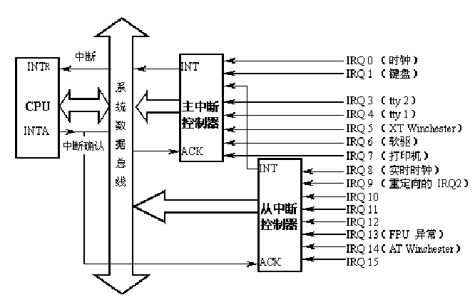

##5.1中断是什么

大多数读者可能对16位实地址模式下的中断机制有所了解，例如中断向量、外部I/O中断以及异常，这些内容在32位的保护模式下依然有效。两种模式之间最本质的差别就是在保护模式引入了中断描述符表。

### 5.1.1中断向量

Intel
x86系列微机共支持256种向量中断，为使处理器较容易地识别每种中断源，将它们从0到256编号，即赋以一个中断类型码n，Intel把这个8位的无符号整数叫做一个向量，因此，也叫**中断向量**。所有256种中断可分为两大类：异常和中断。异常又分为**故障（Fault）和陷阱(Trap)**，它们的共同特点是既不使用中断控制器，又不能被屏蔽（异常其实是CPU发出的中断信号）。中断又分为外部**可屏蔽中断**（INTR）和外部**非屏蔽中断**（NMI），所有I/O设备产生的中断请求（IRQ）均引起屏蔽中断，而紧急的事件（如硬件故障）引起的故障产生非屏蔽中断。

非屏蔽中断的向量和异常的向量是固定的，而屏蔽中断的向量可以通过对中断控制器的编程来改变。Linux对256个向量的分配如下：

1.  从0~31的向量对应于异常和非屏蔽中断。

2.  从32~47的向量（即由I/O设备引起的中断）分配给屏蔽中断。

3.  剩余的从48~255的向量用来标识软中断。Linux只用了其中的一个（即128或0x80向量）用来实现系统调用。

说明，你可以在proc文件系统下的interrupts文件中，查看当前系统中各种外设的IRQ：

$cat /proc/interrupts

### 5.1.2 外设可屏蔽中断

Intel
x86通过两片中断控制器8259A来响应15个外中断源，每个8259A可管理8个中断源。第一级（称主片）的第二个中断请求输入端，与第二级8259A（称从片）的中断输出端INT相连，如图5.1所示。我们把与中断控制器相连的每条线叫做**中断线**，要使用中断线，就要进行中断线的申请，也就是IRQ(Interrupt ReQuirement)，因此我们也常把申请一条中断线称为申请一个IRQ或者是申请一个中断号。IRQ线是从0开始顺序编号的；因此，第一条IRQ线通常表示成IRQ0。IRQn的缺省向量是n+32；如前所述，IRQ和向量之间的映射可以通过中断控制器端口来修改。

图5.1 级连的 8259A的中断机构

并不是每个设备都可以向中断线上发中断信号的，只有对某一条确定的中断线拥有了控制权，才可以向这条中断线上发送信号。由于计算机的外部设备越来越多，所以15条中断线已经不够用了，中断线是非常宝贵的资源，所以只有当设备需要中断的时候才申请占用一个IRQ，或者是在申请IRQ时采用共享中断的方式，这样可以让更多的设备使用中断。

对于外部I/O请求的屏蔽可分为两种情况，一种是从CPU的角度，也就是清除eflag的中断标志位（IF），当IF=0时，禁止任何外部I／O的中断请求，即关中断；一种是从中断控制器的角度，因为中断控制器中有一个8位的中断屏蔽寄存器，每位对应8259A中的一条中断线，如果要禁用某条中断线，则把中断屏蔽寄存器相应的位置1，要启用，则置0。

### 5.1.3异常及非屏蔽中断

异常就是CPU内部出现的中断,也就是说，在CPU执行特定指令时出现的非法情况。非屏蔽中断就是计算机内部硬件出错时引起的异常情况。从上图可以看出，二者与外部I/O接口没有任何关系。Intel把非屏蔽中断作为异常的一种来处理，因此，后面所提到的异常也包括了非屏蔽中断。在CPU执行一个异常处理程序时，就不再为其他异常或可屏蔽中断请求服务，也就是说，当某个异常被响应后，CPU清除eflag的中IF位，禁止任何可屏蔽中断。但如果又有异常产生，则由CPU锁存（CPU具有缓冲异常的能力），待这个异常处理完后，才响应被锁存的异常。我们这里讨论的异常中断向量在0～31之间，不包括系统调用（中断向量为0x80）。

Intel x86处理器发布了大约20种异常（具体数字与处理器模式有关）。Linux内核必须为每种异常提供一个专门的异常处理程序。

### 5.1.4中断描述符表

在实地址模式中，CPU把内存中从0开始的1K字节作为一个中断向量表。表中的每个表项占四个字节，由两个字节的段地址和两个字节的偏移量组成，这样构成的地址便是相应中断处理程序的入口地址。但是，在保护模式下，由四字节的表项构成的中断向量表显然满足不了要求。这是因为，除了两个字节的段描述符，偏移量必用四字节来表示；要有反映模式切换的信息。因此，在保护模式下，中断向量表中的表项由8个字节组成，如图5.2所示，中断向量表也改叫做中断描述符表IDT（Interrupt
Descriptor Table）。其中的每个表项叫做一个**门描述符**（gate descriptor），“门”的含义是当中断发生时必须先通过这些门，然后才能进入相应的处理程序。

图5.2门描述符的一般格式

其中类型占3位，表示门描述符的类型，主要门描述符为：

(1)中断门（Interrupt gate）

其类型码为110,中断门包含了一个中断或异常处理程序所在段的选择符和段内偏移量。当控制权通过中断门进入中断处理程序时，处理器清IF标志，即关中断，以避免嵌套中断的发生。中断门中的**请求特权级**（DPL）为0，因此，用户态的进程不能访问Intel的中断门。所有的中断处理程序都由中断门激活，并全部限制在内核态。

(2)陷阱门（Trap gate）

其类型码为111,与中断门类似，其唯一的区别是，控制权通过陷阱门进入处理程序时维持IF标志位不变，也就是说，不关中断。

(3)系统门（System gate）

这是Linux内核特别设置的，用来让用户态的进程访问Intel的陷阱门，因此，门描述符的DPL为3。系统调用就是通过系统门进入内核的。

最后，在保护模式下，中断描述符表在内存的位置不再限于从地址0开始的地方，而是可以放在内存的任何地方。为此，CPU中增设了一个中断描述符表寄存器IDTR，用来存放中断描述符表在内存的起始地址。中断描述符表寄存器IDTR是一个48位的寄存器，其低16位保存中断描述符表的大小，高32位保存中断描述符表的基址，如图5.3所示。

图5.3 中断描述符表寄存器IDTR

### 5.1.5 相关汇编指令

为了有助于读者对中断实现过程的理解，下面介绍几条相关的汇编指令：

####1.  调用过程指令CALL

   指令格式： CALL 过程名

   说明：在取出CALL指令之后及执行CALL指令之前，使指令指针寄存器EIP指向紧接CALL指令的下一条指令。CALL指令先将EIP值压入栈内，再进行控制转移。当遇到RET指令时，栈内信息可使控制权直接回到CALL的下一条指令

####2.  调用中断过程的指令INT

   指令格式：INT 中断向量

   说明：EFLAG、CS及EIP寄存器被压入栈内。控制权被转移到由中断向量指定的中断处理程序。在中断处理程序结束时，IRET指令又把控制权送回到刚才执行被中断的地方。

####3.  中断返回指令IRET

   指令格式：IRET

   说明：IRET与中断调用过程相反：它将EIP、CS及EFLAGS寄存器内容从栈中弹出，并将控制权返回到发生中断的地方。IRET用在中断处理程序的结束处。

####4.  加载中断描述符表的指令LIDT

   格式：LIDT 48位的伪描述符

   说明：LIDT将指令中给定的48位伪描述符装入中断描述符寄存器IDTR。
