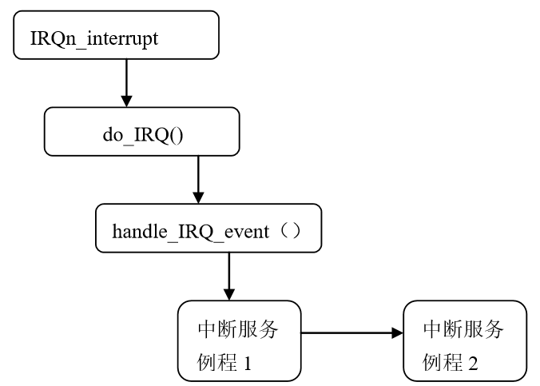

<<<<<<< HEAD
##5.3 中断处理

通过上面的介绍，我们知道了中断描述符表已被初始化，并具有了相应的内容；对于外部中断，还要建立中断请求队列，以及执行中断处理程序，这正是我们本节要关心的主要内容。

### 5.3.1中断和异常的硬件处理。

首先，我们从硬件的角度来看CPU如何处理中断和异常。这里假定内核已被初始化，CPU已从实模式转到保护模式。

当CPU执行了当前指令之后，CS和EIP这对寄存器中所包含的内容就是下一条将要执行指令的虚地址。在对下一条指令执行前，CPU先要判断在执行当前指令的过程中是否发生了中断或异常。如果发生了一个中断或异常，那么CPU将做以下事情：

1.  确定所发生中断或异常的向量i（在0～255之间）。

2.  通过IDTR寄存器找到IDT表，读取IDT表第i项（或叫第i个门）。

3.  分两步进行有效性检查：首先是“段”级检查，将CPU的当前特权级CPL（存放在CS寄存器的最低两位）与IDT中第i项段选择符中的DPL相比较，如果DPL（3）大于CPL（0），就产生一个“通用保护”异常，因为中断处理程序的特权级不能低于引起中断的进程的特权级。这种情况发生的可能性不大，因为中断处理程序一般运行在内核态，其特权级为0。然后是“门”级检查，把CPL与IDT中第i个门的DPL相比较，如果CPL大于DPL，也就是当前特权级（3）小于这个门的特权级（0），CPU就不能“穿过”这个门，于是产生一个“通用保护”异常，这是为了避免用户应用程序访问特殊的陷阱门或中断门。但是请注意，这种“门”级检查是针对一般的用户程序，而不包括外部I/O产生的中断或因CPU内部异常而产生的异常，也就是说，如果产生了中断或异常，就免去了“门”级检查。

4.  检查是否发生了特权级的变化。当中断发生在用户态（特权级为3），而中断处理程序运行在内核态（特权级为0），特权级发生了变化，所以会引起堆栈的更换。也就是说，从用户堆栈切换到内核堆栈。而当中断发生在内核态时，即CPU在内核中运行时，则不会更换堆栈，如图5.4所示。

<div style="text-align: center">

</div>

<center>图5.4中断处理程序堆栈示意图</center>

 从图可以看出，当从用户态堆栈切换到内核态堆栈时，先把用户态堆栈的值压入中断程序的内核态堆栈中，同时把EFLAGS寄存器自动压栈，然后把被中断进程的返回地址压入堆栈。如果异常产生了一个硬错误码，则将它也保存在堆栈中。如果特权级没有发生变化，则压入栈中的内容如图5.4中。此时，CS:EIP的值就是IDT表中第i项门描述符的段选择符和偏移量的值，于是，CPU就跳转到了中断或异常处理程序。

### 5.3.2 中断请求队列的建立

由于硬件的限制，很多外部设备不得不共享中断线，例如，一些PC配置可以把同一条中断线分配给网卡和图形卡。由此看来，让每个中断源都必须占用一条中断线是不现实的。所以，仅仅中断描述符表并不能提供中断产生的所有信息，内核必须对中断线给出进一步的描述。在Linux设计中，专门为每个中断请求IRQ设置了一个队列，这就是所谓的中断请求队列。

#### 1中断服务程序与中断处理程序

我们这里提到的**中断服务程序ISR**（Interrupt Service Routine）与以前所提到的**中断处理程序**(Interrupt handler)是两个不同的概念。在Linux中，15条中断线对应15个中断处理程序，其名依次为IRQ0x00_interrupt()，IRQ0x01_interrupt()……IRQ0x0f_interrupt()。具体来说，中断处理程序相当于某个中断向量的总处理程序，例如IRQ0x05_interrupt()是中断号5（向量为37）的总处理程序，如果这个5号中断由网卡和图形卡共享，则网卡和图形卡分别有其相应的中断服务程序。

#### 2中断线共享的数据结构

为了让多个设备能共享一条中断线而内核设置了一个叫irqaction的数据结构：

```c
typedef irqreturn_t (*irq_handler_t)(int, void *);

		struct irqaction {

		irq_handler_t handler;

		unsigned long flags;

		cpumask_t mask;

		const char *name;

		void *dev_id;

		struct irqaction *next;

		int irq;

		…

};
```

对每个域描述如下：

handler

指向一个具体I/O设备的中断服务程序，该函数有两个参数，第一个参数为中断号IRQ，第二个参数为void指针，该指针一般传入dev_id（唯一地标示某个设备的设备号）的值。

flags

用一组标志描述中断线与I/O设备之间的关系。

IRQF_DISABLED

中断处理程序执行时必须禁止中断

IRQF_SHARED

允许其它设备共享这条中断线。

IRQF_SAMPLE_RANDOM

可以把这个设备看作是随机事件发生源；因此，内核可以用它做随机数产生器。

name

I/O设备名

dev_id

指定I/O设备的主设备号和次设备号(参见第9章)。

next

指向irqaction描述符链表的下一个元素，前提是flags为IRQF_SHARED标志。共享同一中断线的每个硬件设备都有其对应的中断服务程序，链表中的每个元素就是对相应设备及中断服务程序的描述。

#### 3 注册中断服务程序

在IDT表初始化完成之初，每个中断服务队列还为空。此时，即使打开中断且某个外设中断真的发生了，也得不到实际的服务。因为CPU虽然通过中断门进入了某个中断向量的总处理程序，例如IRQ0x05_interrupt()，但是，具体的中断服务程序（如图形卡的）还没有挂入中断请求队列。因此，在设备驱动程序的初始化阶段，必须通过request_irq()函数将相应的中断服务程序挂入中断请求队列，也就是对其进行注册。

request_irq()函数原型为：

```c
int request_irq(unsigned int irq,

   irq_handler_t handler,

   unsigned long irqflags,

   const char *devname,

void *(dev_id)
```

第一个参数irq表示要分配的中断号。对某些设备，如传统PC设备上的系统时钟或键盘，这个值通常是预先设定的。而对于大多数其他设备来说，这个值要么是可以通过探测获取，要么可以通过编程动态确定。

第二个参数handler是一个指针，指向处理这个中断的实际中断服务程序。只要操作系统一接收到中断，该函数就被调用。要注意，handler函数的原型是特定的，它接受两个参数，并有一个类型为irqreturn_t的返回值。

第三个参数irqflags可以为0，也可能是IRQF_SAMPLE_RANDOM ，IRQF_SHARED，

或IRQF_DISABLED 这几个标志的位掩码。

第四个参数devname是与中断相关的设备的名字。例如，
PC机上键盘中断对应的这个值为“keyboard”。这些名字会被/proc/irq和/proc/interrupt文件使用，以便与用户通信，稍后我们将对此进行简短讨论。

第五个参数dev_id主要用于共享中断线。当一个中断服务程序需要释放时，dev_id将提供唯一的标志信息，以便从共享中断线的诸多中断服务程序中删除指定的那一个。如果没有这个参数，那么内核不可能知道在给定的中断线上到底要删除哪一个处理程序。如果无需共享中断线，那么将该参数赋为空值（NULL），但是，如果中断线是被共享的，那么就必须传递唯一的信息。

这里要说明的是，在驱动程序初始化或者在设备第一次打开时，首先要调用request_irq()函数，以申请使用参数中指明的中断请求号irq，另一参数handler指的是要挂入到中断请求队列中的中断服务程序。假定一个程序要对/dev/fd0/（第一个软盘对应的设备）设备进行访问，通常将IRQ6分配给软盘控制器，给定这个中断号6，软盘驱动程序就可以发出下列请求，以将其中断服务程序挂入中断请求队列：

request_irq(6, floppy_interrupt,

IRQF_DISABLED|IRQF_SAMPLE_RANDOM, "floppy", NULL);

我们可以看到，floppy_interrupt（）中断服务程序运行时必须禁止中断（设置了IRQF_DISABLED标志），并且不允许共享这个IRQ（清IRQF_SHARED标志），但允许根据这个中断发生的时间产生随机数（设置了IRQF_SAMPLE_RANDOM标志，用于建立熵池，以供系统产生随机数使用）。

注意，request_irq()函数可能会睡眠，因此，不能在中断上下文或其他不允许阻塞的代码中这调用该函数。在睡眠不安全的上下文中调用request_irq()函数是一种常见错误。

#### 4 注销中断服务程序

卸载驱动程序时，需要注销相应的中断处理服务程序，并释放中断线。可以调用

void free_irq(unsigned int irq,void *dev_id)来释放中断线。

如果指定的中断线不是共享的，那么，该函数删除处理程序的同时将禁用这条中断线。如果中断线是共享的，则仅删除dev_id所对应的服务程序，而这条中断线本身只有在删除了最后一个服务程序时才会被禁用。由此可以看出为什么唯一的dev_id如此重要。对于共享的中断线，需要一个唯一的信息来区分其上面的多个服务程序，并让free_irq()仅仅删除指定的服务程序。不管在哪种情况下（共享或不共享），如果dev_id非空，它都必须与需要删除的服务程序相匹配。

注意，必须从进程上下文中调用free_irq() 。

### 5.3.3中断处理程序的执行

从前面的介绍，我们已经了解了中断机制及有关的初始化工作。现在，我们可以从中断请求的发生到CPU的响应，再到中断处理程序的调用和返回，沿着这一思路走一遍，以体会Linux内核对中断的响应及处理。

假定外设的驱动程序都已完成了初始化工作，并且已把相应的中断服务程序挂入到特定的中断请求队列。
又假定当前进程正在用户空间运行（随时可以接受中断），且外设已产生了一次中断请求。当这个中断请求通过中断控制器8259A到达CPU的中断请求引线INTR时（参看图5.1）,CPU就在执行完当前指令后来响应该中断。

CPU从中断控制器的一个端口取得中断向量I，然后根据I从中断描述符表IDT中找到相应的表项，也就是找到相应的中断门。因为这是外部中断，不需要进行“门级”检查，CPU就可以从这个中断门获得中断处理程序的入口地址，假定为IRQ0x05_interrupt。因为这里假定中断发生时CPU运行在用户空间（CPL＝3），而中断处理程序属于内核（DPL＝0），因此，要进行堆栈的切换。当CPU进入IRQ0x05_interrupt时，内核栈如图5.4的，栈中除用户栈指针、EFLAGS的内容以及返回地址外再无其他内容。另外，由于CPU进入的是中断门（而不是陷阱门），因此，这条中断线已被禁用，直到重新启用。

我们用IRQn_interrupt表示从IRQ0x00_interrupt
到IRQ0x0f_interrupt任意一个中断处理程序。这个中断处理程序要调用do_IRQ()函数。do_IRQ()对所接收的中断进行应答，并禁止这条中断线，然后要确保这条中断线上有一个有效的中断服务程序，而且这个例程已经启动但是目前还没有执行。这时，do_IRQ()调用handle_IRQ_event（）来运行挂在这条中断线上的所有中断服务程序；图5.5给出它们的调用关系：

<div style="text-align: center">

</div>

<center>图5.5中断处理函数的调用关系</center>

#### 1.中断处理程序IRQn_interrupt

如5.2.4节所述，一个中断处理程序主要包含两条语句：

IRQn_interrupt:

pushl $n-256

jmp common_interrupt

其中第一条语句把中断号减256的结果保存在栈中，这是每个中断处理程序唯一的不同之处。然后，所有的中断处理程序都跳到一段相同的代码common_interrupt。这段代码的汇编语言片段为：

common_interrupt:

SAVE_ALL

call do_IRQ

jmp ret_from_intr

SAVE_ALL宏把中断处理程序会使用的所有CPU寄存器都保存在栈中。然后，调用do_IRQ()函数，因为通过CALL调用这个函数，因此，该函数的返回地址被压入栈。当执行完do_IRQ()，就跳转到ret_from_intr()地址（参见后面的“从中断和异常返回”）。

#### 2. do_IRQ( )函数

do_IRQ()这个函数处理所有外设的中断请求。do_IRQ()对中断请求队列的处理主要是调用
handle_IRQ_event （）函数完成的，handle_IRQ_event （）函数的主要代码片段为：

```c
retval=0;

do {

	   	retval | = action->handler(irq, action->dev_id);

	   	action = action->next;

} while (action);
```

这个循环依次调用请求队列中的每个中断服务程序。这里要说明的是，中断服务程序都在关中断的条件下进行（不包括非屏蔽中断），这也是为什么CPU在穿过中断门时自动关闭中断的原因。但是，关中断时间绝不能太长，否则就可能丢失其它重要的中断。也就是说，中断服务程序应该处理最紧急的事情，而把剩下的事情交给另外一部分来处理，即下半部（bottom half）来处理，这一部分内容将在下一节进行讨论。

### 5.3.4 从中断返回

从前面的讨论我们知道，do_IRQ()这个函数处理所有外设的中断请求。当这个函数执行时，内核栈从栈顶到栈底包括：

1.  do_IRQ( )的返回地址

2.  由SAVE_ALL 推进栈中的一组寄存器的值

3.  (n-256）

4.  CPU自动保存的寄存器

可以看出,内核栈顶包含的就是do_IRQ()的返回地址，这个地址指向ret_from_intr。实际上，ret_from_intr是一段汇编语言的入口点，为了描述简单起见，我们以函数的形式提及它。虽然我们这里讨论的是中断的返回，但实际上中断、异常及系统调用的返回是放在一起实现的，因此，我们常常以函数的形式提到下面这三个入口点：

ret_from_intr（）

终止中断处理程序

ret_from_sys_call( )

终止系统调用，即由0x80引起的异常。

ret_from_exception( )

终止除了0x80的所有异常

在相关的计算机课程中，我们已经知道从中断返回时CPU要做的事情。简而言之，调用恢复中断现场的宏RESTORE_ALL(与SAVEL_ALL相对应)，彻底从中断返回。

### 5.3.5 中断的简单应用

在了解中断相关的知识之后，我们用一个简单例子说明如何编写中断服务程序。

例5-1 编写内核模块，计算两次中断的时间间隔。

说明：在内核中，时间用用无符号长整型jiffies表示，这是一个全局变量，表示自系统启动以来的时钟节拍数（参见5.5.3一节）。另外，通过给内核模块传递参数的形式，把设备名和对应的中断号irq传给模块。

```c
#include<linux/module.h>

#include<linux/init.h>

#include<linux/interrupt.h>

#include<linux/kernel.h>

static int irq; /*模块参数-中断号*/

static char *interface; /*模块参数-设备名*/

static int count = 0; /*统计插入模块期间发生的中断次数*/

module_param(interface,charp,0644);

module_param(irq,int,0644);

static irqreturn_t intr_handler(int irq, void *dev_id)

{

		static long interval = 0;

		if(count==0){

		interval=jiffies;

}

interval=jiffies-interval; /*计算两次中断之间的间隔,时间单位为节拍 */

printk(" The interval between two interrupts is %ld\n" interval);

		interval=jiffies;

		count++;

		return IRQ_NONE;

}

static int __init intr_init(void)

{

		if (request_irq(irq,&intr_handler,IRQF_SHARED,interface,&irq)) {
/*注册中断服务程序，注意内核版本不同，共享标志可能有所不同*/

				printk(KERN_ERR " Fails to register IRQ %dn", irq);

				return -EIO;

		}

		printk("%s Request on IRQ %d succeededn",interface,irq);

		return 0;

}

static void __exit intr_exit(void)

{

		printk(“The %d interrupts happened on irq %d”,conut,irq);

		free_irq(irq, &irq); /* 释放中断线*/

		printk("Freeing IRQ %d\n", irq);

		return;

}

module_init(intr_init);

module_exit(intr_exit);

MODULE_LICENSE("GPL");
```

假定编译后的模块名为 intr.ko,则插入方法如下

$ sodu insmod intr.ko interface=eth0 irq=9

编译以后在插入模块时需要带参数interface和irq，interface是设备名，irq是所要申请的中断号，可以从/proc/interrupts文件中查找得到，注意这里要申请的中断号必须是可共享的。读者可以观察网卡中断，当网络连接断开时是出现什么现象，当有网络请求时，又出现什么现象。
=======
##5.3 中断处理

通过上面的介绍，我们知道了中断描述符表已被初始化，并具有了相应的内容；对于外部中断，还要建立中断请求队列，以及执行中断处理程序，这正是我们本节要关心的主要内容。

### 5.3.1中断和异常的硬件处理。

首先，我们从硬件的角度来看CPU如何处理中断和异常。这里假定内核已被初始化，CPU已从实模式转到保护模式。

当CPU执行了当前指令之后，CS和EIP这对寄存器中所包含的内容就是下一条将要执行指令的虚地址。在对下一条指令执行前，CPU先要判断在执行当前指令的过程中是否发生了中断或异常。如果发生了一个中断或异常，那么CPU将做以下事情：

1.  确定所发生中断或异常的向量i（在0～255之间）。

2.  通过IDTR寄存器找到IDT表，读取IDT表第i项（或叫第i个门）。

3.  分两步进行有效性检查：首先是“段”级检查，将CPU的当前特权级CPL（存放在CS寄存器的最低两位）与IDT中第i项段选择符中的DPL相比较，如果DPL（3）大于CPL（0），就产生一个“通用保护”异常，因为中断处理程序的特权级不能低于引起中断的进程的特权级。这种情况发生的可能性不大，因为中断处理程序一般运行在内核态，其特权级为0。然后是“门”级检查，把CPL与IDT中第i个门的DPL相比较，如果CPL大于DPL，也就是当前特权级（3）小于这个门的特权级（0），CPU就不能“穿过”这个门，于是产生一个“通用保护”异常，这是为了避免用户应用程序访问特殊的陷阱门或中断门。但是请注意，这种“门”级检查是针对一般的用户程序，而不包括外部I/O产生的中断或因CPU内部异常而产生的异常，也就是说，如果产生了中断或异常，就免去了“门”级检查。

4.  检查是否发生了特权级的变化。当中断发生在用户态（特权级为3），而中断处理程序运行在内核态（特权级为0），特权级发生了变化，所以会引起堆栈的更换。也就是说，从用户堆栈切换到内核堆栈。而当中断发生在内核态时，即CPU在内核中运行时，则不会更换堆栈，如图5.4所示。

<div style="text-align: center">

</div>

<center>图5.4中断处理程序堆栈示意图</center>

 从图可以看出，当从用户态堆栈切换到内核态堆栈时，先把用户态堆栈的值压入中断程序的内核态堆栈中，同时把EFLAGS寄存器自动压栈，然后把被中断进程的返回地址压入堆栈。如果异常产生了一个硬错误码，则将它也保存在堆栈中。如果特权级没有发生变化，则压入栈中的内容如图5.4中。此时，CS:EIP的值就是IDT表中第i项门描述符的段选择符和偏移量的值，于是，CPU就跳转到了中断或异常处理程序。

### 5.3.2 中断请求队列的建立

由于硬件的限制，很多外部设备不得不共享中断线，例如，一些PC配置可以把同一条中断线分配给网卡和图形卡。由此看来，让每个中断源都必须占用一条中断线是不现实的。所以，仅仅中断描述符表并不能提供中断产生的所有信息，内核必须对中断线给出进一步的描述。在Linux设计中，专门为每个中断请求IRQ设置了一个队列，这就是所谓的中断请求队列。

#### 1中断服务程序与中断处理程序

我们这里提到的**中断服务程序ISR**（Interrupt Service Routine）与以前所提到的**中断处理程序**(Interrupt handler)是两个不同的概念。在Linux中，15条中断线对应15个中断处理程序，其名依次为IRQ0x00_interrupt()，IRQ0x01_interrupt()……IRQ0x0f_interrupt()。具体来说，中断处理程序相当于某个中断向量的总处理程序，例如IRQ0x05_interrupt()是中断号5（向量为37）的总处理程序，如果这个5号中断由网卡和图形卡共享，则网卡和图形卡分别有其相应的中断服务程序。

#### 2中断线共享的数据结构

为了让多个设备能共享一条中断线而内核设置了一个叫irqaction的数据结构：

```c
typedef irqreturn_t (*irq_handler_t)(int, void *);

		struct irqaction {

		irq_handler_t handler;

		unsigned long flags;

		cpumask_t mask;

		const char *name;

		void *dev_id;

		struct irqaction *next;

		int irq;

		…

};
```

对每个域描述如下：

handler

指向一个具体I/O设备的中断服务程序，该函数有两个参数，第一个参数为中断号IRQ，第二个参数为void指针，该指针一般传入dev_id（唯一地标示某个设备的设备号）的值。

flags

用一组标志描述中断线与I/O设备之间的关系。

IRQF_DISABLED

中断处理程序执行时必须禁止中断

IRQF_SHARED

允许其它设备共享这条中断线。

IRQF_SAMPLE_RANDOM

可以把这个设备看作是随机事件发生源；因此，内核可以用它做随机数产生器。

name

I/O设备名

dev_id

指定I/O设备的主设备号和次设备号(参见第9章)。

next

指向irqaction描述符链表的下一个元素，前提是flags为IRQF_SHARED标志。共享同一中断线的每个硬件设备都有其对应的中断服务程序，链表中的每个元素就是对相应设备及中断服务程序的描述。

#### 3 注册中断服务程序

在IDT表初始化完成之初，每个中断服务队列还为空。此时，即使打开中断且某个外设中断真的发生了，也得不到实际的服务。因为CPU虽然通过中断门进入了某个中断向量的总处理程序，例如IRQ0x05_interrupt()，但是，具体的中断服务程序（如图形卡的）还没有挂入中断请求队列。因此，在设备驱动程序的初始化阶段，必须通过request_irq()函数将相应的中断服务程序挂入中断请求队列，也就是对其进行注册。

request_irq()函数原型为：

```c
int request_irq(unsigned int irq,

   irq_handler_t handler,

   unsigned long irqflags,

   const char *devname,

void *(dev_id)
```

第一个参数irq表示要分配的中断号。对某些设备，如传统PC设备上的系统时钟或键盘，这个值通常是预先设定的。而对于大多数其他设备来说，这个值要么是可以通过探测获取，要么可以通过编程动态确定。

第二个参数handler是一个指针，指向处理这个中断的实际中断服务程序。只要操作系统一接收到中断，该函数就被调用。要注意，handler函数的原型是特定的，它接受两个参数，并有一个类型为irqreturn_t的返回值。

第三个参数irqflags可以为0，也可能是IRQF_SAMPLE_RANDOM ，IRQF_SHARED，

或IRQF_DISABLED 这几个标志的位掩码。

第四个参数devname是与中断相关的设备的名字。例如，
PC机上键盘中断对应的这个值为“keyboard”。这些名字会被/proc/irq和/proc/interrupt文件使用，以便与用户通信，稍后我们将对此进行简短讨论。

第五个参数dev_id主要用于共享中断线。当一个中断服务程序需要释放时，dev_id将提供唯一的标志信息，以便从共享中断线的诸多中断服务程序中删除指定的那一个。如果没有这个参数，那么内核不可能知道在给定的中断线上到底要删除哪一个处理程序。如果无需共享中断线，那么将该参数赋为空值（NULL），但是，如果中断线是被共享的，那么就必须传递唯一的信息。

这里要说明的是，在驱动程序初始化或者在设备第一次打开时，首先要调用request_irq()函数，以申请使用参数中指明的中断请求号irq，另一参数handler指的是要挂入到中断请求队列中的中断服务程序。假定一个程序要对/dev/fd0/（第一个软盘对应的设备）设备进行访问，通常将IRQ6分配给软盘控制器，给定这个中断号6，软盘驱动程序就可以发出下列请求，以将其中断服务程序挂入中断请求队列：

request_irq(6, floppy_interrupt,

IRQF_DISABLED|IRQF_SAMPLE_RANDOM, "floppy", NULL);

我们可以看到，floppy_interrupt（）中断服务程序运行时必须禁止中断（设置了IRQF_DISABLED标志），并且不允许共享这个IRQ（清IRQF_SHARED标志），但允许根据这个中断发生的时间产生随机数（设置了IRQF_SAMPLE_RANDOM标志，用于建立熵池，以供系统产生随机数使用）。

注意，request_irq()函数可能会睡眠，因此，不能在中断上下文或其他不允许阻塞的代码中这调用该函数。在睡眠不安全的上下文中调用request_irq()函数是一种常见错误。

#### 4 注销中断服务程序

卸载驱动程序时，需要注销相应的中断处理服务程序，并释放中断线。可以调用

void free_irq(unsigned int irq,void *dev_id)来释放中断线。

如果指定的中断线不是共享的，那么，该函数删除处理程序的同时将禁用这条中断线。如果中断线是共享的，则仅删除dev_id所对应的服务程序，而这条中断线本身只有在删除了最后一个服务程序时才会被禁用。由此可以看出为什么唯一的dev_id如此重要。对于共享的中断线，需要一个唯一的信息来区分其上面的多个服务程序，并让free_irq()仅仅删除指定的服务程序。不管在哪种情况下（共享或不共享），如果dev_id非空，它都必须与需要删除的服务程序相匹配。

注意，必须从进程上下文中调用free_irq() 。

### 5.3.3中断处理程序的执行

从前面的介绍，我们已经了解了中断机制及有关的初始化工作。现在，我们可以从中断请求的发生到CPU的响应，再到中断处理程序的调用和返回，沿着这一思路走一遍，以体会Linux内核对中断的响应及处理。

假定外设的驱动程序都已完成了初始化工作，并且已把相应的中断服务程序挂入到特定的中断请求队列。
又假定当前进程正在用户空间运行（随时可以接受中断），且外设已产生了一次中断请求。当这个中断请求通过中断控制器8259A到达CPU的中断请求引线INTR时（参看图5.1）,CPU就在执行完当前指令后来响应该中断。

CPU从中断控制器的一个端口取得中断向量I，然后根据I从中断描述符表IDT中找到相应的表项，也就是找到相应的中断门。因为这是外部中断，不需要进行“门级”检查，CPU就可以从这个中断门获得中断处理程序的入口地址，假定为IRQ0x05_interrupt。因为这里假定中断发生时CPU运行在用户空间（CPL＝3），而中断处理程序属于内核（DPL＝0），因此，要进行堆栈的切换。当CPU进入IRQ0x05_interrupt时，内核栈如图5.4的，栈中除用户栈指针、EFLAGS的内容以及返回地址外再无其他内容。另外，由于CPU进入的是中断门（而不是陷阱门），因此，这条中断线已被禁用，直到重新启用。

我们用IRQn_interrupt表示从IRQ0x00_interrupt
到IRQ0x0f_interrupt任意一个中断处理程序。这个中断处理程序要调用do_IRQ()函数。do_IRQ()对所接收的中断进行应答，并禁止这条中断线，然后要确保这条中断线上有一个有效的中断服务程序，而且这个例程已经启动但是目前还没有执行。这时，do_IRQ()调用handle_IRQ_event（）来运行挂在这条中断线上的所有中断服务程序；图5.5给出它们的调用关系：

<div style="text-align: center">

</div>

<center>图5.5中断处理函数的调用关系</center>

#### 1.中断处理程序IRQn_interrupt

如5.2.4节所述，一个中断处理程序主要包含两条语句：

IRQn_interrupt:

pushl $n-256

jmp common_interrupt

其中第一条语句把中断号减256的结果保存在栈中，这是每个中断处理程序唯一的不同之处。然后，所有的中断处理程序都跳到一段相同的代码common_interrupt。这段代码的汇编语言片段为：

common_interrupt:

SAVE_ALL

call do_IRQ

jmp ret_from_intr

SAVE_ALL宏把中断处理程序会使用的所有CPU寄存器都保存在栈中。然后，调用do_IRQ()函数，因为通过CALL调用这个函数，因此，该函数的返回地址被压入栈。当执行完do_IRQ()，就跳转到ret_from_intr()地址（参见后面的“从中断和异常返回”）。

#### 2. do_IRQ( )函数

do_IRQ()这个函数处理所有外设的中断请求。do_IRQ()对中断请求队列的处理主要是调用
handle_IRQ_event （）函数完成的，handle_IRQ_event （）函数的主要代码片段为：

```c
retval=0;

do {

	   	retval | = action->handler(irq, action->dev_id);

	   	action = action->next;

} while (action);
```

这个循环依次调用请求队列中的每个中断服务程序。这里要说明的是，中断服务程序都在关中断的条件下进行（不包括非屏蔽中断），这也是为什么CPU在穿过中断门时自动关闭中断的原因。但是，关中断时间绝不能太长，否则就可能丢失其它重要的中断。也就是说，中断服务程序应该处理最紧急的事情，而把剩下的事情交给另外一部分来处理，即下半部（bottom half）来处理，这一部分内容将在下一节进行讨论。

### 5.3.4 从中断返回

从前面的讨论我们知道，do_IRQ()这个函数处理所有外设的中断请求。当这个函数执行时，内核栈从栈顶到栈底包括：

1.  do_IRQ( )的返回地址

2.  由SAVE_ALL 推进栈中的一组寄存器的值

3.  (n-256）

4.  CPU自动保存的寄存器

可以看出,内核栈顶包含的就是do_IRQ()的返回地址，这个地址指向ret_from_intr。实际上，ret_from_intr是一段汇编语言的入口点，为了描述简单起见，我们以函数的形式提及它。虽然我们这里讨论的是中断的返回，但实际上中断、异常及系统调用的返回是放在一起实现的，因此，我们常常以函数的形式提到下面这三个入口点：

ret_from_intr（）

终止中断处理程序

ret_from_sys_call( )

终止系统调用，即由0x80引起的异常。

ret_from_exception( )

终止除了0x80的所有异常

在相关的计算机课程中，我们已经知道从中断返回时CPU要做的事情。简而言之，调用恢复中断现场的宏RESTORE_ALL(与SAVEL_ALL相对应)，彻底从中断返回。

### 5.3.5 中断的简单应用

在了解中断相关的知识之后，我们用一个简单例子说明如何编写中断服务程序。

例5-1 编写内核模块，计算两次中断的时间间隔。

说明：在内核中，时间用用无符号长整型jiffies表示，这是一个全局变量，表示自系统启动以来的时钟节拍数（参见5.5.3一节）。另外，通过给内核模块传递参数的形式，把设备名和对应的中断号irq传给模块。

```c
#include<linux/module.h>

#include<linux/init.h>

#include<linux/interrupt.h>

#include<linux/kernel.h>

static int irq; /*模块参数-中断号*/

static char *interface; /*模块参数-设备名*/

static int count = 0; /*统计插入模块期间发生的中断次数*/

module_param(interface,charp,0644);

module_param(irq,int,0644);

static irqreturn_t intr_handler(int irq, void *dev_id)

{

		static long interval = 0;

		if(count==0){

		interval=jiffies;

}

interval=jiffies-interval; /*计算两次中断之间的间隔,时间单位为节拍 */

printk(" The interval between two interrupts is %ld\n" interval);

		interval=jiffies;

		count++;

		return IRQ_NONE;

}

static int __init intr_init(void)

{

		if (request_irq(irq,&intr_handler,IRQF_SHARED,interface,&irq)) {
/*注册中断服务程序，注意内核版本不同，共享标志可能有所不同*/

				printk(KERN_ERR " Fails to register IRQ %dn", irq);

				return -EIO;

		}

		printk("%s Request on IRQ %d succeededn",interface,irq);

		return 0;

}

static void __exit intr_exit(void)

{

		printk(“The %d interrupts happened on irq %d”,conut,irq);

		free_irq(irq, &irq); /* 释放中断线*/

		printk("Freeing IRQ %d\n", irq);

		return;

}

module_init(intr_init);

module_exit(intr_exit);

MODULE_LICENSE("GPL");
```

假定编译后的模块名为 intr.ko,则插入方法如下

$ sodu insmod intr.ko interface=eth0 irq=9

编译以后在插入模块时需要带参数interface和irq，interface是设备名，irq是所要申请的中断号，可以从/proc/interrupts文件中查找得到，注意这里要申请的中断号必须是可共享的。读者可以观察网卡中断，当网络连接断开时是出现什么现象，当有网络请求时，又出现什么现象。
>>>>>>> d7d2b08a247371c5ff6efb2ae049e05103312afc
