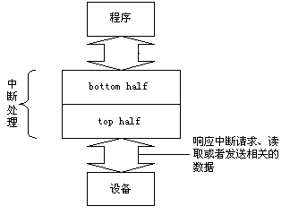

##5.4 中断的下半部处理机制

从上面的讨论我们知道，Linux并不是一口气把中断所要求的事情全部做完，而是分两部分来做，本节我们来具体描述内核怎样处理中断的下半部。

### 5.4.1 为什么把中断分为两部分来处理

中断服务程序一般都是在中断请求关闭的条件下执行的,以避免嵌套而使中断控制复杂化。但是，中断是一个随机事件，它随时会到来，如果关中断的时间太长，CPU就不能及时响应其他的中断请求，从而造成中断的丢失。因此，内核的目标就是尽可能快的处理完中断请求，尽其所能把更多的处理向后推迟。例如，假设一个数据块已经达到了网线，当中断控制器接受到这个中断请求信号时，Linux内核只是简单地标志数据到来了，然后让处理器恢复到它以前运行的状态，其余的处理稍后再进行（如把数据移入一个缓冲区，接受数据的进程就可以在缓冲区找到数据）。因此，内核把中断处理分为两部分：上半部（top
half）和下半部（bottom
half），上半部（就是中断服务程序）内核立即执行，而下半部（就是一些内核函数）留着稍后处理，如图5.6所示：

<div style="text-align: center">

</div>

<center>图5.6 中断的分割</center>

首先，一个快速的“上半部”来处理硬件发出的请求，它必须在一个新的中断产生之前终止。通常，除了在设备和一些内存缓冲区（如果你的设备用到了DMA，就不止这些）之间移动或传送数据，确定硬件是否处于健全的状态之外，这一部分做的工作很少。

下半部运行时是允许中断请求的，而上半部运行时是关中断的，这是二者之间的主要区别。

但是，内核到底什时候执行下半部，以何种方式组织下半部？这就是我们要讨论的下半部实现机制，这种机制在内核的演变过程中不断得到改进，在以前的内核中，这个机制叫做bottom
half(简称bh)，在2.4以后的版本中有了新的发展和改进，改进的目标使下半部可以在多处理机上并行执行，并有助于驱动程序的开发者进行驱动程序的开发，这种执行机制叫软中断（SOFTIRQ）机制。下面主要介绍软中断中常用的**小任务(Tasklet)**机制及2.6内核中的工作队列机制。

### 5.4.2 小任务机制 

这里的小任务是指**对要推迟执行的函数进行组织的一种机制**。其数据结构为tasklet_struct，每个结构代表一个独立的小任务，其定义如下：

```c
struct tasklet_struct {

		struct tasklet_struct *next; /*指向链表中的下一个结构*/

		unsigned long state; /* 小任务的状态 */

		atomic_t count; /* 引用计数器 */

		void (*func) (unsigned long); /* 要调用的函数 */

		unsigned long data; /* 传递给函数的参数 */

}；
```

结构中的func域就是下半部中要推迟执行的函数 ，data是它唯一的参数。

State域的取值为TASKLET_STATE_SCHED或TASKLET_STATE_RUN。TASKLET_STATE_SCHED表示小任务已被调度，正准备投入运行，TASKLET_STATE_RUN表示小任务正在运行。TASKLET_STATE_RUN只有在多处理器系统上才使用，任何时候单处理器系统都清楚一个小任务是不是正在运行（它要么就是当前正在执行的代码，要么不是）。

Count域是小任务的引用计数器。如果它不为0，则小任务被禁止，不允许执行；只有当它为零，小任务才被激活，并且在被设置为挂起时，小任务才能够执行。

#### 1声明和使用小任务

大多数情况下，为了控制一个寻常的硬件设备，小任务机制是实现下半部的最佳选择。小任务可以动态创建，使用方便，执行起来也比较快。

我们既可以静态地创建小任务，也可以动态地创建它。选择那种方式取决于到底是想要对小任务进行直接引用还是一个间接引用。如果准备静态地创建一个小任务（也就是对它直接引用），使用下面两个宏中的一个：
```c
DECLARE_TASKLET(name, func, data)

DECLARE_TASKLET_DISABLED(name, func, data)
```
这两个宏都能根据给定的名字静态地创建一个tasklet_struct结构。当该小任务被调度以后，给定的函数func会被执行，它的参数由data给出。这两个宏之间的区别在于引用计数器的初始值设置不同。第一个宏把创建的小任务的引用计数器设置为0，因此，该小任务处于激活状态。另一个把引用计数器设置为1，所以该小任务处于禁止状态。例如：
```c
DECLARE_TASKLET(my_tasklet, my_tasklet_handler, dev);
```
这行代码其实等价于
```c
struct tasklet_struct my_tasklet = { NULL, 0, ATOMIC_INIT(0),

tasklet_handler, dev};
```
这样就创建了一个名为my_tasklet的小任务，其处理程序为tasklet_handler，并且已被激活。当处理程序被调用的时候，dev就会被传递给它。

#### 2 编写自己的小任务处理程序

小任务处理程序必须符合如下的函数类型：
```c
void tasklet_handler(unsigned long data)
```
由于小任务不能睡眠，因此不能在小任务中使用信号量或者其它产生阻塞的函数。但是小任务运行时可以响应中断。

#### 3调度自己的小任务

通过调用tasklet_schedule()函数并传递给它相应的tasklt_struct指针，该小任务就会被调度以便适当的时候执行：
```c
tasklet_schedule(&my_tasklet); /*把 my_tasklet 标记为挂起 */
```
在小任务被调度以后，只要有机会它就会尽可能早的运行。在它还没有得到运行机会之前，如果一个相同的小任务又被调度了，那么它仍然只会运行一次。

可以调用tasklet_disable()函数来禁止某个指定的小任务。如果该小任务当前正在执行，这个函数会等到它执行完毕再返回。调用tasklet_enable()函数可以激活一个小任务，如果希望把以DECLARE_TASKLET_DISABLED（）创建的小任务激活，也得调用这个函数，如：
```c
tasklet_disable(&my_tasklet); /* 小任务现在被禁止,这个小任务不能运行 */

tasklet_enable(&my_tasklet); /* 小任务现在被激活 */
```
也可以调用tasklet_kill()函数从挂起的队列中去掉一个小任务。该函数的参数是一个指向某个小任务的tasklet_struct的长指针。在小任务重新调度它自身的时候，从挂起的队列中移去已调度的小任务会很有用。这个函数首先等待该小任务执行完毕，然后再将它移去。

#### 4. 小任务的简单应用

例5-2 调用tasklet的相关函数编写一个模块。

```c
#include<linux/module.h>  
#include<linux/init.h>  
#include<linux/fs.h>  
#include<linux/kdev_t.h>  
#include<linux/cdev.h>  
#include<linux/kernel.h>  
#include<linux/interrupt.h>  
     
static struct tasklet_struct my_tasklet;  
     
static void tasklet_handler (unsigned long data)  
{  
       printf(KERN_ALERT "tasklet_handler is running.\n");  
}  
     
static int __init test_init(void)  
{  
       tasklet_init(&my_tasklet, tasklet_handler, 0);  
       tasklet_schedule(&my_tasklet);  

       return 0;  
}  
     
static void __exit test_exit(void)  
{  
       tasklet_kill(&tasklet);  
       printk(KERN_ALERT "test_exit running.\n");  
}  
MODULE_LICENSE("GPL");  
     
module_init(test_init);  
module_exit(test_exit);
```

从这个例子可以看出，所谓的小任务机制是为下半部函数的执行提供了一种执行机制，也就是说，推迟处理的事情是由tasklet_handler实现，何时执行，经由小任务机制封装后交给内核去处理。

### 5.4.3工作队列

工作队列（work queue）是另外一种将工作推后执行的形式，它和我们前面讨论的所有其他形式都有不同。工作队列可以把工作推后，交由一个内核线程去执行，也就是说，这个下半部分可以在进程上下文中执行。这样，通过工作队列执行的代码能占尽进程上下文的所有优势。最重要的就是工作队列允许被重新调度甚至是睡眠。

那么，什么情况下使用工作队列，什么情况下使用tasklet。如果推后执行的任务需要睡眠，那么就选择工作队列。如果推后执行的任务不需要睡眠，那么就选择tasklet。另外，如果需要用一个可以重新调度的实体来执行你的下半部处理，也应该使用工作队列。它是唯一能在进程上下文运行的下半部实现的机制，也只有它才可以睡眠。这意味着在需要获得大量的内存时、在需要获取信号量时，在需要执行阻塞式的I/O操作时，它都非常有用。如果不需要用一个内核线程来推后执行工作，那么就考虑使用tasklet。

#####1.  工作、工作队列和工作者线程

   如前所述，我们把推后执行的任务叫做工作（work），描述它的数据结构为work_struct，这些工作以队列结构组织成工作队列（workqueue），其数据结构为workqueue_struct，而工作线程就是负责执行工作队列中的工作。系统默认的工作者线程为events,自己也可以创建自己的工作者线程。

#####2.  表示工作的数据结构

   在linux/workqueue.h中定义了work_struct结构：

```c
struct work_struct{

		unsigned long pending; /* 这个工作正在等待处理吗？*/

		struct list_head entry; /* 工作的链表 */

		void (*func) (void *); /* 要执行的函数 */

		void *data; /* 传递给函数的参数 */

		void *wq_data; /* 内部使用 */

		struct timer_list timer; /* 延迟的工作队列所用到的定时器 */

};
```

这些结构被连接成链表。当一个工作者线程被唤醒时，它会执行它的链表上的所有工作。工作被执行完毕，它就将相应的work_struct对象从链表上移去。当链表上不再有对象的时候，它就会继续休眠。

####3. 创建推后的工作

要使用工作队列，首先要做的是创建一些需要推后完成的工作。可以通过DECLARE_WORK在编译时静态地建该结构：

   DECLARE_WORK(name, void (*func) (void *), void *data);

这样就静态地创建一个名为name，待执行函数为func，参数为data的work_struct结构。

同样，也可以在运行时通过指针创建一个工作：

   INIT_WORK(struct work_struct *work, woid(*func) (void *), void *data);

这将动态地初始化一个由work指向的工作。

####4. 工作队列中待执行的函数

工作队列待执行的函数原型是：

   void work_handler(void *data)

这个函数由一个工作者线程执行，因此，函数运行在进程上下文中。默认情况下，允许响应中断，并且不持有任何锁。如果需要，函数可以睡眠。需要注意的是，尽管该函数运行在进程上下文中，但它不能访问用户空间，因为内核线程在用户空间没有相关的内存映射。通常在系统调用发生时，内核代表用户空间的进程运行，此时它才能访问用户空间，也只有在此时它才映射用户空间的内存。

####5. 对工作进行调度

现在工作已经被创建，我们可以调度它。想要把给定工作的待处理函数提交给缺省的events工作线程，只需调用
```c
   schedule_work(&work)；
```
work马上就被调度，一旦其所在的处理器上的工作者线程被唤醒，它就被执行。

有时候并不希望工作马上就被执行，而是希望它经过一段延迟以后再执行。在这种情况下，可以调度它在指定的时间执行：
```c
   schedule_delayed_work(&work, delay);
```
这时，&work指向的work_struct直到delay指定的时钟节拍用完以才会执行。

####6. 工作队列的简单应用

例5-3 调用工作队列的相关函数编写一个模块

```c
#include<linux/module.h>  
#include<linux/init.h>  
#include<linux/workqueue.h>  
  
static struct workqueue_struct *queue = NULL;  
static struct work_struct work;  
  
static void work_handler(struct work_struct *data)  
{  
        printk(KERN_ALERT "work handler function.n");  
}  
  
static int __init test_init(void)  
{  
        queue = create_singlethread_workqueue("helloworld");
/*创建一个单线程的工作队列*/  
        if (!queue)  
                goto err;  
  
        INIT_WORK(&work, work_handler);  
        schedule_work(&work);  
  
        return 0;  
err:  
        return -1;  
}  
  
static void __exit test_exit(void)  
{  
        destroy_workqueue(queue);  
}  
MODULE_LICENSE("GPL");  
module_init(test_init);  
module_exit(test_exit);
```