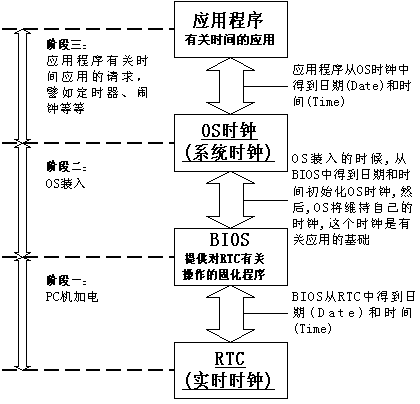
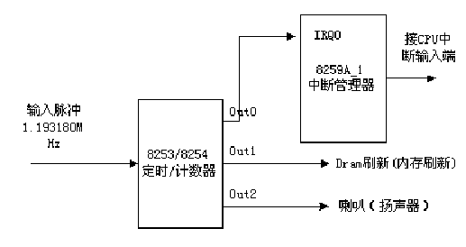

## 5.5 中断应用－时钟中断

在所有的外部中断中，时钟中断起着特殊的作用。因为计算机是以严格精确的时间进行数值运算和和数据处理的，最基本的时间单元是时钟周期，例如取指令、执行指令、存取内存等，但是我们不讨论这些纯硬件的东西，这里要讨论的是操作系统建立的时间系统，这个时间系统是整个操作系统活动的动力。

### 5.5.1时钟硬件

大部分PC机中有两个时钟源，他们分别叫做RTC和OS（操作系统）时钟。RTC（Real Time
Clock，实时时钟）也叫做CMOS时钟，它是PC主机板上的一块芯片（或者叫做时钟电路），它靠电池供电，即使系统断电，也可以维持日期和时间。由于它独立于操作系统，所以也被称为硬件时钟，它为整个计算机提供一个计时标准，是最原始最底层的时钟数据。

OS时钟产生于PC主板上的定时/计数芯片，由操作系统控制这个芯片的工作，OS时钟的基本单位就是该芯片的计数周期。在开机时操作系统取得RTC中的时间数据来初始化OS时钟，然后通过计数芯片的向下计数形成了OS时钟，所以OS时钟并不是本质意义上的时钟，它更应该被称为一个计数器。OS时钟只在开机时才有效，而且完全由操作系统控制，所以也被称为软时钟或系统时钟。下面我们重点描述OS时钟的产生。

OS时钟所用的定时/计数芯片最典型的是8253/8254可编程定时/计数芯片，其硬件结构及工作原理在这里不详细讲述，只简单地描述它是怎样维持OS时钟的。OS时钟的物理产生示意图如图5.7
所示：

<div style="text-align: center">

</div>

<center>图 5.7 8253/8254工作示意图</center>

可编程定时/计数器总体上由两部分组成：计数硬件和通信寄存器。通信寄存器包含有控制寄存器、状态寄存器、计数初始值寄存器（16位）、计数输出寄存器等。通信寄存器在计数硬件和操作系统之间建立联系，用于二者之间的通信，操作系统通过这些寄存器控制计数硬件的工作方式、读取计数硬件的当前状态和计数值等信息。在Linux内核初始化时，内核写入控制字和计数初值，这样计数硬件就会按照一定的计数方式对晶振产生的输入脉冲信号（5~100MHz的频率）进行计数操作：计数器从计数初值开始，每收到一次脉冲信号，计数器减1，当计数器减至0时，就会输出高点平或低电平，然后，如果计数为循环方式（通常为循环计数方式），则重新从计数初值进行计数，从而产生如图所示的输出脉冲信号（当然不一定是很规整的方波）。这个输出脉冲是OS时钟的硬件基础，之所以这么说，是因为这个输出脉冲将接到中断控制器上
，产生中断信号，触发后面要讲的时钟中断，由时钟中断服务程序维持OS时钟的正常工作，所谓维持，其实就是简单的加1及细微的修正操作。这就是OS时钟产生的来源。

### 5.5.2 时钟运作机制

不同的操作系统，RTC和OS时钟的关系是不同的。RTC和OS时钟之间的关系通常也被称作操作系统的时钟运作机制。

一般来说，RTC是OS时钟的时间基准，操作系统通过读取RTC来初始化OS时钟，此后二者保持同步运行，共同维持着系统时间。所谓同步，是指操作系统在运行过程中，每隔一个固定时间会刷新或校正RTC中的信息。

Linux中的时钟运作机制如图5.8所示。OS时钟和RTC之间要通过BIOS的连接，是因为传统PC机的BIOS中固化有对RTC进行有关操作的函数，例如INT
1AH等中断服务程序，通常操作系统也直接利用这些函数对RTC进行操作，例如从RTC中读出有关数据对OS时钟初始化、对RTC进行更新等等。Linux在内核初始化完成后就完全抛弃了BIOS中的程序。

<div style="text-align: center">

</div>

<center>图5.8 时钟运作机制</center>

我们可以看到，RTC处于最底层，提供最原始的时钟数据。OS时钟建立在RTC之上，初始化完成后将完全由操作系统控制，和RTC脱离关系。操作系统通过OS时钟提供给应用程序所有和时间有关的服务。因为OS时钟完全是一个软件问题，其所能表达的时间由操作系统的设计者决定，将OS时钟定义为整型还是长整型或者大的超乎想象都是由设计者决定。

### 5.5.3 Linux时间系统

以上我们了解了RTC和OS时钟。下面我们具体描述OS时钟。

OS时钟是由可编程定时/计数器产生的输出脉冲触发中断而产生的。输出脉冲的周期叫做一个“**时钟节拍**”。计算机中的时间是以时钟节拍为单位的，每一次时钟节拍，系统时间就会加1。操作系统根据当前时钟节拍的数目就可以得到以秒或毫秒等为单位的其他时间格式。

不同的操作系统采用不同的“时间基准”。定义“时间基准”的目的是为了简化计算，这样，计算机中的时间只要表示为从这个时间基准开始的时钟节拍数就可以了。时间基准是由操作系统的设计者规定的。例如DOS的时间基准是1980年1月1日，Unix和Minux的时间基准是1970年1月1日上午12点，Linux的时间基准是1970年1月1日凌晨0点。

通过上面的时钟运作机制，我们知道了OS时钟在Linux中的重要地位。OS时钟记录的时间也就是通常所说的系统时间。系统时间是以“时钟节拍”为单位的，而时钟中断的频率（简称节拍率）决定了一个时钟节拍的长短。节拍率是通过静态预处理定义的，也就是Hz（赫兹），在系统启动时按照Hz值对硬件进行设置。体系结构不同，Hz的值也不同。实际上，对于某些体系结构来说，甚至是机器不同，它的值都会不一样。

内核在文件<asm/param>中定义了Hz的实际值，节拍率就等于Hz，周期为1/Hz秒。比如，对Hz值定义如下：
```c
#define Hz 100 /*内核时间频率*/
```
可以看到系统定时器频率为100Hz（2.6以后的内核为1000Hz），也就是说每秒钟时钟中断100次（每10毫秒产生一次）。

#### 1.节拍数jiffies

**j**iffies是Linux内核中的一个全局变量,用它来表示系统自启动以来的时钟节拍总数。启动时，内核将该变量初始化为0，此后，每次时钟中断处理程序都会增加该变量的值。因为一秒内时钟中断的次数等于Hz，所以jiffes一秒内增加的值也就为Hz。系统运行时间以秒为单位计算，就等于jiffes/Hz。

jiffy是“瞬间、一会儿”的意思，和“时钟节拍”表达的是同一个意思。每次时钟中断jiffies都增1。

iffies变量总是无符号长整数（unsigned long），因此，在32位体系结构上是32位，在64位体系结构上是64位。32位的jiffies变量，在时钟频率为100Hz的情况下，497天后会溢出。如果频率为1000Hz，49.7天后就会溢出。而使用64位的jiffies变量，溢出就会遥遥无期了。

由于性能与历史的原因，主要还考虑到与现有内核代码的兼容性，内核开发者希望jiffie依然为unsigned long
extern unsigned long volatile jiffies;

现在我们来看一些用到jiffes的内核代码。将以秒为单位的时间转化为jiffes：(seconds * HZ)
相反，将jiffies转换为以秒为单位的时间：(jiffies/HZ)
比较而言，内核中将秒转换为jiffies用得多一些，比如经常需要设置一些将来的时间：
```c
unsigned long time_stamp = jiffes; /*现在*/

unsigned long next_tick = jiffies+1; /* 从现在开始1个节拍*/

unsigned long later = jiffies+5*HZ; /*从现在开始5秒*/
```
上面这种操作经常会用在内核和用户空间进行交互的时候，而内核本身很少用到绝对时间。

注意jiffies类型为无符号长整型（unsigned long），用其他任何类型存放它都不正确。

#### 2. 实际时间xtime

所谓实际时间就是实际生活中以秒为单位的时间。当系统启动时，内核通过读取RTC来初始化实际时间，该时间存放在内核的**xtim**e变量中。

当前实际时间（墙上时间）定义在文件kernel/timekeeping.c中：

```c
struct timespec xtime;
```

timespec 数据结构定义在文件linux/time.h中，形式如下：
```c
   struct timespec { /*高进度*/
	__kernel_time_t	tv_sec;			/* 秒 */
	long		tv_nsec;		
	/* 纳秒：十亿分之一秒（ nanosecond）*/


};
```

xtime.tv_sec以秒为单位，存放着自1970年7月1日（UTC）以来经过的时间，1970年1月1日被称为纪元，多数Unix系统的墙上时间都是基于该纪元而言的。xtime.tv_nsec记录自上一秒开始经过的纳秒数。除此之外，还有一种普通精度的时间表示方式：

```c
truct timeval { /* 普通精度 */

	__kernel_time_t		tv_sec;		/* 秒 */
	__kernel_suseconds_t	tv_usec;	/* 微秒：百万分之一秒（microsecond） */
};
```

另外，Linux还定义了更加符合大众习惯的时间表示：年、月、日。但是万变不离其宗，所有的时间应用都是建立在jiffies基础之上的。

### 5.5.5 时钟中断

#### 1. 时钟中断的产生

前面我们看到，Linux的OS时钟的物理产生原因是可编程定时/计数器产生的输出脉冲，这个脉冲送入CPU，就可以引发一个中断请求信号，我们就把它叫做时钟中断。

“时钟中断”是特别重要的一个中断，因为整个操作系统的活动都受到它的激励。系统利用时钟中断维持系统时间、促使环境的切换，以保证所有进程共享CPU；利用时钟中断进行记帐、监督系统工作以及确定未来的调度优先级等工作。可以说，“时钟中断”是整个操作系统的脉搏。

时钟中断的物理产生如图5.9所示：

<div style="text-align: center">

</div>

<center>图5.9 8253和8259A的物理连接方式</center>

操作系统对可编程定时/计数器进行有关初始化，然后定时/计数器就对输入脉冲进行计数（分频），产生的三个输出脉冲Out0、Out1、Out2各有用途，很多计算机接口书都介绍了相关主题，我们只看Out0上的输出脉冲，这个脉冲信号接到中断控制器8259A_1的0号管脚，触发一个周期性的中断，我们就把这个中断叫做时钟中断，时钟中断的周期，也就是脉冲信号的周期，我们叫做“滴答”或“节拍”（tick）。从本质上说，时钟中断只是一个周期性的信号，完全是硬件行为，该信号触发CPU去执行一个中断服务程序。

#### 2. 时钟中断处理程序

每一次时钟中断的产生都会进行一些列的操作，其中调用的主要函数为do_timer()：

1） 给jiffies变量增加1。

2）更新资源消耗的统计值，比如当前进程所消耗的系统时间和用户时间。

3）执行已经到期的定时器（下一节将讨论）。

4）执行sheduler_tick()函数。

5）更新墙上时间，该时间存放在xtime变量中。

6） 计算平均负载值。

因为上述工作分别都由单独的函数负责完成，所以实际上do_timer()执行代码看起来非常简单。

```c
void do_timer(unsigned long ticks)
{
	jiffies_64 += ticks;
	update_wall_time();
	calc_global_load(ticks);
}
```

其中参数structpt_reg是CPU中一组寄存器的定义，在本函数中user_mode()宏在查询处理器寄存器状态时，根据cs寄存器最低两位RPL判断时钟中断发生在用户态还是内核态，如果发生在用户态它返回1；如果发生在内核态则返回0。update_process_times()函数根据时钟中断产生的位置，对相关时间进行更新。

```c
void update_process_times(int user_tick)
{
	struct task_struct *p = current;
	int cpu = smp_processor_id();

	account_process_tick(p, user_tick);
	run_local_timers();
	rcu_check_callbacks(cpu, user_tick);		
	
	...
	
	scheduler_tick();
	run_posix_cpu_timers(p);
}
```

update_one_process()函数的作用是更新进程时间。它的实现是相当细致的，但是要注意，因为使用了XOR操作，所以user_tick和system两个变量只要其中有一个为1，则另外一个就必为0。updates_one_process()函数可以通过判断分支，将user_tick和system加到进程相应的计数上：
```c
/*

* 更新恰当的时间计数器，给其加一个jiffy。

*/

p->utime += user;

p->stime += system;
```
上述操作将适当的计数值增加1，而另一个值保持不变。这样做意味着内核对进程进行时间计数时，是根据中断发生时处理器所处的状态进行分类统计的，它把上一个tick全部算给进程。但是事实上进程在上一个节拍期间可能多次进入和退出内核态，而且在上一个节拍期间，该进程也不一定是唯一一个运行进程。很不幸，这种粒度的进程统计方式是传统的Unix/Linux所具有的，现在还没有更加精密的统计算法的支持，内核现在只能做到这个程度。

接下来的run_lock_times()函数去处理所有到期的定时器，定时器作为在下半部分中执行。在下一节中将对定时器进行简单讨论。

最后
scheduler_tick()函数负责减少当前运行进程的时间片计数值并且在需要时设置need_resched标志。

当update_process_timer（）函数返回后，do_timer()函数接着会调用update_wall_time()函数更新墙上时钟。

```c
static void update_wall_time(void)
{
	struct clocksource *clock;
	struct timekeeper *real_tk = &timekeeper;
	struct timekeeper *tk = &shadow_timekeeper;
	cycle_t offset;
	int shift = 0, maxshift;
	unsigned int clock_set = 0;
	unsigned long flags;

	raw_spin_lock_irqsave(&timekeeper_lock, flags);

	
	if (unlikely(timekeeping_suspended))
		goto out;

	clock = real_tk->clock;

#ifdef CONFIG_ARCH_USES_GETTIMEOFFSET
	offset = real_tk->cycle_interval;
#else
	offset = (clock->read(clock) - clock->cycle_last) & clock->mask;
#endif

	if (offset < real_tk->cycle_interval)
		goto out;

	shift = ilog2(offset) - ilog2(tk->cycle_interval);
	shift = max(0, shift);
	
	maxshift = (64 - (ilog2(ntp_tick_length())+1)) - 1;
	shift = min(shift, maxshift);
	while (offset >= tk->cycle_interval) {
		offset = logarithmic_accumulation(tk, offset, shift,
							&clock_set);
		if (offset < tk->cycle_interval<<shift)
			shift--;
	}

	
	old_vsyscall_fixup(tk);

	clock_set |= accumulate_nsecs_to_secs(tk);

	write_seqcount_begin(&timekeeper_seq);
	
	clock->cycle_last = tk->cycle_last;
	
	memcpy(real_tk, tk, sizeof(*tk));
	timekeeping_update(real_tk, false, false);
	write_seqcount_end(&timekeeper_seq);
out:
	raw_spin_unlock_irqrestore(&timekeeper_lock, flags);
	if (clock_set)
		clock_was_set_delayed();

}

```

ticks记录最近一次更新后新产生的节拍数。通常情况下ticks显然应该等于1。但是时钟中断也有可能丢失，因而节拍也会丢失。在中断长时间被禁止的情况下，就会出现这种现象—但这种现象并不正常，往往是个bug。wall_jiffies值随后被加上ticks—所以此刻wall_jiffies值就等于最新的墙上时间的更新值jiffies—接着调用update_wall_time()函数更新xtime，最后由calc_load()计算平均负载，到此，update_times()执行完毕。

do_timer()函数执行完毕后返回具体的时钟中断处理程序，继续执行后面的工作，释xtime_lock锁，然后退出。

以上全部工作每1/Hz秒都要发生一次，也就是说在你的PC机上时钟中断处理程序每秒执行100或者1000次。

### 5.5.5 定时器及应用

定时器是管理内核所花时间的基础，有时也被称为动态定时器或内核定时器。内核经常需要推后执行某些代码，比如前面提到的下半部机制就是为了将工作放到以后执行。但不幸的是，“之后”这个概念很含糊，下半部的本意并非是放到以后的某个时间去执行任务，而仅仅是不在此时此刻执行就可以了。我们所需要的是能够使工作在指定时间点上执行，也就是不长不短，就在希望的时间点上执行。内核定时器正是解决这个问题的理想工具。

定时器使用很简单。只需要执行一些初始化工作，设置一个到期时间，指定到时后执行的函数，然后激活定时器就可以了。指定的函数将在定时器到期时自动执行。注意定时器并不周期运行，它在到期后就自行销毁，这也正是这种定时器被称为动态定时器的一个原因；动态定时器不断的创建和销毁，而且它的运行次数也不受限制。定时器在内核中用得非常普遍。

#### 1 使用定时器

定时器由timer_list结构表示，定义如下：

```c
struct timer_list {
	
	struct list_head entry; /*包含定时器的链表*/
	unsigned long expires; /*以jifffies为单位的定时值*/
	struct tvec_base *base;/*保护定时器的锁*/
	void (*function)(unsigned long);/*定时器到时要执行的函数*/
	unsigned long data; /*传递给处理函数的长整型参数*/

	...
};
```

内核提供了一组与定时器相关的接口简化了对定时器的操作。

创建定时器首先需要先定义它：
```c
struct timer_list my_timer;
```
接下来需要通过一个辅助函数初始化定时器数据结构的内部值，初始化必须在对定时器操作前完成。
```c
init_timer(&my_timer);
```
现在就可以填充结构中需要的值：
```c
my_timer.expires = jiffies + delay; /* 定时器到期节拍数*/

my_timer.data = 0;/* 给定时器处理函数传入0值*/

my_timer.function = my_function;/*定时器到期调用的函数*/
```
my_timer.expires表示到期时间，它是以节拍为单位的绝对计数值。如果当前jiffies计数等于或大于my_timer.expires，由my_timer.function指向的处理函数就会开始执行，另外该函数还要使用长整型参数my_timer.data。我们从timer_list结构可以看到，处理函数必须符合下面的函数原形：
```c
void my_timer_function(unsigned long data)
```
data参数不同，则可以对应不同的定时器。如果不需要这个参数，可以简单传递０（或任何其它值）。

最后，必须激活定时器：
```c
add_timer(&my_timer);
```
到此为止，定时器可以工作了。但请注意定时值的重要性。当前节拍计数*等于或大于*指定的到期时间，内核就开始执行定时器处理函数。虽然内核可以保证不会在定时时间到期前运行定时器处理函数，但是有可能延误定时器的执行。一般来说，定时器都在到期后马上就会执行，但是也有可能被推迟到下一次时钟节拍才能运行，所以不能用定时器实现任何硬实时任务。

如果需要在定时器到期前停止定时器，可以使用del_timer()函数：
```c
del_timer(&my_timer);
```
被激活或未被激活的定时器都可以使用该函数，如果定时器还未被激活，该函数返回０；否则返回１。注意，不需要为已经到期的定时器调用该函数，因为它们会自动被删除。

#### 2 执行定时器

内核在时钟中断发生后执行定时器，定时器作为软中断在下半部中执行。具体来说，时钟中断处理程序会执行update_process_timers()函数，该函数随即调用run_local_timers()函数：
```c
void run_local_timers(void)
{
	hrtimer_run_queues();
	raise_softirq(TIMER_SOFTIRQ);
}
```
run_timer_softirq()函数处理软中断TIMER_SOFTIRQ，其处理函数为run_timer_softirq
，该函数用来处理所有的软件时钟，从而在当前处理器上运行所有的超时定时器。定时器是一种比较复杂的机制，其具体实现在此不做讨论。

#### 3 定时器应用

为了说明定时器如何在内核中实际使用，我们给出创建和使用进程延时的例子。假定内核决定把当前进程挂起两秒，可以通过执行下列代码来做到这一点：
```c
timeout = 2 * HZ; /*1HZ等于1000，因此为2000ms*/

set_current_state(TASK_INTERRUPTIBLE); /* 或者 TASK_UNINTERRUPTIBLE */

remaining = schedule_timeout(timeout);
```
schedule_timeout()函数会让需要延迟执行的进程睡眠到指定的延迟时间耗尽后再重新运行。但该方法也不能保证睡眠时间正好等于指定的延迟时间，而只能尽量使睡眠时间接近指定的延迟时间。当指定的时间到期后，内核唤醒被延迟的进程并将其重新放回运行队列。

上面的代码将相应的进程推入可中断睡眠队列，睡眠timeout秒。因为进程处于可中断状态，所以如果进程收到信号将被唤醒。如果睡眠进程不想接收信号，可以将进程状态设置为TASK_UNINTERRUPTBLE，然后睡眠。注意在调用sechedule_timeout()函数前必须首先将进程设置成上面两种状态之一，否则进程不会睡眠。

注意，由于shedule_timeout()函数需要调用调度程序，所以调用它的代码必须保证能够睡眠。简而言之，调用代码必须处于进程上下文中，并且不能持有锁。

schedule_timeout( )函数的主要代码如下：

```c
signed long __sched schedule_timeout(signed long timeout)
{
	struct timer_list timer;
	unsigned long expire;

	switch (timeout)
	{
	case MAX_SCHEDULE_TIMEOUT:
		
		schedule();
		goto out;
	default:
		
		if (timeout < 0) {
			printk(KERN_ERR "schedule_timeout: wrong timeout "
				"value %lx\n", timeout);
			dump_stack();
			current->state = TASK_RUNNING;
			goto out;
		}
	}

	expire = timeout + jiffies;

	setup_timer_on_stack(&timer, process_timeout, (unsigned long)current);
	__mod_timer(&timer, expire, false, TIMER_NOT_PINNED);
	schedule();/* 进程被挂起直到定时器到期 */
	
	del_singleshot_timer_sync(&timer);

	destroy_timer_on_stack(&timer);

	timeout = expire - jiffies;

 out:
	return timeout < 0 ? 0 : timeout;
}

```

该函数创建一个定时器timer；然后设置它的到期时间expires；设置超时时要执行的函数process_timeout()；然后激活定时器而且调用schedule()。因为进程被标识为TASK_
INTERRUPTIBLE或TASK_UNINTERRUPTIBLE，所以调度程序不会再选择该进程投入运行，而会选择其他新进程运行。

当延时到期时，内核执行下列函数：

```c
static void process_timeout(unsigned long __data)
{
	wake_up_process((struct task_struct *)__data);
}
```

当调用process_timeout(
)，把存在定时器对象data域的task_struct指针作为参数传递过去。结果，挂起的进程被唤醒，状态被置为TASK_RUNNING，然后将其放入运行队列。
当该进程重新被调度时，将返回进入睡眠前的位置继续执行（正好在调用schedule()后）。如果进程提前被唤醒（比如收到信号），那么定时器被销毁，process_timeout()函数返回剩余的时间。
