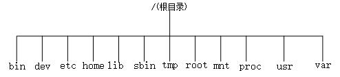
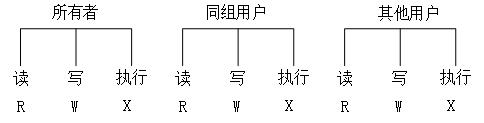
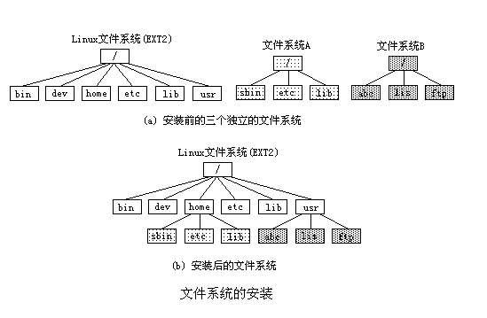

## 8.1 Linux文件系统基础

&emsp;&emsp;在深入了解文件系统之前，首先介绍文件系统的基本知识。

### 8.1.1 Linux文件结构

&emsp;&emsp;文件结构是文件存放在磁盘等存贮设备上的组织方法。主要体现在对文件和目录的组织上。
目录提供了管理文件的一个方便而有效的途径。Linux使用标准的目录结构，在Linux安装的时候，安装程序就已经为用户创建了文件系统和完整而固定的目录组成形式，并指定了每个目录的作用和其中的文件类型，如图8.1。

<div align=center>
  
</div>

<div align=center>
图8.1 Linux目录树结构    
</div>


&emsp;&emsp;Linux采用的是树型结构。最上层是根目录，其他的所有目录都是从根目录出发而生成的。微软的DOS和Windows也是采用树型结构，但是在DOS和Windows中这样的树型结构的根是磁盘分区的盘符，有几个分区就有几个树型结构，他们之间的关系是并列的。但是在Linux中，无论操作系统管理几个磁盘分区，这样的目录树只有一个。因为Linux是一个多用户系统，因此制定这样一个固定的目录规划有助于对系统文件和不同的用户文件进行统一管理。下面列出了Linux下一些主要目录的功能：

/bin 二进制可执行命令  
/dev 设备特殊文件  
/etc 系统管理和配置文件  
/home 用户主目录的基点，比如用户user的主目录就是/home/user。  
/lib 标准程序设计库，又叫动态链接共享库。  
/sbin 系统管理命令，这里存放的是系统管理员使用的管理程序  
/tmp 公用的临时文件存储点  
/root 系统管理员的主目录  
/mnt 用户临时安装其他文件系统的目录。  
/proc 虚拟的目录，不占用磁盘空间，是系统内存的映射。可直接访问这个目录来获取系统信息。  
/var 某些大文件的溢出区，例如各种服务的日志文件  
/usr 最庞大的目录，要用到的应用程序和文件几乎都在这个目录下。

### 8.1.2 文件类型

&emsp;&emsp;Linux的文件可以是下列类型之一：

&emsp;&emsp;1.常规文件

&emsp;&emsp;计算机用户和操作系统用于存放数据、程序等信息的文件，一般都长期地存放在外存储器（磁盘、磁带等）中。常规文件一般又分为文本文件和二进制文件。

&emsp;&emsp;2.目录文件

&emsp;&emsp;Linux文件系统将文件索引节点号和文件名同时保存在目录中。所以，目录文件就是将文件的名称和它的索引节点号结合在一起的一张表。目录文件只允许系统进行修改。用户进程可以读取目录文件，但不能对它们进行修改。

&emsp;&emsp;3.设备文件

&emsp;&emsp;Linux把所有的外设都当作文件来看待。每一种I/O设备对应一个设备文件，存放在/dev目录中，如行式打印机对应/dev/lp文件，第一个软盘驱动器对应/dev/fd0文件。

&emsp;&emsp;4.管道文件

&emsp;&emsp;主要用于在进程间传递数据。管道是进程间传递数据的“媒介”。某进程数据写入管道的一端，另一个进程从管道另一端读取数据。Linux对管道的操作与文件操作相同，它把管道做为文件进行处理。管道文件又称先进先出(FIFO)文件。

&emsp;&emsp;5.链接文件

&emsp;&emsp;又称符号链接文件，它提供了共享文件的一种方法。在链接文件中不是通过文件名实现文件共享，而是通过链接文件中包含的指向文件的指针来实现对文件的访问。使用链接文件可以访问常规文件，目录文件和其它文件。

### 8.1.3 存取权限和文件模式

&emsp;&emsp;为了保证文件信息的安全，Linux设置了文件保护机制，其中之一就是给文件都设定了一定的访问权限。当文件被访问时，系统首先检验访问者的权限，只有与文件的访问权限相符时才允许对文件进行访问。

&emsp;&emsp;Linux中的每一个文件都归某一个特定的用户所有，而且一个用户一般总是与某个用户组相关。Linux对文件的访问设定了三级权限：文件所有者，与文件所有者同组的用户，其他用户。对文件的访问主要是三种处理操作：读取、写入和执行。三级访问权限和三种处理操作形成了9种情况,如图8.2所示。

<div align=center>
  
</div>

<div align=center>
图8.2 文件访问权和访问模式
</div>

### 8.1.4 Linux文件系统 

&emsp;&emsp;文件系统指文件存在的物理空间，Linux系统中每个分区都是一个文件系统，都有自己的目录层次结构。Linux会将这些分属不同分区的、单独的文件系统按一定的方式形成一个系统的总的目录层次结构。

&emsp;&emsp;1.索引节点:

&emsp;&emsp;Linux文件系统使用索引节点来记录文件信息，其作用与Windows的文件分配表类似。索引节点是一个数据结构，它包含文件的长度、创建时间、修改时间、权限、所属关系、磁盘中的位置等信息。每个文件或目录都对应一个索引节点，文件系统把所有的索引节点形成一个数组，系统给每个索引节点分配了一个号码，也就是该节点在数组中的索引号，称为
**索引节点号**。文件系统正是靠这个索引节点号来识别一个文件。可以用ls –i命令查看文件的索引节点：


&emsp;&emsp;2.软链接和硬链接

&emsp;&emsp;可以用链接命令ln（Link）对一个已经存在的文件再建立一个新的链接，而不复制文件的内容。顾名思义，ln是将两个文件名彼此链接起来，使得用户无论使用哪一个文件名都可以访问到同一文件。链接有 **软链接**（也叫 **符号链接** ）和 **硬链接**之分。

&emsp;&emsp;**硬链接**(hard link)就是让一个文件对应一个或多个文件名，或者说把我们使用的文件名和文件系统使用的节点号链接起来，这些文件名可以在同一目录或不同目录。一个文件有几个文件名，我们就说该文件的链接数为几。硬链接有两个限制，一是不允许给目录创建硬链接，二是只有在同一文件系统中的文件之间才能创建链接。

&emsp;&emsp;例如，对已有的文件My.c创建一个硬链接MyHlink.c:
```
    $ln My.c myHlink.c

    $ls –i
```
&emsp;&emsp;可以看到My.c 和MyHlink.c有相同的索引节点号

&emsp;&emsp;为了克服硬链接的两个限制，引入 **符号链接** (symbolic link)。符号链接实际上是一种特殊的文件，这种文件包含了另一个文件的任意一个路径名。这个路径名指向位于任意一个文件系统的任意文件，甚至可以指向一个不存在的文件。系统会自动把对符号链接的大部分操作(如读、写等)变为对源文件的操作，但某些操作(如删除等)就会直接在符号链接上完成。

&emsp;&emsp;例如，对已有的文件My.c创建一个符号链接MySlink.c。

```
    $ln –s My.c MySlink.c

    $ls –li
```

&emsp;&emsp;从显示结果可以看出，My.c和MySlink.c具有不同的索引节点号，也就是说MySlink.c中存放的是My.c的路径。于是在列目录中显示有“MySlink.c-\>My.c”，表示MySlink.c 是符号链接文件，指向的实际文件为My.c

3.安装文件系统

&emsp;&emsp;将一个文件系统的顶层目录挂到另一个文件系统的子目录上，使它们成为一个整体，称为“安装（mount）”。把该子目录称为“安装点(mount
point)”，如图8.2。由于Ext4是Linux的标准文件系统，所以系统把EXT4文件系统的磁盘分区做为系统的根文件系统，EXT4以外的文件系统(如Window的FAT32文件系统)则安装在根文件系统下的某个目录下，成为系统树型结构中的一个分枝。安装一个文件系统用mount命令。

<div align=center>
  
</div>

<div align=center>
图 8.3 文件系统的安装
</div>

&emsp;&emsp;例如：
```
    $ mount -t iso9660 /dev/cdrom /mnt/cdrom
```
&emsp;&emsp;其中，iso9660是光驱文件系统的名称，/dev/cdrom是包含文件系统的物理块设备，/mnt/cdrom就是将要安装到的目录，即安装点。从这个例子可以看出，安装一个文件系统实际上是安装一个物理设备。

4.文件系统创建示例

&emsp;&emsp;为了说明 Linux文件系统层的功能（以及安装的方法），我们在当前文件系统的一个文件中创建一个文件系统。实现的方法是，首先用 dd 命令创建一个指定大小的文件（使用/dev/zero 作为源进行文件复制）—— 换句话说，一个用零进行初始化的文件，见清单 1。

&emsp;&emsp;清单 1. 创建一个经过初始化的文件
```
    $ dd if=/dev/zero of=file.img bs=1k count=10000 //把输入文件/dev/zero拷贝到输出文件file.img中，输入输出的块大小为1k，总共拷贝10000块
    10000+0 records in // 输入块为10000 
    10000+0 records out // 输出块为10000 
    $ 
```

&emsp;&emsp;现在有了一个 10MB 的 file.img文件。使用 losetup 命令将一个循环设备与这个文件关联起来，让它看起来像一个块设备，而不是文件系统中的常规文件：
```
    $ losetup /dev/loop0 file.img 
    $ 
```


file.img文件现在作为一个块设备出现（由 /dev/loop0表示）。然后用 mke2fs 在这个设备上创建一个文件系统。这个命令创建一个指定大小的新的
ext4 文件系统，见清单2。

&emsp;&emsp;清单 2. 用循环设备创建 ext4 文件系统
```
    $ mke2fs -c /dev/loop0 10000 //在/dev/loop0块设备上创建大小为10MB的ext4文件系统  
    ... 
    $ 
```

&emsp;&emsp;使用 mount 命令将循环设备（/dev/loop0）所表示的 file.img 文件安装到安装点/mnt/point1。注意，文件系统类型指定为 ext4。安装之后，就可以将这个安装点当作一个新的文件系统，比如使用ls 命令，见清单3。

&emsp;&emsp;清单 3. 创建安装点并通过循环设备安装文件系统
```
    $ mkdir /mnt/point1 //创建安装点 
    $ mount -t ext4 /dev/loop0 /mnt/point1 //在安装点上安装ext4文件系统 
    $ ls /mnt/point1 //查看文件系统 
    lost+found //新文件系统中的默认目录
    $ 
```

&emsp;&emsp;如清单 4所示，还可以继续这个过程：在刚才安装的文件系统中创建一个新文件，将它与一个循环设备关联起来，再在上面创建另一个文件系统。

&emsp;&emsp;清单 4. 在循环文件系统中创建一个新的循环文件系统
```
    $ dd if=/dev/zero of=/mnt/point1/file.img bs=1k count=1000 
    $ losetup /dev/loop1 /mnt/point1/file.img 
    $ mke2fs -c /dev/loop1 1000 
    ... 
    $ mkdir /mnt/point2 
    $ mount -t ext4 /dev/loop1 /mnt/point2 
    $ ls /mnt/point2 //查看另一个新的文件系统
    lost+found 
    $ ls /mnt/point1 
    file.img lost+found $ 
```

&emsp;&emsp;通过这个简单的演示很容易体会到 Linux文件系统（和循环设备）是多么强大。可以按照相同的方法在文件上用循环设备创建加密的文件系统。可以在需要时使用循环设备临时安装文件，这有助于保护数据。
