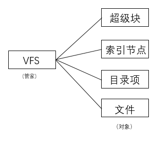
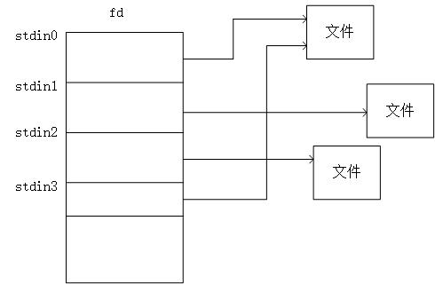
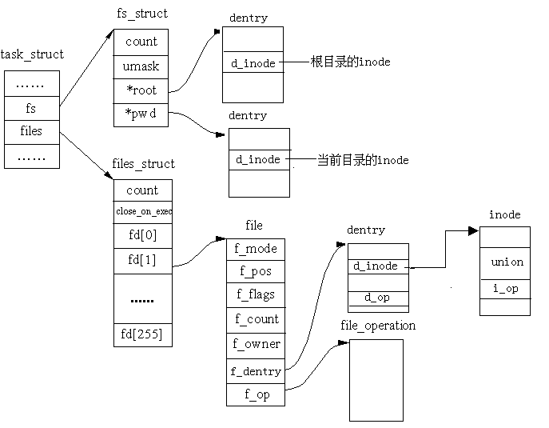

## 8.2 虚拟文件系统

&emsp;&emsp;为了保证Linux的开放性，设计人员必须考虑如何使Linux除支持Ext4文件系统外，还能支持其他各种不同的文件系统，例如集群文件系统以及加密文件系统等。为此，就必须将各种不同文件系统的操作和管理纳入到一个统一的框架中，使得用户程序可以通过同一个文件系统界面，也就是同一组系统调用，能够对各种不同的文件系统以及文件进行操作。这样，用户程序就可以不关心各种不同文件系统的实现细节，而使用系统提供的统一、抽象、虚拟的文件系统界面。这种统一的框架就是所谓的虚拟文件系统转换（Virtual Filesystem Switch），一般简称 **虚拟文件系统 (VFS)**。

### 8.2.1虚拟文件系统的引入

&emsp;&emsp;Linux最初采用的是Minix的文件系统，但是，Minix是一种教学用操作系统，其文件系统的大小限于64MB，文件名长度也限于14个字节。所以，Linux经过一段时间的改进和发展，特别是吸取了Unix文件系统多年改进所积累的经验，最终形成了现在的Ext4文件系统。

&emsp;&emsp;虚拟文件系统所提供的抽象界面主要由一组标准的、抽象的操作构成，例如read()、write()、lseek等，这些函数以系统调用的形式供用户程序调用。这样，用户程序调用这些系统调用时，根本无需关心所操作的文件属于哪个文件系统，这个文件系统是怎样设计和实现的。

&emsp;&emsp;Linux内核中，VFS与具体文件系统的关系如图8.4所示：

<div align=center>
  
</div>

<div align=center>
图8.4 VFS与具体文件系统之间的关系	
</div>

&emsp;&emsp;Linux的目录建立了一棵根目录为“/ ”的树。根目录包含在**根文件系统**中，在Linux中，这个根文件系统通常就是Ext4类型。其他所有的文件系统都可以被“安装”在根文件系统的子目录中。例如，用户可以通过“mount”命令，将DOS格式的磁盘分区（即FAT文件系统）安装到Linux系统中，然后，用户就可以像访问Ext4文件一样访问DOS的文件。

&emsp;&emsp;例如：假设用户输入以下shell命令：
```
    $ cp /mnt/dos/TEST /tmp/test
```
&emsp;&emsp;其中 /mnt/dos 是 DOS 磁盘的一个安装点，而 /tmp 是一个标准的第二扩展文件系统（Ext4）的目录。 如图8.4所示, VFS是用户的应用程序与具体文件系统之间的抽象层。因此， cp程序并不需要知道/mnt/dos/TEST 和 /tmp/test是什么文件系统类型。相反, cp程序通过系统调用直接与VFS交互。cp 所执行的代码片段如下：
```c
    inf=open("/mnt/dos/TEST",O_RDONLY,O);

    outf=open("/tmp/test",O_WRONLY|O_CREATE|O_TRUNC,0600);

    do{
            l=read(inf,buf,4096);
            write(outf,buf,l);
    }while(l);
```
&emsp;&emsp;为了进一步理解图8.4，结合上面的程序片段，我们来说明内核如何把read()转换为专对DOS文件系统的一个调用。应用程序对read( )的调用引起内核调用sys\_read()，这完全与其他系统调用类似。我们在本章后面会看到，文件在内核中是由一个file数据结构来表示的：
```c
    struct file{
            ...
            struct file_operation *f_op;
            ...
    }
```
&emsp;&emsp;该数据结构中包含一个称为f\_op的域，该域的类型为file\_operation结构。该结构包含指向各种函数的指针，例如：
```c
    struct file_operation {
            ...
            ssize_t(*read)(); /* ssize_t 实际为无符号整型*/
            ssize_t(*write)();
            int (*open)();
            int (*close)();
            ...
    };
```
&emsp;&emsp;每种文件系统都有自己的file\_operation结构，该结构中的域几乎全是函数指针。因此，当应用程序调用read()系统调用时，就会陷入内核而调用sys\_read()，而sys\_read()调用vfs\_read()，其简化代码如下:

```c
    ssize_t vfs_read(struct file *file, char _user *buf, size_t count, loff_t *pos)
    {
            ssize_t ret;
            ...
            if (file->f_op->read)
                    ret = file->f_op->read(file, buf, count, pos);
            ...
    }
```
&emsp;&emsp;从代码看出，通过file结构中的指针f\_op就会调用DOS文件系统的read()：

&emsp;&emsp;file-\>f\_op-\>read(...);

&emsp;&emsp;与之类似，write( ) 操作也会引发一个与输出文件相关的
Ext4写函数（而不是DOS文件系统的写函数）执行。

&emsp;&emsp;由此可以看出，如果把内核比拟为PC机中的“母板”，把VFS比拟为“母板”上的一个“插槽”，那么，每个具体的文件系统就好像一块块“接口卡”。不同的接口卡上有不同的电子线路，但是，它们与插槽的连接有几条线，每条线做什么有明确的定义。同样，不同的文件系统通过不同的程序来实现其各种功能，但是，与VFS之间的界面则是有明确定义的。这个界面就是file\_operation()结构。

### 8.2.2 VFS中对象的演绎

&emsp;&emsp;虚拟文件系统（VFS）的第一个词是“虚拟”，这就意味着，这样的文件系统在磁盘（或其他存储介质上）并没有对应的存储信息。那么，这样一个虚无的文件系统到底怎样形成？尽管Linux支持多达几十种文件系统，但这些真实的文件系统并不是一下子都挂在系统中的，他们实际上是按需被挂载的。老子说：“有无相生”，这个“虚”的VFS的信息都来源于“实”的文件系统，所以VFS必须承载各种文件系统的共有属性。另外，这些实的文件系统只有安装到系统中，VFS才予以认可，也就是说，VFS只管理挂载到系统中的实际文件系统。  
 
 
&emsp;&emsp;既然，VFS承担管家的角色，那么我们分析一下它到底要管哪些对象。Linux在文件系统的设计中，全然汲取了Unix的设计思想。Unix在文件系统的设计中抽象出四个概念：文件，目录项，索引节点和超级块。

<div align=center>
  
</div>

&emsp;&emsp;从本质上讲文件系统是特殊的数据分层存储结构，它包含文件、目录和相关的控制信息。文件系统的典型操作包含创建、删除和安装等等。如前所述，一个文件系统被挂载在根文件系统的某个枝叶上，这就是**安装点**，安装点在全局的层次结构中具有独立的命名空间。

&emsp;&emsp;如何给耳熟能详的**文件**给一个明确的定义？其实可以把**文件**看作是一个有序字节串，字节串中第一个字节是文件的头，最后一个字节是文件的尾。为了便于系统和用户识别，每一个文件都被分配了一个便于理解的名字。典型的文件操作有读、写、创建和删除等。

&emsp;&emsp;文件系统通过**目录**来组织文件。文件目录好比一个文件夹，用来容纳相关文件。因为目录也可以包含子目录，所以目录可以层层嵌套，形成文件路径。路径中的每一部分被称作**目录项**，例如“/home/clj/myfile”是文件路径的一个例子，其中根目录是/，home，clj和文件myfile都是目录项。在Unix中，目录属于普通文件，所以对目录和文件可以实施同样的操作。

&emsp;&emsp;文件系统如何对文件的属性（例如文件名，访问控制权限、大小、拥有者、创建时间等信息）进行描述？这就是索引节点（index Inode），为什么不叫文件控制块而叫索引节点，主要是因为有一个叫索引号的属性可以惟一的标识文件。

&emsp;&emsp;以上说明了文件，目录项，索引节点，还有超级块，超级块是一种包含文件系统信息的数据结构。

&emsp;&emsp;通过以上的介绍，可以概括出VFS中四个主要对象：

-   **超级块对象**：描述已安装文件系统。

-   **索引节点对象**：描述一个文件。

-   **目录项对象**：描述一个目录项，是路径的组成部分。

-   **文件对象**：描述由进程打开的文件。

&emsp;&emsp;注意，因为VFS将目录作为一个文件来处理，所以不存在目录对象。换句话说，目录项不同于目录，但目录却和文件相同。

### 8.2.3 VFS的超级块

&emsp;&emsp;超级块用来描述整个文件系统的信息。对每个具体的文件系统来说,都有各自的超级块，如Ext3或Ext4超级块，他们存放于磁盘。当内核在对一个文件系统进行初始化和注册时在内存为其分配一个超级块，这就是VFS超级块。也就是说，VFS超级块是各种具体文件系统在安装时建立的，并在这些文件系统卸载时被自动删除，可见，VFS超级块只存在于内存中。

1. 超级块数据结构

&emsp;&emsp;VFS超级块的数据结构为super\_block，该结构及其主要域的含义如下：
```c
struct super_block
{
        struct list_head  s_list;  /*指向超级块链表的指针*/
        dev_t s_dev; /*具体文件系统的块设备标识符。 例如，对于 /dev/hda1，其设备标识符为 0x301*/
        unsigned char s_blocksize_bits; /*块大小的值占用的位数，例如， 如果块大小为1024字节，则该值为10*/
        unsigned long s_blocksize; /*以字节为单位数据块的大小*/
        loff_t  s_maxbytes;	/* 最大文件大小*/
        struct file_system_type *s_type; /*指向文件系统的file_system_type 数据结构的指针*/
        struct super_operations *s_op; /*指向具体文件系统的用于超级块操作的函数集合 */
        ...
        void * s_fs_info; /*指向具体文件系统的超级块*/
};
```
&emsp;&emsp;所有超级块对象都以双向循环链表的形式链接在一起。链表中第一个元素用**super\_blocks**变量来表示。

&emsp;&emsp;其中的s\_list字段存放指向链表相邻元素的指针。s\_fs\_info字段指向具体文件系统的超级块；例如，假如超级块对象指的是Ext2文件系统，该字段就指向ext2\_sb\_info数据结构，该结构包括与磁盘分配位图等相关数据，不包含与VFS的通用文件模型相关的数据。

&emsp;&emsp;通常，为了效率起见，由s\_fs\_info字段所指向的数据被复制到内存。任何磁盘文件系统都需要访问和更改自己的磁盘分配位图，以便分配或释放磁盘块。VFS允许这些文件系统直接对内存超级块的s\_fs\_info字段进行操作，而无需访问磁盘。

&emsp;&emsp;与超级块关联的方法就是所谓的超级块操作表。这些操作是由数据结构super\_operations来描述的，其主要函数如下：

```c
struct super_operations {
struct inode *(*alloc_inode)(struct super_block *sb);
void (*destroy_inode)(struct inode *);
void (*dirty_inode) (struct inode *, int flags);
int (*write_inode) (struct inode *, struct writeback_control *wbc);
int (*drop_inode) (struct inode *);
void (*evict_inode) (struct inode *);
void (*put_super) (struct super_block *);
int (*sync_fs)(struct super_block *sb, int wait);
        ...
}
```

&emsp;&emsp;每一种文件系统都应该有自己的super\_operations操作实例。其主要函数的功能简述如下：

&emsp;&emsp;put\_super（）：释放超级块对象。

&emsp;&emsp;write\_inode（）：把inode写回磁盘。

&emsp;&emsp;destroy\_inode（）和drop\_inode（）：都是释放索引节点，前者仅仅是逻辑上的释放，而后者是从磁盘上物理地删除。

### 8.2.4 VFS的索引节点

&emsp;&emsp;文件系统处理文件所需要的所有信息都放在称为索引节点的数据结构中。文件名可以随时更改，但是索引节点对文件是唯一的，并且随文件的存在而存在。这里要说明的是，具体文件系统的索引节点是存放在磁盘上的，是一种静态结构，要使用它，必须调入内存，填写VFS的索引节点，因此，也称VFS索引节点是动态节点。VFS索引节点数据结构的主要域定义如下：
```c
struct inode
{
        umode_t			i_mode;  /*文件的类型与访问权限*/
	unsigned short		i_opflags;
	kuid_t			i_uid;   /*文件拥有者标识号*/
	kgid_t			i_gid; /*文件拥有者所在组标识号*/
	unsigned int		i_flags;  /*文件系统的安装标志*/
	const struct inode_operations	*i_op;  /*指向对该结点进行操作的一组函数*/
	struct super_block	*i_sb;  /*指向该文件系统超级块的指针*/
	struct address_space	*i_mapping;
	unsigned long		i_ino;   /*索引结点号*/
	...
	dev_t			i_rdev; /*实际设备标识号*/
	...
	unsigned long		i_state;  /*索引结点的状态标志*/
        ...
	struct hlist_node	i_hash;   /*指向哈希链表的指针*/
        ...
}
```

&emsp;&emsp;下面给出对inode数据结构的进一步说明

1.  在同一个文件系统中，每个索引节点号都是唯一的，内核可以根据索引节点号的哈希值查找其inode结构。

2.  inode
    中的设备号i\_rdev。如果索引节点所代表的并不是常规文件，而是某个设备，那就得有个设备号，这就是i\_rdev。

3.  每个VFS索引节点都会复制磁盘索引节点包含的一些数据，比如文件占用的磁盘块数。如果i\_state域的值等于I\_DIRTY，该索引节点就是“脏”的，也就是说，对应的磁盘索引节点必须被更新。每个索引节点对象总是出现在下列循环双向链表的某个链表中：未用索引节点链表、正在使用索引节点链表和脏索引节点链表。这三个链表都是通过索引节点的i\_list域链接在一起的。

4.  属于“正在使用”或“脏”链表的索引节点对象也同时存放在一个哈希表中。哈希表加快了对索引节点对象的搜索，前提是内核要知道索引节点号及对应文件所在文件系统的超级块对象的地址。

&emsp;&emsp;与索引节点关联的方法叫**索引节点操作表**，由inode\_operations结构来描述：
```c
struct inode_operations {
        ...
        int (*create) (struct inode *,struct dentry *,int);
        int (*link) (struct dentry *,struct inode *,struct dentry *);
        int (*unlink) (struct inode *,struct dentry *);
        int (*symlink) (struct inode *,struct dentry *,const char *);
        int (*mkdir) (struct inode *,struct dentry *,int);
        int (*rmdir) (struct inode *,struct dentry *);
        ...
}
```
&emsp;&emsp;其中主要函数的功能如下：

&emsp;&emsp;create()：创建一个新的磁盘索引节点

&emsp;&emsp;link()：创建一个新的硬连接

&emsp;&emsp;unlink()：删除一个硬连接

&emsp;&emsp;symlink()：为符号链创建一个新的索引节点

&emsp;&emsp;mkdir()：为目录项创建一个新的索引节点

&emsp;&emsp;…

&emsp;&emsp;对于不同的文件系统，其每个函数的具体实现是不同的,也不是必每个函数都必须实现，没有实现的函数对应的域应当置为NULL。


### 8.2.5 目录项对象

&emsp;&emsp;每个文件除了有一个索引节点inode数据结构外，还有一个目录项dentry数据结构。dentry结构中有个d\_inode指针指向相应的inode结构。读者也许会问，既然inode结构和dentry结构都是对文件各方面属性的描述，那为什么不把这两个结构合二为一呢？这是因为二者所描述的目标不同，dentry结构代表的是逻辑意义上的文件，所描述的是文件逻辑上的属性，因此，目录项对象在磁盘上并没有对应的映像；而inode结构代表的是物理意义上的文件，记录的是物理上的属性，对于一个具体的文件系统（如Ext4），Ext4\_inode结构在磁盘上就有对应的映像。所以说，一个索引节点对象可能对应多个目录项对象。

&emsp;&emsp;dentry 结构的主要域为：
```c
struct dentry {
	unsigned int d_flags;		/* 目录项标志 */
	seqcount_t d_seq;		
	struct hlist_bl_node d_hash;	/* 目录项形成的哈希表 */
	struct dentry *d_parent;	/* 父目录的目录项 */
	struct qstr d_name;          /* 目录项名（可快速查找）*/
	struct inode *d_inode;		/* 与文件名关联的索引节点 */
	unsigned char d_iname[DNAME_INLINE_LEN];    /* 短文件名 */
	unsigned int d_count;		/* 目录项引用计数器 */
	spinlock_t d_lock;		
	const struct dentry_operations *d_op;/* 操作目录项的函数*/
	struct super_block *d_sb;  /* 目录项树的根（即文件的超级块)*/
	unsigned long d_time;		
	void *d_fsdata;			/* 具体文件系统的数据 */
	struct list_head d_lru;		/*未使用的 LRU 链表 */
	union {
		struct list_head d_child;	/*父目录的子目录项所形成的链表 */
	 	struct rcu_head d_rcu;
	} d_u;
	struct list_head d_subdirs;	/* 该目录项的子目录所形成的链表*/
	struct hlist_node d_alias;	/* 索引节点别名的链表*/
};
```
&emsp;&emsp;一个有效的dentry结构必定有一个inode结构，这是因为一个目录项要么代表着一个文件，要么代表着一个目录，而目录实际上也是文件。所以，只要dentry结构是有效的，则其指针d\_inode必定指向一个inode结构。可是，反过来则不然，一个inode却可能对应着不止一个dentry结构；也就是说，一个文件可以有不止一个文件名或路径名。这是因为一个已经建立的文件可以被链接（link）到其他文件名。所以在inode结构中有一个队列i\_dentry，凡是代表着同一个文件的所有目录项都通过其dentry结构中的d\_alias域挂入相应inode结构中的i\_dentry队列。

&emsp;&emsp;在内核中有一个哈希表dentry\_hashtable，是一个list\_head的指针数组。一旦在内存中建立起一个目录节点的dentry结构，该dentry结构就通过其d\_hash域链入哈希表中的某个队列中。

&emsp;&emsp;内核中还有一个队列dentry\_unused，凡是已经没有用户（count域为0）使用的dentry结构就通过其d\_lru域挂入这个队列。

&emsp;&emsp;Dentry结构中除了d\_alias、d\_hash、d\_lru三个队列外，还有d\_vfsmnt、d\_child及d\_subdir三个队列。其中d\_vfsmnt仅在该dentry为一个安装点时才使用。另外，当该目录节点有父目录时，则其dentry结构就通过d\_child挂入其父节点的d\_subdirs队列中，同时又通过指针d\_parent指向其父目录的dentry结构，而它自己各个子目录的dentry结构则挂在其d\_subdirs域指向的队列中。

&emsp;&emsp;从上面的叙述可以看出，一个文件系统中所有目录项结构或组织为一个哈希表，或组织为一颗树，或按照某种需要组织为一个链表，这将为文件访问和文件路径搜索奠定下良好的基础。

&emsp;&emsp;对目录项进行操作的一组函数叫目录项操作表，由dentry\_operation结构描述：
```c
struct dentry_operations {
        int (*d_revalidate)(struct dentry *, unsigned int);
	int (*d_weak_revalidate)(struct dentry *, unsigned int);
	int (*d_hash)(const struct dentry *, const struct inode *,
			struct qstr *);
	int (*d_compare)(const struct dentry *, const struct inode *,
			const struct dentry *, const struct inode *,
			unsigned int, const char *, const struct qstr *);
	int (*d_delete)(const struct dentry *);
	void (*d_release)(struct dentry *);
	void (*d_prune)(struct dentry *);
	void (*d_iput)(struct dentry *, struct inode *);
	char *(*d_dname)(struct dentry *, char *, int);
	struct vfsmount *(*d_automount)(struct path *);
	int (*d_manage)(struct dentry *, bool);
};
```
&emsp;&emsp;该结构中函数的主要功能简述如下：

&emsp;&emsp;d\_revalidate（）：判定目录项是否有效。

&emsp;&emsp;d\_hash（）：生成一个哈希值。

&emsp;&emsp;d\_compare（）：比较两个文件名

&emsp;&emsp;d\_delete（）：删除d\_count域为0 的目录项对象

&emsp;&emsp;d\_release（）释放一个目录项对象。

&emsp;&emsp;d\_iput（）： 调用该方法丢弃目录项对应的索引节点

### 8.2.6 与进程相关的文件结构

&emsp;&emsp;文件最终是被进程访问的，一个进程可以打开多个文件，而一个文件可以被多个进程同时访问。在这里进程是通过文件描述符来抽象所打开的文件，用**用户打开文件表**来描述和记录进程打开文件描述符的使用情况。

#### 1.文件对象

&emsp;&emsp;每个打开的文件都用一个32位的数字来表示下一个读写的字节位置，这个数字叫做文件位置或**偏移量**（offset）。每次打开一个文件，文件位置一般都被置为0，此后的读或写操作都将从文件的开始处进行，但是可以通过执行系统调用lseek（随机定位）对这个文件位置进行修改。Linux在file文件对象中保存了打开文件的文件位置，这个对象称为**打开的文件描述**（open file description）。

&emsp;&emsp;那么，为什么不把文件位置干脆存放在索引节点中，而要多此一举设一个file数据结构呢？我们知道，Linux中的文件是能够共享的，假如把文件位置存放在索引节点中，则如果有两个或更多个进程同时打开同一个文件时，它们将去访问同一个索引节点，于是一个进程的lseek操作将影响到另一个进程的读操作，这显然是不允许也是不可想象的。

&emsp;&emsp;file结构中主要保存了文件位置，此外，还把指向该文件索引节点的指针也放在其中。file结构形成一个双链表，称为系统**打开文件表**。

&emsp;&emsp;file结构主要域如下：
```c
    struct file
    {
        union {
		struct list_head	fu_list;/*所有打开的文件形成一个链表*/
		struct rcu_head 	fu_rcuhead;
	} f_u;
	struct path		f_path;
#define f_dentry	f_path.dentry/*与文件相关的目录项对象*/
	struct inode		*f_inode;	/* cached value */
	const struct file_operations	*f_op;/*指向文件操作表的指针*/
	spinlock_t		f_lock;
	atomic_long_t		f_count;/*使用该结构的进程数*/
	unsigned int 		f_flags;/*打开文件时所指定的标志*/
	fmode_t			f_mode;/*文件的打开模式*/
	loff_t			f_pos;/*文件的当前位置*/
            ...
    };
```

&emsp;&emsp;每个文件对象总是包含在下列的一个双向循环链表之中：

1.  “未使用”文件对象的链表。该链表既可以用做文件对象的内存缓冲区，又可以当作超级用户的备用存储器，也就是说，即使系统的动态内存用完，也必须允许超级用户打开文件，否则系统就会崩溃。内核必须确认该链表总是至少包含NR\_RESERVED\_FILES个对象，通常该值设为10。

2.  “正在使用”文件对的象链表：该链表中的每个元素至少由一个进程使用，因此，各个元素的f\_count域不会为NULL。

&emsp;&emsp;如果VFS需要分配一个新的文件对象，就调用函数get\_empty\_filp()。该函数检测“未使用”文件对象链表的元素个数是否多于NR\_RESERVED\_FILES，如果是，可以为新打开的文件使用其中的一个元素；如果没有，则退回到正常的内存分配。

&emsp;&emsp;对文件进行操作的一组函数叫文件操作表，由file\_operations结构描述：
```c
struct file_operations {  
        struct module *owner;
	loff_t (*llseek) (struct file *, loff_t, int);
	ssize_t (*read) (struct file *, char __user *, size_t, loff_t *);
	ssize_t (*write) (struct file *, const char __user *, size_t, loff_t *);
	ssize_t (*aio_read) (struct kiocb *, const struct iovec *, unsigned long, loff_t);
	ssize_t (*aio_write) (struct kiocb *, const struct iovec *, unsigned long, loff_t);
	int (*readdir) (struct file *, void *, filldir_t);
	unsigned int (*poll) (struct file *, struct poll_table_struct *);
	long (*unlocked_ioctl) (struct file *, unsigned int, unsigned long);
	long (*compat_ioctl) (struct file *, unsigned int, unsigned long);
	int (*mmap) (struct file *, struct vm_area_struct *);
	int (*open) (struct inode *, struct file *);
	int (*flush) (struct file *, fl_owner_t id);
	int (*release) (struct inode *, struct file *);
	int (*fsync) (struct file *, loff_t, loff_t, int datasync);
        ...  
};
```
&emsp;&emsp;该结构中函数的主要功能简述如下：

&emsp;&emsp;llseek()：修改文件指针

&emsp;&emsp;read()：从读文件中读出若干个字节

&emsp;&emsp;write()：给文件中写若干个字节

&emsp;&emsp;mmap()：文件到内存的映射

&emsp;&emsp;open()：打开文件

&emsp;&emsp;flush()：关闭文件时减少 f-count计数

&emsp;&emsp;release()：释放file对象（f\_count = 0）

&emsp;&emsp;fsync()：文件在缓冲的数据写回磁盘

#### 2.用户打开文件表

&emsp;&emsp;**文件描述符**是用来描述打开的文件的。每个进程用一个files\_struct结构来记录文件描述符的使用情况，这个files\_struct结构称为**用户打开文件表**，它是进程的私有数据。该结构定义如下：
```c
struct files_struct {
        atomic_t count;/* 共享该表的进程数 */
	struct fdtable __rcu *fdt;
	struct fdtable fdtab;
	spinlock_t file_lock ____cacheline_aligned_in_smp;/*保护以下的所有域*/
	int next_fd;/*已分配的文件描述符加1*/
	unsigned long close_on_exec_init[1];/* 执行exec( )时需要关闭的文件描述符的初值集合 */
	unsigned long open_fds_init[1];/*文件描述符的初值集合 */
	struct file __rcu * fd_array[NR_OPEN_DEFAULT];/* 文件对象指针的初始化数组 */
};
```
&emsp;&emsp;fd域指向文件对象的指针数组。该数组的长度存放在max\_fds域中。通常，fd域指向files\_struct结构的fd\_array域，该域包括32个文件对象指针。如果进程打开的文件数目多于32，内核就分配一个新的、更大的文件指针数组，并将其地址存放在fd域中；内核同时也更新max\_fds域的值。

&emsp;&emsp;对于在fd数组中有入口地址的每个文件来说，数组的索引就是**文件描述符**。通常，数组的第一个元素（索引为0）表示进程的标准输入文件，数组的第二个元素（索引为1）是进程的标准输出文件，数组的第三个元素（索引为2）是进程的标准错误文件（参见图8.5）。请注意，通过dup()、dup2( )和 fcntl()
系统调用，两个文件描述符可以指向同一个打开的文件，也就是说，数组的两个元素可能指向同一个文件对象。

<div align=center>
  
</div>

<div align=center>
图8.5 文件描述符数组	
</div>


#### 3.fs\_struct结构

&emsp;&emsp;fs\_struct结构描述进程与文件系统的关系，其定义为：

```c
    struct fs_struct {
    	int users;
	spinlock_t lock;
	seqcount_t seq;
	int umask;
	int in_exec;
	struct path root, pwd;
    };
    
    struct path {
	struct vfsmount *mnt;
	struct dentry *dentry;
    };
```
&emsp;&emsp;umask域由umask（）系统调用使用，用于为新创建的文件设置初始文件许可权。

&emsp;&emsp;fs\_path中的dentry结构是对一个目录项的描述，root、pwd指针都指向这个结构。其中，root所指向的dentry结构代表着本进程所在的根目录，也就是在用户登录进入系统时所看到的根目录；pwd指向进程当前所在的目录。实际运行时，这两个目录不一定都在同一个文件系统中。例如，进程的根目录通常是安装于"/"节点上的Ext4文件系统，而当前工作目录可能是安装于/msdos的一个DOS文件系统。因此，fs\_path结构中的mnt就是对那两个目录的安装点的描述，安装点的数据结构为vfsmount。

### 8.2.7主要数据结构间的关系

&emsp;&emsp;前面我们介绍了超级块对象、索引节点对象、文件对象及目录项对象的数据结构。在此给出这些数据结构之间的联系。

&emsp;&emsp;超级块是对一个文件系统的描述；索引节点是对一个文件物理属性的描述；而目录项是对一个文件逻辑属性的描述。除此之外，文件与进程之间的关系是由另外的数据结构来描述的。一个进程所处的位置是由fs\_struct来描述的，而一个进程（或用户）打开的文件是由files\_struct来描述的，而整个系统所打开的文件是由file结构来描述。如图8.6给出了这些数据结构之间的关系。


<div align=center>
  
</div>

<div align=center>
图8.6 与进程联系的文件结构的关系示意图	
</div>


### 8.2.8 实例-观察数据结构中的数据

&emsp;&emsp;上面介绍的各个数据结构都有很多域，我们希望观察其中一些域的具体值，从而加深对这些域的理解。下面以超级块super\_block数据结构为例。

&emsp;&emsp;从8.2.2节超级块数据结构的描述知道，域s\_list把系统中已安装的文件系统的超级块通过双向链表链接起来，其中super\_block变量指向链表头。

&emsp;&emsp;例8-1 编写内核模块，打印super\_block结构中一些域的值。
```c
    #include <linux/module.h>
    #include <linux/fs.h>
    #include <linux/init.h>
    #include <linux/list.h>
    #include <linux/spinlock.h>
    #include <linux/kdev_t.h>

    static int __init my_init(void)
    {  
            struct super_block *sb;  
            struct list_head *pos;
            struct list_head *linode;
            struct inode *pinode;
            unsigned long long count = 0;

            printk("\nPrint some fields of super_blocks:\n");

            spin_lock(&sb_lock); /*加锁*/  
            list_for_each(pos, &super_blocks) {  
            sb = list_entry(pos, struct super_block, s_list);  
            printk("dev_t:%d:%d", MAJOR(sb->s_dev),MINOR(sb->s_dev));
            /*打印文件系统所在设备的主设备号和次设备号*/  
            printk("file_type name:%s\n", sb->s_type->name);
            /*打印文件系统名（参见8.3.1）*/

            list_for_each(linode,&sb->s_inodes) {

            pinode=list_entry(linode,struct inode, i_sb_list);
            count++;
            printk("%lu\t", pinode->i_ino); /*打印索引节点号*/
            }
    }  
    spin_unlock(&sb_lock);

    printk("The number of inodes:%llu\n", sizeof(struct inode)*count);  
    return 0;
    }

    static void __exit my_exit(void)  
    {  
            printk("unloading…\n");  
    }  
    module_init(my_init);  
    module_exit(my_exit);  
    MODULE_LICENSE("GPL");  
```
&emsp;&emsp;但是在编译的过程中报告如下错误：  
&emsp;&emsp;“super\_blocks” ，“sb\_lock” undefined!  
&emsp;&emsp;编译程序申明这两个变量没有定义，而实际上fs.h和spinlock.h头文件中对此已经定义。但是，在Linux内核中，并不是每个变量和函数都可以在其他子系统和模块中被引用，只有导出后才能被引用。而super\_blocks和sb\_lock变量并没有被导出，所以不能在模块中直接使用此变量。为了解决这个问题，通过EXPORT\_SYMBOL宏可以将这些变量导出，然后重新编译内核，但这样做的代价太大！

&emsp;&emsp;实际上，在proc文件系统下的kallsyms文件中存放有内核所有符号的信息:
```
    $cat /proc/kallsyms
```
&emsp;&emsp;可以看出，其中包含有各种函数、变量的地址。我们知道，一旦知道一个变量的地址，通过指针取出其内容就是轻而易举的事。
```
    $cat /proc/kallsyms | grep super_blocks  
    c03f83ac D super_blocks   /* super_blocks 变量的地址为c03f83ac */  
    $ cat /proc/kallsyms | grep sb_lock  
    c03f83b4 D sb_lock   /* sb_lock 变量的地址为c03f83b4*/  
    （注，从你的机子上取出来的值可能与此有所不同）
```
&emsp;&emsp;于是，定义如下宏：  
```
    #define SUPER_BLOCKS_ADDRESS 0xc03f83ac  
    #define SB_LOCK_ADDRESS 0xc03f83b4
```
&emsp;&emsp;将上面程序中的super\_blocks和sb\_lock换成宏定义SUPER\_BLOCKS\_ADDRESS和SB\_LOCK\_ADDRESS：
```
    spin_lock((spinlock_t *)SB_LOCK_ADDRESS);  
    list_for_each(pos, (struct list_head *)SUPER_BLOCKS_ADDRESS)
```
&emsp;&emsp;如此，就可以编译通过，并加载模块,然后观察结果（dmesg）

&emsp;&emsp;对以上结果进行分析：  

1. 超级块与分区是一对一还是一对多的关系？超级块与文件系统是什么关系？

2. 超级块与索引节点是什么关系？
