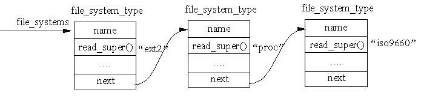

## 8.3 文件系统的注册、安装与卸载

### 8.3.1 文件系统的注册和注销

&emsp;&emsp;当内核被编译时，就已经确定了可以支持哪些文件系统，这些文件系统在系统引导时，在VFS中进行注册。如果文件系统是作为内核可装载的模块，则在实际安装时进行注册，并在模块卸载时注销。

&emsp;&emsp;每个文件系统都有一个初始化例程，它的作用就是在VFS中进行注册，即填写一个叫做file\_system\_type 的数据结构，该结构包含了文件系统的名称以及一个指向对应的VFS超级块读取例程的地址。所有已注册的文件系统的file\_system\_type结构形成一个链表，我们把这个链表称为注册链表。图8.7所示就是内核中的file\_system\_type 链表，链表头由 file\_systems 变量指定。

<div align=center>
  
</div>

<div align=center>
图8.7 已注册的文件系统形成的链表
</div>

&emsp;&emsp;图8.7 仅示意性地说明系统中已安装的三个文件系统Ext2、proc 及 iso9660 的 file\_system\_type 结构所形成的链表。当然，系统中实际安装的文件系统要更多。

&emsp;&emsp;file\_system\_type 的数据结构定义如下：
```c
    struct file_system_type {
        const char *name;/*文件系统的类型名*/
	int fs_flags;/*文件系统的一些特性*/
	...
	struct module *owner;/*通常置为宏THIS_MODLUE，用以确定是否把文件系统作为模块来安装*/
	struct file_system_type * next;
	...
    };
```
&emsp;&emsp;要对一个文件系统进行注册，就调用 register\_filesystem() 函数。如果不再需要这个文件系统，还可以撤消这个注册，即从注册链表中删除一个file\_system\_type
结构，此后系统不再支持该种文件系统。unregister\_filesystem() 函数就起这个作用的，它在执行成功后返回0，如果注册链表中本来就没有指定的要删除的结构，则返回-1。

&emsp;&emsp;我们可以通过8.2.7 节的方法来观察系统现有注册的文件系统，现在动手吧！

### 8.3.2 文件系统的安装

&emsp;&emsp;要使用一个文件系统，仅仅注册是不行的，还必须安装这个文件系统。在安装Linux时，硬盘上已经有一个分区安装了Ext4文件系统，它是作为根文件系统在启动时自动安装的。其实，在系统启动后你所看到的文件系统，都是在启动时安装的。如果你需要自己（一般是超级用户）安装文件系统，则需要指定三种信息：文件系统的名称、包含文件系统的物理块设备、文件系统在已有文件系统中的安装点。

&emsp;&emsp;把一个文件系统（或设备）安装到一个安装点时要用到的主要数据结构为mount，定义如下：
```c
    struct mount
    {
        struct list_head mnt_hash;/* 哈希表 */
	struct mount *mnt_parent;/*指向上一层安装点的指针*/
	struct dentry *mnt_mountpoint;/* 安装点的目录项 */
	...
	struct list_head mnt_mounts;	/* 子链表 */
	struct list_head mnt_child;	/* 通过mnt_child进行遍历 */
	struct list_head mnt_list;
	...
	struct mountpoint *mnt_mp;	 /*安装点 */
	...
    };
```
&emsp;&emsp;下面对结构中的主要域给予进一步说明：

1.  为了对系统中的所有安装点进行快速查找，内核把它们按哈希表来组织，mnt\_hash就是形成哈希表的队列指针。

2.  mnt\_mountpoint是指向安装点dentry结构的指针。而dentry指针指向安装点所在目录树中根目录的dentry结构。

3.  mnt\_parent是指向上一层安装点的指针。如果当前的安装点没有上一层安装点（如根设备），则这个指针为NULL。同时，mount结构中还有mnt\_mounts和mnt\_child两个队列头，只要上一层mount结构存在，就把当前mount结构中mnt\_child链入上一层mount结构的mnt\_mounts队列中。这样就形成一颗设备安装的树结构，从一个mount结构的mnt\_mounts队列开始，可以找到所有直接或间接安装在这个安装点上的其他设备。如图8.2。

4.  mnt\_list是指向vfsmount结构所形成链表的头指针。

&emsp;&emsp;每个文件系统都有它自己的根目录，如果某个文件系统（如）的根目录是系统目录树的根目录，那么该文件系统称为根文件系统。而其他文件系统可以安装在系统的目录树上，把这些文件系统要插入的目录就称为**安装点**。根文件系统的安装函数为mount\_root()。

&emsp;&emsp;一旦在系统中安装了根文件系统，就可以安装其他的文件系统。每个文件系统都可以安装在系统目录树中的一个目录上。

&emsp;&emsp;前面我们介绍了以命令方式来安装文件系统，在用户程序中要安装一个文件系统则可以调用 mount()系统调用,其内核实现函数为 sys\_mount()。安装过程主要工作是创建安装点对象，将其挂接到根文件系统的指定安装点下，然后初始化超级块对象，从而获得文件系统基本信息和相关的操作。

### 8.3.3 文件系统的卸载

&emsp;&emsp;如果文件系统中的文件当前正在使用，该文件系统是不能被卸载的。如果文件系统中的文件或目录正在使用，则VFS 索引节点缓冲区中可能包含相应的 VFS索引节点。内核根据文件系统所在设备的标识符，检查在索引节点缓冲区中否有来自该文件系统的VFS索引节点，如果有且使用计数大于0，则说明该文件系统正在被使用，因此，该文件系统不能被卸载。否则，查看对应的VFS 超级块，如果该文件系统的 VFS超级块标志为“脏”，则必须将超级块信息写回磁盘。上述过程结束之后，对应的 VFS超级块被释放，vfsmount 数据结构将从vfsmntlist链表中断开并被释放。具体的实现代码为fs/super.c中的sys\_umount（）函数，在此不再进行详细的讨论。
