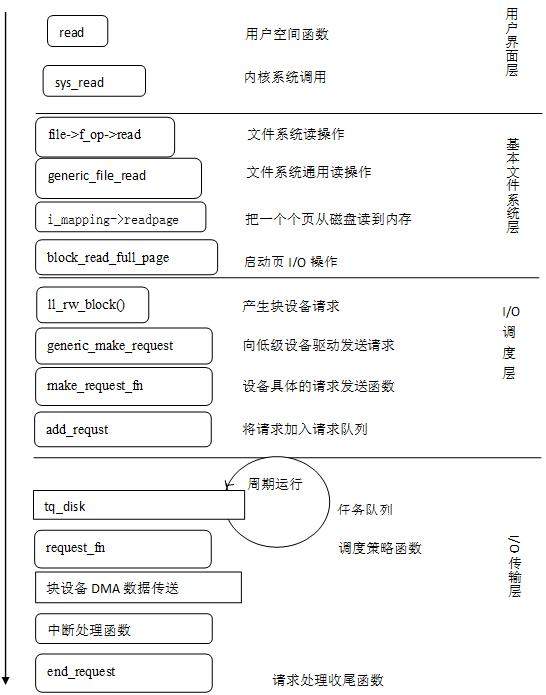

## 8.4 文件的打开与读写

&emsp;&emsp;让我们重新考虑一下在本章开始所提到的例子，用户发出一条shell命令：把/floppy/TEST中的MS-DOS文件拷贝到/tmp/test中的Ext2文件中。命令shell调用外部程序（如cp），在实现cp的代码片段中，涉及文件系统常见的三种文件操作，也就是三个系统调用open()、read()和write()。下面就对这三个系统调用的实现及涉及的相关知识给予介绍。

### 8.4.1文件打开

&emsp;&emsp;open()系统调用就是打开文件，它返回一个文件描述符。所谓打开文件实质上是在进程与文件之间建立起一种连接，而“文件描述符”唯一地标识着这样一个连接。在文件系统的处理中，每当一个进程打开一个文件时，就建立起一个独立的读／写文件“上下文”，这个“上下文”由file数据结构表示。另外，打开文件，还意味着将目标文件的索引节点从磁盘载入内存，并对其进行初始化。

&emsp;&emsp;open操作在内核中是由do\_sys\_open()函数完成的，其代码如下：
```c
    long do_sys_open(int dfd, const char __user *filename, int flags, umode_t mode)
{
	struct open_flags op;
	int lookup = build_open_flags(flags, mode, &op);
	struct filename *tmp = getname(filename);
	int fd = PTR_ERR(tmp);

	if (!IS_ERR(tmp)) {
		fd = get_unused_fd_flags(flags);
		if (fd >= 0) {
			struct file *f = do_filp_open(dfd, tmp, &op, lookup);
			if (IS_ERR(f)) {
				put_unused_fd(fd);
				fd = PTR_ERR(f);
			} else {
				fsnotify_open(f);
				fd_install(fd, f);
			}
		}
		putname(tmp);
	}
	return fd;
}
```
&emsp;&emsp;其中，调用参数filename是文件的路径名（绝对路径名或相对路径名）；mode表示打开的模式，如“只读”等；而flag则包含许多标志位，用以表示打开模式以外的一些属性和要求。函数通过getname()从用户空间把文件的路径名拷贝到内核空间，并通过get\_unused\_fd\_flags(flags)从当前进程的“打开文件表”中找到一个空闲的表项，该表项的下标即为“文件描述符fd”。然后，通过do\_filp\_open()找到文件名对应索引节点的dentry结构以及ionde结构，并找到或创建一个由file数据结构代表的读／写文件的“上下文”。通过fd\_install()函数，将新建的file数据结构的指针“安装”到当前进程的file\_struct结构中，也就是已打开文件指针数组中，其位置即已分配的下标fd。

&emsp;&emsp;在以上过程中，如果出错，则将分配的文件描述符、file结构收回，inode也被释放，函数返回一个负数以示出错，其中PTR\_ERR（）和IS\_ERR（）是出错处理函数。

&emsp;&emsp;由此可以看到，打开文件后，文件相关的“上下文”、索引节点、目录对象等都已经生成，下一步就是实际的文件读写操作了。

### 8.4.2文件读写

&emsp;&emsp;让我们再回到cp例子的代码。open( )系统调用返回两个文件描述符，分别存放在inf
和outf变量中。然后，程序开始循环。在每次循环中，/floppy/TEST文件的一部分被拷贝到一个缓冲区中，然后，这个缓冲区中的数据又被拷贝到/tmp/test文件。

&emsp;&emsp;read( ) 和write(
)系统调用非常相似。它们都需要三个参数：一个文件描述符fd、一个内存区的地址buf（该缓冲区包含要传送的数据），以及一个数count（指定应该传送多少字节）。当然，read(
)把数据从文件传送到缓冲区，而write(
)执行相反的操作。两个系统调用都返回所成功传送的字节数，或者发一个错误条件的信号并返回-1。

&emsp;&emsp;简而言之，read( ) 和write( )系统调用所对应的内核函数sys\_read( ) 和sys\_write(
)执行几乎相同的步骤：

1.  file=fget(fd)，也就是调用fget(
    )从fd获取相应文件对象的地址file，并把引用计数器file-\>f\_count加1。

2.  检查file-\>f\_mode中的标志是否允许所请求的访问（读或写操作）。

3.  调用locks\_verify\_area( )检查对要访问的文件部分是否有强制锁。

4.  调用file-\>f\_op-\>read
    或file-\>f\_op-\>write来传送数据。这两个函数都返回实际传送的字节数。另一方面的作用是，文件指针被更新。

5.  调用fput( )以减少引用计数器file-\>f\_count的值。

6.  返回实际传送的字节数。

&emsp;&emsp;以上概述了文件读写的基本步骤，但是f\_op-\>read或
f\_op-\>write两个方法属于VFS提供的抽象方法，对于具体的文件系统，必须调用针对该具体文件系统的具体方法。而对基于磁盘的文件系统，比如EXT4等，所调用的具体的读写方法都是Linux内核已提供的通用函数generic\_file\_read()或generic\_file\_write()。简单地说，这些通用函数的作用是确定正被访问数据所在物理块的位置，并激活块设备驱动程序开始数据传送，所以基于磁盘的文件系统没必要再实现专用函数了。下面对generic\_file\_read()函数所执行的主要步骤简述如下：

第一步：利用给定的文件偏移量和读写字节数计算出数据所在页的逻辑号(index)。

第二步： 开始传送数据页。

第三步： 更新文件指针，记录时间戳等收尾工作。

&emsp;&emsp;其中最复杂的是第二步，首先内核会检查数据是否已经驻存在页缓冲区，如果在页缓冲区中发现所需数据而且数据是有效的，那么内核就可以从缓存中快速返回需要的页；否则如果页中的数据是无效的，那么内核将分配一个新页面，然后将其加入到页缓冲区中，随即调用address\_space对象的readpage方法，激活相应的函数进行磁盘到页的I/O
数据传送。在进行一定预读，并完成数据传送之后，还要调用file\_read\_actor(
)方法把页中的数据拷贝到用户态缓冲区，最后进行一些收尾等工作，如更新标志等。

&emsp;&emsp;总之，从用户发出读请求到最终的从磁盘读取数据，可以概括为以下几步：

   1. 用户界面层——负责从用户函数经过系统调用进入内核；

   2. 基本文件系统层——负责调用文件读方法，从缓冲区中搜索数据页，返回给用户。

   3. I/O调度层——负责对请求排队，从而提高吞吐量。

   4. I/O传输层——利用任务队列，异步操作设备控制器，完成数据传输。

&emsp;&emsp;图8.9 给出读操作的逻辑流程。

<div align=center>
  
</div>

<div align=center>
图8.9 读操作流程
</div>