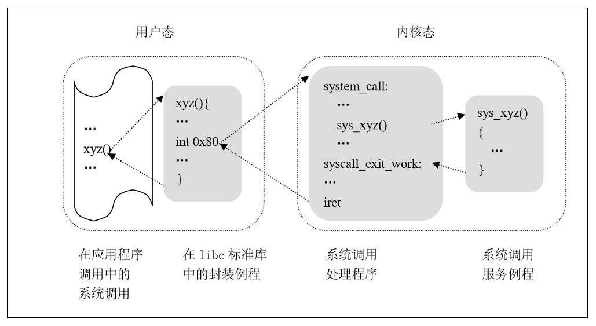

## 6.3 系统调用实现

&emsp;&emsp;当用户态的进程调用一个系统调用时，CPU从内核态切换到内核态并开始执行一个内核函数。Linux对系统调用的调用必须通过执行int$0x80汇编指令，这条汇编指令产生向量为128的编程异常（参见5.1.3异常及非屏蔽中断）。

&emsp;&emsp;因为内核实现了很多不同的系统调用，因此进程必须传递一个系统调用号的参数来识别所需的系统调用；eax寄存器就用做此目的。我们将在本章的“参数传递”一节看到，当调用一个系统调用时通常还要传递另外的参数。

&emsp;&emsp;与其他异常处理程序的结构类似，系统调用处理程序执行下列操作：

1.  在内核栈保存大多数寄存器的内容（这个操作对所有的系统调用都是通用的，并用汇编语言编写）。

2.  调用所谓系统调用服务例程的相应的C函数来处理系统调用。

3.  通过syscall_exit_work( )函数从系统调用返回（这个函数用汇编语言编写）。

&emsp;&emsp;xyz( )系统调用对应的服务例程的名字通常是sys_xyz()。图6.1显示了调用系统调用的应用程序、相应的封装例程、系统调用处理程序及系统调用服务例程之间的关系。箭头表示函数之间的执行流。

<div style="text-align: center">

</div>

<center>图6.1 调用一个系统调用</center>

### 6.3.1 初始化系统调用

&emsp;&emsp;内核初始化期间调用trap_init( )函数建立IDT表中128号向量对应的表项，语句如下：
```c
set_system_gate(SYSCALL_VECTOR, &system_call);
```
&emsp;&emsp;其中SYSCALL_VECTOR是一个宏定义，其值为0x80，该调用把下列值装入这个门描述符的相应域（参见第五章“5.2中断描述符表的初始化”一节）：

  段选择子：因为系统调用处理程序属于内核代码,填写内核代码段__KERNEL_CS的段选择子。

偏移量：指向system_call( )系统调用处理程序。

类型：置为15。表示这个异常是一个陷阱，相应的处理程序不禁止可屏蔽中断。

DPL（描述符特权级）：置为3。这就允许用户态进程调用这个异常处理程序。

### 6.3.2 system_call( )函数

&emsp;&emsp;system_call( )函数实现了系统调用处理程序。它首先把系统调用号和这个异常处理程序可以用到的所有CPU寄存器保存到相应的栈中，当然，栈中还有CPU已自动保存的eflags、cs、eip、ss和esp寄存器（参见第五章“异常的硬件处理”一节），也在ds和es中装入内核数据段的段选择子：
```c
ENTRY(system_call)

pushl %eax

SAVE_ALL

GET_THREAD_INFO(%ebp)
```
&emsp;&emsp;GET_THREAD_INFO()宏把当前进程PCB的地址存放在ebp中；这是通过获得内核栈指针的值并把它取整到8KB的倍数而完成的（参见第三章“3．2．4进程控制块的存放”一节），此宏定义在arch/x86/include/asm/thread_info.h中。然后，对用户态进程传递来的系统调用号进行有效性检查。如果这个号大于或等于NR_syscalls，系统调用处理程序终止：
```c
cmpl $(nr_syscalls), %eax

jae syscall_badsys
```
&emsp;&emsp;如果系统调用号无效，跳转到syscall_badsys处执行，此时就把-ENOSYS值存放在栈中eax[^2]寄存器所在的单元（从当前栈顶开始偏移为24的单元）。然后跳到resume_userspace反回到用户空间。当进程以这种方式恢复它在用户态的执行时，会在eax中发现一个负的返回码。

[^2]: 2
eax寄存器中既存放系统调用号，也存放系统调用的返回值，前者是一个正数，后者是一个负数。

&emsp;&emsp;最后， 根据eax中所包含的系统调用号调用对应的特定服务例程：
```c
call *sys_call_table(0， %eax， 4)
```
&emsp;&emsp;因为系统调用表中的每一表项占4个字节，因此首先把eax中的系统调用号乘以4再加上sys_call_table系统调用表的起始地址，然后从这个地址单元获取指向相应服务例程的指针，内核就找到了要调用的服务例程。

&emsp;&emsp;当服务例程执行结束时，system_call( )从eax获得它的返回值，并把这个返回值存放在栈中，让其位于用户态eax寄存器曾存放的位置。然后执行syscall_exit代码段，终止系统调用处理程序的执行（参见“5.4.6从中断返回”一节）。
```c
movl %eax， 24(%esp)

syscall_exit:

...
```
&emsp;&emsp;当进程恢复它在用户态的执行时，就可以在eax中找到系统调用的返回码。

### 6.3.3 参数传递

&emsp;&emsp;与普通函数类似，系统调用通常也需要输入/输出参数，这些参数可能是实际的值（例如数值），也可能是函数的地址及用户态进程地址空间的变量。因为system_call()函数是Linux中所有系统调用唯一的人口点，因此每个系统调用至少有一个参数，即通过eax寄存器传递来的系统调用号。例如，如果一个应用程序调用fork()封装例程，在执行int$0x80汇编指令之前就把eax寄存器置为5。因为这个寄存器的设置是由libc中的封装例程进行的，因此程序员通常并不需要关心系统调用号。

&emsp;&emsp;fork()系统调用并不需要其他的参数。不过，很多系统调用确实需要由应用程序明确地传递另外的参数。例如，mmap()系统调用可能需要多达6个参数（除了系统调用号）。

&emsp;&emsp;普通函数的参数传递是通过把参数值写进活动的程序栈（或者用户态栈或者内核态栈）。但是系统调用的参数通常是传递给系统调用处理程序在CPU中的寄存器，然后再拷贝到内核态堆栈。

&emsp;&emsp;为什么内核不直接把参数从用户态的栈拷贝到内核态的栈呢？首先，同时操作两个栈是比较复杂的；此外，寄存器的使用使得系统调用处理程序的结构与其他异常处理程序的结构类似。

&emsp;&emsp;然而，为了用寄存器传递参数，必须满足两个条件：

1.  每个参数的长度不能超过寄存器的长度，即32位[^3]。

2.  参数的个数不能超过6个（包括eax中传递的系统调用号），因为Intel Pentium寄存器的数量是有限的。

&emsp;&emsp;第一个条件总能成立，因为根据POSIX标准，不能存放在32位寄存器中的长参数必须通过指定它们的地址来传递。

&emsp;&emsp;对于第二个条件，确实存在多于6个参数的系统调用：在这样的情况下，用一个单独的寄存器指向进程地址空间中这些参数值所在的一个内存区即可。当然，编程者不用关心这个工作区。与任何C调用一样，当调用libc封装例程时，参数被自动地保存在栈中。封装例程将找到合适的方式把参数传递给内核。

&emsp;&emsp;存放系统调用参数所用的6个寄存器以递增的顺序为：eax (存放系统调用号)、
ebx、ecx、edx、esi及edi。正如前面看到的那样，system_call()使用SAVE_ALL宏把这些寄存器的值保存在内核态堆栈中。因此，当系统调用服务例程转到内核态堆栈时，就会找到system_call()的返回地址、紧接着是存放在eax中的参数（即系统调用的第一个参数）、存放在ecx中的参数等等。这种栈结构与普通函数调用的栈结构完全相同，因此，服务例程可以很容易地使用一般C语言构造的参数。

&emsp;&emsp;让我们来看一个例子。处理write( )系统调用的sys_write( )服务例程的声明如下：
```c
int sys_write (unsigned int fd， const char * buf，unsigned int count)
```
&emsp;&emsp;C编译器产生一个汇编语言函数，该函数可以在栈顶找到fd、buf和count参数，因为这些参数就位于返回地址的下面。

&emsp;&emsp;在少数情况下，系统调用不使用任何参数，但是相应的服务例程也需要知道在发出系统调用之前CPU寄存器的内容。例如，
系统调用fork( )没有参数，但其服务例程do_fork()需要知道有关寄存器的值，以便在子进程中使用它们。在这种情况下，一个类型为pt_regs的单独参数允许服务例程访问由SAVE_ALL宏保存在内核态堆栈中的值：
```c
int sys_fork (struct pt_regs regs)
```
&emsp;&emsp;服务例程的返回值必须写到eax寄存器中，这是在执行return n指令时由C编译程序自动完成的。

### 6.3.4 跟踪系统调用的执行

&emsp;&emsp;我们可以通过分析getpid系统调用的实际执行过程将上述概念具体化。分析getpid系统调用有两种方法，一种是查看entry.S中的代码细节，阅读相关的源码来分析其运行过程；另外一种是借助一些内核调试工具，动态跟踪执行路径。

&emsp;&emsp;假设我们的程序源文件名为getpid.c，程序为：

```c
#include<syscall.h>

#include<unistd.h>

#include<stdio.h>

#include<sys/types.h>

int main(void) {

long ID;

ID = getpid();

printf ("getpid()=%ld\n", ID);

return(0);

}
```

&emsp;&emsp;将其编译成名为getpid的执行文件：“gcc –o getpid getpid.c”,我们使用KDB来看进入内核后的执行路径（kdb是个内核调试补丁，使用前需要给内核打上该补丁，然后打开调试选项，再重新编译内核）。首先激活KDB(按下pause键)，设置内核断点 “bp sys_getpid”，退出kdb。然后执行./getpid。瞬间，进入内核调试状态,执行路径停止在断点sys_getpid处。

1.  在KDB>提示符下，执行bt命令观察堆栈，发现调用的嵌套路径，可以看到sys_getpid是在内核函数system_call中被嵌套调用的。

2.  在KDB>提示符下，执行rd命令查看寄存器中的数值，可以看到eax中存放的是getpid调用号0x00000014(即十进制20)。

3.  在KDB>提示符下，执行ssb（或ss）命令跟踪内核代码执行路径,可以发现sys_getpid执行后，会返回system_call函数，然后接着转入syscall_exit_work例程。

结合用户空间的执行路径，该程序的执行大致可归结为以下几个步骤：

1.  程序调用libc库的封装函数getpid。该封装函数中将系统调用号_NR_getpid（第20个）压入eax寄存器。

2.  调用软中断 int 0x80 进入内核。

3.  在内核中首先执行system_call函数，接着根据系统调用号在系统调用表中查找到对应的系统调用服务例程sys_getpid。

4.  执行sys_getpid服务例程。

5.  执行完毕后，转入syscall_exit_work例程，从系统调用返回。</div>