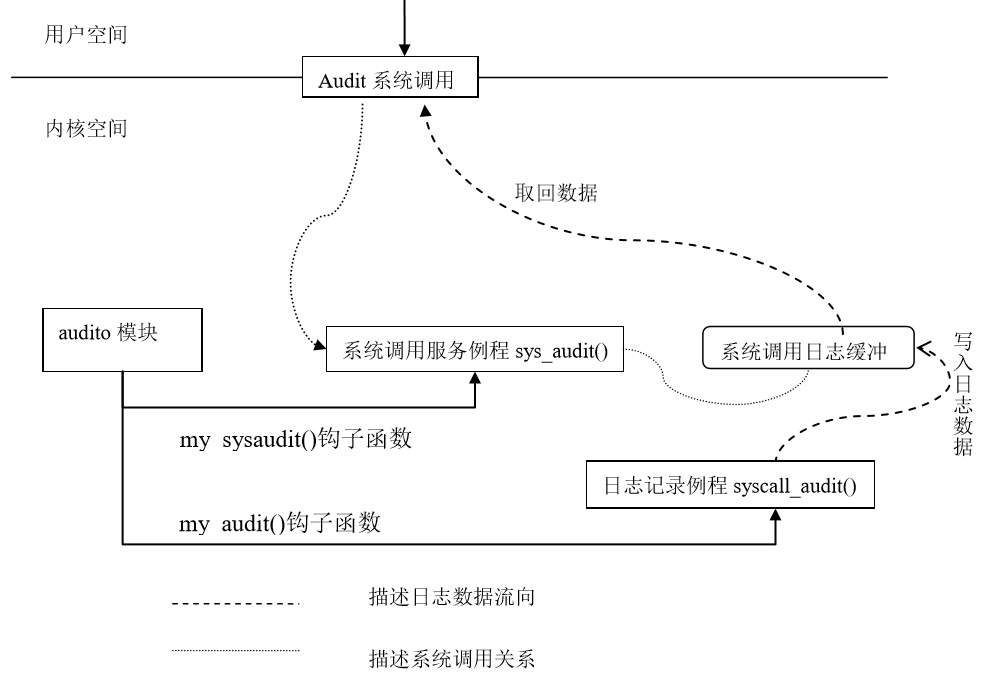

## 6.6 实例-系统调用日志收集系统

系统调用是用户程序与系统打交道的唯一入口，因此对系统调用的安全调用直接关系到系统的安全，但对系统管理员来说，某些操作却会给系统管理带来麻烦，比如一个用户恶意地不断调用fork()将导致系统负载增加，所以如果我们能收集到是谁调用了一些有危险的系统调用，以及调用系统调用的时间和其他信息，将有助于系统管理员进行事后追踪，从而提高系统的安全性。。

本实例收集Linux系统运行时系统调用被执行的信息，也就是实时获取系统调用日志，这些日志信息将以可读的形式实时地返回到用户空间，以便做为系统管理或者系统安全分析时的参考数据。

本实例需要完成以下几个基本功能：

第一：记录系统调用日志，将其写入缓冲区（内核中），以便用户读取；

第二：建立新的系统调用，以便将内核缓冲中的系统调用日志返回到用户空间。

第三：循环利用系统调用，以便能动态实时返回系统调用的日志。

### 6.6.1 代码结构体系介绍

上面介绍的基本功能对应程序代码中的三个子程序，它们分别是模块中的两个例程
syscall_audit()和mod_sys_audit()以及用户态程序auditd()，以下代码基于2.6.28内核。

#### 1 日志记录例程syscall_audit()

syscall_audit()是一个内核态的服务例程，该例程负责记录系统调用的运行日志，包括调用时刻、调用者PID、程序名等，这些信息可从内核代码的全局变量xtime或current等处获得。实际中，并不是对每一个系统调用信息都进行收集，只需要对系统影响较大的系统调用，比如fork(),clone(),open()等进行收集即可。

为了保证数据连续性，防止丢失，
syscall_audit()建立了一个内核缓冲区存放每刻搜集到的日志数据。当搜集的数据量到达一定阀值时（比如到达缓冲区总大小的%80时），就唤醒系统调用所在进程取回数据。否则继续搜集，这时该例程会堵塞在一个等待队列上，直到被唤醒。

变量的申明和定义如下

```c
#define COMM_SIZE 16

struct syscall_buf { /*定义缓冲区*/

		u32 serial; /* 序列号 */

		u32 ts_sec; /*秒 */

		u32 ts_micro; /* 微秒 */

		u32 syscall; /* 系统调用号 */

		u32 status; /* 系统调用的状态 */

		pid_t pid; /* 进程标识符 */

		uid_t uid; /* 用户标识符 */

		u8 comm[COMM_SIZE]; /* 进程对应的程序名 */

};

DECLARE_WAIT_QUEUE_HEAD(buffer_wait); /*申明并初始化等待队列buffer_wait
*/

#define AUDIT_BUF_SIZE 100 /*缓冲区大小 */

static struct syscall_buf audit_buf[AUDIT_BUF_SIZE]; /*缓冲区变量audit_buf
*/

static int current_pos = 0; /*缓冲区中的位置 */

static u32 serial = 0; /*序列号*/
```

代码如下：

```c
void syscall_audit(int syscall,int return_status)

{

		struct syscall_buf *ppb_temp;

		if(current_pos < AUDIT_BUF_SIZE) {

				ppb_temp = &audit_buf[current_pos];

				//以下代码是记录系统调用相关信息

				ppb_temp->serial = serial++;

				ppb_temp->ts_sec = xtime.tv_sec;

				ppb_temp->ts_micro = xtime.tv_usec;

				ppb_temp->syscall = syscall;

				ppb_temp->status=return_status;

				ppb_temp->pid = current->pid;

				ppb_temp->uid = current->uid;

				ppb_temp->euid = current->euid;

				memcpy(ppb_temp->comm, current->comm, COMM_SIZE);

				if (++current_pos == AUDIT_BUF_SIZE*8/10)

				{

						printk("IN MODULE_audit:yes, it near full\n ");

						wake_up_interruptible(&buffer_wait); /*唤醒在等待队列上等待的进程*/

				}

		}
}
```

#### 2 模块例程sys_audit()

由于系统调用是在内核中执行，因此其执行日志也应该在内核态收集。为此，我们需要编写一个模块函数将内核信息带回到用户空间，即sys_audit()，其功能是从缓冲区中取数据返回用户空间。

```c
int sys_audit(u8 type, u8 * us_buf, u16 us_buf_size, u8 reset)

{

		int ret = 0;

		if (!type) {

				if (__clear_user(us_buf, us_buf_size)) { / *清用户态缓冲区*/

						printk("Error:clear_usern");

						return 0;

				}

				printk("IN MODULE_systemcall:starting...\n");

				ret = wait_event_interruptible(buffer_wait,

				current_pos >= AUDIT_BUF_SIZE*8/10);

				printk("IN MODULE_systemcall:over,current_pos is %dn", current_pos);

				if(__copy_to_user(us_buf, audit_buf,

		(current_pos)*sizeof(struct syscall_buf))) { /*将日志拷贝到用户空间*/

						printk("Error:copy error\n");

						return 0;

				}

				ret = current_pos;

				current_pos = 0; /*清空缓冲区*/

		}

		return ret;

}
```

当收集的日志数量达到缓冲区总容量的80％时，则调用wait_event_interruptible()让进程在buffer_wait等待队列上等待。否则，调用__copy_to_user()把缓冲区当前位置中的日志信息拷贝到用户空间的缓冲区。最后，返回缓冲区的当前位置。

#### 3 模块的初始化和退出

为了在模块中能对syscall_audit()和sys_audit()函数动态加载和卸载，我们又定义了与这两个函数对应的钩子函数my_audit（）和my_sysaudit（）；它们的定义在另一个文件中（参见6.6.2节），于是在模块中，申明它们为外部函数。
```c
extern void (*my_audit)(int ,int );

extern int (*my_sysaudit)(unsigned char,unsigned char*,unsigned
short,unsigned char);
```
于是，模块的初始化函数如下：

```c
static int __init audit_init(void)

{

		my_sysaudit = sys_audit;

		my_audit = syscall_audit;

		printk("Starting System Call Auditing\n");

		return 0;

}
```

模块的退出函数如下：

```c
static void __exit audit_exit(void)

{

		my_audit = NULL;

		my_sysaudit = NULL;

		printk("Exiting System Call Auditing\n");

		return ;

}
```

#### 4 用户空间收集日志进程auditd 

我们需要一个用户空间进程来不断的调用audit()系统调用，取回系统中搜集到的系统调用日志信息。这里要说明的是，连续不断地调用日志序列对于分析入侵或系统行为等才有价值。

```c
#include<stdlib.h>

#include<stdio.h>

#include<errno.h>

#include<signal.h>

#include<unistd.h>

#include<sys/resource.h>

#include<sys/syscall.h>

#include "types.h" /*包含struct syscall_buf的定义*/

#define AUDIT_BUF_SIZE 100*sizeof(struct syscall_buf)

int main(int argc, char *argv[])

{

		u8 col_buf[AUDIT_BUF_SIZE];

		unsigned char reset =1;

		int num = 0;

		struct syscall_buf *p;

		while (1) {

				num = syscall(__NR_myaudit, 0, col_buf, AUDIT_BUF_SIZE, reset);

				printf("num:%d\n", num);

				u8 j=0;

				int i;

				p = (struct syscall_buf *)col_buf;

				for (i = 0;i < num;i++) {

						printf("num [%d],serial: %d\t", i, p[i].serial);

						printf("syscall: %d\n", p[i].syscall);

						printf("ts_sec: %d\n", ((struct syscall_buf*)col_buf)[i].ts_sec);

						printf("status: %d\n", ((struct syscall_buf*)col_buf)[i].status);

						printf("pid: %d\n", ((struct syscall_buf*)col_buf)[i].pid);

						printf("uid: %d\n", ((struct syscall_buf*)col_buf)[i].uid);

						printf("comm: %s\n", ((struct syscall_buf*)col_buf)[i].comm);

				}

		}

		return 1;

}
```

<div style="text-align: center">

</div>

<center>图6.2 日志收集系统的代码结构</center>
### 6.6.2 把代码集成到内核中

除了上面介绍的内容外，还需要一些辅助性的工作，这些工作将帮助我们将上述代码灵活地结成一体，以完成需要的功能。

#### 1. 添加系统调用号

与6.5节中添加系统调用的步骤一样，首先修改arch/x86/include/asm/unistd_32.h和/usr/include/asm/unistd_32.h文件，如下：
```c
#definle _NR_mysyscall 333

#define __NR_myaudit 334
```
#### 2. 在系统调用表中添加相应表项

arch/x86/kernel/syscall_table_32.S文件中含有系统调用表，在其中加入新的系统调用如下：
```c
ENTRY(sys_call_table)

.long sys_restart_syscall /* 0 - old "setup()" system call, used for
restarting */

.long sys_exit

.long sys_fork

.long sys_read

…

long sys_mysyscall /*333号*/

.long sys_myaudit /*334号*/
```
#### 3. 修改系统调用入口

在arch/x86/kernel/entry_32.S中含有系统调用入口system_call，因此在该文件中添加如下代码：
```c
syscall_call:

call *sys_call_table(,%eax,4)

movl %eax,PT_EAX(%esp) # store the return value
```

```c
#以下代码为新添加代码

cmpl $2, 0x28(%esp) # this is fork()

je myauditsys

cmpl $5, 0x28(%esp) # this is open()

je myauditsys

cmpl $6, 0x28(%esp) # this is close()

je myauditsys

cmpl $11, 0x28(%esp) # this is execv()

je myauditsys

cmpl $20, 0x28(%esp) # this is getpid()

je myauditsys

cmpl $120, 0x28(%esp) # this is clone()

je myauditsys

#添加代码段结束
```

以上代码保证在每次系统调用后都执行比较，如果系统调用号与我们要收集的系统调用号系统，则将调用myauditsys代码段，如下代码：
```c
syscall_exit:

……
```

```c
#以下为新添加代码段

jmp restore_all #new add

myauditsys:

pushl %eax # pass in return status

CFI_ADJUST_CFA_OFFSET 4 # help to debug

pushl 0x2C(%esp) # pass in syscall number

CFI_ADJUST_CFA_OFFSET 4

call syscall_audit;

popl %eax # remove orig_eax from stack

popl %eax # remove eax from stack

jmp syscall_exit

#新添加代码段结束
```

```c
restore_all:

movl PT_EFLAGS(%esp), %eax # mix EFLAGS, SS and CS
```
其中调用了我们编写的日志记录例程syscall_audit()。

#### 4. 添加自己的文件

在/arch/x86/kernel/目录下添加自己编写的myaudit.c文件，该文件包含的内容如下：

```c
#include<asm/uaccess.h>

#include<linux/proc_fs.h>

#include<linux/init.h>

#include<linux/types.h>

#include<asm/current.h>

#include<linux/sched.h>

void (*my_audit)(int, int) = 0;

/* 系统调用日志记录例程 */

asmlinkage void syscall_audit(int syscall,int return_status)

{

		if(my_audit)

		return (*my_audit)(syscall, return_status);

		printk("IN KERNEL:%s(%d),syscall:%d,return:%d\n",

		current->comm, current->pid, syscall, return_status);

		return ;

}

/* 系统调用 */

int (*my_sysaudit)(u8,u8*,u16,u8)=0;

asmlinkage int sys_myaudit(u8 type, u8 * us_buf, u16 us_buf_size, u8 reset)

{

		if(my_sysaudit)

		return (*my_sysaudit)(type,us_buf,us_buf_size,reset);

		printk("IN KERNEL:my system call sys_myaudit() working\n");

		return 1;

}
```

从代码可以看出sycall_audit()和sys_audit()并没有实现而是用两个钩子函数my_audit()和my_sysaudit()作为替身。而这两个钩子函数my_audit()和my_sysaudit()被放在模块中去实现，这样可以动态加载，方便调式。代码的结构如图6.2所示：

#### 5. 修改Makefile文件

修改arch/x86/kernel/Makefile:

加入 obj-y +=audit.o，即告诉内核将模块audit.o编译进内核

#### 6. 导出函数名，以提供内核接口函数

修改arch/x86/kernel/i386_ksyms_32.c，在末尾加入：
```c
extern void (*my_audit)(int,int);

EXPORT_SYMBOL(my_audit);

extern int(*my_sysaudit)(unsigned char,unsigned char*unsigned short,unsigned
char);

EXPORT_SYMBOL (my_sysaudit);
```
通过EXPORT_SYMBOL导出刚加入的函数名，以便其他内核函数调用，这两个钩子函数的实现我们放在了模块中。

#### 7. 编译并加载模块

insmod audit.o

#### 8. 重新编译内核