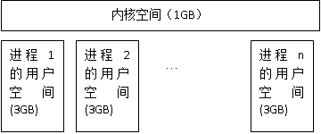
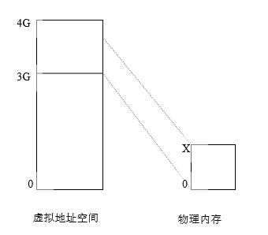
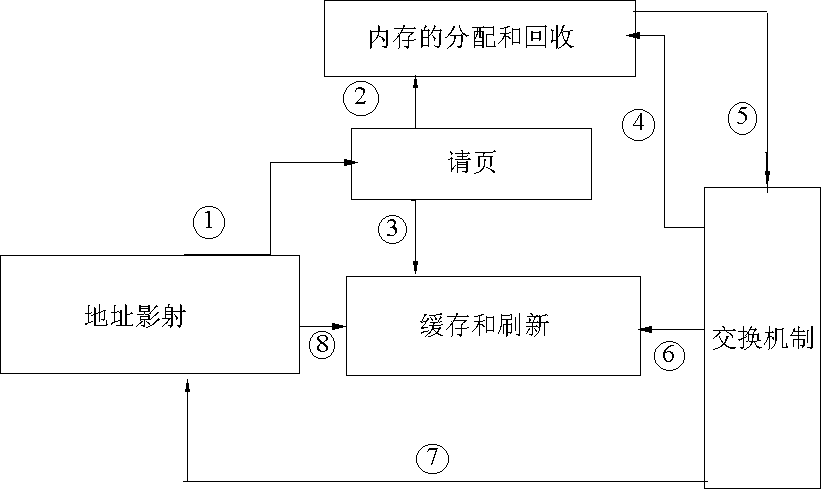

# 第四章 内存管理

存储器是一种必须仔细管理的重要资源。在理想的情况下，每个程序员都喜欢无穷大、快速并且内容不易变(即掉电后内容不会丢失)的存储器，同时又希望它是廉价的。但不幸的是，当前技术没有能够提供这样的存储器，因此大部分的计算机都有一个存储器层次结构，即少量的非常快速、昂贵、易变的高速缓存(cache)；若干兆字节的中等速度、中等价格、易变的主存储器(RAM)；数百兆或数千兆的低速、廉价、不易变的磁盘。这些资源的合理使用与否直接关系着系统的效率。

## 4.1 Linux的内存管理概述

Linux是为多用户多任务设计的操作系统, 所以存储资源要被多个进程有效共享；且由于程序规模的不断膨胀，要求的内存空间比从前大得多。Linux内存管理的设计充分利用了计算机系统所提供的虚拟存储技术，真正实现了虚拟存储器管理。

第二章介绍的80X86的段机制和页机制是操作系统实现虚拟存储管理的一种硬件平台。实际上，Linux不仅仅可以运行在Intel系列个人计算机上，还可以运行在Apple、DEC Alpha、MIPS和Motorola 68k等系列上，这些平台都支持虚拟存储器管理，而我们之所以选择80X86，是因为它更具代表性和普遍性。

关于内存管理，读者可能对一下问题比较困惑

1. 一个源程序编译链接后形成的地址空间是虚地址空间还是物理地址空间，如何管理？
2. 程序装入内存的过程中，虚地址如何被转换为物理地址？

本章将围绕这两大问题展开讨论，在讨论的过程中，会涉及到其他方面的技术问题。

### 4.1.1 虚拟内存、内核空间和用户空间

从第二章我们知道，Linux简化了分段机制，使得虚地址与线性地址总是一致的。线性空间在32位平台上为4GB的固定大小，也就是Linux的虚拟地址空间也这么大。Linux内核将这4G字节的空间分为两部分。最高的1G字节（从虚地址0xC0000000到0xFFFFFFFF）供内核使用，称为“**内核空间**”。而较低的3G字节（从虚地址0x00000000到0xBFFFFFFF），供各个进程使用，称为“**用户空间**”。因为每个进程可以通过系统调用进入内核，因此,Linux内核空间由系统内的所有进程共享。于是，从具体进程的角度来看，每个进程可以拥有4G字节的**虚拟地址空间**(也叫**虚拟内存**)。图4.1 给出了进程虚拟地址空间示意图。

<div style="text-align: center">

</div>

<center>图4.1 进程虚拟地址空间</center>

从图中可以看出，每个进程有各自的私有用户空间（0～3G），这个空间对系统中的其他进程是不可见的。最高的1GB内核空间则为所有进程以及内核所共享。另外，进程的“**用户空间**”也叫“**地址空间**”，在后面的叙述中，我们对这两个术语不再区分。

图4.1也说明，用户空间不是进程共享的，而是进程隔离的。每个进程最大都可以有3GB的用户空间。一个进程对其中一个地址的访问，与其它进程对于同一地址的访问绝不冲突。比如，一个进程从其用户空间的地址0x1234ABCD处可以读出整数8，而另外一个进程从其用户空间的地址0x1234ABCD处可以读出整数20，这取决于进程自身的逻辑。

任意一个时刻，在一个CPU上只有一个进程在运行。所以对于此CPU来讲，在这一时刻，整个系统只存在一个4GB的虚拟地址空间，这个虚拟地址空间是面向此进程的。当进程发生切换的时候，虚拟地址空间也随着切换。由此可以看出，每个进程都有自己的虚拟地址空间，只有此进程运行的时候，其虚拟地址空间才被运行它的CPU所知。在其它时刻，其虚拟地址空间对于CPU来说，是不可知的。所以尽管每个进程都可以有4GB的虚拟地址空间，但在CPU眼中，只有一个虚拟地址空间存在。虚拟地址空间的变化，随着进程切换而变化。

从第二章我们知道，一个程序编译连接后形成的地址空间是一个虚拟地址空间，但是程序最终还是要运行在物理内存中。因此，应用程序所给出的任何虚地址最终必须被转化为物理地址，所以，虚拟地址空间必须被映射到物理内存空间中，这个映射关系需要通过硬件体系结构所规定的数据结构来建立。这就是我们第二章所描述的段描述符表和页表，Linux主要通过页表来进行映射。

于是，我们得出一个结论，如果给出的页表不同，那么CPU将某一虚拟地址空间中的地址转化成的物理地址就会不同。所以我们为每一个进程都建立其页表，将每个进程的虚拟地址空间根据自己的需要映射到物理地址空间上。既然某一时刻在某一CPU上只能有一个进程在运行，那么当进程发生切换的时候，将页表也更换为相应进程的页表，这就可以实现每个进程都有自己的虚拟地址空间而互不影响。所以，在任意时刻，对于一个CPU来说，只需要有当前进程的页表，就可以实现其虚拟地址到物理地址的转化。

#### 1. 内核空间到物理内存的映射

内核空间对所有的进程都是共享的，其中存放的是内核代码和数据，而进程的用户空间中存放的是用户程序的代码和数据，不管是内核程序还是用户程序，它们被编译和连接以后，所形成的指令和符号地址都是**虚地址**（参见2.5节中的例子），而不是物理内存中的物理地址。

虽然内核空间占据了每个虚拟空间中的最高1GB字节，但映射到物理内存却总是从最低地址（0x00000000）开始的，如图4.2所示，之所以这么规定，是为了在内核空间与物理内存之间建立简单的线性映射关系。其中，3GB（0xC0000000）就是物理地址与虚拟地址之间的位移量，在Linux代码中就叫做PAGE_OFFSET。

<div style="text-align: center">

</div>

<center>图4.2内核的虚拟地址空间到物理地址空间的映射</center>

我们来看一下在page.h头文件中对内核空间中地址映射的说明及定义：

```c
#ifdef CONFIG_64BIT
#define __PAGE_OFFSET	(0x40000000)	/* 1GB */
#else
#define __PAGE_OFFSET	(0x10000000)	/* 256MB */
#endif

#define PAGE_OFFSET		((unsigned long)__PAGE_OFFSET)

/* The size of the gateway page (we leave lots of room for expansion) */
#define GATEWAY_PAGE_SIZE	0x4000

/* The start of the actual kernel binary---used in vmlinux.lds.S
 * Leave some space after __PAGE_OFFSET for detecting kernel null
 * ptr derefs */
#define KERNEL_BINARY_TEXT_START	(__PAGE_OFFSET + 0x100000)

/* These macros don't work for 64-bit C code -- don't allow in C at all */
#ifdef __ASSEMBLY__
#   define PA(x)	((x)-__PAGE_OFFSET)
#   define VA(x)	((x)+__PAGE_OFFSET)
#endif
#define __pa(x)			((unsigned long)(x)-PAGE_OFFSET)
#define __va(x)			((void *)((unsigned long)(x)+PAGE_OFFSET))
```

对于内核空间而言，给定一个虚地址x，其物理地址为“x-PAGE_OFFSET”，给定一个物理地址x，其虚地址为“x+ PAGE_OFFSET”。

例如，进程的页目录PGD（Page Global Directory）就处于内核空间中。在进程切换时，要将寄存器CR3设置成指向新进程的页目录PGD，而该目录的起始地址在内核空间中是虚地址，但CR3所需要的是物理地址，这时候就要用__pa()进行地址转换：

```c
asm volatile(“movl %0,%%cr3”: :”r” (__pa(next->pgd));
```

这是一行嵌入式汇编代码，其含义是将下一个进程的页目录起始地址next_pgd，通过__pa()转换成物理地址，存放在某个寄存器中，然后用movl指令将其写入CR3寄存器中。经过这行语句的处理，CR3就指向新进程next的页目录PGD

这里再次说明，宏__pa()仅仅把一个内核空间的虚地址映射到物理地址，而决不适用于用户空间，用户空间的地址映射要复杂得多，它通过分页机制完成。

#### 2．内核映像

在下面的描述中，我们把内核的代码和数据就叫内核映像（kernelimage）。当系统启动时，Linux内核映像被装入在物理地址0x00100000开始的地方，即1MB开始的区间，这第1M用来存放一些与系统硬件相关的代码和数据，如图4.3所示，内核只占用从0x100000开始到start_mem结束的一段区域。从start_mem到end_mem这段区域叫动态内存，是用户程序和数据使用的内存区。

    0          0x100000             start_mem                 end_mem

<center>图4.3 系统启动后的物理内存布局</center>

然而，在正常运行时，整个内核映像应该在虚拟内存的内核空间中，因为连接程序在连接内核映像时，在所有的符号地址上加一个偏移量PAGE_OFFSET，这样，内核映像在内核空间的起始地址就为0xC0100000。

### 4.1.2 虚拟内存实现机制间的关系

Linux虚拟内存的实现需要多种机制的支持，因此，本章我们将围绕以下几种核心机制进行介绍：

- 地址映射机制

- 请页机制

- 内存分配和回收机制

- 交换机制

- 缓存和刷新机制

这几种机制的关系如图4.4所示。

<div style="text-align: center">

</div>

<center>图4.4 虚拟内存实现机制及之间的关系</center>

首先内核通过映射机制把进程的虚拟地址映射到物理地址，在进程运行时，如果内核发现进程要访问的页没有在物理内存时，就发出了请页要求①；如果有空闲的内存可供分配，就请求分配内存②（于是用到了内存的分配和回收），并把正在使用的物理页记录在页缓存中③（使用了缓存机制）。如果没有足够的内存可供分配，那么就调用交换机制，腾出一部分内存④⑤。另外在地址映射中要通过TLB（翻译后援存储器）来寻找物理页⑧；交换机制中也要用到交换缓存⑥，并且把物理页内容交换到交换文件中后也要修改页表来映射文件地址⑦。