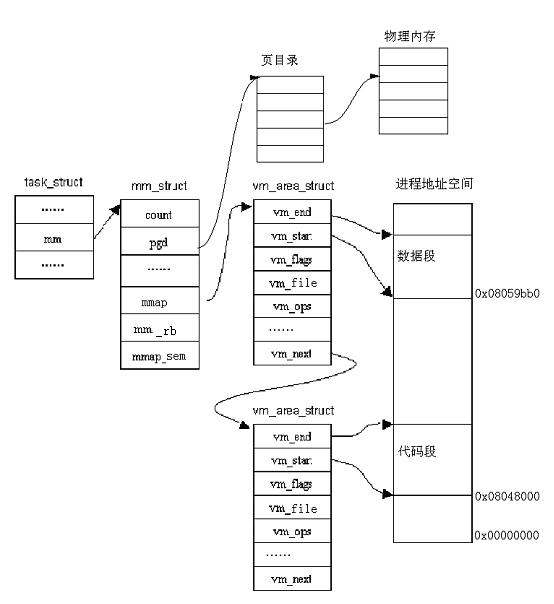

##4.2 进程的用户空间管理 

如前所述,每个进程最大可以拥有3GB的私有虚存空间。那么，这3GB的空间是如何划分？概括地说，用户程序经过编译、链接后形成的二进制映像文件有一个代码段和数据段，其中代码段在下，数据段在上。数据段中包括了所有静态分配的数据空间，即全局变量和所有申明为static的局部变量，这些空间是进程所必需的基本要求，是在建立一个进程的运行映像时就分配好的。除此之外，堆栈使用的空间也属于基本要求，所以也是在建立进程时就分配好的，如图4.5所示：

<div style="text-align: center">

</div>

<center>图4.5 进程用户空间的划分</center>

由图可以看出，堆栈段安排在用户空间的顶部，运行时由顶向下延伸；代码段和数据段则在低部，运行时并不向上延伸。从数据段的顶部到堆栈段地址的下沿这个区间是一个巨大的空洞，这就是进程在运行时调用malloc()可以动态分配的空间，也叫动态内存或**堆**。BSS（Block Started by Symbol）是未初始化的数据段。

我们可以写一个用户态下的程序example.c来打印出各个区间的起始地址：

```c
#include<stdio.h>

#include<malloc.h>

#include<unistd.h>

int bss_var;

int data_var0=1;

int main(int argc,char **argv)

{

		printf("below are addresses of types of process's mem\n");

		printf("Text location:\n");

		printf("tAddress of main(Code Segment):%p\n",main);

		printf("____________________________\n");

		int stack_var0=2;

		printf("Stack Location:n");

		printf("tInitial end of stack:%p\n",&stack_var0);

		int stack_var1=3;

		printf("tnew end of stack:%pn",&stack_var1);

		printf("____________________________\n");

		printf("Data Location:\n");

		printf("tAddress of data_var(Data Segment):%p\n",&data_var0);

		static int data_var1=4;

		printf("tNew end of data_var(Data Segment):%p\n",&data_var1);

		printf("____________________________\n");

		printf("BSS Location:n"); /*未初始化代码段*/

		printf("tAddress of bss_var:%pn",&bss_var);

		printf("____________________________\n");

		char *b = sbrk((ptrdiff_t)0);

		printf("Heap Location:\n");

		printf("tInitial end of heap:%p\n",b);

		brk(b+4);

		b=sbrk((ptrdiff_t)0);

		printf("tNew end of heap:%p\n",b);

		return 0;

}
```

其中，sbrk() 函数用来增加分配给程序的数据段的空间。

该程序的结果如下：
```c

   below are addresses of types of process's mem

   Text location:

   Address of main(Code Segment):0x8048388

   ____________________________

   Stack Location:

   Initial end of stack:0xbffffab4

   new end of stack:0xbffffab0

   ____________________________

   Data Location:

   Address of data_var(Data Segment):0x8049758

   New end of data_var(Data Segment):0x804975c

   ____________________________

   BSS Location:

   Address of bss_var:0x8049864

   ____________________________

   Heap Location:

   Initial end of heap:0x8049868

   New end of heap:0x804986c
```

利用size命令也可以看到程序的各段大小，比如执行size example会得到：

text data bss dec hex filename

1654 280 8 1942 796 example

但这些数据是程序编译的静态统计，而上面显示的是进程运行时的动态值，但两者是对应的。

前面的例子中我们看到的地址0x804xxxx都是虚地址。尽管每个进程拥有3GB的用户空间，但是其中的地址都是虚地址，因此，用户进程在这个虚拟内存中并不能真正地运行起来，必须把用户空间中的虚地址最终映射到物理存储空间才行，而这种映射的建立和管理是由内核完成的。所谓向内核申请一块空间，实际上是指请求内核分配一块虚存区间（如，数据段区间从0x8049758到0x804975c）和相应的若干物理页面，并建立起映射关系。

内核在创建进程时并不是为整个用户空间都分配好相应的物理空间,而是根据需要才真正分配一些物理页面并建立映射。在后面我们会看到，系统利用了请页机制来避免对物理内存的过分使用。因为进程访问的用户空间中的页可能当前不在物理内存中，这时，操作系统通过请页机制把数据从磁盘装入到物理内存。为此，系统需要修改进程的页表，以便标志用户空间中的页已经装入到物理页面中。由于上面这些原因，Linux采用了比较复杂的数据结构跟踪进程的用户地址空间。

### 4.2.1 进程用户空间的描述

一个进程的用户地址空间主要由两个数据结来描述。一个是mm_struct结构,它对进程整个用户空间进行描述，简称**内存描述符**；另一个是vm_area_structs结构,它对用户空间中各个区间(简称**虚存区**进行描述，这里的虚存区就是上例中的**代码区，未初始化数据区，数据区以及堆栈区等）**。Linux内核版本不同,对这些结构的定义可能稍有不同,为了简单起见，给出这些结构主要域的定义。

#### 1. mm_struct结构 

mm_strcut 用来描述一个进程的虚拟地址空间，在/include/linux/mm_types.h中主要域描述如下：

该结构用来描述进程的整个用户空间，具体定义如下：

```c
struct mm_struct {

		struct vm_area_struct * mmap;

		rb_root_t mm_rb;

		struct vm_area_struct * mmap_cache;

		pgd_t * pgd;

		atomic_t mm_users;                                    

   	 	atomic_t mm_count;                                    

   		int map_count;

   		struct rw_semaphore mmap_sem;

   		spinlock_t page_table_lock;                                              

   		struct list_head mmlist;

   		unsigned long start_code, end_code, start_data, end_data;

   		unsigned long start_brk, brk, start_stack;

   		unsigned long arg_start, arg_end, env_start, env_end;

   		unsigned long rss, total_vm, locked_vm;

   		unsigned long def_flags;

   		……
};
```

对主要域的解释如表4.1

表4.1 对mm_struct结构中主要域的说明

<table>
   <tr>
      <td>域名</td>
      <td>说明</td>
   </tr>
   <tr>
      <td>mmap</td>
      <td>指向线性区对象的链表头</td>
   </tr>
   <tr>
      <td>mm_rb</td>
      <td>指向线性区对象的红-黑树的根</td>
   </tr>
   <tr>
      <td>mmap_cahce</td>
      <td>最近一次用到的虚存区很可能下一次还要用到，因此，把最近用到的虚存区结构放入高速缓存，这个虚存区就由mmap_cache指向</td>
   </tr>
   <tr>
      <td>pgd</td>
      <td>进程的页目录基地址，当调度程序调度一个进程运行时，就将这个地址转成物理地址，并写入控制寄存器（CR3）</td>
   </tr>
   <tr>
      <td>mm_user</td>
      <td>表示共享地址空间的进程数目</td>
   </tr>
   <tr>
      <td>mm_count</td>
      <td>对mm_struct结构的引用进行计数。为了在Linux中实现线程，内核调用clone派生一个线程，线程和调用进程共享用户空间，即mm_struct结构，派生后系统会累加mm_struct中的引用计数</td>
   </tr>
   <tr>
      <td>map_count</td>
      <td>在进程的整个用户空间中虚存区的个数</td>
   </tr>
   <tr>
      <td>mmap_sem</td>
      <td>线性区的读写信号量</td>
   </tr>
   <tr>
      <td>page_table_lock</td>
      <td>线性区的自旋锁和页表的自旋锁</td>
   </tr>
   <tr>
      <td>mmlist</td>
      <td>所有mm_struct通过mmlist域链接成双向链表，链表的第一个元素是idle进程的mm_struct结构</td>
   </tr>
   <tr>
      <td>start_code，end_code, start_data，end_data</td>
      <td>进程的代码段和数据段的起始地址和终止地址</td>
   </tr>
   <tr>
      <td>start_brk，brk, start_stack</td>
      <td>每个进程都有一个特殊的地址区间，这个区间就是所谓的堆，也就是图4.5中的空洞。前两个域分别描述堆的起始地址和终止的地址，最后一个域描述堆栈段的起始地址</td>
   </tr>
   <tr>
      <td>arg_start，arg_end, env_start，env_end</td>
      <td>命令行参数所在的堆栈部分的起始地址和终止地址；环境串所在的堆栈部分的起始地址和终止地址</td>
   </tr>
   <tr>
      <td>Rss，total_vm, locked_vm</td>
      <td>进程贮留在物理内存中的页面数，进程所需的总页数，被锁定在物理内存中的页数</td>
   </tr>
   <tr>
      <td>def_flags</td>
      <td>线性区默认的访问标志</td>
   </tr>
   <tr>
</table>

对该结构进一步说明如下：

1.  在内核代码中，指向这个数据结构的变量常常是mm。

2.  每个进程只有一个mm_struct结构，在每个进程的task_struct结构中，有一个指向该结构的指针。可以说，mm_struct结构是对整个用户空间的描述。

3.  一个进程的虚拟空间中可能有多个虚拟区间（参见下面对vm_area_struct描述），对这些虚拟区间的组织方式有两种，当虚拟区较少时采用单链表，由mmap指针指向这个链表，当虚拟区间多时采用树结构。在2.4.10以前的版本中，采用的是AVL树结构，之后，采用的是红黑树结构，因为与AVL树相比，对红黑树进行操作的效率更高。

4.  因为程序中用到的地址常常具有局部性，因此，最近一次用到的虚拟区间很可能下一次还要用到，因此，把最近用到的虚拟区间结构应当放入高速缓存，这个虚拟区间就由mmap_cache指向。

5.  指针pgt指向该进程的页目录（每个进程都有自己的页目录，注意同内核页目录的区别）,当调度程序调度一个程序运行时，就将这个地址转成物理地址，并写入控制寄存器（CR3）。

6.  由于进程的虚拟空间及其下属的虚拟区间有可能在不同的上下文中受到访问，而这些访问又必须互斥，所以在该结构中设置了用于P、V操作的信号量mmap_sem。此外，page_table_lock也是为类似的目的而设置。

7.  虽然每个进程只有一个虚拟地址空间，但这个地址空间可以被别的进程来共享，如，子进程共享父进程的地址空间（也即共享mm_struct结构）。所以，用mm_user和mm_count进行计数。类型atomic_t实际上就是整数，但对这种整数的操作必须是“原子”的。

8.  另外，还描述了代码段、数据段、堆栈段、参数段以及环境段的起始地址和结束地址。这里的段是对程序的逻辑划分，与我们前面所描述的段机制是不同的。

#### 2. VM_AREA_STRUCT 结构

vm_area_struct描述进程用户空间的一个虚拟内存区间(Virtual Memory
Area,简称VMA)，其定义如下：

```c
struct vm_area_struct {

   		struct mm_struct * vm_mm;

  	 	unsigned long vm_start;

   		unsigned long vm_end;

   		struct vm_area_struct * vm_next;

   		pgprot_t vm_page_prot;

   		unsigned long vm_flags;

   		struct rb_node_t vm_rb;

   		struct vm_operations_struct * vm_ops;

   		unsigned long vm_pgoff;

  		struct file * vm_file;

   		void * vm_private_data;

   		……

};
```

对其主要域的解释如表4.2

表4.2 对vm_area_struct结构主要域的说明
  
<table>
   <tr>
      <td>域名</td>
      <td>说明</td>
   </tr>
   <tr>
      <td>vm_mm</td>
      <td>指向虚存区所在的mm_struct结构的指针。</td>
   </tr>
   <tr>
      <td>vm_start，vm_end</td>
      <td>虚存区的起始地址和终止地址。</td>
   </tr>
   <tr>
      <td>vm_page_prot</td>
      <td>虚存区的保护权限。</td>
   </tr>
   <tr>
      <td>vm_flags</td>
      <td>虚存区的标志。</td>
   </tr>
   <tr>
      <td>vm_next</td>
      <td>构成线性链表的指针，按虚存区基址从小到大排列。</td>
   </tr>
   <tr>
      <td>vm_rb</td>
      <td>用于红-黑树结构</td>
   </tr>
   <tr>
      <td>vm_ops</td>
      <td>对虚存区进行操作的函数。这些给出了可以对虚存区中的页所进行的操作。</td>
   </tr>
   <tr>
      <td>vm_pgoff</td>
      <td>映射文件中的偏移量。对匿名页，它等于0、vm_start或PAGE_SIZE</td>
   </tr>
   <tr>
      <td>vm_file</td>
      <td>指向映射文件的文件对象</td>
   </tr>
   <tr>
      <td>vm_private_data</td>
      <td>指向内存区的私有数据</td>
   </tr>
   <tr>
</table>                                         

另外，与磁盘文件相关的域有vm_pgoff及vm_file等，为什么要设置这些域？这是因为在两种情况下虚存中的页（或区间）会与磁盘发生关系。一种是磁盘交换区（Swap），当内存不够分配时，一些久未使用的页面可以被交换到磁盘的交换区，腾出物理页面以供急需的进程使用，这就是分页管理的“交换机制”。另一种情况是，将一个磁盘文件映射到进程的用户空间中，Linux提供的mmap()系统调用可以将一个打开的文件映射到进程的用户空间，此后就可以像访问内存中的字符数组那样来访问这个文件，而不必通过lseek()、read()或write()等进行文件操作。

为什么把进程的用户空间要划分为一个个区间？这是因为每个虚存区可能来源不同，有的可能来自可执行映像，有的可能来自共享库，而有的则可能是动态分配的内存区，对不同的区间可能具有不同的访问权限，也可能有不同的操作。因此Linux
把进程的用户空间分割管理，并利用了虚存区处理函数（vm_ops）来抽象对不同来源虚存区的处理方法。Linux在这里利用了面向对象的思想，即把一个虚存区看成一个对象，用vm_area_structs描述了这个对象的属性，其中的vm_operation结构描述了在这个对象上的操作，其定义如下：

```c
struct vm_operations_struct {

		void (*open)(struct vm_area_struct * area);

		void (*close)(struct vm_area_struct * area);

		struct page * (*nopage)(struct vm_area_struct * area, unsigned long address, int unused);

		…;

};
```

vm_operations结构中包含的是函数指针；其中，open、close分别用于虚存区的打开、关闭，而nopage是当虚存页面不在物理内存而引起的“缺页异常”时所应该调用的函数。如图4.6
给出虚存区的操作函数。

<div style="text-align: center">

</div>

<center>图4.6 虚存区的操作函数</center>

#### 3. 相关数据结构之间的关系

进程控制块是内核中的核心数据结构。在进程的 task_struct结构中包含一个mm域，它是指向 mm_struct 结构的指针。而进程的mm_struct结构则包含进程的可执行映像信息以及进程的页目录指针pgd等。该结构还包含有指向vm_area_struct 结构的几个指针，每个 vm_area_struct
代表进程的一个虚拟地址区间。这几个结构之间的关系如图4.7所示：

<div style="text-align: center">

</div>

<center>图4.7相关数据结构之间的关系示意图</center>

从图中可以看出，系统以用户虚拟内存地址的降序排列vm_area_struct。在进程的运行过程中，Linux要经常为进程分配虚存区，因此，vm_area_struct结构的访问时间就成了性能的关键因素。为此，除链表结构外，Linux还利用红黑树来组织 vm_area_struct。通过这种树结构，Linux可以快速定位某个虚存区。

### 4.2.2 进程用户空间的创建

了解了以上数据结构后，读者会问进程的用户空间到底是什么时候创建的？实际上，在调用fork()系统调用创建一个新的进程时就为这个进程创建了一个完整的用户空间。

我们在第三章“进程创建”一节中提到，当创建一个新的进程时，拷贝或共享父进程的用户空间，具体地说，就是内核调用copy_mm()函数。该函数通过建立新进程的所有页表和mm_struct结构来创建进程的用户空间。

通常，每个进程都有自己的用户空间，但是调用clone()函数创建的内核线程时共享父进程的用户空间。

按照第三章讲述的写时复制方法，子进程继承父进程的用户空间：只要页是只读的，就依然共享它们。当其中的一个进程试图写入某一个页时，这个页就被复制一份；一段时间之后，所创建的进程通常获得与父进程不一样的完全属于自己的用户空间。而对于内核线程来说，它使用父进程的用户空间。因此创建内核线程比创建普通进程相应要快得多，而且只要父进程和子进程谨慎地调整它们的访问顺序，就可以认为页的共享是有益的。

由此可以看出，进程用户空间的创建主要依赖于父进程，而且，在创建的过程中所做的工作仅仅是mm_struc结构的建立、vm_area_struct结构的建立以及页目录和页表的建立，并没有真正地复制一个物理页面，这也是为什么Linux内核能迅速地创建进程的原因之一。

### 4.2.3 虚存映射

当调用exec()系统调用开始执行一个进程时，进程的可执行映像（包括代码段、数据段等）必须装入到进程的用户地址空间。如果该进程用到了任何一个共享库，则共享库也必须装入到进程的用户空间。

由此可看出，Linux并不将映像装入到物理内存，相反，可执行文件只是被连接到进程的用户空间中。随着进程的运行，被引用的程序部分会由操作系统装入到物理内存，这种将映像链接到进程用户空间的方法被称为“**虚存映射**”，也就是把文件从磁盘映射到进程的用户空间，这样把对文件的访问转化为对虚存区的访问。有两种类型的虚存映射：

1.  **共享的**：有几个进程共享这一映射，也就是说，如果一个进程对共享的虚存区进行写，其它进程都能感觉到，而且会修改磁盘上对应的文件。

2.  **私有的**：进程创建的这种映射只是为了读文件，而不是写文件，因此，对虚存区的写操作不会修改磁盘上的文件，由此可以看出，私有映射的效率要比共享映射的高。

除了这两种映射外，如果映射与文件无关，就叫**匿名映射**。

当可执行映像映射到进程的用户空间时，将产生一组 vm_area_struct结构来描述各个虚拟区间的起始点和终止点，每个 vm_area_struct结构代表可执行映像的一部分，可能是可执行代码，可能是初始化的变量或未初始化的数据，也可能是刚打开的一个文件，这些映射都是在mmap（）系统调用对应的do_mmap()内核函数来实现的。随着vm_area_struct 结构的生成，这些结构所描述的虚拟内存区间上的标准操作函数也由Linux初始化。但要明确，在这一步还没有建立从虚拟内存到物理内存的映射。

这里要说明的是，do_mmap()主要建立了文件到虚存的映射。那么，什么时候才建立虚存页面到物理页面的映射？其实，具体的映射是较复杂的，是一个动态变化的过程。因此，不管是从文件到虚存区的映射，还是虚存页面到物理页面映射，重要的并不是建立一个特定的映射，而是建立一套机制，使得一旦需要，可以根据当时的具体情况建立实际的映射。

当某个可执行映像映射到进程用户空间中并开始执行时，因为只有很少一部分虚存页面装入到了物理内存，可能会遇到所访问的数据不在物理内存。这时，处理器将向Linux 报告一个页故障及其对应的故障原因，于是就用到了后面讲述的请页机制。

### 4.2.4 进程的虚存区举例

如前所述，进程的用户空间中包含代码段、数据段、堆栈段等程序段。mm_struct结构中相应域描述了各个段的起始地址和终止地址。现在，我们通过一个简单的例子来描述Linux内核是如何把共享库及各个程序段映射到进程的用户空间的。我们照样假设用户进程的地址空间范围从0x00000000
到0xbfffffff。我们考虑一个最简单的C程序exam.c：

例4-1 查看进行的虚拟区

```c
#include<stdio.h>

#include<stdlib.h>

#include<unistd.h>
 
int main(int argc, char **argv)

{

        int i;

        unsigned char *buff;

 

        buff = (char *)malloc(sizeof(char)*1024);

        printf("My pid is :%dn", getpid());

        for (i = 0; i < 60; i++) {

                sleep(60);

        }  

 		return 0;
}
```

编译：

$ gcc exam.c –o exam

$ ./exam&（在后台运行）

My pid is 9840 (在你的机器上可能是另一个pid值)

假定这个程序编译连接后的可执行代码位于/home/test/目录下，则这个进程对应的虚存区如表4.3所示（可以从/proc/9840/maps得到这些信息）。注意，这里列出的所有区都是私有虚存映射（在许可权列出现的字母p）。这是因为，这些虚存区的存在仅仅是为了给进程提供数据；当进程执行指令时，可以修改这些虚存区的内容，但与它们相关的磁盘上的文件保持不变,这就是私有虚存映射所起的保护作用。

表4.3 exam进程的虚存区

<table>
   <tr>
      <td>地址范围</td>
      <td>许可权</td>     
	  <td> 偏移量 </td>
      <td>     所映射的文件</td>
   </tr>
   <tr>
      <td>08048000-08049000 </td>
      <td>r-xp</td>
      <td>    00000000</td>
      <td>/home/test/exam</td>
   </tr>
   <tr>
      <td>08049000-0804a000</td>
      <td>rw-p </td>
      <td>    00001000</td>
      <td>/home/test/exam </td>
   </tr>
   <tr>
      <td>40000000-40015000</td>
      <td>r-xp</td>   
   	  <td>   00000000</td>
      <td>/lib/ld-2.3.2.so</td>
   </tr>
   <tr>
      <td>40015000-40016000</td>
      <td>rw-p</td>
      <td>    00015000</td>
      <td>/lib/ld-2.3.2.so</td>
   </tr>
   <tr>
      <td>40016000-40017000</td>
      <td>rw-p</td>
      <td>    00000000</td>
      <td>匿名</td>
   </tr>
   <tr>
      <td>4002a000-40159000</td>
      <td>r-xp </td>
      <td>    00000000</td>
      <td>/lib/libc-2.3.2.so</td>
   </tr>
   <tr>
      <td>40159000-4015e000</td>
      <td>rw-p</td>
      <td>    0012f000</td>
      <td>/lib/libc-2.3.2.so</td>
   </tr>
   <tr>
      <td>4015e000-40160000</td>
      <td>rw-p</td>
      <td>    00000000</td>
      <td>匿名</td>
   </tr>
   <tr>
      <td>bfffe000-c0000000 </td>
      <td>        rwxp   
	  <td>  fffff000</td>
      <td>        匿名</td>
   </tr>
   <tr>
</table>

从0x8048000开始的虚存区是/home/test/exam文件的某一部分的虚存映射，范围从0到0x1000字节。许可权指定这个区域是可执行的（包含目标代码）、只读的（不可写，因为指令执行期间不能改变），并且是私有的，因此我们可以猜出这个区域映射了程序的代码段。

从0x8049000开始的虚存区是/home/test/exam文件的另一部分虚存映射，因为许可权指定这个私有区域可以被写，我们可以推断出它映射了程序的数据段。

类似地，从0x40000000、0x40015000开始的虚存区分别对应动态链接库/lib/ld-2.3.2.so的代码段和数据段。从40016000开始的虚存区是匿名的，也就是说，它与任何文件都无关，可以推断出它映射了连接程序的bbs段（未初始化的数据段）。紧接着的三个区映射了C库程序/lib/libc-2.3.2.so的代码段、数据段和bss段。最后一个虚拟区是进程的堆栈。

另外，我们可以编写内核模块，查看某一进程的虚拟区。

在进程的task_struct（PCB）结构中，有如下定义：
```c
struct task_struct {

		……

		struct mm_struct *mm; /*描述进程的整个用户空间*/

		……

}

在stuct mm_struct 结构中，又有如下定义：

struct mm_struct{

		……

		struct vm_area_struct * mmap; /*描述进程的虚存区*/

		……

}
```
例4-2 编写一个内核模块，打印进程的虚存区，其中通过模块参数把进程的pid传递给模块

```c

#include<linux/module.h>                     

#include<linux/init.h>

#include<linux/interrupt.h>

#include<linux/sched.h>

static int pid;

module_param(pid,int,0644);

static int __init memtest_init(void)

{

        struct task_struct *p;

        struct vm_area_struct *temp;

 

        printk("The virtual memory areas(VMA) are:\n");

        p = find_task_by_vpid(pid); /*该函数因内核版本而稍有不同*/

        temp = p->mm->mmap;

         while(temp) {

                printk("start:%ptend:%pn", (unsigned long*)temp->vm_start,

(unsigned long *)temp->vm_end);

                temp = temp->vm_next;

        }  

 		return 0;

}

static void __exit memtest_exit(void)

{

        printk("Unloading my module.\n");

        return;

}

module_init(memtest_init);

module_exit(memtest_exit);

MODULE_LICENSE("GPL");

```        

编译模块，运行例4-1中的程序,然后带参数插入模块，如下：

$ ./exam &

pid is :9413

$ sudo insmod mem.ko pid=9413

$dmesg

可以看出，输出的信息与前面从proc文件系统中所读取的信息是一致的。

通过这个简单的例子可以看出，一个进程的虚拟地址空间是由一个个的虚存区组成。对进程用户空间的管理在很大程度上依赖于对虚存区的管理。

### 4.2.5 与用户空间相关的系统调用

对虚存区了解以后，我们来看一下哪些系统调用会对进程的用户空间及其中虚存区产生影响，表4.4是几个主要的系统调用。

表4.4 与用户空间相关的主要系统调用

<table>
   <tr>
      <td>系统调用</td>
      <td>描述</td>
   </tr>
   <tr>
      <td>fork()</td>
      <td>创建具有新的用户空间的进程,用户空间中的所有页被标记为“写时复制”，且由父子进程共享，当其中的一个进程所访问的页不在内存时，这个页就被复制一份。</td>
   </tr>
   <tr>
      <td>mmap()</td>
      <td>在进程的用户空间内创建一个新的虚存区。</td>
   </tr>
   <tr>
      <td>munmap()</td>
      <td>销毁一个完整的虚存区或其中的一部分，如果要取消的虚存区位于某个虚存区的中间，则这个虚存区被划分为两个虚存区。</td>
   </tr>
   <tr>
      <td>exec()</td>
      <td>装入新的可执行文件以代替当前用户空间。</td>
   </tr>
   <tr>
      <td>Exit()</td>
      <td>销毁进程的用户空间及其所有的虚存区。</td>
   </tr>
   <tr>
</table>

对fork()、exec()、exit（）这几个系统调用我们在第三章已经有所了解，下面说明在用户程序中如何调用mmap()，其原型为：

```c
void *mmap (void *start , int length, int prot, int flags, int fd, int offset)
```

其中参数fd代表一个已打开的文件，offset为文件的起点，而start为映射到用户空间的起始地址，length则为长度（以字节为单位）。参数prot表示对所映射区间的访问模式，如可写、可读、可执行等，而flags用于其他控制目的：

MAP_SHARED：与子进程共享虚存区

MAP_PRIVATE: 子进程对这个虚存区是“写时考贝”

MAP_LOCKED：锁定这个虚存区，不能交换。

MAP_ANONYMOUS：匿名区，与文件无关

例4-3 映射一个4字节大小的匿名区，父进程和子进程**共享**这个匿名区：

```c
#define N 10

int i,sum,fd;

int *result_ptr = **mmap** (0, 4, PROT_READ | PROT_WRITE,MAP_SHARED |
MAP_ANONYMOUS, 0, 0);

int pid = fork();

if (pid==0) { /*子进程，进行计算*/

		for (sum=0,i=1; i<=N i++)

				sum+=i;

		*result_ptr = sum;

} else { /*父进程，等待计算结果*/

        wait(0);

		printf(“result=%d\n”, *result_ptr);

}
```

请给出打印结果。

例4-4 映射一个名为“test_data”的文件，文件包含的内容为“Hello，World！”：

```c
int i,fd;

char* buf;

fd = open(“test-data”,O_RDONLY);

buf = mmap (0, 12, PROT_READ,

MAP_PRIVATE, fd, 0);

for (i=0; i<12; i++)

printf (“%c\n”,buf[i]);
```

把文件映射到进程的用户空间后，就可以像访问内存一样访问文件，如上例中把对文件的操作变为对数组的操作，而不必通过lseek(),read()或write()等进行文件操作。