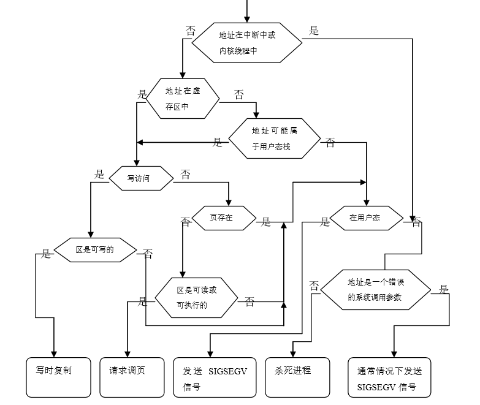

##4.3 请页机制

当一个进程运行时，CPU访问的地址是用户空间的虚地址。Linux采用请页机制来节约物理内存，也就是说，它仅仅把当前要使用的用户空间中的少量页装入物理内存。当访问的虚存页面尚未装入物理内存时，处理器将向Linux 报告一个页故障及其对应的故障原因。 页故障的产生有三种原因：

1.  程序出现错误，例如，要访问的虚地址在PAGE_OFFSET（3GB）之外，则该地址无效，Linux 将向进程发送一个信号并终止进程的运行；

2.  虚地址有效，但其所对应的页当前不在物理内存中，即缺页异常[^1]，这时，操作系统必须从磁盘或交换文件（此页被换出）中将其装入物理内存。这是本节要讨论的主要内容。

3.  要访问的虚地址被写保护，即保护错误，这时，操作系统必须判断：如果是某个用户进程正在写当前进程的地址空间，则发送一个信号并终止进程的运行。但是，如果错误发生在一旧的共享页上时，则处理方法有所不同，也就是要对这一共享页进行复制，这就是曾经描述过的“写时复制”技术。

### 4.3.1 缺页异常处理程序

当一个进程执行时，如果CPU访问到一个有效的虚地址，但是这个地址对应的页没有在内存，则CPU产生一个缺页异常，同时将这个虚地址存入CR2寄存器（参见第二章），然后调用缺页异常处理程序do_page_fault()。Linux的缺页异常处理程序必须对产生缺页的原因进行区分：是由编程错误所引起的异常，还是由访问进程用户空间的页但还尚未分配物理页面所引起的异常。

下面我们首先给出缺页异常处理程序的总体方案如图4.8所示，随后给出其详细流程图，其中的“地址”指当前进程执行时引起缺页的虚地址，“虚存区”指该地址所处的虚存区。SIGSEGV是当一个进程执行了一个无效的内存引用，或发生段错误时发送给它的信号。

图4.8  缺页异常处理程序的总体方案

实际上，缺页异常处理程序必须处理多种更细的特殊情况，它们不宜在总体方案中列出，详细流程图如图4.9。

图4.9 缺页异常处理程序流程图

do_page_fault()函数的首先是读取引起缺页的虚地址。如果没找到，则说明访问了非法虚地址，Linux会发信号终止进程。否则，检查缺页类型，如果是非法类型(越界错误，段权限错误等)同样会发信号终止进程。

缺页异常肯定要发生在内核态，如果发生在用户态，则必定是错误的，于是把相关信息保存在进程的PCB中。

对有效的虚地址，如果是缺页异常，Linux必须区分页所在的位置，即判断页是在交换文件中，还是在可执行映像中。为此，Linux通过页表项中的信息区分页所在的位置。如果该页的页表项非空，但对应的页不在内存,则说明该页处于交换文件中，操作系统要从交换文件装入页。

如果错误由写访问引起，该函数检查这个虚存区是否可写。如果不可写，则对这种错误进行相应的处理；如果可写，则采用“写时复制”技术。

如果错误由读或执行访问引起，该函数检查这一页是否已经存在于物理内存中。如果在，错误的发生就是由于进程试图访问用户态下的一个有特权的页面（页面的User/Supervisor标志被清除），因此函数跳到相应的错误处理代码处（实际上这种情况从不发生，因为内核根本不会给用户进程分配有特权的页面）。如果不在物理内存，函数还将检查这个虚存区是否可读或可执行。

如果这个虚存区的访问权限与引起缺页异常的访问类型相匹配，则调用handle_mm_fault()函数，该函数确定如何给进程分配一个新的物理页面：

1.  如果被访问的页不在内存，也就是说，这个页还没有被存放在任何一个物理页面中，那么，内核分配一个新的页面并适当地初始化；这种技术称为“**请求调页”**。

2.  如果被访问的页在内存但是被标为只读，也就是说，它已经被存放在一个页面中，那么，内核分配一个新的页面，并把旧页面的数据拷贝到新页面来初始化它；这种技术称为“**写时复制”**。

### 4.3.2 请求调页

术语“请求调页”指的是一种动态内存分配技术，它把页面的分配推迟到不能再推迟为止，也就是说，一直推迟到进程要访问的页不在物理内存时为止，由此引起一个缺页异常。

请求调页技术的引入主要是因为进程开始运行时并不访问其地址空间中的全部地址；事实上，有一部分地址也许进程永远不使用。此外，程序的局部性原理保证了在程序执行的每个阶段，真正使用的进程页只有一小部分，因此临时用不着的页根本没必要调入内存。相对于全局分配（一开始就给进程分配所需要的全部页面，直到程序结束才释放这些页面）来说，请求调页是首选的，因为它增加了系统中的空闲页面的平均数，从而更好地利用空闲内存。从另一个观点来看，在内存总数保持不变的情况下，请求调页从总体上能使系统有更大的吞吐量。

但是，系统为此也要付出额外的开销，这是因为由请求调页所引发的每个“缺页”异常必须由内核处理，这将浪费CPU的周期。幸运的是，局部性原理保证了一旦进程开始在一组页上运行，在接下来相当长的一段时间内它会一直停留在这些页上而不去访问其它的页：这样我们就可以认为“缺页”异常是一种稀有事件。

基于以下两种原因，被寻址的页可以不在主存中：

1.  进程永远也没有访问到这个页。内核能够识别这种情况，这是因为页表相应的表项被填充为0。宏pte_none(pte是PageTable Entry的缩写)用来判断这种情况，如果页表项为空，则返回1，否则返回0。

2.  进程已经访问过这个页，但是这个页的内容被临时保存在磁盘上。内核也能够识别这种情况，这是因为页表相应表项没有被填充为0（然而，由于页面不存在物理内存中，存在位P为0）。

在其它情况下，当页从未被访问时则调用do_no_page()函数。有两种方法装入所缺的页，这取决于这个页是否与磁盘文件建立了映射关系。该函数通过检查虚存区描述符的nopage域来确定这一点，如果页与文件建立起了映射关系，则nopage域就指向一个函数，该函数把所缺的页从磁盘装入到内存。因此，可能有两种情况：

1.  nopage域不为NULL。在这种情况下，说明某个虚存区映射了一个磁盘文件，nopage域指向从磁盘进行读入的函数。这种情况涉及到磁盘文件的低层操作，暂不讨论。

2.  nopage域为NULL。在这种情况下，虚存区没有映射磁盘文件，也就是说，它是一个匿名映射。因此，do_no_page()调用do_anonymous_page()函数获得一个新的页面。

do_anonymous_page()函数分别处理写请求和读请求：

当处理写访问时，该函数调用__get_free_page()分配一个新的页面，并把新页面填为0。最后，把页表相应的表项置为新页面的物理地址，并把这个页面标记为可写和脏两个标志。

相反，当处理读访问时(所访问的虚存区可能是未初始化的数据段bss)，因为进程正在对它进行第一次访问,因此页的内容是无关紧要的。给进程一个填充为0的页面要比给它一个由其它进程填充了信息的旧页面更为安全。Linux在请求调页方面做得更深入一些。没有必要立即给进程分配一个填充为零的新页面，我们可以给它一个现有的称为“零页”的页，这样可以进一步推迟页面的分配。“零页”在内核初始化期间被静态分配，并存放在empty_zero_page变量中（一个有1024个长整数的数组，并用0填充）；因此页表项被设为零页的物理地址：

由于“零页”被标记为不可写，如果进程试图写这个页，则写时复制机制被激活。当且仅当在这个时候，进程才获得一个属于自己的页面并对它进行写。

### 4.3.3 写时复制

第一代Unix系统实现了一种傻瓜式的进程创建：当发出fork()系统调用时，内核原样复制父进程的整个用户地址空间并把复制的那一份分配给子进程。这种行为是非常耗时的，因为它需要：

1.  为子进程的页表分配页面

2.  为子进程的页分配页面

3.  初始化子进程的页表

4.  把父进程的页复制到子进程相应的页中

这种创建地址空间的方法涉及许多内存访问，消耗许多CPU周期，并且完全破坏了高速缓存中的内容。在大多数情况下，这样做常常是毫无意义的，因为许多子进程通过装入一个新的程序开始它们的运行，这样就完全丢弃了所继承的地址空间。

写时复制(Copy-on-write)是一种可以推迟甚至免除拷贝数据的技术。内核此时并不复制整个进程空间，而是让父进程和子进程共享同一个拷贝。只有在需要写入的时候，数据才会被复制，从而使各个进程拥有各自的拷贝。也就是说，资源的复制只有在需要写入的时候才进行，在此之前，以只读方式共享。这种技术使地址空间上的页的拷贝被推迟到实际发生写入的时候。有时共享页根本不会被写入，例如，fork()后立即调用exec()，就无需复制父进程的页了。fork()的实际开销就是复制父进程的页表以及给子进程创建唯一的PCB。这种优化可以避免拷贝大量根本就不会使用的数据（地址空间里常常包含数十兆的数据）。
