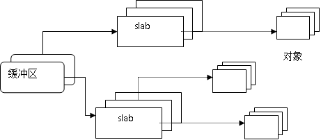
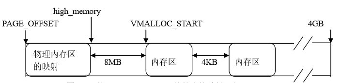

## 4.4 物理内存分配与回收

&emsp;&emsp;在操作系统启动过程中要对内存进行初始化，初始化完成后，物理内存的分布如图4.3所示：

&emsp;&emsp;从图可以看出，0x100000(1MB)地址以前的内存留作BIOS和其它特定情况所用，而从1MB开始的一段内存，永久地分配给内核来存放内核映象（内核代码及内核静态数据结构）。

&emsp;&emsp;如前所述，在Linux中，CPU所访问的地址不是物理内存中的实地址，而是虚拟地址空间的虚地址；因此，对于内存页面的管理，通常是先在虚存空间中分配一个虚存区间，然后才根据需要为此区间分配相应的物理页面并建立起映射，也就是说，虚存区间的分配在前，而物理页面的分配在后。

### 4.4.1 页描述符

&emsp;&emsp;从虚拟内存的角度来看，页就是最小单位。体系结构不同，支持的页大小也不尽相同。有些体系结构甚至支持几种不同的页大小。大多数32位体系结构支持4KB的页，而64位体系结构一般会支持8KB的页。这就意味着，在支持4KB页大小并有1GB物理内存的机器上，物理内存会被划分为262144个页。

&emsp;&emsp;内核用struct page结构表示系统中的每个物理页，也叫**页描述符**，该结构位于<linux/Mm_types.h>中：

```c
struct page {
	
	unsigned long flags;				
	struct address_space *mapping;	
	struct {
		union {
			pgoff_t index;		
			void *freelist;		
			bool pfmemalloc;	
		};

		union {
#if defined(CONFIG_HAVE_CMPXCHG_DOUBLE) && \
	defined(CONFIG_HAVE_ALIGNED_STRUCT_PAGE)
			unsigned long counters;
#else
			unsigned counters;
#endif

			struct {

				union {
					atomic_t _mapcount;

					struct { 
						unsigned inuse:16;
						unsigned objects:15;
						unsigned frozen:1;
					};
					int units;	
				};
				atomic_t _count;		
			};
		};
	};

	union {
		struct list_head lru;	
		struct {		
			struct page *next;	
#ifdef CONFIG_64BIT
			int pages;	
			int pobjects;	
#else
			short int pages;
			short int pobjects;
#endif
		};

		struct list_head list;	
		struct slab *slab_page;
	};

	union {
		unsigned long private;		
#if USE_SPLIT_PTLOCKS
		spinlock_t ptl;
#endif
		struct kmem_cache *slab_cache;
		struct page *first_page;	
	};

#if defined(WANT_PAGE_VIRTUAL)
	void *virtual;			
#endif 
#ifdef CONFIG_WANT_PAGE_DEBUG_FLAGS
	unsigned long debug_flags;	
#endif

#ifdef CONFIG_KMEMCHECK
	void *shadow;
#endif

#ifdef LAST_NID_NOT_IN_PAGE_FLAGS
	int _last_nid;
#endif
}
```

&emsp;&emsp;让我们看一下其中比较重要的域。flag域用来存放页的状态。这些状态包括页是不是脏的，是不是被锁定在内存中等等。flag的每一位单独表示一种状态，所以它至少可以同时表示出32种不同的状态。这些标志定义在<linux/page-flags.h>中。

&emsp;&emsp;_count域存放页的引用计数—也就是这一页被引用了多少次。当计数值变为0时，就说明当前内核并没有引用这一页，于是，在新的分配中就可以使用它。内核代码不应当直接检查该域，而是调用page_count（）函数进行检查，该函数唯一的参数就是
page结构。对page_count（）函数而言，返回0表示页空闲，返回一个正整数表示页在使用。一个页可以由页缓存使用,这就是mapping域所指向的addresss_space对象；一个页也可以装有私有数据，这就由private域说明。virtual域是页的虚拟地址。通常情况下，它就是页在虚拟内存中的地址。lru域存放的next和prev指针，指向最近最久未使用（LRU）链表中的相应结点。这个链表用于页面的回收。

&emsp;&emsp;必须要理解的一点是page结构与物理页相关，而并非与虚拟页相关。因此，该结构对页的描述只是短暂的。即使页中所包含的数据继续存在，但是由于交换等原因，它们可能并不再和同一个page结构相关联。内核仅仅用这个数据结构来描述当前时刻在相关的物理页中存放的东西。这种数据结构的目的在于描述物理内存本身，而不是描述包含在其中的数据。

&emsp;&emsp;内核用这一结构来管理系统中所有的页，因为内核需要知道一个页是否空闲（也就是页有没有被分配）。如果页已经被分配，内核还需要知道谁拥有这个页。拥有者可能是用户空间进程、动态分配的内核数据、静态内核代码，
或页缓存等等。

&emsp;&emsp;系统中的每个物理页都要分配一个这样的结构体。假定struct
page占40字节的内存，系统的物理页为4KB大小，系统有128MB物理内存。那么，系统中所有page结构消耗的内存是1MB多。要管理系统中这么多物理页面，可以采用最简单的数组结构：
```c
struct page *mem_map;
```
&emsp;&emsp;系统初始化时就建立起page结构的数组mem_map，在内核代码中, mem_map是一个全局变量，它描述了系统中的全部物理页面。

&emsp;&emsp;随着用户程序的执行和结束，就需要不断地为其分配和释放物理页面。内核应该为分配一组连续的页面而建立一种稳定、高效的分配策略。但是，频繁地请求和释放不同大小的一组连续页面，必然导致在已分配的内存块中分散许多小块的空闲页面，即**外碎片**，由此带来的问题是，即使这些小块的空闲页面加起来足以满足所请求的页面，但是要分配一个大块的连续页面可能就根本无法满足。为此，Linux采用著名的伙伴（Buddy）算法来解决外碎片问题。

### 4.4.2 伙伴算法

&emsp;&emsp;Linux的伙伴算法把所有的空闲页面分为10个块链表，每个链表中的一个块含有2的幂次个页面，我们把这种块叫做“**页块**”或简称“块”。例如，第0个链表中块的大小都为20（1个页面），第1个链表中块的大小为都为21（2个页面），第9个链表中块的大小都为29（512个页面）。

&emsp;&emsp;伙伴系统所采用的数据结构是一个叫做 free_area 的数组，其示意图如图4.11所示。

```c
struct free_area {
	struct list_head	free_list[MIGRATE_TYPES];
	unsigned long		nr_free;
};
```
<div style="text-align: center">

</div>

<center>图4.11 伙伴系统使用的数据结构</center>

&emsp;&emsp;在这个结构中有一个表示当前分配阶所对应的页框块链表free_list，不过这里稍显复杂一下，因free_list是一个链表数组，这个数组也称为迁移数组。我们可以将这个数组看作是对页框块链表的进一步细分，每个数组元素对应一种迁移类型的页框块链表。除了链表结构以外，该结构使用nr_free表示当前链表中空闲页框块的数目，比如free_area[2]中nr_free的值为5，表示有5个大小为4的页框块，那么总的页框数目为20。

&emsp;&emsp;我们通过一个简单的例子来说明该算法的工作原理。

&emsp;&emsp;假设要求分配的块其大小为128个页面。该算法先在块大小为128个页面的链表中查找，看是否有这样一个空闲块。如果有，就直接分配；如果没有，该算法会查找下一个更大的块，具体地说，就是在块大小为256个页面的链表中查找一个空闲块。如果存在这样的空闲块，内核就把这256个页面分为两等份，一份分配出去，另一份插入到块大小为128个页面的链表中。如果在块大小为256个页面的链表中也没有找到空闲页块，就继续找更大的块，即512个页面的块。如果存在这样的块，内核就从512个页面的块中分出128个页面满足请求，然后从384个页面中取出256个页面插入到块大小为256个页面的链表中。然后把剩余的128个页面插入到块大小为128个页面的链表中。如果512个页面的链表中还没有空闲块，该算法就放弃分配，并发出出错信号。

&emsp;&emsp;以上过程的逆过程就是块的释放过程，这也是该算法名字的来由。满足以下条件的两个块称为伙伴：

- 两个块的大小相同

- 两个块的物理地址连续

- 两个快必须是从同一个更大的块中分离出来

&emsp;&emsp;伙伴算法把满足以上条件的两个块合并为一个块，该算法是迭代算法，如果合并后的块还可以跟相邻的块进行合并，那么该算法就继续合并。

### 4.4.3 物理页面的分配

&emsp;&emsp;Linux使用伙伴算法有效地分配和回收物理页块。该算法试图分配由一个或多个连续物理页面组成的内存块，其大小为1页，2页，或4页等。只要系统有满足需要的足够的空闲页面，就会在free_area数组中查找满足需要大小的一个页块。

&emsp;&emsp;函数__get_free_pages 用于物理页块的分配，其定义如下：
```c
unsigned long __get_free_pages(gfp_t gfp_mask, unsigned int order)
```
&emsp;&emsp;其中gfp是分配标志，表示对所分配内存的特殊要求。常用的标志为GFP_KERNEL和GFP_ATOMIC，前者表示在分配内存期间可以睡眠，在进程中使用；后者表示不可以睡眠。在中断处理程序中使用。

&emsp;&emsp;Order是指数，所请求的页块大小为2的order次幂个物理页面，即页块在free_area数组中的索引。

&emsp;&emsp;该函数会去调用alloc_pages_current()，下面我们就来分析alloc_pages_current()
```c
struct page *alloc_pages_current(gfp_t gfp, unsigned order)
{
	struct mempolicy *pol = get_task_policy(current);
	struct page *page;
	unsigned int cpuset_mems_cookie;

	if (!pol || in_interrupt() || (gfp & __GFP_THISNODE))
		pol = &default_policy;

retry_cpuset:
	cpuset_mems_cookie = get_mems_allowed();

	if (pol->mode == MPOL_INTERLEAVE)
		page = alloc_page_interleave(gfp, order, interleave_nodes(pol));
	else
		page = __alloc_pages_nodemask(gfp, order,
				policy_zonelist(gfp, pol, numa_node_id()),
				policy_nodemask(gfp, pol));

	if (unlikely(!put_mems_allowed(cpuset_mems_cookie) && !page))
		goto retry_cpuset;

	return page;
}
```
&emsp;&emsp;函数的开始会去检查标志位，如内存分配标志位为置有__GFP_THISNODE,明确在当前节点上申请内存，或代码申请是在中断中，或当前进程的内存分配策略为空时；就是使用系统默认的分配策略。默认的分配策略为MPOL_PREFERRED
```c
static struct mempolicy default_policy = {
	.refcnt = ATOMIC_INIT(1), 
	.mode = MPOL_PREFERRED,
	.flags = MPOL_F_LOCAL,
};
```
&emsp;&emsp;若内核打开了cpuset功能，则get_mems_allowed()和put_mems_allowed()两个函数功能就是增加和减少当前进程mems_allowed_seq的计数。若内核关闭了cpuset功能，则该两个函数实现为空。mems_allowed_seq的计数目的就是在内存分配过程中，避免上层更改内存分配策略。

&emsp;&emsp;下面我们来分析__alloc_pages_nodemask()函数
```c
struct page *
__alloc_pages_nodemask(gfp_t gfp_mask, unsigned int order,
			struct zonelist *zonelist, nodemask_t *nodemask)
{
	enum zone_type high_zoneidx = gfp_zone(gfp_mask);
	struct zone *preferred_zone;
	struct page *page = NULL;
	int migratetype = allocflags_to_migratetype(gfp_mask);
	unsigned int cpuset_mems_cookie;
	int alloc_flags = ALLOC_WMARK_LOW|ALLOC_CPUSET;
	struct mem_cgroup *memcg = NULL;

	gfp_mask &= gfp_allowed_mask;

	lockdep_trace_alloc(gfp_mask);

	might_sleep_if(gfp_mask & __GFP_WAIT);

	if (should_fail_alloc_page(gfp_mask, order))
		return NULL;


	if (unlikely(!zonelist->_zonerefs->zone))
		return NULL;


	if (!memcg_kmem_newpage_charge(gfp_mask, &memcg, order))
		return NULL;

retry_cpuset:
	cpuset_mems_cookie = get_mems_allowed();

	first_zones_zonelist(zonelist, high_zoneidx,
				nodemask ? : &cpuset_current_mems_allowed,
				&preferred_zone);
	if (!preferred_zone)
		goto out;

#ifdef CONFIG_CMA
	if (allocflags_to_migratetype(gfp_mask) == MIGRATE_MOVABLE)
		alloc_flags |= ALLOC_CMA;
#endif
	page = get_page_from_freelist(gfp_mask|__GFP_HARDWALL, nodemask, order,
			zonelist, high_zoneidx, alloc_flags,
			preferred_zone, migratetype);
	if (unlikely(!page)) {
	
		gfp_mask = memalloc_noio_flags(gfp_mask);
		page = __alloc_pages_slowpath(gfp_mask, order,
				zonelist, high_zoneidx, nodemask,
				preferred_zone, migratetype);
	}

	trace_mm_page_alloc(page, order, gfp_mask, migratetype);

out:
	
	if (unlikely(!put_mems_allowed(cpuset_mems_cookie) && !page))
		goto retry_cpuset;

	memcg_kmem_commit_charge(page, memcg, order);

	return page;
}
```
&emsp;&emsp;函数的前一部分代码都是在做一些检查工作，检查通过之后，就尝试通get_page_from_freelist()来从区域列表中分配2^order个物理地址连续的页面。即首先尝试在控线页面链表中分配页面。显然随着系统的运行，空闲页面会越来越少，通过get_page_from_freelist()分配内存很可能失败，此时就要调用__alloc_pages_slowpath()函数全局内存池中分配页面，其中的工作也包括物理页面的回收。
下面我们来分析get_page_from_freelist()，因为__alloc_pages_slowpath()函数主要是解决在内存不足时如何分配内存的问题。这里我们就不再详细分析。

#### get_page_from_freelist()分析
&emsp;&emsp;get_page_from_freelist()的函数主体就是for_each_zone_zonelist_nodemask()循环语句，在nodemask确定的节点中所有区域，找到满足请求数量的空闲页面。
```c

static struct page *
get_page_from_freelist(gfp_t gfp_mask, nodemask_t *nodemask, unsigned int order,
		struct zonelist *zonelist, int high_zoneidx, int alloc_flags,
		struct zone *preferred_zone, int migratetype)
{
	...

	for_each_zone_zonelist_nodemask(zone, z, zonelist,
						high_zoneidx, nodemask) {
		if (IS_ENABLED(CONFIG_NUMA) && zlc_active &&
			!zlc_zone_worth_trying(zonelist, z, allowednodes))
				continue;
		if ((alloc_flags & ALLOC_CPUSET) &&
			!cpuset_zone_allowed_softwall(zone, gfp_mask))
				continue;
	
		if ((alloc_flags & ALLOC_WMARK_LOW) &&
		    (gfp_mask & __GFP_WRITE) && !zone_dirty_ok(zone))
			goto this_zone_full;

		BUILD_BUG_ON(ALLOC_NO_WATERMARKS < NR_WMARK);
		if (!(alloc_flags & ALLOC_NO_WATERMARKS)) {
			unsigned long mark;
			int ret;

			mark = zone->watermark[alloc_flags & ALLOC_WMARK_MASK];
			if (zone_watermark_ok(zone, order, mark,
				    classzone_idx, alloc_flags))
				goto try_this_zone;

			if (IS_ENABLED(CONFIG_NUMA) &&
					!did_zlc_setup && nr_online_nodes > 1) {
			
				allowednodes = zlc_setup(zonelist, alloc_flags);
				zlc_active = 1;
				did_zlc_setup = 1;
			}

			if (zone_reclaim_mode == 0 ||
			    !zone_allows_reclaim(preferred_zone, zone))
				goto this_zone_full;

			if (IS_ENABLED(CONFIG_NUMA) && zlc_active &&
				!zlc_zone_worth_trying(zonelist, z, allowednodes))
				continue;

			ret = zone_reclaim(zone, gfp_mask, order);
			switch (ret) {
			case ZONE_RECLAIM_NOSCAN:

				continue;
			case ZONE_RECLAIM_FULL:

				continue;
			default:

				if (zone_watermark_ok(zone, order, mark,
						classzone_idx, alloc_flags))
					goto try_this_zone;
				if (((alloc_flags & ALLOC_WMARK_MASK) == ALLOC_WMARK_MIN) ||
				    ret == ZONE_RECLAIM_SOME)
					goto this_zone_full;

				continue;
			}
		}

try_this_zone:
		page = buffered_rmqueue(preferred_zone, zone, order,
						gfp_mask, migratetype);
		if (page)
			break;
this_zone_full:
		if (IS_ENABLED(CONFIG_NUMA))
			zlc_mark_zone_full(zonelist, z);
	}

	...
}
```
&emsp;&emsp;在真正查找空闲页面之前，先做一些基本检查。若内核打开了NUMA，就通过zlc_zone_worth_trying()函数来快速检查该区域是否值得去更进一步查找空闲内存；多该区域不值得查找，则到下一个区域执行同样的动作。
接下来检查区域水准，看当前区域是否满足水准要求。

(1) 若本区域水准满足要求，则直接尝试在本区域分配页面。

(2) 若本区域水准不能满足要求，且区域zone_reclaim_mode的值为0，则跳转到this_zone_full；

(3) 如果上面两个条件都不满足，则要通过调用zone_reclaim()尝试回收本区域内存。若返回值为区域未扫描ZONE_RECLAIM_NOSCAN，则跳过这个区域尝试下一个区域；若返回值为ZONE_RECLAIM_FULL没法回收，就标记该区域已满，下次就不会浪费时间在扫描这个区域；若成功回收了部分内存，则重新检查区域水准。

&emsp;&emsp;当我们检查完当前区域并且认为这个区域能够有足够的控线页面满足要求。就回去调用buffered_rmqueue()函数进行区域分配页面。

```c
static inline
struct page *buffered_rmqueue(struct zone *preferred_zone,
			struct zone *zone, int order, gfp_t gfp_flags,
			int migratetype)
{
	...
page = __rmqueue(zone, order, migratetype);

	...
}
```

&emsp;&emsp;在buffered_rmqueue()中核心代码是__rmqueue()着个函数从相应的zone中取得多页面的操作，它是整个页面分配过程的真正分配页面的核心代码。
```c

static struct page *__rmqueue(struct zone *zone, unsigned int order,
						int migratetype)
{
	struct page *page;

retry_reserve:
	page = __rmqueue_smallest(zone, order, migratetype);

	if (unlikely(!page) && migratetype != MIGRATE_RESERVE) {
		page = __rmqueue_fallback(zone, order, migratetype);

		if (!page) {
			migratetype = MIGRATE_RESERVE;
			goto retry_reserve;
		}
	}

	trace_mm_page_alloc_zone_locked(page, order, migratetype);
	return page;
}
```
&emsp;&emsp;首先通过 __rmqueue_smallest()函数，尝试找到恰好满足给定的order大小、migratetype类型的页面块。

&emsp;&emsp;若在区域链表中，找不到给你order大小和migratetype类型的页面块，就要调用__rmqueue_fallback()从fallback链表中分配指定order和migrate页面块。

&emsp;&emsp;下面分析__rmqueue_smallest()和__rmqueue_fallback()函数

1. __rmqueue_smallest()

```c
c inline
struct page *__rmqueue_smallest(struct zone *zone, unsigned int order,
						int migratetype)
{
	unsigned int current_order;
	struct free_area * area;
	struct page *page;
	for (current_order = order; current_order < MAX_ORDER; ++current_order) {
		area = &(zone->free_area[current_order]);
		if (list_empty(&area->free_list[migratetype]))
			continue;

		page = list_entry(area->free_list[migratetype].next,
							struct page, lru);
		list_del(&page->lru);
		rmv_page_order(page);
		area->nr_free--;
		expand(zone, page, order, current_order, area, migratetype);
		return page;
	}

	return NULL;
}

```

&emsp;&emsp;分配页面快的步骤如下：
(1) 从order开始的空闲块立案表上开始找空闲的块;

(2) 若当前order上有空闲的页面块，则摘除空闲块并且跳转到步骤(4);

(3) 若当前order上没有控线页面块，则order = order + 1 ，跳转需要到上一级查找是否有空闲块，跳转到步骤(2)执行；若order > MAX_ORDER - 1， 则跳转到步骤(5);

(4) 若分配页面块所在order大于请求值，还要将剩余部分页面块放在更低的order链表上，页面分配成功返回；

(5) 页面分配失败返回。

2. __rmqueue_fallback()

```c


__rmqueue_fallback(struct zone *zone, int order, int start_migratetype)
{
	struct free_area * area;
	int current_order;
	struct page *page;
	int migratetype, i;

	for (current_order = MAX_ORDER-1; current_order >= order;
						--current_order) {
		for (i = 0;; i++) {
			migratetype = fallbacks[start_migratetype][i];

			if (migratetype == MIGRATE_RESERVE)
				break;

			area = &(zone->free_area[current_order]);
			if (list_empty(&area->free_list[migratetype]))
				continue;

			page = list_entry(area->free_list[migratetype].next,
					struct page, lru);
			area->nr_free--;

		
			if (!is_migrate_cma(migratetype) &&
			    (unlikely(current_order >= pageblock_order / 2) ||
			     start_migratetype == MIGRATE_RECLAIMABLE ||
			     page_group_by_mobility_disabled)) {
				int pages;
				pages = move_freepages_block(zone, page,
								start_migratetype);

				if (pages >= (1 << (pageblock_order-1)) ||
						page_group_by_mobility_disabled)
					set_pageblock_migratetype(page,
								start_migratetype);

				migratetype = start_migratetype;
			}

			list_del(&page->lru);
			rmv_page_order(page);


			if (current_order >= pageblock_order &&
			    !is_migrate_cma(migratetype))
				change_pageblock_range(page, current_order,
							start_migratetype);

			expand(zone, page, order, current_order, area,
			       is_migrate_cma(migratetype)
			     ? migratetype : start_migratetype);

			trace_mm_page_alloc_extfrag(page, order, current_order,
				start_migratetype, migratetype);

			return page;
		}
	}

	return NULL;
}
```
&emsp;&emsp;__rmqueue_fallback()函数分配过程和__rmqueue_smallest()类似，区别在于在fallback链表中进行，而不是在本节点上的zone区域。


### 4.4.4 物理页面的回收 

&emsp;&emsp;分配页块的过程中将大的页块分为小的页块，将会使内存更为零散。页回收的过程与页分配的过程相反，只要可能，它就把小页块合并成大的页块。

函数free_pages用于页块的回收，其定义如下：
```c
void free_pages(unsigned long addr, unsigned int order)
```
其中addr是要回收的页块的首地址；

order指出要回收的页块的大小为2的order次幂个物理页。

该函数所做的工作如下：

1.  根据页块的首地址addr算出该页块的第一页在mem_map数组的索引；

2.  如果该页是保留的（内核在使用），则不允许回收；

3.  将页块第一页对应的page结构中的count域减1，表示引用该页的进程数减了1个。如果count域的值不是0，说明还有别的进程在使用该页块，因此不能回收它，简单地返回；

4.  清除页块第一页对应的page结构中flags域的PG_referenced位，表示该页块不在被引用；

5.  调整全局变量nr_free_pages，将其值加上回收的物理页数；

6.  将页块加入到数组free_area的相应链表中。

   要加入的链表由order参数指定，即将页块加入到free_area[order]链表中。加入的过程如下：

1.  检查free_area[order]的位图map，看该页块的伙伴是否已在链表中（在位图map中，两伙伴使用同一位）。对大小为2的order幂次的页块，假定其开始页在mem_map数组中的索引为map_nr，则其伙伴在mem_map数组中的索引是：map_nr^（-（（~0）<< order））。

   检查的结果有二：

1.  其伙伴不在链表中，说明该页块的伙伴还在使用，不需要合并。此时只需将位图中该页块相应的位取反，表示页块已经自由；将其加入到free_area[order]链表的头部。

2.  其伙伴在链表中，说明页块及其伙伴均获得自由，可以将它们合并成更大的页块。将页块的伙伴从链表中摘下，将它们在位图中对应的位取反，表示页块已不可用；计算新的大页块在mem_map数组中的索引（页块索引和伙伴索引的小者）；order++，转1），将大页块加入到数组free_area的相应链表中。

&emsp;&emsp;例如，在图4.10，如果第1页释放，因为此时它的伙伴（第0页）已经空闲，因此可以将他们合并成一个大小为2页的块（0、1），并将其加入到free_area[1]的链表中；因为新块（0、1）的伙伴（2、3）不在free_area[1]链表中，所以不需要进行进一步的合并。其结果是，第0块被从free_area[0]链表中取下，合并成大小为2页的新块（0、1），新块被加到了free_area[1]链表中。当然，相应的位图也做了修改以反映这种变化。

### 4.4.5 Slab分配机制

&emsp;&emsp;采用伙伴算法分配内存时，每次至少分配一个页面。但当请求分配的内存大小为几十个字节或几百个字节时应该如何处理？如何在一个页面中分配小的内存区，小内存区的分配所产生的内碎片又如何解决？

&emsp;&emsp;Linux2.0采用的解决办法是建立了13个空闲区链表，它们的大小从32字节到132056字节。从Linux2.2开始，内存管理的开发者采用了一种叫做slab的分配模式，该模式早在1994年就被开发出来，用于Sun Microsystem Solaris 2.4操作系统中。Slab的提出主要是基于以下考虑：

1.  内核对内存区的分配取决于所存放数据的类型。例如，当给用户态进程分配页面时，内核调用__get_free_pages()函数，并用0填充所分配的页面。而给内核的数据结构分配页面时，事情没有这么简单，例如，要对数据结构所在的内存进行初始化、在不用时要收回它们所占用的内存。因此，Slab中引入了对象这个概念，所谓对象就是存放一组数据结构的内存区，其方法就是构造或析构函数，构造函数用于初始化数据结构所在的内存区，而析构函数收回相应的内存区。但为了便于理解，也可以把对象直接看作内核的数据结构。为了避免重复初始化对象，Slab分配模式并不丢弃已分配的对象，而是释放但把它们依然保留在内存中。当以后又要请求分配同一对象时，就可以从内存获取而不用进行初始化，这是在Solaris中引入Slab的基本思想。

&emsp;&emsp;Linux中对Slab分配模式有所改进，它对内存区的处理并不需要进行初始化或回收。出于效率的考虑，Linux并不调用对象的构造或析构函数，而是把指向这两个函数的指针都置为空。Linux中引入Slab的主要目的是为了减少对伙伴算法的调用次数。

2.  实际上，内核经常反复使用某一内存区。例如，只要内核创建一个新的进程，就要为该进程相关的数据结构（PCB、打开文件对象等）分配内存区。当进程结束时，收回这些内存区。因为进程的创建和撤销非常频繁，因此，Linux的早期版本把大量的时间花费在反复分配或回收这些内存区上。从Linux2.2开始，把那些频繁使用的页面保存在高速缓存中并重新使用。

3.  可以根据对内存区的使用频率来对它分类。对于预期频繁使用的内存区，可以创建一组特定大小的专用缓冲区进行处理，以避免内碎片的产生。对于较少使用的内存区，可以创建一组通用缓冲区来处理，即使这种处理模式产生碎片，也对整个系统的性能影响不大。

4.  硬件高速缓存的使用，又为尽量减少对伙伴算法的调用提供了另一个理由，因为对伙伴算法的每次调用都会“弄脏”硬件高速缓存，因此，这就增加了对内存的平均访问次数。

&emsp;&emsp;Slab分配模式把对象分组放进缓冲区（尽管英文中使用了Cache这个词，但实际上指的是内存中的区域，而不是指硬件高速缓存）。因为缓冲区的组织和管理与硬件高速缓存的命中率密切相关，因此，Slab缓冲区并非由各个对象直接构成，而是由一连串的“大块（Slab）”构成，而每个大块中则包含了若干个同种类型的对象，这些对象或已被分配，或空闲，如图4.12所示。一般而言，对象分两种，一种是大对象，一种是小对象。所谓小对象，是指在一个页面中可以容纳下好几个对象的那种。例如，一个inode结构大约占300多个字节，因此，一个页面中可以容纳8个以上的inode结构，因此，inode结构就为小对象。Linux内核中把小于512字节的对象叫做小对象，大于512字节的对象叫做大对象。

<div style="text-align: center">

</div>

<center>图4.12 Slab的组成</center>

&emsp;&emsp;实际上，缓冲区就是主存中的一片区域，把这片区域划分为多个块，每块就是一个Slab，每个Slab由一个或多个页面组成，每个Slab中存放的就是对象。

Linux把缓冲区分为专用和通用，它们分别用于不同的目的，下面给予说明。

#### 1 Slab专用缓冲区的建立和释放

&emsp;&emsp;专用缓冲区主要用于频繁使用的数据结构，如task_struct、mm_struct、vm_area_struct、 file、 dentry、
inode等。缓冲区是用kmem_cache_t类型描述的，通过kmem_cache_create（）来建立，函数原型为：

```c
struct kmem_cache *
kmem_cache_create(const char *name, size_t size, size_t align,
		  unsigned long flags, void (*ctor)(void *))
```

   对其参数说明如下：

   name： 缓冲区名 ( 19 个字符)

   size： 对象大小

   offset： 在缓冲区内第一个对象的偏移，用来确定在页内进行对齐的位置，缺省为0，表示标准对齐。

   flags： 对缓冲区的设置标志：

   SLAB_HWCACHE_ALIGN： 表示与第一个缓冲区中的缓冲行边界（16或32字节）对齐。
   SLAB_NO_REAP： 不允许系统回收内存

   SLAB_CACHE_DMA： 表示Slab使用的是DMA内存

   ctor： 构造函数（一般都为NULL)


&emsp;&emsp;但是，函数kmem_cache_create（）所创建的缓冲区中还没有包含任何Slab，因此，也没有空闲的对象。只有以下两个条件都为真时，才给缓冲区分配Slab：

1.  已发出一个分配新对象的请求；

2.  缓冲区不包含任何空闲对象；

&emsp;&emsp;当从内核卸载一个模块时，同时应当撤销为这个模块中的数据结构所建立的缓冲区，这是通过调用kmem_cache_destroy()函数来完成的。

   创建缓冲区之后，就可以通过下列函数从中获取对象：

```c

	void *kmem_cache_alloc(struct kmem_cache *cachep,gfp_t flags)

```

&emsp;&emsp;该函数从给定的缓冲区cachep中返回一个指向对象的指针。如果缓冲区中所有的slab中都没有空闲的对象，那么
slab必须调用__get_free_pages()获取新的页面，flags是传递给该函数的值，一般应该是GFP_KERNEL或GFP_ATOMIC。

   最后释放一个对象，并把它返回给原先的slab，这使用下面这个函数：

```c
	void kmem_cache_free(struct kmem_cache *cachep, void *objp)
```

   这样就能把cachep中的对象objp标记为空闲了。

#### 2 Slab分配举例

&emsp;&emsp;让我们考察一个实际的例子，这个例子用的是task_struct结构（进程控制块），代码取自kernel/fork.c。

   首先，内核用一个全局变量存放指向task_struct缓冲区的指针：

```c
	kmem_cache *task_struct_cachep
```

   内核初始化期间，在fork_init()中会创建缓冲区：

```c

task_struct_cachep =
		kmem_cache_create("task_struct", sizeof(struct task_struct),
			ARCH_MIN_TASKALIGN, SLAB_PANIC | SLAB_NOTRACK, NULL);
```

&emsp;&emsp;这样就创建了一个名为task_struct_cachep的缓冲区，其中存放的就是类型为struct
task_struct的对象。对象被创建在slab中缺省的偏移量处，并完全按缓冲区对齐。没有构造函数或析构函数。注意要检查返回值是否为NULL，
NULL表示失败。在这种情况下，如果内核不能创建task_struct_cachep缓冲区，它就会陷入混乱，因为这时系统操作一定要用到该缓冲区（没有进程控制块，操作系统自然不能正常运行）。

&emsp;&emsp;每当进程调用fork()时，一定会创建一个新的进程控制块。这是在dup_task_sturct()中完成的，而该函数会被do_fork()调用：

```c
struct task_struct *tsk;

tsk = kmem_cache_alloc(task_struct_cachep, GFP_KERNEL);

if (!tsk) {

/* 不能分配进程控制块，清除，并返回错误码 */
			
		…

		return NULL;
}
```

&emsp;&emsp;进程执行完后，如果没有子进程在等待的话，它的进程控制块就会被释放，并返回给task_struct_cachep
slab缓冲区。这是在free_task_struct()中执行的（这里，tsk是现有的进程）：

```c
kmem_cache_free(task_struct_cachep, tsk);
```

&emsp;&emsp;由于进程控制块是内核的核心组成部分，时刻都要用到，因此task_struct_cachep缓冲区绝不会销毁。即使真能销毁，我们也要通过下列函数：

```c
int err;

err = kmem_cache_destroy(task_struct_cachep);

if (err)

/*出错，撤销缓冲区*/
```

&emsp;&emsp;如果要频繁创建很多相同类型的对象，那么，就应该考虑使用slab缓冲区。确切地说，不要自己去实现空闲链表！

#### 3. 通用缓冲区

&emsp;&emsp;在内核中初始化开销不大的数据结构可以合用一个通用的缓冲区。通用缓冲区最小的为32字节，然后依次为64、128、…直至128K（即32个页面），但是，对通用缓冲区的管理又采用的是Slab方式。从通用缓冲区中分配和释放缓冲区的函数为：

```c
void *kmalloc(size_t size, int flags);

Void kfree(const void *ptr);
```

&emsp;&emsp;因此，当一个数据结构的使用根本不频繁时，或其大小不足一个页面时，就没有必要给其分配专用缓冲区，而应该调用kmallo()进行分配。如果数据结构的大小接近一个页面，则干脆通过__get_free_pages()为之分配一个页面。

&emsp;&emsp;事实上，在内核中，尤其是驱动程序中，有大量的数据结构仅仅是一次性使用，而且所占内存只有几十个字节，因此，一般情况下调用kmallo()给内核数据结构分配内存就足够了。另外，因为在Linux2.0以前的版本一般都调用kmallo()给内核数据结构分配内存，因此，调用该函数的一个优点是让你开发的驱动程序能保持向后兼容。

&emsp;&emsp;kfree()函数释放由kmalloc()分配出来的内存块。如果想要释放的内存不是由kmalloc()分配的，或者想要释放的内存早就被释放过了，比如说释放属于内核其它部分的内存，调用这个函数会导致严重的后果。与用户空间类似，分配和回收要注意配对使用，以避免内存泄漏和其它bug。注意，调用kfree(NULL
)是安全的。

&emsp;&emsp;让我们看一个在中断处理程序中分配内存的例子。在这个例子中，中断处理程序想分配一个缓冲区来保存输入数据。BUF_SIZE预定义为缓冲区长度，它应该是大于两个字节。

```c
char *buf;

buf = kmalloc(BUF_SIZE, GFP_ATOMIC);

if (!buf)
```

/*内存分配出错*/

之后，当我们不再需要这个内存时，别忘了释放它：

kfree(buf)

### 4.4.6 内核空间非连续内存区的分配

&emsp;&emsp;我们说，任何时候，CPU访问的都是虚拟内存，那么，在你编写驱动程序，或者编写模块时，Linux给你分配什么样的内存？它处于4G空间的什么位置？这就是我们要讨论的非连续内存。

&emsp;&emsp;首先，非连续内存处于3G到4G之间，也就是处于内核空间，如图4.13所示：

<div style="text-align: center">

</div>

<center>图4.13 从PAGE_OFFSET开始的内核地址区间</center>

&emsp;&emsp;图中，PAGE_OFFSET为3GB，high_memory为保存物理地址最高值的变量，VMALLOC_START为非连续区的的起始地址。

&emsp;&emsp;在物理地址的末尾与第一个内存区之间插入了一个8MB的区间，这是一个安全区，目的是为了“捕获”对非连续区的非法访问。出于同样的理由，在其他非连续的内存区之间也插入了4K大小的安全区。每个非连续内存区的大小都是4096的倍数。

描述非连续区的数据结构为struct vm_struct：

```c

struct vm_struct {
	struct vm_struct	*next;
	void			*addr;
	unsigned long		size;
	unsigned long		flags;
	struct page		**pages;
	unsigned int		nr_pages;
	phys_addr_t		phys_addr;
	const void		*caller;
};
```

&emsp;&emsp;Addr域是每个内存区的起始地址；size是内存区的大小加4096(安全区的大小)
，非连续区组成一个单链表。

&emsp;&emsp;函数get_vm_area()创建一个新的非连续区结构，其中调用了kmalloc()和kfree()函数分别为vm_struct结构分配和释放所需的内存。

vmalloc()函数给内核分配一个非连续的内存区，其原型为：
```c
void * vmalloc (unsigned long size)
```
&emsp;&emsp;函数首先把size参数取整为页面大小（4096）的一个倍数，也就是按页的大小进行对齐，然后进行有效性检查，如果有大小合适的可用内存，就调用get_vm_area（）获得一个内存区的结构。最后调用函数vmalloc_area_pages()真正进行非连续内存区的分配，该函数实际上建立起了非连续内存区到物理页面的映射。

vmalloc()与 kmalloc()都是在内核代码中用来分配内存的函数，但二者有何区别？

&emsp;&emsp;从前面的介绍已经看出，这两个函数所分配的内存都处于内核空间，即从3GB～4GB；但位置不同，kmalloc()分配的内存处于3GB～high_memory之间，这
一段内核空间与物理内存的映射一一对应，而vmalloc()分配的内存在VMALLOC_START～4GB之间，这一段非连续内存区映射到物理内存也可能是非连续的。

&emsp;&emsp;vmalloc()工作方式与kmalloc()类似，
其主要差别在于前者分配的物理地址无需连续，而后者确保页在物理上是连续的（虚地址自然也是连续的）。

&emsp;&emsp;尽管仅仅在某些情况下才需要物理上连续的内存块，但是，很多内核代码都调用kmalloc()，而不是用vmalloc()获得内存。这主要是出于性能的考虑。vmalloc()函数为了把物理上不连续的页面转换为虚拟地址空间上连续的页，必须专门建立页表项。还有，通过vmalloc()获得的页必须一个一个的进行映射（因为它们物理上不是连续的），这就会导致比直接内存映射大得多的缓冲区刷新。因为这些原因，vmalloc()仅在绝对必要时才会使用——典型的就是为了获得大块内存时，例如，当模块被动态插入到内核中时，就把模块装载到由vmalloc()分配的内存上。

vmalloc()函数用起来比较简单：

```c
char *buf;

buf = vmalloc（16*PAGE_SIZE）; /*获得16页*/

if （!buf）

/* 错误！不能分配内存*/
```

在使用完分配的内存之后，一定要释放它：

```c
vfree（buf）；
```

### 4.4.7 物理内存分配举例

&emsp;&emsp;通过以上介绍我们了解到，调用伙伴算法的_get_free_pages()函数能分配一个或多个连续的物理页面，调用kmalloc()为不足一个页面的需求分配内存，而调用vmalloc()获得大块的内存区，以下代码说明了如何调用这几个函数，它们所返回的地址位于何处。

例 4-5 内存分配函数的调用

```c
#include<linux/module.h>

#include<linux/init.h>

#include<linux/slab.h>

#include<linux/mm.h>

#include<linux/vmalloc.h>

unsigned long pagemem;

unsigned char *kmallocmem;

unsigned char *vmallocmem;

MODULE_LICENSE("GPL");

static int __init init_mmshow(void)

{

		pagemem = __get_free_page(GFP_KERNEL);

		if(!pagemem)

				goto fail3;

		printk(KERN_INFO "pagemem=0x%lx\n", pagemem);

		kmallocmem = kmalloc(100, GFP_KERNEL);

		if(!kmallocmem)

				goto fail2;

		printk(KERN_INFO "kmallocmem=0x%p\n", kmallocmem);

		vmallocmem = vmalloc(1000000);

		if(!vmallocmem)

			goto fail1;

		printk(KERN_INFO "vmallocmem=0x%p\n", vmallocmem);

		return 0;

fail1:

		kfree(kmallocmem);

fail2:

		free_page(pagemem);

fail3:

		return -1;

}

static void __exit cleanup_mmshow(void)

{

		vfree(vmallocmem);

		kfree(kmallocmem);

		free_page(pagemem);

}

module_init(init_mmshow);

module_exit(cleanup_mmshow);
```

#### 1. 把一个虚地址转换为物理地址

&emsp;&emsp;我们知道，CPU访问应用程序的中的地址都是虚拟地址，然后通过MMU将虚拟地址转化成物理地址。虚拟内存和物理内存的映射关系是通过页表来实现的。由于内核要在各种不同的CPU上运行，甚至包括目前64位机器。因此，内核提供了四级页表的管理机制，它可以兼容各种架构的CPU。

&emsp;&emsp;因此，一个虚地址会被分为五个部分：页全局目录PGD（Page Global Directory），页上级目录PUD（Page Upper Directory），页中间目录PMD（Page Middle
Directory），PT（Page Table）以及偏移量offset，其中的表项叫页表项PTE（Page Tabe
Entry）。也就是说，一个线性地址中除去偏移量，分别存放了四级目录表项的索引值。具体的线性地址翻译成物理地址的过程是：首先从进程地址描述符中（mm_struct）中读取pgd字段的内容，它就是页全局目录的起始地址；然后页全局目录起始地址加上页全局目录索引获得页上级目录的起始地址；页上级目录的起始地址加上页上级目录的索引获得页中间目录的起始地址；页中间目录的起始地址加上页中间目录的索引获得页表起始地址；页表起始地址加上索引，可以得到完整的页表项内容；从页表项中取出物理页的基址，加上偏移量可以得到最终的物理地址。

&emsp;&emsp;接下来的程序是通过给定一个有效的虚地址，首先找到该虚地址所属的内存区，然后通过my_follow_page()函数得到该虚地址对应的物理页描述符page。最后通过page_address()函数找到该物理页描述符所代表的物理页起始地址，接着提取出物理页的偏移量，最终合成完整的物理地址。

```c
static struct page *my_follow_page(struct vm_area_struct *vma, unsigned
long addr)

{

		pud_t *pud;

		pmd_t *pmd;

		pte_t *pte;

		spinlock_t *ptl;

		unsigned long full_addr;

		struct page *page = NULL;

		struct mm_struct *mm = vma->vm_mm;

		pgd = pgd_offset(mm, addr); /*获得addr对应的pgd项的地址*/

		if (pgd_none(*pgd) || unlikely(pgd_bad(*pgd))) { /*pgd为空或无效*/

				goto out;

		}

		pud = pud_offset(pgd, addr);

		if (pud_none(*pud) || unlikely(pud_bad(*pud)))

				goto out;

		pmd = pmd_offset(pud, addr);

		if (pmd_none(*pmd) || unlikely(pmd_bad(*pmd))) {

				goto out;

		}

		pte = pte_offset_map_lock(mm, pmd, addr, &ptl);

		if (!pte)

				goto out;

		if (!pte_present(*pte))

		goto unlock;

		page = pfn_to_page(pte_pfn(*pte)); /*从pte_pfn(*pte)取得物理页号，从而获得页的起始地址*/

		if (!page)

				goto unlock;

		full_addr=(*pte).pte_low & PAGE_MASK; /*获取低12位偏移量*/

		full_addr+=addr & (~PAGE_MASK);

		printk("full_addr=%lx..n",full_addr); /*打印物理地址*/

		printk("pte=%lx.....n",pte_pfn(*pte)); /*打印物理页面号*/

		printk("page=%p..\n",page); /*打印页的起始地址*/

		get_page(page); /* page->_count原子的加1*/

unlock:

		pte_unmap_unlock(pte, ptl);

out:

		return page;

}
```
